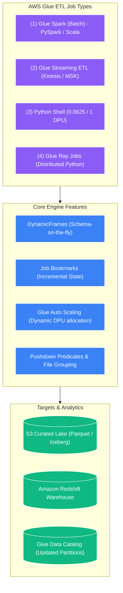
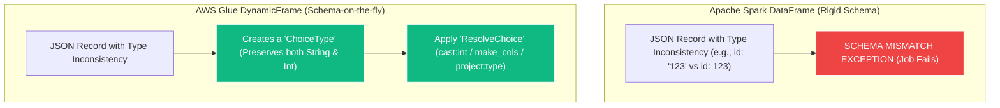
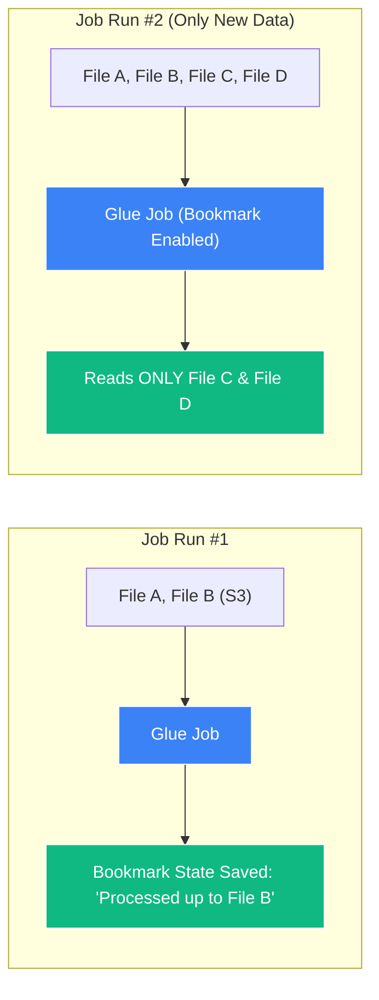
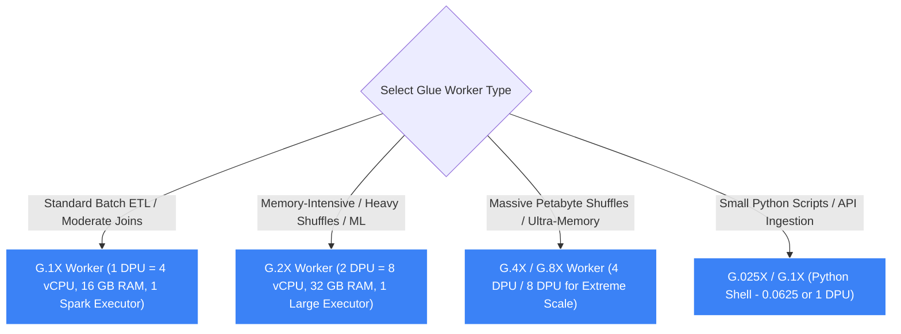

# ⚙️ AWS Glue ETL Jobs & DynamicFrames

- **Category**: Analytics / Distributed Serverless Processing
- **Language / ဘာသာစကား**: **English (Original)** | [မြန်မာဘာသာ (Burmese)](/mm/02-services/analytics-streaming/glue/glue-etl-jobs)
- **Primary Use Case**: Serverless Apache Spark & Python ETL, incremental processing with Job Bookmarks, semi-structured data manipulation with DynamicFrames, and performance tuning.
- **Slide Reference**: Pages 331–364 in `[[AWSCertifiedDataEngineerSlides.pdf]]`
- **Hub Links**: `[[index]]` | `[[glue]]` | `[[emr]]` | `[[domain-3-data-processing]]`

---

## 1. High-Level Summary

**AWS Glue ETL Jobs** execute data transformation scripts in a fully managed, serverless Apache Spark (PySpark or Scala) or Python Shell environment. 

Unlike **[[emr]]**, where engineers must size, provision, monitor, and scale EC2/EKS clusters, AWS Glue handles all cluster lifecycle management automatically. Jobs start rapidly and are billed strictly by the second based on the number of **Data Processing Units (DPUs)** consumed (1 DPU = 4 vCPUs and 16 GB of memory).



---

## 2. Core Technical Concepts for DEA-C01

### 1. Glue DynamicFrames vs. Apache Spark DataFrames

While native Apache Spark uses **DataFrames** that require a rigid, upfront schema, AWS Glue introduces **DynamicFrames**.



#### Comparison Matrix:

| Feature | Apache Spark DataFrame | AWS Glue DynamicFrame |
| :--- | :--- | :--- |
| **Schema Requirement** | Rigid; must be defined upfront before execution. | Dynamic; inferred row-by-row on the fly. |
| **Inconsistent Types Handling** | Throws exceptions or casts mismatched values to `null`. | Creates a `ChoiceType` containing all observed variants. |
| **Nested JSON Flattening** | Requires complex recursive queries with `explode()`. | Uses built-in `Relationalize` or `Unnest` transforms. |
| **Interoperability** | Native Spark API. | Convert anytime using `.toDF()` and `DynamicFrame.fromDF()`. |

---

### 2. Essential DynamicFrame Transforms (PySpark Code Snippets)

#### A. Reading Data from the Catalog
```python
import sys
from awsglue.transforms import *
from awsglue.utils import getResolvedOptions
from pyspark.context import SparkContext
from awsglue.context import GlueContext
from awsglue.job import Job

glueContext = GlueContext(SparkContext.getOrCreate())

# Read directly from Glue Data Catalog with Pushdown Predicate
datasource = glueContext.create_dynamic_frame.from_catalog(
    database="analytics_db",
    table_name="raw_orders",
    push_down_predicate="year == '2026' and month == '08'",
    transformation_ctx="datasource"
)
```

#### B. `ApplyMapping` (Renaming, Casting, and Dropping Columns)
```python
# Rename columns, change data types, or drop unmapped columns in one step
mapped_frame = ApplyMapping.apply(
    frame=datasource,
    mappings=[
        ("order_id", "string", "id", "long"),
        ("customer_name", "string", "customer", "string"),
        ("amount", "string", "order_total", "double"),
        ("temp_col", "string", None, None) # Dropped from target
    ],
    transformation_ctx="mapped_frame"
)
```

#### C. `ResolveChoice` (Resolving Conflicting Data Types)
When a column contains mixed types (e.g., both integers and strings):
- `cast:target_type`: Force cast all values to a specific type (e.g., `cast:int`).
- `make_cols`: Split the column into two separate columns (e.g., `id_int` and `id_string`).
- `project:type`: Keep only the specified type and drop the conflicting values.

```python
resolved_frame = ResolveChoice.apply(
    frame=mapped_frame,
    choice="cast:long",
    specs=[("id", "cast:long")],
    transformation_ctx="resolved_frame"
)
```

#### D. `Relationalize` (Flattening Complex Nested JSON)
- Splits complex nested JSON/arrays into multiple flat relational tables.
- Creates a `root` table with foreign key IDs linking to child tables.

```python
# Returns a DynamicFrameCollection containing 'root' and nested child tables
relationalized_tables = Relationalize.apply(
    frame=datasource,
    staging_path="s3://my-lake/staging/",
    name="orders_relational",
    transformation_ctx="relationalized_tables"
)
root_table = relationalized_tables.select("orders_relational")
```

---

### 3. Job Bookmarks (Incremental State Management)

**AWS Glue Job Bookmarks** automatically track which files in an S3 bucket or rows in a JDBC database have already been processed in prior runs.



#### Bookmark States for DEA-C01:
- **Enable (Default)**: Maintains state and only processes new data arriving since the last successful run.
- **Disable**: Ignores state; re-reads and reprocesses the **entire dataset** from the beginning.
- **Pause**: Reads only new data arriving during the current run, but does **not** update the state bookmark at completion (useful for debugging and dry-runs).
- **Rewind**: Resets the bookmark state back to a previous job run timestamp to reprocess historical data.

---

### 4. Performance Tuning & Cost Optimization

| Optimization Technique | Implementation / Parameter | Impact on Performance & Cost |
| :--- | :--- | :--- |
| **Pushdown Predicates** | `push_down_predicate="year=='2026'"` in `from_catalog()` | Prunes S3 partition prefixes at the **Glue Catalog level** before loading files into Spark memory. Drastically reduces S3 GET requests and I/O. |
| **Catalog Partition Predicates** | `catalogPartitionPredicate="year='2026'"` | Evaluates partition filtering **server-side inside the Glue Catalog**, speeding up query planning for tables with millions of partitions. |
| **File Grouping (Small Files)** | `additional_options={"groupFiles": "inPartition", "groupSize": "134217728"}` (128 MB) | Merges thousands of small S3 files into 128 MB in-memory chunks per Spark task, solving the **Small File Problem** and preventing executor out-of-memory (OOM) errors. |
| **Glue Auto Scaling** | Enable **Auto Scaling** in Job Details | Dynamically provisions and decommissions DPUs based on Spark executor queue depth. Eliminates manual over-provisioning. |
| **Bounded Execution** | `boundedFiles=1000` or `boundedSize=10737418240` | Limits the number of files or bytes processed per job run to prevent long-running timeouts and manage memory. |

---

### 5. Worker Types & DPU Sizing (Capacity Planning)

1 DPU = **4 vCPUs** and **16 GB of memory**. AWS Glue offers the following worker configurations:



- **`G.1X`**: 1 DPU (4 vCPU, 16 GB RAM). Allocates 1 Spark executor per worker node. Best for general-purpose batch processing and standard transforms.
- **`G.2X`**: 2 DPU (8 vCPU, 32 GB RAM). Allocates 1 large Spark executor per worker node. Recommended for memory-intensive transformations, large skew joins, and ML transforms (`FindMatches`).
- **`G.4X` / `G.8X`**: 4 or 8 DPUs per worker. Ideal for extreme memory-hungry workloads and petabyte-scale data lakes.
- **`G.025X` (Python Shell)**: 0.0625 DPU (1 vCPU, 256 MB RAM). Ultra-cheap option for running lightweight Python scripts without Spark overhead.

---

### 6. Glue Streaming ETL & Glue Ray Jobs

1. **Glue Streaming ETL**:
   - Executes streaming PySpark jobs on top of **Amazon Kinesis Data Streams**, **Amazon MSK (Apache Kafka)**, or Apache Kafka on EC2.
   - Operates on continuous micro-batches with windowing (tumbling and sliding windows).
   - Uses S3 checkpointing to guarantee fault tolerance and exactly-once processing.
2. **AWS Glue Ray Jobs**:
   - Runs the **Ray open-source framework** on a serverless Glue backend.
   - Designed for distributed Python workloads that do not fit into the Spark paradigm (e.g., distributed training of scikit-learn/PyTorch models, large-scale matrix operations, or distributed Pandas dataframes).

---

## 3. DEA-C01 Exam Tips & Scenarios

> [!IMPORTANT]
> **Key Exam Decision Triggers for Glue ETL**:
>
> - **"Process nested, semi-structured JSON with changing schemas and conflicting data types without failing"** $\rightarrow$ **Use AWS Glue DynamicFrames with `ResolveChoice`**.
> - **"Flatten deeply nested JSON structures into relational tables with parent-child key relationships"** $\rightarrow$ **Use the `Relationalize` transform**.
> - **"Process only newly arrived files in S3 without custom DynamoDB state tracking"** $\rightarrow$ **Enable AWS Glue Job Bookmarks**.
> - **"Job is failing with Out-of-Memory (OOM) errors during heavy shuffle/join operations"** $\rightarrow$ Upgrade worker type from **`G.1X` to `G.2X`** (provides 32 GB memory per executor).
> - **"Job is slow due to reading millions of small 10 KB files from S3"** $\rightarrow$ Enable **S3 File Grouping** with `groupFiles="inPartition"` and `groupSize="134217728"` (128 MB).
> - **"Prune irrelevant S3 partitions before loading data into Spark memory"** $\rightarrow$ Use **`push_down_predicate`** in `from_catalog()`.
> - **"Deduplicate records across two tables without a unique identifier using Machine Learning"** $\rightarrow$ Use the **`FindMatches` ML transform**.
> - **"Run lightweight Python scripts without provisioning Spark workers"** $\rightarrow$ **AWS Glue Python Shell with `G.025X` workers**.

---

## 📌 Related Notes
- `[[glue]]` — AWS Glue Overview & Architecture
- `[[glue-data-catalog]]` — Glue Data Catalog Metastore
- `[[glue-flex]]` — Saving 35% on Batch ETL with Flex Execution
- `[[glue-data-quality]]` — Integrating Data Validation into Glue Jobs
- `[[emr]]` — Comparing Glue Serverless Spark vs. Amazon EMR Clusters
