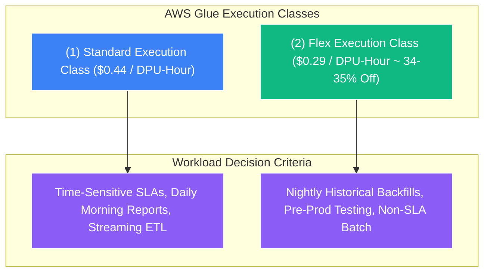

# 💰 AWS Glue Flex Execution Class

- **Category**: Analytics / Cost Optimization & Execution Classes
- **Language / ဘာသာစကား**: **English (Original)** | [မြန်မာဘာသာ (Burmese)](/mm/02-services/analytics-streaming/glue/glue-flex)
- **Primary Use Case**: Massive cost reduction (up to 35%) for non-urgent, non-time-sensitive, and non-SLA data integration workloads.
- **Slide Reference**: Pages 331–364 in `[AWSCertifiedDataEngineerSlides.pdf](/docs/AWSCertifiedDataEngineerSlides.pdf)`
- **Hub Links**: `[[index]]` | `[[glue]]` | `[[glue-etl-jobs]]` | `[[cost-management]]`

---

## 1. High-Level Summary

**AWS Glue Flex** (Flexible Execution Class) is a cost-optimized execution tier for AWS Glue ETL batch jobs that reduces compute costs by **up to 35%** compared to the Standard execution class. 

Similar in concept to **Amazon EC2 Spot Instances**, Glue Flex leverages spare, non-critical compute capacity within AWS data centers. In exchange for significant cost savings, jobs running under the Flex class have variable start times, and execution times may fluctuate depending on capacity availability in the chosen AWS Region.

---

## 2. Standard vs. Flex Execution Class Comparison

| Feature | Standard Execution Class | Flexible (Flex) Execution Class |
| :--- | :--- | :--- |
| **Pricing** | **$0.44 per DPU-Hour** (Billed per second) | **$0.29 per DPU-Hour** (Up to **35% discount**) |
| **Start Time Predictability** | **Fast & Predictable** (Immediate worker provisioning) | **Variable** (Can be delayed if regional capacity is constrained) |
| **Execution Duration** | Consistent and stable | May fluctuate based on background resource balancing |
| **Job Interruption Risk** | Minimal / None | **Possible** (AWS may reclaim capacity if standard demand spikes) |
| **Supported Worker Types** | `G.1X`, `G.2X`, `G.4X`, `G.8X`, `G.025X` (Python Shell) | `G.1X`, `G.2X` (Spark jobs) |
| **Supported Job Types** | Spark Batch, Streaming ETL, Python Shell, Ray | **Spark Batch Jobs only** |
| **Best Suited Workloads** | Time-critical ETL, financial reporting, live streaming pipelines. | Historical backfills, staging/testing environments, overnight non-urgent batch. |

---

## 3. Cost Calculation Example for DEA-C01

Imagine an organization runs a 10-hour historical data backfill ETL job utilizing **100 DPUs**:

$$\text{Standard Cost} = 100 \text{ DPUs} \times 10 \text{ Hours} \times \$0.44 = \$440.00$$

$$\text{Flex Cost} = 100 \text{ DPUs} \times 10 \text{ Hours} \times \$0.29 = \$290.00$$

$$\textbf{Total Savings} = \$440 - \$290 = \mathbf{\$150.00 \text{ (34.1\% Cost Reduction)}}$$

---

## 4. Best Practices & Workload Guidelines

### When to Use AWS Glue Flex:
1. **Historical Data Backfills**: Reprocessing 5 years of historical logs where finishing at 2:00 AM vs 3:30 AM has no business impact.
2. **Development, Staging, and Testing**: Running test pipeline runs in non-production AWS accounts.
3. **Non-Urgent Nightly Aggregations**: Transforming raw telemetry or clickstream data for weekly/monthly trend models.

### When NOT to Use AWS Glue Flex (Exam Traps):
1. **Strict SLA Workloads**: If executive dashboards must be updated precisely at 7:00 AM before financial markets open, **use Standard execution**.
2. **Glue Streaming ETL**: Streaming jobs require continuous, dedicated compute and cannot use Flex.
3. **Python Shell Jobs**: Python Shell jobs already operate at fractional DPUs (`G.025X` at $0.0625/DPU) and do not support Flex.
4. **Interactive Notebooks / Data Previews**: Developing in Glue Studio interactive sessions requires immediate responsiveness.

---

## 5. DEA-C01 Exam Tips & Scenarios

> [!IMPORTANT]
> **Key Exam Decision Triggers for Glue Flex**:
>
> - **"A company wants to reduce the cost of nightly batch ETL jobs that have no strict completion deadlines"** $\rightarrow$ **Switch job execution class to AWS Glue Flex (save ~35%)**.
> - **"Cost-optimize historical data backfills on terabytes of S3 data"** $\rightarrow$ **AWS Glue Flex Execution Class with `G.1X` or `G.2X` workers**.
> - **"A pipeline must finish within a 30-minute maintenance window every morning"** $\rightarrow$ **DO NOT use Glue Flex**; use the **Standard Execution Class** to ensure predictable start and runtime.
> - **"Can Glue Flex be used for Kinesis streaming ETL?"** $\rightarrow$ **No**, Flex is strictly for batch Spark workloads.

---

## 📌 Related Notes
- `[[glue]]` — AWS Glue Architecture Overview
- `[[glue-etl-jobs]]` — AWS Glue Worker Types & Capacity Planning
- `[[cost-management]]` — AWS Analytics Cost Optimization Strategies
