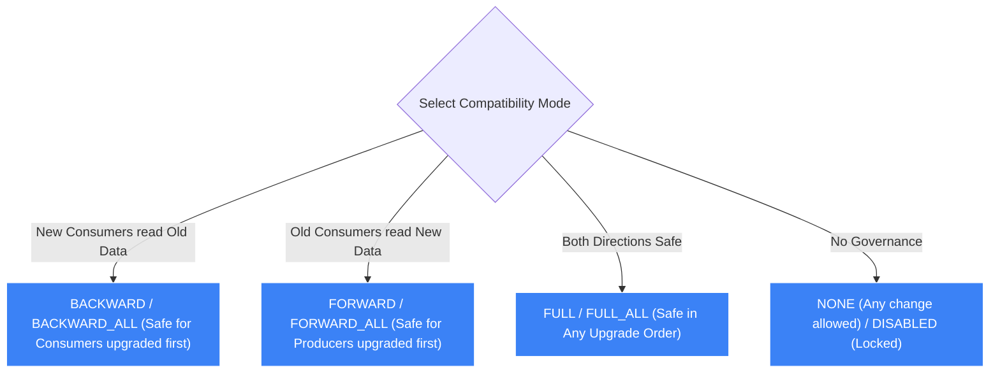

# 🧬 AWS Glue Schema Registry

- **Category**: Analytics / Streaming Schema Governance & Evolution
- **Language / ဘာသာစကား**: **English (Original)** | [မြန်မာဘာသာ (Burmese)](/mm/02-services/analytics-streaming/glue/glue-schema-registry)
- **Primary Use Case**: Centralized discovery, validation, and controlled evolution of event stream schemas for Amazon MSK, Amazon Kinesis, and Apache Flink.
- **Slide Reference**: Pages 331–364 in `[AWSCertifiedDataEngineerSlides.pdf](/docs/AWSCertifiedDataEngineerSlides.pdf)`
- **Hub Links**: `[[index]]` | `[[glue]]` | `[[msk]]` | `[[kinesis]]`

---

## 1. High-Level Summary

**AWS Glue Schema Registry** is a serverless feature within AWS Glue that provides a centralized repository for validating, discovering, and evolving schemas across streaming data applications. 

When building distributed streaming architectures using **[[msk]]**, **[[kinesis]]**, or **Amazon Managed Service for Apache Flink**, disparate producer and consumer teams must adhere to a strict data contract. The Glue Schema Registry enforces this contract at the producer level, preventing malformed or breaking schema changes from ever reaching your data streams.

```mermaid
graph LR
    subgraph Producers["(1) Streaming Producers"]
        JavaApp["Producer Application (Kafka / Kinesis SDK)"]
        Serializer["Glue Client-Side Serializer"]
        JavaApp --> Serializer
    end

    subgraph Governance["(2) AWS Glue Schema Registry"]
        Registry[("Central Schema Registry (Avro / JSON / Protobuf)")]
        Compatibility{"Compatibility Check Engine (BACKWARD / FULL)"}
        Registry <--> Compatibility
    end

    subgraph DataStream["(3) Streaming Transport"]
        KinesisStream[("Amazon Kinesis / Amazon MSK Stream")]
    end

    subgraph Consumers["(4) Streaming Consumers"]
        Deserializer["Glue Client-Side Deserializer"]
        ConsumerApp["Consumer Application (Spark / Flink / Lambda)"]
        Deserializer --> ConsumerApp
    end

    Serializer -->|1. Validate Schema & Fetch Schema ID| Registry
    Serializer -->|2. Send Payload + Schema ID (No Embedded Schema)| KinesisStream
    KinesisStream -->|3. Read Stream Record| Deserializer
    Deserializer -->|4. Fetch Cached Schema by ID| Registry

    classDef prod fill:#8b5cf6,stroke:#fff,stroke-width:1px,color:#fff;
    classDef reg fill:#f59e0b,stroke:#fff,stroke-width:1px,color:#000;
    classDef stream fill:#3b82f6,stroke:#fff,stroke-width:1px,color:#fff;
    classDef con fill:#10b981,stroke:#fff,stroke-width:1px,color:#fff;

    class JavaApp,Serializer prod;
    class Registry,Compatibility reg;
    class KinesisStream stream;
    class Deserializer,ConsumerApp con;
```

---

## 2. Core Capabilities & Mechanics

### 1. Supported Formats & Client-Side SerDe
- **Supported Formats**: **Apache Avro**, **JSON Schema**, and **Protocol Buffers (Protobuf)**.
- **Client-Side Validation**:
  - The validation occurs inside the producer's client application using open-source AWS Glue Serializers/Deserializers (SerDes).
  - If a producer attempts to publish a message that violates the registered schema, the serialization library throws a client-side exception and **blocks the record from entering the stream**.
- **Payload Compression & Bandwidth Reduction**:
  - Instead of embedding the full, heavy schema definition in every single JSON or Avro message, the producer only includes the data payload and a tiny **16-byte Schema UUID**.
  - Consumers retrieve the schema once from the registry and cache it locally, cutting network bandwidth and S3/Kinesis storage costs significantly.

---

### 2. Schema Compatibility & Evolution Modes

As business requirements evolve, developers must update schemas without breaking downstream consumer applications. AWS Glue Schema Registry enforces strict **Compatibility Modes**:



#### Detailed Compatibility Rules for DEA-C01:

| Compatibility Mode | Definition & Meaning | Allowed Schema Changes | Recommended Upgrade Sequence |
| :--- | :--- | :--- | :--- |
| **`BACKWARD`** *(Default)* | The **new schema version** can read data written with the **immediately preceding schema version**. | Add optional fields with default values; delete required fields. | **Upgrade Consumers first**, then upgrade Producers. |
| **`BACKWARD_ALL`** | The **new schema version** can read data written with **all previous schema versions** in the registry. | Add optional fields with defaults; delete required fields. | **Upgrade Consumers first**. |
| **`FORWARD`** | The **immediately preceding schema version** can read data written with the **new schema version**. | Delete optional fields; add required fields with defaults. | **Upgrade Producers first**, then upgrade Consumers. |
| **`FORWARD_ALL`** | **All previous schema versions** can read data written with the **new schema version**. | Delete optional fields; add required fields. | **Upgrade Producers first**. |
| **`FULL`** | Both **`BACKWARD` and `FORWARD`** compatible with the immediately preceding version. | Add or delete **optional fields only** (all new/deleted fields must have default values). | Upgrade in **any order** (Producers or Consumers first). |
| **`FULL_ALL`** | Both **`BACKWARD_ALL` and `FORWARD_ALL`** compatible across all registered versions. | Add or delete **optional fields only** with default values. | Upgrade in **any order**. |
| **`NONE`** | No schema validation or compatibility rules enforced. | Any modification. | Unsafe for production pipelines. |
| **`DISABLED`** | Prevents new schema versions from being registered. | None (Schema is locked). | Deprecating or sunsetting a stream. |

---

### 3. Integration with AWS Analytics & Streaming Ecosystem

1. **Amazon MSK (Apache Kafka)**:
   - Integrates natively with Kafka Producers and Consumers via custom Kafka Serializer plugins.
2. **Amazon Kinesis Data Streams**:
   - Integrates with the **Kinesis Producer Library (KPL)** and **Kinesis Client Library (KCL)**.
3. **AWS Glue Streaming ETL**:
   - Glue streaming jobs can automatically deserialize messages using the schema registered in the Glue Schema Registry.
4. **Apache Flink / Amazon Managed Service for Apache Flink**:
   - Validates event streams in real-time stream-processing pipelines.

---

## 3. DEA-C01 Exam Tips & Scenarios

> [!IMPORTANT]
> **Key Exam Decision Triggers for Glue Schema Registry**:
>
> - **"Prevent invalid or malformed data structures from entering an Amazon MSK or Kinesis data stream"** $\rightarrow$ **AWS Glue Schema Registry**.
> - **"Ensure that streaming consumers can continue reading data after adding a new field to an Avro message"** $\rightarrow$ Configure Glue Schema Registry with **`BACKWARD` compatibility** and provide a **default value** for the new field.
> - **"Allow producers and consumers to be upgraded in any arbitrary order without breaking data pipelines"** $\rightarrow$ Set the compatibility mode to **`FULL` or `FULL_ALL`**.
> - **"Reduce network bandwidth and storage costs by removing redundant schema headers from every streaming message"** $\rightarrow$ Use **AWS Glue Schema Registry client-side SerDes** to transmit only the 16-byte Schema ID.
> - **"Which formats are natively supported by AWS Glue Schema Registry?"** $\rightarrow$ **Apache Avro, JSON Schema, and Protocol Buffers (Protobuf)**.

---

## 📌 Related Notes
- `[[glue]]` — AWS Glue Architecture Overview
- `[[msk]]` — Amazon Managed Streaming for Apache Kafka
- `[[kinesis]]` — Amazon Kinesis Data Streams
- `[[glue-data-catalog]]` — Glue Metadata Catalog
