# 🎨 AWS Glue Studio

- **Category**: Analytics / Visual ETL Authoring & Monitoring
- **Language / ဘာသာစကား**: **English (Original)** | [မြန်မာဘာသာ (Burmese)](/mm/02-services/analytics-streaming/glue/glue-studio)
- **Primary Use Case**: Visual drag-and-drop authoring, running, inspecting, and monitoring AWS Glue PySpark/Scala ETL jobs and serverless Jupyter notebooks.
- **Slide Reference**: Pages 331–364 in `[[AWSCertifiedDataEngineerSlides.pdf]]`
- **Hub Links**: `[[index]]` | `[[glue]]` | `[[glue-etl-jobs]]` | `[[glue-databrew]]`

---

## 1. High-Level Summary

**AWS Glue Studio** provides an intuitive graphical user interface (GUI) that simplifies the creation, execution, and monitoring of AWS Glue ETL jobs. Instead of requiring engineers to write PySpark or Spark Scala code manually from scratch, Glue Studio allows you to design data integration pipelines using a visual **Directed Acyclic Graph (DAG)**.

As you configure nodes in the visual interface, Glue Studio automatically generates production-ready **Apache Spark code** behind the scenes. Engineers can inspect the generated script, modify it, inject custom Python/SQL snippets, and debug pipelines in real time using interactive **Data Previews**.

```mermaid
graph LR
    subgraph SourceNodes["1. Source Nodes"]
        S3In["Amazon S3 (Catalog / Direct)"]
        RDSIn["Amazon RDS / JDBC"]
        KinesisIn["Kinesis / MSK Streaming"]
    end

    subgraph TransformNodes["2. Transform Nodes (Visual DAG)"]
        ApplyMap["ApplyMapping (Rename / Cast)"]
        DropNull["Drop Null Fields / Filter"]
        JoinNode["Join / Aggregate / SQL Query"]
        DQNode["Glue Data Quality (DQDL Validation)"]
    end

    subgraph TargetNodes["3. Target Nodes"]
        S3Out[("Amazon S3 (Parquet / Iceberg)")]
        RedshiftOut[("Amazon Redshift")]
        SnowflakeOut[("Snowflake / BigQuery")]
    end

    SourceNodes --> ApplyMap
    ApplyMap --> DropNull
    DropNull --> JoinNode
    JoinNode --> DQNode
    DQNode --> TargetNodes

    classDef src fill:#8b5cf6,stroke:#fff,stroke-width:1px,color:#fff;
    classDef trans fill:#3b82f6,stroke:#fff,stroke-width:1px,color:#fff;
    classDef tgt fill:#10b981,stroke:#fff,stroke-width:1px,color:#fff;

    class S3In,RDSIn,KinesisIn src;
    class ApplyMap,DropNull,JoinNode,DQNode trans;
    class S3Out,RedshiftOut,SnowflakeOut tgt;
```



---

## 2. Core Capabilities & Architectural Features

### 1. Visual DAG Job Authoring
- **Three Core Node Types**:
  1. **Source Nodes**: Ingest from Amazon S3 (Glue Catalog or direct S3 path), JDBC databases (RDS, Aurora, Redshift, PostgreSQL, Oracle), DynamoDB, Kinesis, or MSK.
  2. **Transform Nodes**: Native visual transformations including `ApplyMapping`, `Filter`, `Join`, `SplitFields`, `SelectFields`, `DropNullFields`, `Relationalize`, `Evaluate Data Quality`, and `Custom SQL / Spark Code`.
  3. **Target Nodes**: Write transformed datasets directly to Amazon S3 (Parquet, ORC, Avro, CSV, JSON, Apache Iceberg, Delta Lake), Amazon Redshift, DynamoDB, or external connectors.
- **Code Inspection & Customization**: You can switch seamlessly between the **Visual** tab, the **Script** tab (to inspect and edit auto-generated PySpark/Scala code), and the **Job Details** tab (to configure worker types, DPU allocation, and timeouts).

---

### 2. Live Data Preview (Interactive Debugging)
- During job design, engineers can enable **Data Preview** on any node in the graph.
- Glue Studio launches a lightweight interactive session that samples the source data and displays the exact schema and sample records after that specific transformation.
- This allows developers to catch transformation logic bugs, column mismatch errors, and null values immediately without waiting 10–20 minutes for a full batch job to execute.

---

### 3. Custom Visual Transforms
- Senior data engineers can package complex, custom PySpark logic into reusable **Custom Visual Transforms**.
- Once uploaded to S3 and registered, these transforms appear as native drag-and-drop nodes in the Glue Studio palette, enabling non-technical teammates to utilize advanced business logic safely.

---

### 4. Glue Studio Interactive Sessions & Jupyter Notebooks

For engineers who prefer a code-first approach, Glue Studio provides serverless **Jupyter Notebooks powered by Glue Interactive Sessions**:
- **Fast Startup**: Launches in seconds rather than waiting minutes for traditional EMR clusters.
- **Cost Efficiency**: You only pay for the DPU-seconds while actively running notebook cells; compute automatically scales down when idle.
- **Direct Magic Commands**: Use `%glue_version`, `%idle_timeout`, and `%number_of_workers` directly inside notebook cells to configure the serverless backend dynamically.

```python
# Example Glue Interactive Session Magic Commands
%idle_timeout 15
%number_of_workers 5
%worker_type G.1X
%glue_version 4.0

import sys
from awsglue.transforms import *
from awsglue.utils import getResolvedOptions
from pyspark.context import SparkContext
from awsglue.context import GlueContext

glueContext = GlueContext(SparkContext.getOrCreate())
df = glueContext.create_dynamic_frame.from_catalog(database="ecommerce", table_name="orders")
df.printSchema()
```

---

### 5. Centralized Job Monitoring Dashboard

Glue Studio includes an enterprise-wide **Monitoring Dashboard** that provides aggregated visibility into all Glue ETL activities across the AWS account:
- **Execution Overview**: Total job runs, success rate, failure rate, and currently running jobs.
- **Resource Utilization**: Total DPU hours consumed over time to track ETL spending.
- **Detailed Run Logs**: Direct integration with **Amazon CloudWatch Logs** and CloudWatch Metrics (CPU utilization, memory usage, executor queue depth).

---

## 3. DEA-C01 Exam Tips & Scenarios

> [!IMPORTANT]
> **Key Exam Decision Triggers for Glue Studio**:
>
> - **"Author and monitor Apache Spark ETL jobs using a visual, drag-and-drop interface that automatically generates PySpark code"** $\rightarrow$ **AWS Glue Studio**.
> - **"Inspect transformed data row-by-row on sample records during pipeline development to catch errors early"** $\rightarrow$ Use **AWS Glue Studio Data Preview**.
> - **"Provide reusable custom Python transformations as visual nodes for junior developers to drop into their pipelines"** $\rightarrow$ Create **AWS Glue Studio Custom Visual Transforms**.
> - **"Run interactive PySpark exploration in a Jupyter notebook without provisioning an Amazon EMR cluster"** $\rightarrow$ **AWS Glue Studio Notebooks with Interactive Sessions**.
> - **"A central dashboard to monitor the status, duration, failure rates, and DPU spending of all Glue jobs across the account"** $\rightarrow$ **AWS Glue Studio Monitoring Dashboard**.

---

## 📌 Related Notes
- `[[glue]]` — AWS Glue Architecture Overview
- `[[glue-etl-jobs]]` — Code-based AWS Glue ETL Jobs & DynamicFrames
- `[[glue-data-quality]]` — Visual Data Quality Nodes in Glue Studio
- `[[glue-databrew]]` — Visual Data Preparation for Non-Technical Analysts
