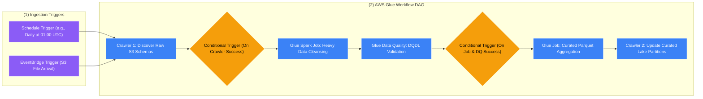
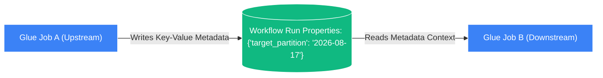

# 🛤️ AWS Glue Workflows

- **Category**: Analytics / Pipeline Orchestration
- **Language / ဘာသာစကား**: **English (Original)** | [မြန်မာဘာသာ (Burmese)](/mm/02-services/analytics-streaming/glue/glue-workflows)
- **Primary Use Case**: Native, serverless orchestration of multi-step Glue Crawlers, Jobs, and Triggers with dynamic parameter sharing.
- **Slide Reference**: Pages 331–364 in `[[AWSCertifiedDataEngineerSlides.pdf]]`
- **Hub Links**: `[[index]]` | `[[glue]]` | `[[step-functions]]` | `[[mwaa-airflow]]`

---

## 1. High-Level Summary

**AWS Glue Workflows** is a fully managed orchestration service designed specifically to coordinate and monitor multi-step extract, transform, and load (ETL) pipelines consisting of **AWS Glue Crawlers, Jobs, and Triggers**.

While enterprise-wide workflows spanning multiple AWS services (such as AWS Lambda, Amazon EMR, Amazon ECS, or Amazon SNS) are typically orchestrated using **[[step-functions]]** or **[[mwaa-airflow]]**, **Glue Workflows** provides a lightweight, zero-infrastructure solution dedicated exclusively to the AWS Glue ecosystem.



---

## 2. Core Architectural Features

### 1. Trigger Types & Coordination Mechanics

Workflows rely on **Triggers** to initiate and synchronize execution across pipeline stages:

| Trigger Type | Firing Condition | DEA-C01 Use Case |
| :--- | :--- | :--- |
| **Schedule-based** | Cron or rate expression (e.g., `cron(0 2 * * ? *)`). | Nightly recurring batch pipelines. |
| **On-Demand** | Manually started via AWS Console, AWS CLI, or SDK. | Ad-hoc data backfills and testing. |
| **Event-based** | Invoked when an **Amazon EventBridge event** occurs (e.g., S3 upload, API gateway). | Event-driven, near-real-time ingestion pipelines. |
| **Conditional** | Fires when **all** or **any** antecedent jobs/crawlers complete with status `SUCCEEDED`, `FAILED`, `STOPPED`, or `TIMEOUT`. | Branching logic, failure handling, and multi-job dependencies. |

---

### 2. Workflow Run Properties (State Sharing Between Nodes)

In a multi-stage pipeline, subsequent jobs often need runtime context generated by upstream jobs (e.g., the exact partition timestamp calculated by Job 1, or the S3 file count detected by Crawler 1).

Glue Workflows provides **Workflow Run Properties** (key-value metadata pairs) that persist across the entire execution graph:



#### Python (Boto3) Code Snippet for Workflow State Sharing:
```python
import boto3
import sys
from awsglue.utils import getResolvedOptions

# Retrieve the current workflow run ID passed into the Glue Job arguments
args = getResolvedOptions(sys.argv, ['WORKFLOW_NAME', 'WORKFLOW_RUN_ID'])
workflow_name = args['WORKFLOW_NAME']
workflow_run_id = args['WORKFLOW_RUN_ID']

glue_client = boto3.client('glue')

# 1. Job A: Put dynamic runtime properties into the workflow
glue_client.put_workflow_run_properties(
    Name=workflow_name,
    RunId=workflow_run_id,
    RunProperties={'target_date': '2026-08-17', 'batch_id': 'B-90210'}
)

# 2. Job B: Retrieve runtime properties set by upstream jobs
response = glue_client.get_workflow_run_properties(
    Name=workflow_name,
    RunId=workflow_run_id
)
current_date = response['RunProperties']['target_date']
print(f"Processing partition date: {current_date}")
```

---

### 3. Orchestration Tool Decision Matrix (Glue Workflows vs. Step Functions vs. MWAA)

Choosing the correct orchestration tool is one of the most heavily tested concepts in the DEA-C01 exam:

| Feature | AWS Glue Workflows | AWS Step Functions | Amazon MWAA (Apache Airflow) |
| :--- | :--- | :--- | :--- |
| **Primary Scope** | **Exclusively AWS Glue components** (Crawlers, Jobs, Triggers). | **Entire AWS Ecosystem** (200+ services: Lambda, EMR, ECS, SNS, DynamoDB). | **Multi-Cloud & Hybrid Ecosystem** (Python DAGs, on-prem, multi-cloud). |
| **Complexity** | Simple, linear ETL pipelines. | Complex state machines, branching, loops, human-in-the-loop approvals. | Complex, dynamic data dependency graphs. |
| **Infrastructure** | **Zero infrastructure**; built into Glue. | **Serverless** (Pay per state transition). | **Managed Instances** (Requires provisioning Airflow environments). |
| **Authoring** | Visual console / JSON API. | Amazon States Language (ASL) / Visual Studio. | Pure Python Code (Airflow DAG files). |
| **Error Handling** | Basic conditional triggers (success/fail). | Advanced `Retry` and `Catch` blocks with exponential backoff. | Advanced task retries, custom failure callbacks. |

---

## 3. DEA-C01 Exam Tips & Scenarios

> [!IMPORTANT]
> **Key Exam Decision Triggers for Glue Workflows**:
>
> - **"Orchestrate a pipeline consisting solely of an S3 Glue Crawler followed by two Glue PySpark jobs without managing external infrastructure"** $\rightarrow$ **AWS Glue Workflows**.
> - **"Automatically trigger a Glue workflow when a new data manifest lands in S3"** $\rightarrow$ **Amazon S3 Event Notification $\rightarrow$ Amazon EventBridge $\rightarrow$ Glue Event Trigger**.
> - **"Pass dynamic partition dates generated in step 1 to downstream jobs in step 2"** $\rightarrow$ Use **AWS Glue Workflow Run Properties (`put_workflow_run_properties` / `get_workflow_run_properties`)**.
> - **"Orchestrate a pipeline that coordinates an AWS Batch job, an Amazon EMR cluster, an AWS Lambda function, and an Amazon SNS alert"** $\rightarrow$ *DO NOT use Glue Workflows; use **AWS Step Functions***.
> - **"Data engineering team requires Python-based DAGs with hundreds of cross-cloud dependencies"** $\rightarrow$ **Amazon MWAA (Managed Apache Airflow)**.

---

## 📌 Related Notes
- `[[glue]]` — AWS Glue Architecture Overview
- `[[glue-etl-jobs]]` — AWS Glue ETL Jobs & Transforms
- `[[glue-crawlers]]` — Automating Data Catalog Crawls
- `[[step-functions]]` — AWS Step Functions Enterprise Orchestration
- `[[mwaa-airflow]]` — Amazon Managed Workflows for Apache Airflow
