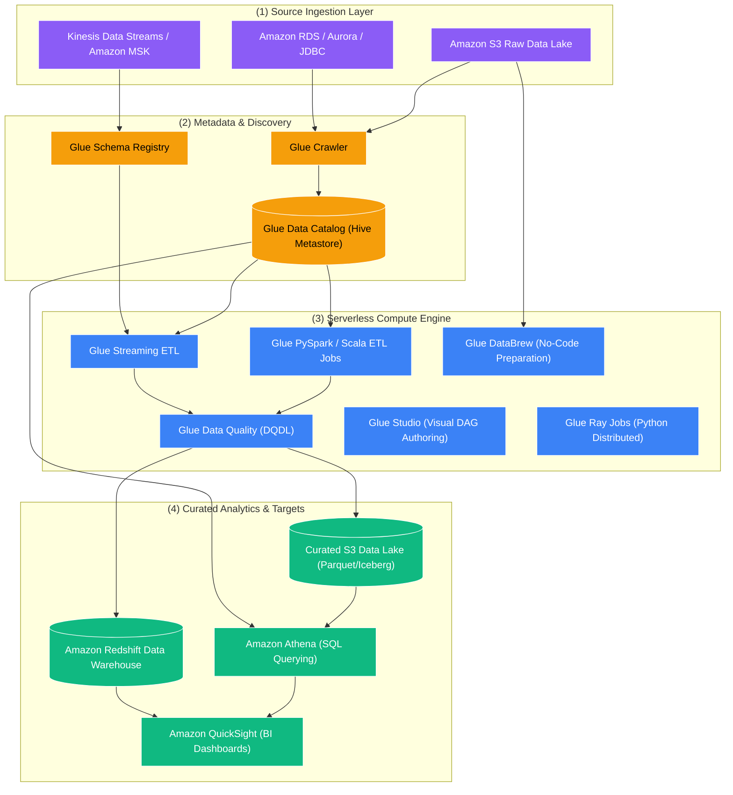
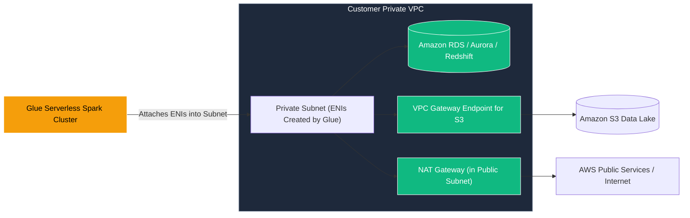

# 🧪 AWS Glue Overview (Serverless Data Integration & ETL)

- **Category**: Analytics / Data Pipelines
- **Language / ဘာသာစကား**: **English (Original)** | [မြန်မာဘာသာ (Burmese)](/mm/02-services/analytics-streaming/glue/glue)
- **Primary Use Case**: Serverless ETL, Centralized Metadata Management, Automated Schema Discovery, Data Quality Governance, Visual & Code-based Data Preparation.
- **Slide Reference**: Pages 331–364 in `[AWSCertifiedDataEngineerSlides.pdf](/docs/AWSCertifiedDataEngineerSlides.pdf)`
- **Hub Links**: `[[index]]` | `[[service-catalog]]` | `[[domain-1-ingestion-and-processing]]` | `[[domain-3-data-processing]]`

---

## 1. High-Level Summary

**AWS Glue** is a fully managed, event-driven, serverless data integration service that makes it easy to discover, prepare, transform, and combine data for analytics, machine learning, and application development. It serves as the foundational data pipeline engine across the AWS Modern Data Architecture.

Unlike cluster-based frameworks such as **[[emr]]**, AWS Glue abstracts away all underlying compute infrastructure. It provisions, configures, and scales resources automatically, billing strictly per second for the **Data Processing Units (DPUs)** consumed by jobs (1 DPU = 4 vCPUs and 16 GB of memory).

---

## 2. The AWS Glue Service Taxonomy

AWS Glue is not a single tool; it is a unified suite composed of several purpose-built services. Master each of the sub-features below for the DEA-C01 exam:

| Component | Primary Function | Core Technology / Language | Detailed Note |
| :--- | :--- | :--- | :--- |
| **Glue Data Catalog** | Central Apache Hive-compatible metastore for table definitions, partitions, schema versions, and connections. | Apache Hive Metastore API | `[[glue-data-catalog]]` |
| **Glue Crawlers** | Automated scanners that inspect data stores (S3, JDBC, DynamoDB) to infer schemas, detect partitions, and update the catalog. | Classifiers (Grok / Built-in) | `[[glue-crawlers]]` |
| **Glue ETL Jobs** | Serverless batch and streaming data transformation engine with built-in DynamicFrames and state management. | PySpark, Spark Scala, Python Shell | `[[glue-etl-jobs]]` |
| **Glue Data Quality** | Declarative data validation framework using DQDL rulesets to measure data health, fail jobs, or quarantine bad records. | DQDL (Data Quality Definition Lang) | `[[glue-data-quality]]` |
| **Glue DataBrew** | Visual, spreadsheet-like data preparation tool with 250+ pre-built transformations for business analysts and data scientists. | Visual UI / Recipe Engine | `[[glue-databrew]]` |
| **Glue Studio** | Visual drag-and-drop DAG interface for authoring, running, inspecting, and monitoring Spark ETL jobs without writing code. | Visual GUI / Auto-generated Spark | `[[glue-studio]]` |
| **Glue Flex Execution** | Flexible, cost-optimized execution class offering up to 35% discount for non-time-sensitive, non-SLA batch jobs. | Spot-like compute capacity | `[[glue-flex]]` |
| **Glue Workflows** | Purpose-built orchestration service for managing multi-step Glue pipelines (Triggers, Crawlers, and Jobs) as visual DAGs. | Native Glue Orchestration | `[[glue-workflows]]` |
| **Glue Schema Registry** | Centralized streaming schema governance that validates and evolves message structures in real time. | Apache Avro, JSON Schema, Protobuf | `[[glue-schema-registry]]` |

---

## 3. Critical Architectural & Exam Deep Dives

### 1. VPC Networking & Private Connectivity

When a Glue job or crawler needs to access resources inside a private Amazon VPC (e.g., Amazon RDS, Amazon Redshift, Amazon MSK, or on-premises databases over Direct Connect/VPN), you must configure an **AWS Glue Connection**:

#### Key Networking Rules for DEA-C01:
1. **Self-Referencing Security Group**: The security group attached to the Glue Connection must contain a **self-referencing inbound rule** that allows all TCP traffic from itself (Source = Security Group ID). This is required for Glue Spark worker nodes to communicate with each other during shuffle and broadcast operations.
2. **S3 Gateway VPC Endpoint**: When Glue runs inside a private VPC subnet without internet access, it cannot communicate with Amazon S3 unless you configure a **Gateway VPC Endpoint for Amazon S3** attached to the route table of that subnet.
3. **Public Internet Access**: If the job must reach external APIs or public endpoints while running inside a VPC, the subnet route table must route `0.0.0.0/0` traffic through a **NAT Gateway** located in a public subnet.
4. **Subnet IP Sizing**: Ensure the private subnet has enough available private IP addresses; each Glue worker consumes an Elastic Network Interface (ENI) and an IP address.

---

### 2. Security Configurations & Data Protection

AWS Glue provides **Security Configurations** to enforce encryption across the entire ETL lifecycle:

| Layer | Encryption Options | Scope |
| :--- | :--- | :--- |
| **S3 Data at Rest** | SSE-S3 or SSE-KMS (Customer Managed Key) | Input data, transformed output data, and temporary scratch buckets. |
| **Glue Data Catalog Metadata** | AWS KMS Key | Encrypts catalog table definitions, column metadata, and connection credentials. |
| **CloudWatch Logs** | AWS KMS Key | Encrypts log streams generated by PySpark and Python Shell jobs. |
| **Job Bookmarks** | AWS KMS Key | Encrypts incremental state files stored in S3. |
| **Local Disk (Shuffle Storage)** | AWS KMS Key or OS-level encryption | Encrypts temporary intermediate shuffle data written to local NVMe storage on worker nodes. |
| **Data in Transit** | TLS 1.2+ | Encrypts inter-node Spark communication and API calls. |

---

### 3. Compute Service Decision Matrix (Glue vs. EMR vs. Athena vs. Batch)

| Feature | AWS Glue | Amazon EMR | Amazon Athena | AWS Batch |
| :--- | :--- | :--- | :--- | :--- |
| **Compute Model** | **Serverless Spark / Python** | **Managed Clusters (EC2 / EKS / Serverless)** | **Serverless Presto / Trino** | **Containerized Batch (EC2 / Fargate)** |
| **Primary Use Case** | Scheduled ETL, event-driven pipelines, streaming ETL, metadata management. | Petabyte-scale big data, custom Spark/Hadoop/Presto/Flink clusters, long-running persistent analytics. | Interactive ad-hoc SQL querying directly on S3 data lakes. | General-purpose batch computing, image processing, custom Docker containers. |
| **Startup Latency** | Fast (seconds to ~1 minute; under 1 sec for Athena Spark). | Minutes (for EC2 provisioning) or seconds (EMR Serverless). | Instant (sub-second query initiation). | Seconds (Fargate) to minutes (EC2 scale-out). |
| **Cost Model** | Per DPU-second consumed ($0.44 per DPU-hour). | EC2 hourly + EMR management surcharge; Spot instance savings up to 90%. | $5.00 per TB of data scanned. | Standard underlying EC2 or Fargate container pricing. |
| **Maintenance** | **Zero infrastructure maintenance**; fully serverless. | High (cluster sizing, instance types, OS tuning, autoscaling policies). | **Zero infrastructure maintenance**; fully serverless. | Low to Medium (container image maintenance). |
| **State Tracking** | **Native Job Bookmarks**. | Custom application logic (DynamoDB / S3 manifests). | Stateless. | Custom application logic. |

---

## 4. DEA-C01 Exam Tips & Decision Triggers

> [!IMPORTANT]
> **Key Exam Decision Triggers for AWS Glue**:
> - **"Serverless PySpark ETL without managing EC2 clusters"** $\rightarrow$ **AWS Glue ETL Jobs**.
> - **"Track incremental S3 file arrivals without custom database state tracking"** $\rightarrow$ **Enable AWS Glue Job Bookmarks**.
> - **"Automatically identify schema changes, data formats, and partitions in S3"** $\rightarrow$ **AWS Glue Crawlers**.
> - **"Centralized Apache Hive-compatible metastore across Athena, EMR, and Redshift Spectrum"** $\rightarrow$ **AWS Glue Data Catalog**.
> - **"Self-referencing security group required during setup"** $\rightarrow$ **Glue Connection for private VPC data access**.
> - **"Validate incoming data against rules (completeness, uniqueness) and quarantine invalid rows"** $\rightarrow$ **AWS Glue Data Quality (DQDL)**.
> - **"Business analysts need to normalize and clean data visually with zero coding"** $\rightarrow$ **AWS Glue DataBrew**.
> - **"Save up to 35% on non-urgent, nightly batch backfills"** $\rightarrow$ **AWS Glue Flex Execution Class**.
> - **"Orchestrate a pipeline consisting exclusively of Glue Crawlers, Jobs, and Triggers"** $\rightarrow$ **AWS Glue Workflows**.
> - **"Validate streaming message schemas before writing to Amazon MSK or Kinesis"** $\rightarrow$ **AWS Glue Schema Registry**.

---

## 📌 Related Notes
- `[[glue-data-catalog]]` — Glue Data Catalog, Metastore & Partition Indexes
- `[[glue-crawlers]]` — Glue Crawlers, Classifiers & Schema Drift
- `[[glue-etl-jobs]]` — Glue ETL Jobs, DynamicFrames & Performance Tuning
- `[[glue-data-quality]]` — AWS Glue Data Quality & DQDL Rules
- `[[glue-databrew]]` — AWS Glue DataBrew for Visual Preparation
- `[[glue-studio]]` — AWS Glue Studio Visual ETL
- `[[glue-flex]]` — AWS Glue Flex Execution Class
- `[[glue-workflows]]` — AWS Glue Workflows Orchestration
- `[[glue-schema-registry]]` — AWS Glue Schema Registry for Streaming
- `[[athena]]` — Amazon Athena Integration
- `[[emr]]` — Amazon EMR vs. AWS Glue
- `[[lake-formation]]` — AWS Lake Formation Centralized Governance
