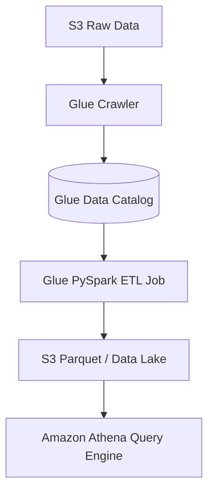

# 🧪 AWS Glue Overview (Serverless Data Integration & ETL)

- **Category**: Analytics / Data Pipelines
- **Language / ဘာသာစကား**: **English (Original)** | [မြန်မာဘာသာ (Burmese)](/mm/02-services/analytics-streaming/glue/glue)
- **Primary Use Case**: Serverless ETL, Data Cataloging, Schema Discovery, Data Quality, Visual ETL.
- **Slide Reference**: Pages 331–364 in `[[AWSCertifiedDataEngineerSlides.pdf]]`
- **Hub Links**: `[[index]]` | `[[service-catalog]]` | `[[domain-1-ingestion-and-processing]]`

---

## 1. High-Level Summary

AWS Glue is a fully managed, serverless data integration service that makes it easy to discover, prepare, and combine data for analytics, machine learning, and application development. It forms the backbone of AWS data pipelines by providing event-driven ETL job orchestration, automatic schema crawlers, and a centralized Apache Hive-compatible **Glue Data Catalog**.

By abstracting away the infrastructure management of Apache Spark clusters (unlike Amazon EMR), AWS Glue allows Data Engineers to focus on transformation logic and data quality, running on a pay-as-you-go serverless model.

---

## 2. Key Architecture Components

AWS Glue is divided into several major feature sets, each critical for the DEA-C01 exam:

1. **[[glue-data-catalog]]**: The central meta-store for structural and operational metadata, serving as an Apache Hive metastore replacement for Athena, EMR, and Redshift Spectrum.
2. **[[glue-crawlers]]**: Automated services that scan data stores (S3, RDS, DynamoDB), infer their schema, detect partitions, and populate the Data Catalog.
3. **[[glue-etl-jobs]]**: Serverless distributed processing using Apache Spark (PySpark/Scala) or Python shell, featuring Glue DynamicFrames and Job Bookmarks.
4. **[[glue-data-quality]]**: Rule-based DQDL validation to halt pipelines or quarantine bad data without writing custom Spark scripts.
5. **[[glue-databrew]]**: A visual data preparation tool enabling analysts to clean and transform data without writing code.

---

## 3. DEA-C01 Exam Tips & Decision Triggers

> [!IMPORTANT]
> **Key Exam Rules for AWS Glue**:
> - **Schema Drift Handling**: Use **Glue Crawlers** and configure them to `Update the table definition in the data catalog`.
> - **ETL State Management**: Use **Glue Job Bookmarks** to process only newly added files incrementally.
> - **Visual No-Code Preparation**: Use **AWS Glue DataBrew** for analysts who need to clean data without writing PySpark code.
> - **Data Validation**: Use **AWS Glue Data Quality** to evaluate records against DQDL rules.

---

## 📌 Related Notes
- `[[glue-data-catalog]]` — Glue Data Catalog & Metastore
- `[[glue-crawlers]]` — Glue Crawlers & Schema Inference
- `[[glue-etl-jobs]]` — Glue ETL Jobs, DynamicFrames & Bookmarks
- `[[glue-data-quality]]` — AWS Glue Data Quality (DQDL)
- `[[glue-databrew]]` — AWS Glue DataBrew
- `[[athena]]` — Serverless SQL queries on Glue Data Catalog
- `[[emr]]` — Managed EMR clusters vs Glue Serverless Spark
