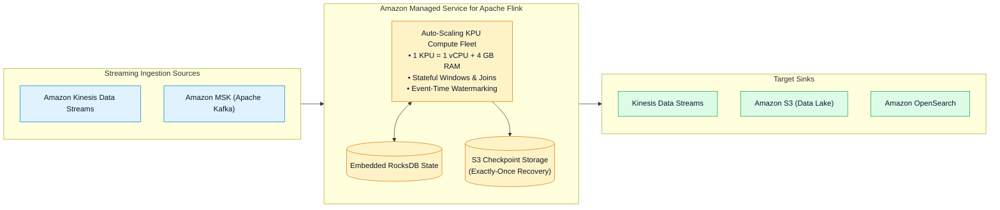
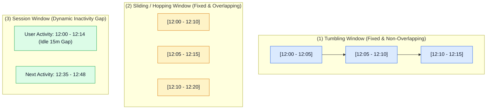
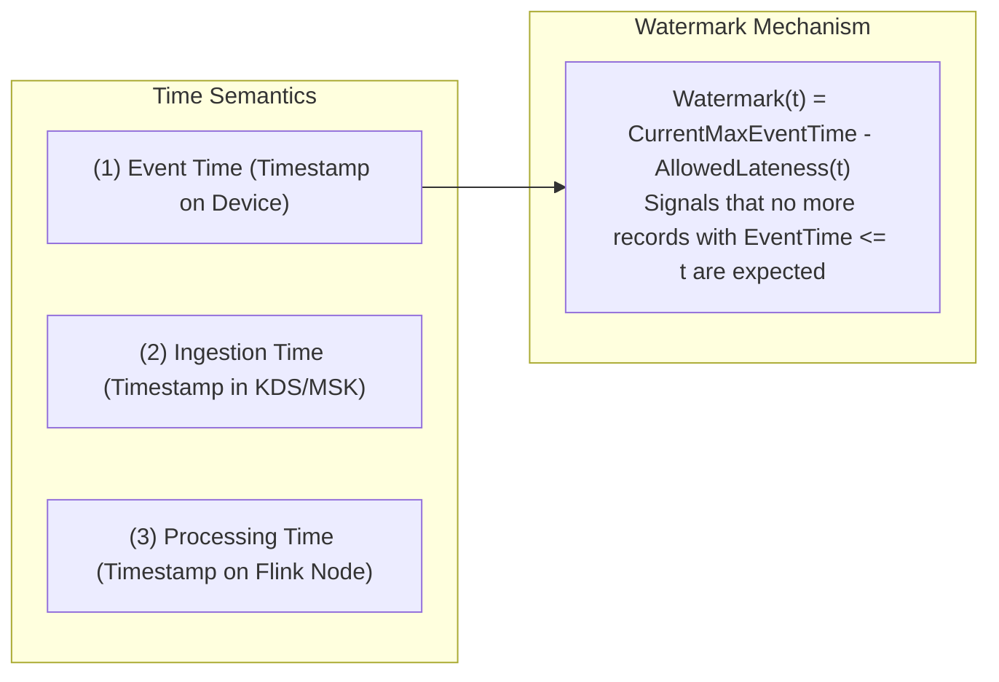
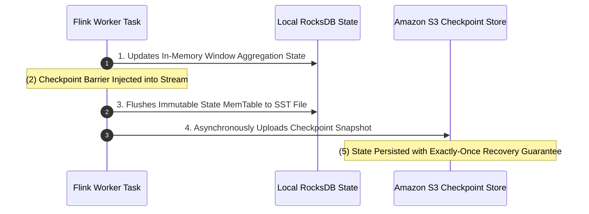

# ⚡ Amazon Managed Service for Apache Flink

- **Category**: Analytics / Stateful Real-Time Stream Processing
- **Language / ဘာသာစကား**: **English (Original)** | [မြန်မာဘာသာ (Burmese)](/mm/02-services/analytics-streaming/kinesis/kinesis-apache-flink)
- **Primary Use Case**: Sub-second, stateful stream processing, continuous anomaly detection, time-window aggregations (Tumbling, Sliding, Session), and exact-once delivery semantics.
- **Slide Reference**: Pages 451–459 in `[AWSCertifiedDataEngineerSlides.pdf](/docs/AWSCertifiedDataEngineerSlides.pdf)`
- **Hub Links**: `[[index]]` | `[[kinesis]]` | `[[kinesis-data-streams]]` | `[[s3]]` | `[[domain-3-data-processing]]`

---

## 1. High-Level Summary

**Amazon Managed Service for Apache Flink** (formerly *Amazon Kinesis Data Analytics*) is a fully managed, serverless Apache Flink service designed for building complex, stateful streaming applications.

It processes continuous real-time data from **Amazon Kinesis Data Streams**, **Amazon MSK (Apache Kafka)**, or custom sources with **sub-second latency**, supporting SQL, Java, Scala, and Python.

---

## 2. Compute Model & Kinesis Processing Units (KPUs)

The compute capacity of an Apache Flink application is measured in **Kinesis Processing Units (KPUs)**:

| Metric / Dimension | Specification | Architecture Detail |
| :--- | :--- | :--- |
| **1 KPU Resources** | **1 vCPU + 4 GB Memory + 50 GB Disk Storage** | Standardized compute block. |
| **Auto-Scaling** | Dynamic scaling based on CPU and memory utilization | Scales between `MinKPUs` (default: 1) and `MaxKPUs` (default: 64). |
| **Parallelism** | Configurable per operator or application-wide | `Parallelism` determines how many parallel tasks execute on the KPUs. |
| **Parallelism per KPU** | 1 (default) | Up to 8 tasks per KPU for I/O bound workloads. |

---

## 3. Streaming Window Types

Windowing partitions continuous infinite streams into finite buckets for mathematical aggregation:

### 1. Tumbling Window
- **Definition**: Fixed duration with zero overlap. Every record belongs to exactly one window.
- **Example**: Calculate total financial transaction volume **every 5 minutes**.

### 2. Sliding (Hopping) Window
- **Definition**: Fixed duration that moves forward by a smaller sliding interval, producing overlapping results.
- **Example**: Calculate a **10-minute moving average CPU load**, updated **every 1 minute**.

### 3. Session Window
- **Definition**: Dynamic duration that groups events by periods of user activity separated by a configured inactivity timeout gap (e.g., 15 minutes of idle time).
- **Example**: Tracking continuous web browsing sessions per user.

---

## 4. Time Semantics & Event-Time Watermarking

Handling out-of-order and late-arriving records is a major strength of Apache Flink:

1. **Event Time (Recommended)**: The exact timestamp when an event occurred on the source device (e.g., sensor clock). Resilient to network latency and out-of-order deliveries.
2. **Watermarks**: A watermark `Watermark(t)` acts as a time progress indicator, telling the Flink engine that all records with `EventTime <= t` have arrived, triggering the evaluation and closing of that window.
3. **Allowed Lateness**: Bounded late-arriving records that arrive after a window closes can still update the window state or be routed to a **Side Output** for auditing.

---

## 5. State Management & Fault Tolerance (Exactly-Once Semantics)

Flink maintains local state in an embedded **RocksDB state backend** on SSDs and periodically writes asynchronous checkpoint snapshots to **Amazon S3**:

- **Fault Tolerance**: If an EC2 host crashes or the application scales out KPUs, Flink restarts the operators and restores state from the latest successful **S3 Checkpoint**, guaranteeing **Exactly-Once Processing**.
- **Savepoints**: Manually triggered state snapshots allowing zero-data-loss application upgrades, code refactoring, or AWS Region migrations.

---

## 6. DEA-C01 Exam Tips & Scenarios

> [!IMPORTANT]
> **Key Exam Decision Triggers for Managed Service for Apache Flink**:
>
> - **"Perform continuous 10-minute moving average calculations on IoT sensor data with sub-second latency"** $\rightarrow$ Use **Amazon Managed Service for Apache Flink** with a **Sliding Window**.
> - **"Calculate financial metrics every 1 hour where late-arriving trade records up to 10 minutes must be included"** $\rightarrow$ Use **Apache Flink** with **Event-Time Watermarks and Allowed Lateness**.
> - **"Need an interactive Apache Zeppelin notebook to run streaming SQL queries against Kinesis Data Streams"** $\rightarrow$ Use **Amazon Managed Service for Apache Flink Studio**.
> - **"Compute requirements for scaling a stateful Flink application"** $\rightarrow$ Configure **Kinesis Processing Units (KPUs)** (each KPU provides 1 vCPU and 4 GB RAM).
> - **"Guarantee zero data loss and exactly-once processing across application restarts"** $\rightarrow$ Enable **Flink Checkpointing to Amazon S3**.

---

## 📌 Related Notes
- `[[kinesis]]` — Kinesis Streaming Ecosystem Overview Hub
- `[[kinesis-data-streams]]` — KDS Ingestion & Shards
- `[[kinesis-firehose]]` — Micro-Batch Streaming Delivery
- `[[s3]]` — S3 Checkpoint and Sink Storage
