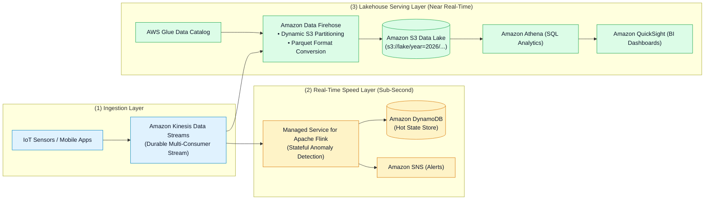
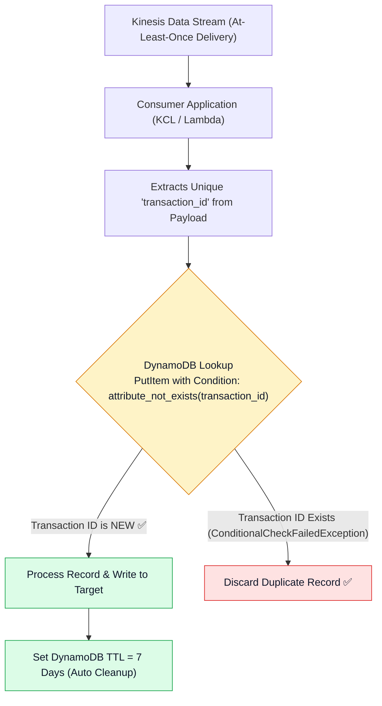
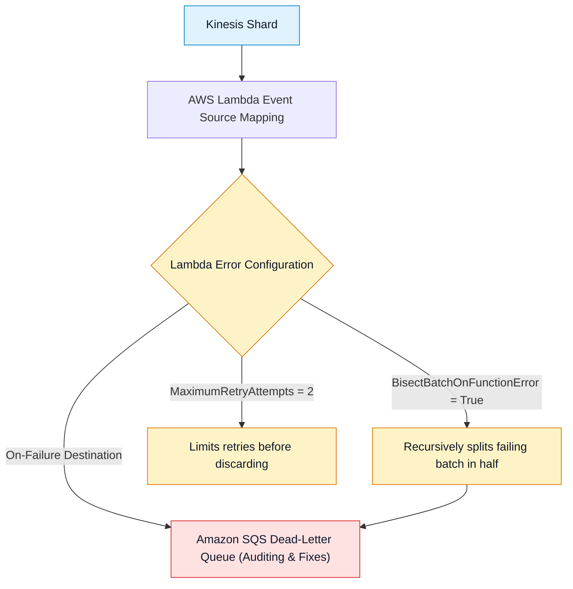

# 🏗️ Kinesis Streaming Architectures, Design Patterns & Decision Matrices

- **Category**: Analytics / Streaming Architecture & System Design
- **Language / ဘာသာစကား**: **English (Original)** | [မြန်မာဘာသာ (Burmese)](/mm/02-services/analytics-streaming/kinesis/kinesis-architecture-and-patterns)
- **Primary Use Case**: Designing end-to-end streaming data pipelines, implementing record deduplication, isolating poison pills, and choosing between KDS, Firehose, MSK, and SQS.
- **Slide Reference**: Pages 414–459 in `[AWSCertifiedDataEngineerSlides.pdf](/docs/AWSCertifiedDataEngineerSlides.pdf)`
- **Hub Links**: `[[index]]` | `[[kinesis]]` | `[[kinesis-data-streams]]` | `[[kinesis-firehose]]` | `[[kinesis-apache-flink]]` | `[[msk]]`

---

## 1. High-Level Summary

Real-time data engineering on AWS combines multiple services to satisfy two distinct streaming workloads: **Low-Latency Stream Processing** (sub-second alerting, stateful anomaly detection) and **Continuous Managed Lakehouse Ingestion** (columnar Parquet micro-batch delivery into S3).

This guide provides end-to-end enterprise reference architectures, deduplication strategies, and a multi-dimensional decision matrix covering the complete AWS streaming and messaging landscape.

---

## 2. Comprehensive Streaming & Messaging Decision Matrix

| Dimension | Kinesis Data Streams (KDS) | Amazon Data Firehose (KDF) | Amazon MSK (Apache Kafka) | Amazon SQS | Amazon SNS |
| :--- | :--- | :--- | :--- | :--- | :--- |
| **Delivery Model** | Streaming partition log (pull / push via EFO). | Automated streaming delivery (micro-batch push). | Distributed publish-subscribe topic partitions. | Point-to-point message queue. | Publish-subscribe fan-out topic. |
| **Target Latency** | **70 ms – 200 ms** (sub-second). | **60 s – 900 s** (near real-time). | **< 20 ms** (sub-second). | **Sub-second** (pull). | **Sub-second** (push). |
| **Data Retention & Replay** | **24 hours to 365 days** (full replay). | **None** (in-flight buffer only). | **Configurable** (hours to years). | **1 minute to 14 days** (deleted upon read). | **None** (no message storage). |
| **Message Ordering** | Strictly ordered **per Partition Key**. | Micro-batched; order not guaranteed across batches. | Strictly ordered **per Partition**. | Ordered only in **SQS FIFO**; unordered in Standard. | Ordered only in **SNS FIFO**. |
| **Max Payload Size** | **1 MB** | **1 MB** (or 10 MB with Lambda) | **1 MB** (configurable up to multi-MB) | **256 KB** (2 GB with S3 Extended Client) | **256 KB** |
| **Scaling Mechanism** | Shard scaling (Provisioned or On-Demand). | Fully serverless (auto-scales). | Broker node instance types & storage expansion. | Virtually unlimited automatic scaling. | Virtually unlimited automatic scaling. |
| **Primary Use Case** | Multi-consumer custom stream processing & replay. | Direct ingestion to S3/Redshift with Parquet format conversion. | Enterprise Kafka migration, custom Kafka Connect plugins. | Decoupling microservices & background worker queues. | Event notifications, fan-out to SQS/Lambda/Email. |

---

## 3. Data Deduplication in Streaming Pipelines

Because Kinesis operates on an **At-Least-Once Delivery** guarantee, network retries by producers or worker restarts can introduce duplicate records.

### Deduplication Strategies:
1. **Idempotent Destination Writes**: Use primary key upserts in DynamoDB (`PutItem`) or `MERGE INTO` in Apache Iceberg / Delta Lake.
2. **DynamoDB State Tracker**: Track processed message UUIDs in a dedicated DynamoDB table using conditional writes (`attribute_not_exists(id)`). Attach a **Time to Live (TTL)** of 7 days to purge historical keys automatically.
3. **Apache Flink Stateful Deduplication**: Flink maintains an in-memory RocksDB state bounded by a time window (e.g. 1 hour) to filter duplicates before emitting downstream.

---

## 4. Isolating Poison Pills (Corrupted Records)

A malformed or unparseable record ("poison pill") must never be allowed to stall an entire stream pipeline:

---

## 5. DEA-C01 Scenario Decision Guide

> [!IMPORTANT]
> **Key Exam Decision Triggers for Streaming Architecture**:
>
> - **"Need real-time sub-second anomaly detection AND automated delivery to an S3 Parquet data lake"** $\rightarrow$ Ingest via **Kinesis Data Streams**, connect **Managed Service for Apache Flink** for real-time alerts, and attach **Amazon Data Firehose** for S3 Parquet delivery.
> - **"Prevent duplicate records from causing duplicate accounting entries when processing streams"** $\rightarrow$ Implement **Idempotency keys with Amazon DynamoDB conditional writes**.
> - **"Existing infrastructure uses Apache Kafka APIs and custom Kafka Connect plugins"** $\rightarrow$ Migrate to **Amazon MSK**.
> - **"Decouple background web worker tasks where each task is processed once by a single worker and deleted"** $\rightarrow$ Use **Amazon SQS**.
> - **"Fan-out a single streaming event to 10 different subscriber queues simultaneously"** $\rightarrow$ Publish to **Amazon SNS** subscribed to multiple **Amazon SQS queues**.

---

## 📌 Related Notes
- `[[kinesis]]` — Kinesis Streaming Ecosystem Overview Hub
- `[[kinesis-data-streams]]` — KDS Ingestion & Shards
- `[[kinesis-firehose]]` — Micro-Batch Streaming Delivery
- `[[kinesis-apache-flink]]` — Real-Time Stateful Stream Processing
- `[[msk]]` — Amazon Managed Streaming for Apache Kafka
- `[[dynamodb]]` — Deduplication State Storage
