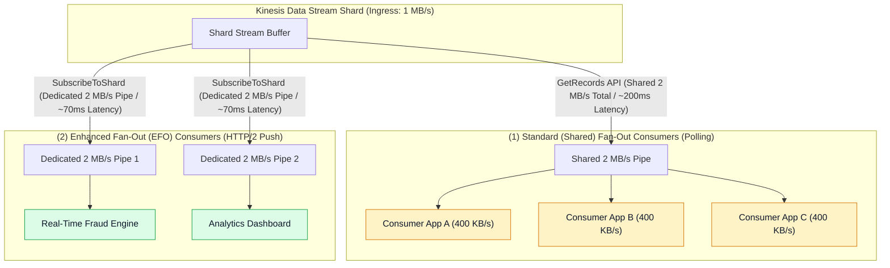
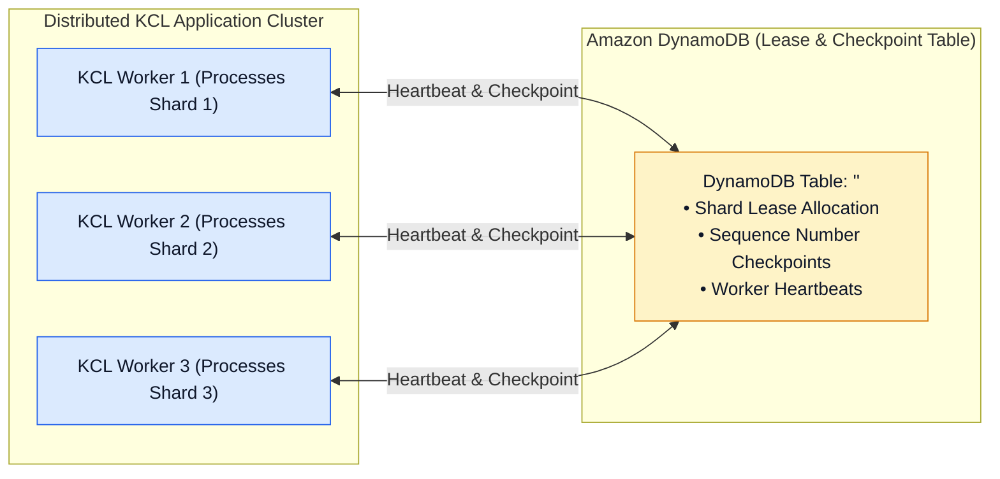
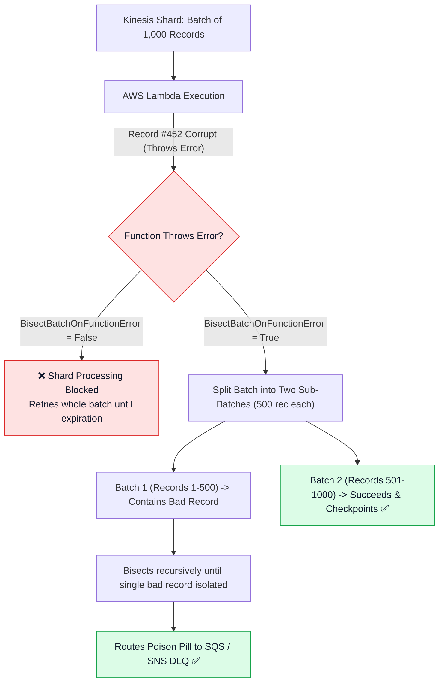
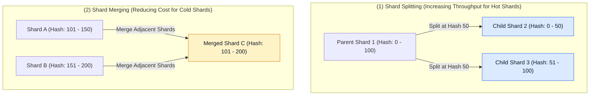

# 🚀 Kinesis Consumers, Enhanced Fan-Out & Scaling

- **Category**: Analytics / Stream Processing & Consumer Scaling
- **Language / ဘာသာစကား**: **English (Original)** | [မြန်မာဘာသာ (Burmese)](/mm/02-services/analytics-streaming/kinesis/kinesis-consumers-and-scaling)
- **Primary Use Case**: High-throughput stream consumption, dedicated consumer fan-out, KCL state coordination via DynamoDB, and automated Lambda error handling.
- **Slide Reference**: Pages 425–445 in `[[AWSCertifiedDataEngineerSlides.pdf]]`
- **Hub Links**: `[[index]]` | `[[kinesis]]` | `[[kinesis-data-streams]]` | `[[dynamodb]]` | `[[lambda]]`

---

## 1. High-Level Summary

Extracting records from Amazon Kinesis Data Streams requires selecting the optimal consumer architecture. AWS supports two fundamental consumption models: **Standard (Shared) Fan-Out** (polling via `GetRecords`) and **Enhanced Fan-Out (EFO)** (push via HTTP/2 `SubscribeToShard`).

For enterprise stream processing, the **Kinesis Client Library (KCL)** coordinates distributed worker instances and checkpoints progress in **Amazon DynamoDB**, while **AWS Lambda Event Source Mappings** offer built-in parallelization and error isolation mechanisms.

---

## 2. Standard Fan-Out vs. Enhanced Fan-Out (EFO)

| Feature | Standard (Shared) Fan-Out | Enhanced Fan-Out (EFO) |
| :--- | :--- | :--- |
| **API Mechanism** | Pull model using HTTP `GetRecords` polling. | Push model using HTTP/2 `SubscribeToShard`. |
| **Throughput per Shard** | **2 MB / second total** (shared across all standard consumers). | **2 MB / second dedicated per registered consumer**. |
| **Latency** | Typical propagation delay **~200 ms**. | Ultra-low propagation delay **~70 ms**. |
| **Max Consumers Limit** | Limited by shared 2 MB/s throughput and 5 `GetRecords` calls/sec per shard. | Up to **20 registered EFO consumers** per stream. |
| **Cost Model** | No additional consumer fee (included in base shard hour). | Billed per **Consumer-Shard-Hour** + **Data Retrieval (GB)**. |
| **Recommended Use Case** | Single consumer application, batch consumers, or non-latency-critical pipelines. | Multiple concurrent applications reading the same stream, or strict sub-100ms latency SLAs. |

---

## 3. Kinesis Client Library (KCL) & DynamoDB Coordination

The **Kinesis Client Library (KCL)** is a Java/Python framework that simplifies building scalable distributed stream consumer applications.

### Key KCL Operational Principles:
1. **One-to-One Shard Mapping**: At any given time, exactly one worker thread in the KCL fleet processes data from a single shard. If you have 10 shards, you can run up to 10 worker instances in parallel.
2. **DynamoDB State Table**: KCL creates a DynamoDB table named after the application (`applicationName`). It tracks which worker owns which shard lease and the latest sequence number successfully checkpointed.
3. **DynamoDB Provisioning Caution**: If the DynamoDB table experiences provisioned throughput throttling, KCL workers cannot checkpoint, leading to processing stalls or duplicate message replays. Ensure the DynamoDB table uses **On-Demand Capacity** or sufficient provisioned RCU/WCU.
4. **KPL De-Aggregation**: KCL automatically and transparently de-aggregates records that were bundled by the Kinesis Producer Library (KPL).

---

## 4. AWS Lambda as a Kinesis Consumer

When configuring AWS Lambda to read from Kinesis Data Streams via **Event Source Mapping**, Lambda polls the stream shards and executes functions on batches of records.

### Critical Lambda Tuning Parameters for DEA-C01:
- **`BatchSize`**: Maximum number of records to retrieve in a single Lambda invocation (default: 100, max: 10,000).
- **`MaximumBatchingWindowInSeconds`**: Maximum time Lambda buffers records before invoking the function (0 to 300 seconds), optimizing batch sizes for low-traffic streams.
- **`ParallelizationFactor` (1 to 10)**: Allows up to 10 concurrent Lambda invocations **per shard**. Lambda processes different partition keys concurrently while maintaining strictly ordered processing per individual partition key.
- **`BisectBatchOnFunctionError`**: When enabled, if a batch fails, Lambda splits the batch in two and retries each half independently. This recursively isolates the single malformed record ("poison pill") and prevents head-of-line blocking.
- **`On-Failure Destination`**: Sends metadata regarding permanently failed records to an **Amazon SQS Dead-Letter Queue (DLQ)** or **Amazon SNS topic** after reaching `MaximumRetryAttempts` or `MaximumRecordAgeInSeconds`.

---

## 5. Stream Resharding: Splitting vs. Merging

Resharding adjusts the total capacity of a Provisioned Kinesis stream without interrupting running applications.

### Resharding Rules:
1. **Parent Shards to Closed State**: When a shard is split or merged, the parent shard moves to the `CLOSED` (or `EXPIRED`) state.
2. **Order Preservation**: KCL and Lambda continue to read and finish processing all remaining records in the parent shard **before** beginning to read from the child shards. This guarantees end-to-end record ordering.
3. **Only Adjacent Shards Can Be Merged**: Two shards can only be merged if their contiguous hash key ranges meet without gaps.

---

## 6. DEA-C01 Exam Tips & Scenarios

> [!IMPORTANT]
> **Key Exam Decision Triggers for Kinesis Consumers**:
>
> - **"5 independent analytics applications are reading from the same Kinesis stream and experiencing `ReadProvisionedThroughputExceeded` errors"** $\rightarrow$ Enable **Enhanced Fan-Out (EFO)** with dedicated 2 MB/sec HTTP/2 pipes for each application.
> - **"A KCL application running on EC2 is repeatedly failing to checkpoint and causing duplicate record reads"** $\rightarrow$ Check the **DynamoDB lease table** for write throttling and increase provisioned WCU or enable On-Demand capacity.
> - **"A single corrupted record causes a Lambda Kinesis consumer to retry infinitely, blocking the entire shard"** $\rightarrow$ Enable **`BisectBatchOnFunctionError = True`** and configure an **On-Failure SQS DLQ destination**.
> - **"Need to scale up Lambda consumer concurrency on a high-throughput shard without losing in-order processing per partition key"** $\rightarrow$ Increase the **`ParallelizationFactor`** (up to 10).
> - **"How does KCL maintain data ordering during stream resharding?"** $\rightarrow$ KCL reads all existing records from the **parent shard until exhaustion** before consuming from the newly created **child shards**.

---

## 📌 Related Notes
- `[[kinesis]]` — Kinesis Streaming Ecosystem Overview Hub
- `[[kinesis-data-streams]]` — Shards, Partition Keys & Capacity Modes
- `[[dynamodb]]` — DynamoDB Capacity & KCL State Storage
- `[[lambda]]` — AWS Lambda Stream Processing Architecture
