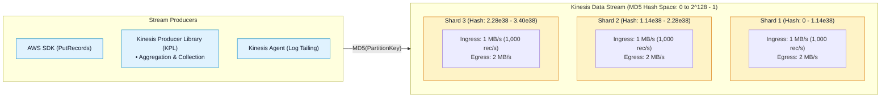
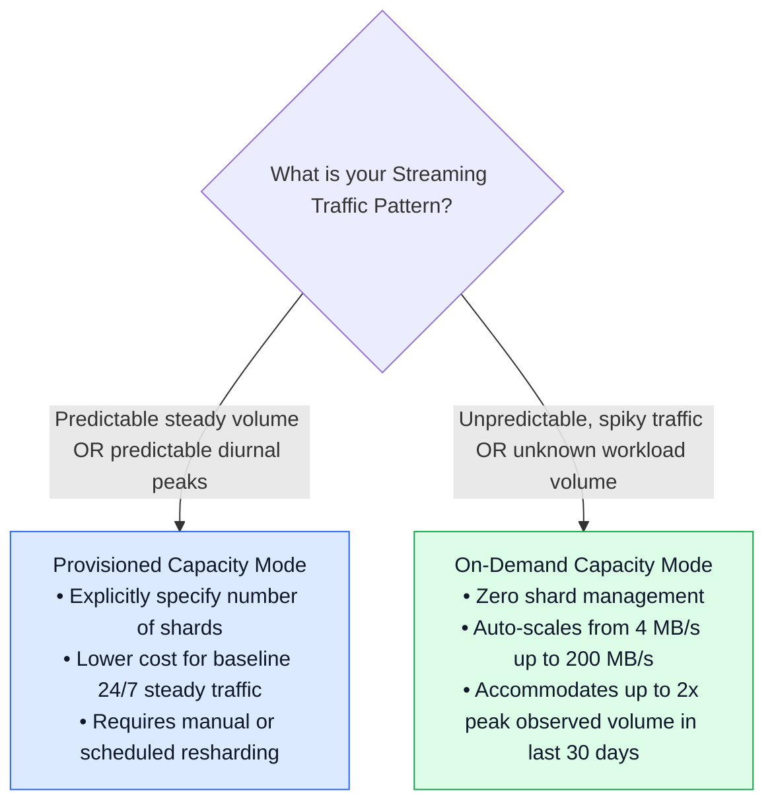
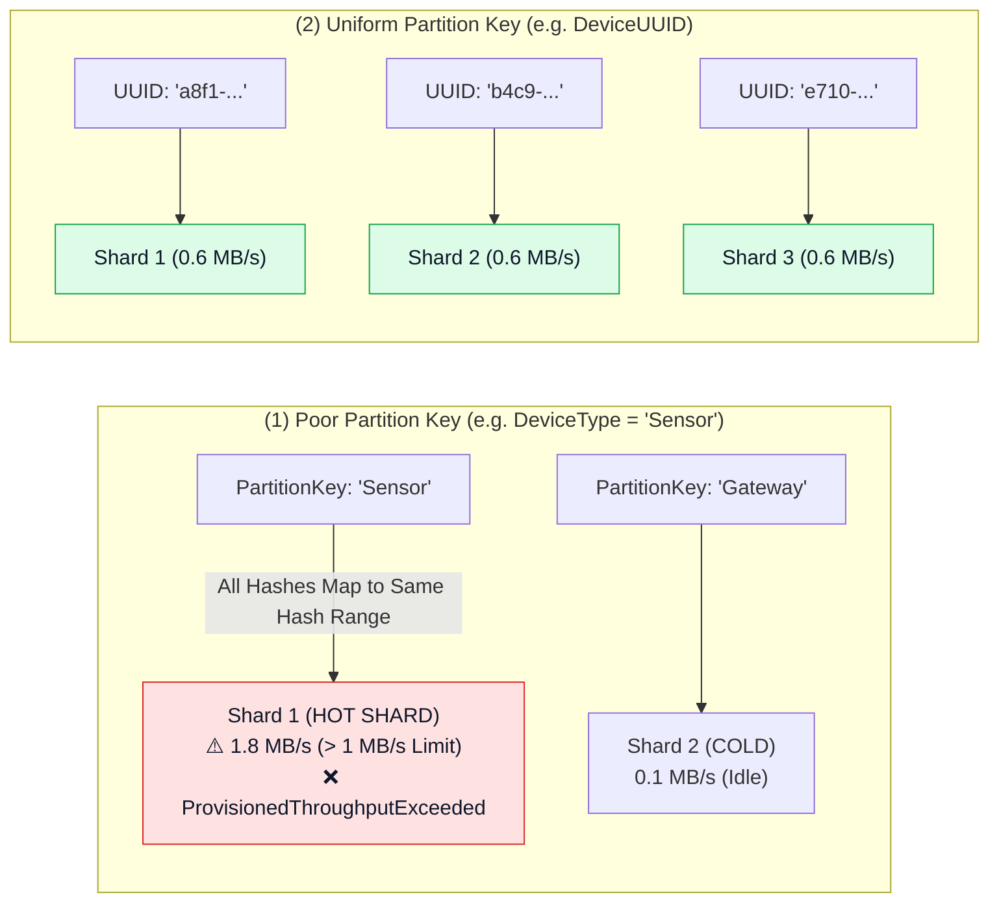
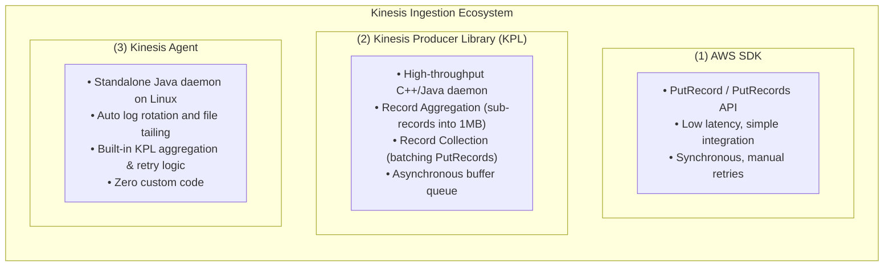

# ⚡ Amazon Kinesis Data Streams (KDS) Architecture & Ingestion

- **Category**: Analytics / Real-Time Data Streaming & Ingestion
- **Language / ဘာသာစကား**: **English (Original)** | [မြန်မာဘာသာ (Burmese)](/mm/02-services/analytics-streaming/kinesis/kinesis-data-streams)
- **Primary Use Case**: Ingesting massive data streams with custom partition keys, sub-second latency, multi-consumer replay, and flexible capacity scaling.
- **Slide Reference**: Pages 414–435 in `[AWSCertifiedDataEngineerSlides.pdf](/docs/AWSCertifiedDataEngineerSlides.pdf)`
- **Hub Links**: `[[en/index|index]]` | `[[en/02-services/analytics-streaming/kinesis/kinesis|kinesis]]` | `[[en/02-services/analytics-streaming/kinesis/kinesis-consumers-and-scaling|kinesis-consumers-and-scaling]]` | `[[en/01-domains/domain-1-ingestion-and-processing|domain-1-ingestion-and-processing]]`

---

## 1. High-Level Summary

**Amazon Kinesis Data Streams (KDS)** is a massively scalable, durable, real-time data streaming service. Data is ingested into a stream and structured into **Shards**. Each record within a stream contains a **Sequence Number**, a **Partition Key**, and a data payload (blob) of up to **1 MB**.

Records are durably replicated across three Availability Zones (AZs) in an AWS Region and retained for a configurable period (default **24 hours**, extendable up to **365 days**), allowing multiple downstream applications to consume and re-read data independently.

---

## 2. Shard Fundamentals & Capacity Limits

A **Shard** is the base throughput unit of a Kinesis Data Stream.

| Shard Dimension | Limit / Metric per Shard | Notes & DEA-C01 Implications |
| :--- | :--- | :--- |
| **Write Throughput (Ingress)** | **1 MB / second** or **1,000 records / second** | Exceeding either limit triggers `ProvisionedThroughputExceededException`. |
| **Read Throughput (Standard Egress)** | **2 MB / second** (shared across all consumers) | Max 5 `GetRecords` API calls per second per shard. |
| **Enhanced Fan-Out (EFO Egress)** | **2 MB / second per registered consumer** | Dedicated HTTP/2 push pipeline (does not consume shared 2 MB/s). |
| **Maximum Record Size** | **1 MB** (including partition key) | Base64 encoded payload. Larger payloads must use S3 claim-check pattern. |
| **Data Retention Window** | **24 hours default** (up to **365 days / 8760 hours**) | Enables replaying historical data during application failure or backfill. |

---

## 3. Capacity Modes: Provisioned vs. On-Demand

### 1. Provisioned Mode (Manual Capacity Planning)
- You specify the exact number of shards.
- Formula for calculating required shards:
  $$\text{Required Shards} = \max\left(\left\lceil\frac{\text{Peak Write Data Rate (MB/sec)}}{1\text{ MB/sec}}\right\rceil, \left\lceil\frac{\text{Peak Records/sec}}{1000\text{ records/sec}}\right\rceil\right)$$
- If consumer read throughput exceeds $2\text{ MB/sec}$, add shards or enable Enhanced Fan-Out.

### 2. On-Demand Mode (Automated Elastic Scaling)
- AWS automatically manages shard provisioning and scaling without downtime.
- Default baseline: **4 MB/sec** write (4,000 records/sec) and **8 MB/sec** read.
- Auto-scales dynamically up to **200 MB/sec** write and **400 MB/sec** read per stream.
- Handles traffic spikes up to **2x the previous 30-day peak** throughput instantly without throttling.

---

## 4. Partition Keys & The Hot Shard Problem

Each incoming record requires a string **Partition Key** (up to 256 characters). Kinesis applies an **MD5 hash algorithm** to map the partition key to an ordered 128-bit integer space ($0$ to $2^{128}-1$) divided among active shards.

### Hot Shard Causes and Solutions:
1. **Cause**: Low cardinality partition keys (e.g., status code, country code, or date string) route the vast majority of records to a single shard, triggering `ProvisionedThroughputExceededException` even when total stream capacity is underutilized.
2. **Solution**: Use high-cardinality keys (e.g., `user_id`, `device_id`, or `transaction_uuid`).
3. **Random Suffixing (Salting)**: If data must be partitioned by an entity that generates uneven traffic, append a random integer suffix (e.g., `device_101#rand_04`) to distribute records uniformly across hash spaces.

---

## 5. Ingestion Producers: SDK vs. KPL vs. Kinesis Agent

### 1. AWS SDK (`PutRecord` and `PutRecords`)
- Direct HTTP REST API calls.
- `PutRecords` supports up to **500 records** or **5 MB** per call.
- Synchronous; returns per-record status codes (`ErrorCode` and `ErrorMessage`) to identify individual failed records for manual retry.

### 2. Kinesis Producer Library (KPL)
- Designed for maximum write throughput and cost efficiency.
- **Aggregation**: Combines multiple micro-records (e.g., 200-byte IoT records) into a single 1 MB Kinesis record.
- **Collection**: Batches multiple Kinesis records into a single `PutRecords` HTTP call to saturate shard capacity.
- **Buffering**: Configured via `RecordMaxBufferedTime` (default 100ms).
- **Caveat**: Aggregated records must be de-aggregated by consumers using the **Kinesis Client Library (KCL)** or the KPL de-aggregation library.

### 3. Kinesis Agent
- Standalone background daemon for Linux servers (EC2 or on-premises).
- Automatically monitors log directories, handles multiline log parsing, and publishes data to KDS or Firehose with built-in retry and aggregation mechanisms.

---

## 6. DEA-C01 Exam Tips & Scenarios

> [!IMPORTANT]
> **Key Exam Decision Triggers for Kinesis Data Streams**:
>
> - **"Stream receives `ProvisionedThroughputExceededException` but CloudWatch shows overall stream capacity is only at 30%"** $\rightarrow$ Diagnosed as a **Hot Shard** caused by a low-cardinality partition key. Fix by selecting a high-cardinality key (e.g., `device_id`) or applying random salting.
> - **"Millions of tiny 100-byte IoT records need to be ingested into KDS cost-effectively without exceeding the 1,000 records/sec per shard limit"** $\rightarrow$ Use the **Kinesis Producer Library (KPL)** to enable **Record Aggregation**.
> - **"Need to stream Linux server system and application log files directly into Kinesis without writing custom producer code"** $\rightarrow$ Install and configure the **Amazon Kinesis Agent**.
> - **"Application requires replaying streaming transactions from 30 days ago to train a machine learning model"** $\rightarrow$ Extend KDS **Data Retention Period** from 24 hours to 30 days (up to 365 days).
> - **"Unpredictable streaming traffic with sudden 10x traffic spikes that cannot tolerate manual shard management"** $\rightarrow$ Switch stream capacity mode to **On-Demand Mode**.

---

## 📌 Related Notes
- `[[en/02-services/analytics-streaming/kinesis/kinesis|kinesis]]` — Kinesis Streaming Ecosystem Overview Hub
- `[[en/02-services/analytics-streaming/kinesis/kinesis-consumers-and-scaling|kinesis-consumers-and-scaling]]` — Standard vs. Enhanced Fan-Out & KCL
- `[[en/02-services/analytics-streaming/kinesis/kinesis-firehose|kinesis-firehose]]` — Amazon Data Firehose Pipelines
- `[[en/02-services/analytics-streaming/kinesis/kinesis-security-and-monitoring|kinesis-security-and-monitoring]]` — KMS Encryption & CloudWatch Metrics
