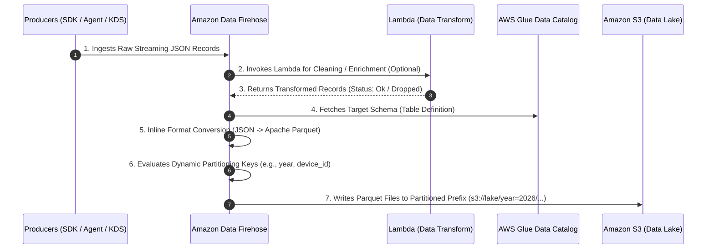
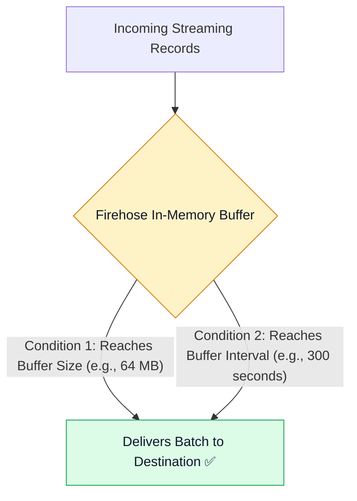
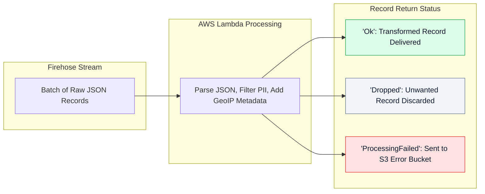
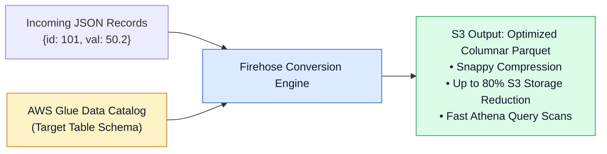
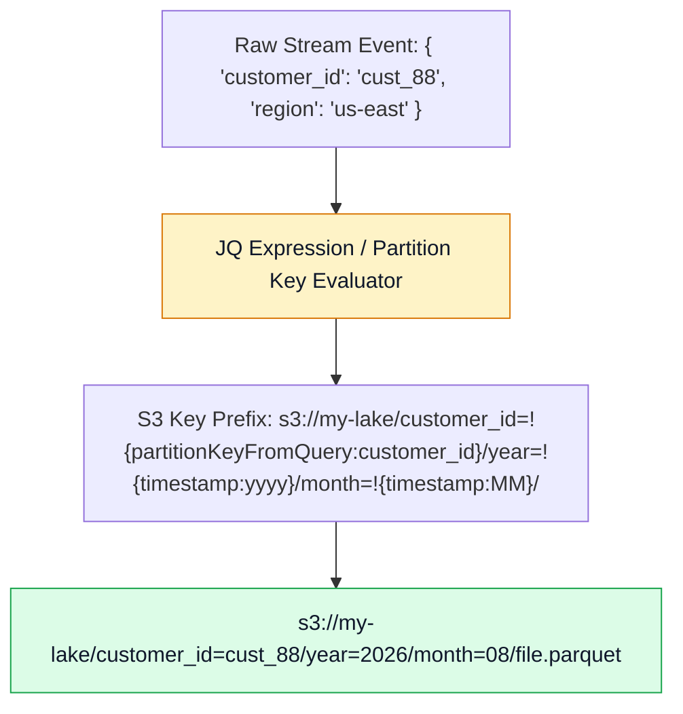

# 🚒 Amazon Data Firehose Streaming Delivery Pipelines

- **Category**: Analytics / Managed Streaming Delivery & ETL
- **Language / ဘာသာစကား**: **English (Original)** | [မြန်မာဘာသာ (Burmese)](/mm/02-services/analytics-streaming/kinesis/kinesis-firehose)
- **Primary Use Case**: Serverless, zero-maintenance streaming ingestion to S3 data lakes, Redshift, and OpenSearch with native Parquet conversion and dynamic S3 partitioning.
- **Slide Reference**: Pages 436–450 in `[[AWSCertifiedDataEngineerSlides.pdf]]`
- **Hub Links**: `[[index]]` | `[[kinesis]]` | `[[s3]]` | `[[glue-data-catalog]]` | `[[athena]]`

---

## 1. High-Level Summary

**Amazon Data Firehose** (formerly *Amazon Kinesis Data Firehose*) is a fully managed, serverless delivery service that captures, transforms, and loads streaming data into data lakes, data warehouses, and analytics tools.

Unlike Kinesis Data Streams, Firehose requires **zero shard management**, scales automatically to accommodate unpredictable data volumes, and delivers records in near real-time micro-batches based on configurable **Buffer Size** and **Buffer Interval** thresholds.

---

## 2. Supported Destinations & Integration Architecture

Firehose natively delivers streaming data to both AWS destinations and third-party analytic platforms:

| Destination Category | Supported Targets | Delivery Mechanism |
| :--- | :--- | :--- |
| **AWS Data Lake & Search** | **Amazon S3**, **Amazon OpenSearch Service** | Direct micro-batch PUT delivery into S3 buckets or OpenSearch indexing API. |
| **AWS Data Warehousing** | **Amazon Redshift** | Stages micro-batches in an intermediate S3 bucket and automatically executes the Redshift `COPY` command. |
| **Third-Party Analytic SaaS** | **Splunk**, **Datadog**, **Dynatrace**, **New Relic**, **Snowflake** | Direct delivery over HTTPS with authentication tokens. |
| **Custom Endpoints** | **Generic HTTP / HTTPS Endpoints** | Delivers JSON/raw payloads with configurable headers and retry policies. |

---

## 3. Buffering Hints & Delivery Latency

Firehose buffers incoming streaming records in memory before delivering them to destinations. Delivery is triggered when **whichever condition is satisfied first**:

- **Buffer Size**: Configurable from **1 MB to 128 MB** (default: 5 MB).
- **Buffer Interval**: Configurable from **60 seconds to 900 seconds (15 minutes)** (default: 300s).
- **Near Real-Time Classification**: Firehose is designed for micro-batch delivery (**60s – 900s latency**). If your application requires sub-second processing latency, use **Kinesis Data Streams (KDS)** instead.

---

## 4. In-Flight Lambda Transformations

Firehose can invoke an **AWS Lambda function** to transform incoming raw records before loading them into destinations.

- **Lambda Response Schema**: Each record in the batch must return:
  - `recordId`: Matches the incoming record identifier.
  - `result`: Must be `"Ok"`, `"Dropped"` (e.g., filtering out debug logs), or `"ProcessingFailed"`.
  - `data`: Base64-encoded transformed data payload.
- **Lambda Invocation Timeout**: Up to 5 minutes per batch.

---

## 5. Native Format Conversion: JSON to Apache Parquet / ORC

Firehose can convert raw streaming JSON directly into **Apache Parquet** or **Apache ORC** without requiring an external Apache Spark or AWS Glue ETL job.

### Format Conversion Best Practices:
1. **Schema Reference**: Firehose reads the schema definitions (column names and data types) directly from an **AWS Glue Data Catalog table**.
2. **Buffer Sizing for Parquet**: Set the Firehose buffer size to **64 MB or 128 MB** (maximum) to produce large, efficient Parquet files and avoid creating thousands of tiny small files.
3. **Downstream Benefits**: Automatically optimizes query performance in **Amazon Athena**, **Amazon Redshift Spectrum**, and **Amazon EMR** while significantly reducing S3 API scan charges.

---

## 6. Dynamic Partitioning into Amazon S3

**Dynamic Partitioning** parses record keys directly from streaming payloads and writes output records into partitioned S3 directory prefixes in real time.

### Partitioning Key Configuration:
- Uses **JQ Expressions** to extract attributes (e.g., `customer_id`, `event_type`, `device_id`) from incoming JSON records.
- Formats standard Hive-compatible partitions (`year=YYYY/month=MM/day=DD/`).
- Eliminates the need to run nightly ETL partition restructuring jobs.

---

## 7. Source Record Backup & Error Handling

Firehose supports S3 backup streams to prevent data loss:
- **`BackupMode: FailedDataOnly`**: Only records that failed Lambda transformation, schema validation, or format conversion are written to an S3 error prefix (e.g., `s3://backup-bucket/processing-failed/`).
- **`BackupMode: AllData`**: Archives a 100% complete raw copy of every record ingested before any transformation or conversion took place.

---

## 8. DEA-C01 Exam Tips & Scenarios

> [!IMPORTANT]
> **Key Exam Decision Triggers for Amazon Data Firehose**:
>
> - **"Ingest streaming JSON logs into an S3 data lake in Apache Parquet format with zero server management"** $\rightarrow$ Use **Amazon Data Firehose** with **Record Format Conversion** referencing an **AWS Glue Data Catalog** schema.
> - **"Organize streaming S3 output records dynamically by customer ID and year/month without post-processing ETL"** $\rightarrow$ Enable Firehose **Dynamic Partitioning** with JQ partition expressions.
> - **"Need to stream IoT records into Amazon Redshift automatically"** $\rightarrow$ Configure an **Amazon Data Firehose delivery stream with Redshift destination** (Firehose automatically stages data in S3 and executes `COPY`).
> - **"Filter out PII fields or discard debug log records before streaming data to an OpenSearch cluster"** $\rightarrow$ Enable **In-Flight Data Transformation** using an **AWS Lambda function** returning status `"Ok"` or `"Dropped"`.
> - **"Streaming data produces thousands of tiny 500 KB Parquet files in S3 causing slow Athena queries"** $\rightarrow$ Increase the Firehose **Buffer Size to 128 MB** and **Buffer Interval to 900 seconds**.

---

## 📌 Related Notes
- `[[kinesis]]` — Kinesis Streaming Ecosystem Overview Hub
- `[[kinesis-data-streams]]` — KDS Ingestion & Shard Architecture
- `[[glue-data-catalog]]` — Glue Metastore for Firehose Schema Lookups
- `[[athena]]` — Querying Firehose Parquet Output with Serverless SQL
