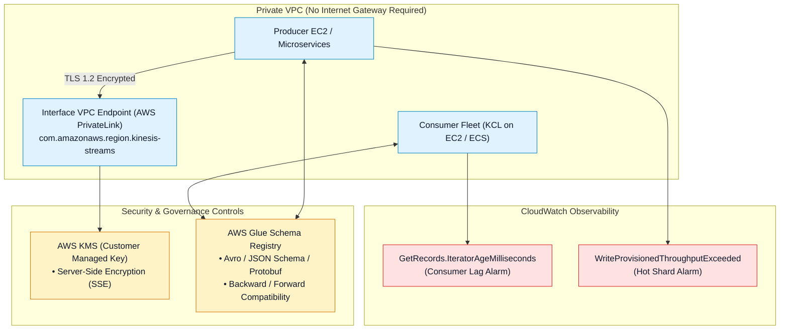
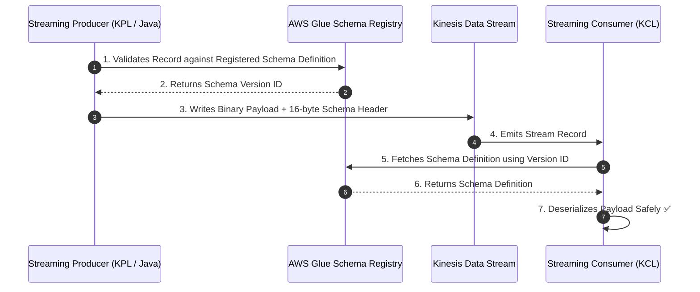
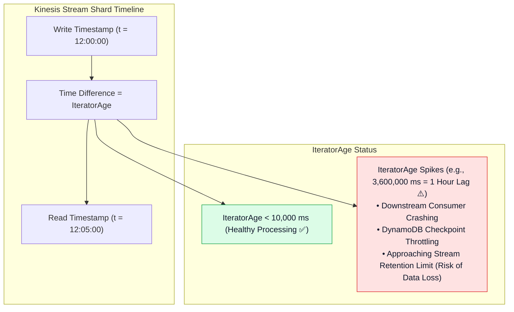

# 🛡️ Kinesis Security, Governance & CloudWatch Monitoring

- **Category**: Analytics / Stream Security, Network Isolation & Observability
- **Language / ဘာသာစကား**: **English (Original)** | [မြန်မာဘာသာ (Burmese)](/mm/02-services/analytics-streaming/kinesis/kinesis-security-and-monitoring)
- **Primary Use Case**: Securing stream payloads with KMS and VPC PrivateLink, validating stream schemas via Glue Schema Registry, and detecting consumer lag via `IteratorAgeMilliseconds`.
- **Slide Reference**: Pages 446–459 in `[AWSCertifiedDataEngineerSlides.pdf](/docs/AWSCertifiedDataEngineerSlides.pdf)`
- **Hub Links**: `[[en/index|index]]` | `[[en/02-services/analytics-streaming/kinesis/kinesis|kinesis]]` | `[[en/02-services/analytics-streaming/kinesis/kinesis-data-streams|kinesis-data-streams]]` | `[[en/02-services/analytics-streaming/glue/glue-schema-registry|glue-schema-registry]]` | `[[security-and-compliance]]`

---

## 1. High-Level Summary

Operating production streaming workloads at enterprise scale requires rigorous **Security Controls** (at-rest KMS encryption, in-transit TLS, and private VPC routing), **Schema Governance** (contract enforcement via AWS Glue Schema Registry), and **Real-Time Observability** (CloudWatch metrics, alarms, and lag tracking).

The most vital operational metric in the entire Amazon Kinesis ecosystem is **`GetRecords.IteratorAgeMilliseconds`**, which directly measures consumer processing latency and prevents data loss.

---

## 2. Security & Network Isolation Architecture

### 1. Encryption at Rest & in Transit
- **Server-Side Encryption (SSE)**: Uses **AWS KMS** to encrypt data records at rest inside Kinesis shards before they are written to disk. Supports both AWS Managed Keys (`aws/kinesis`) and Customer Managed Keys (CMKs).
- **In-Transit Encryption**: All API communications (`PutRecord`, `PutRecords`, `GetRecords`, and `SubscribeToShard`) enforce **TLS 1.2 / HTTPS**.

### 2. Network Isolation via AWS PrivateLink (VPC Endpoints)
- Configure **Interface VPC Endpoints** (`com.amazonaws.<region>.kinesis-streams` and `com.amazonaws.<region>.kinesis-firehose`) inside your private subnets.
- Enables EC2 instances, Lambda functions, and containerized workloads to publish and consume streaming records securely over private AWS network backbones without requiring an Internet Gateway or NAT Gateway.

### 3. IAM Least-Privilege Policies
- Producers require `kinesis:PutRecord` and `kinesis:PutRecords`.
- Standard consumers require `kinesis:GetRecords`, `kinesis:GetShardIterator`, and `kinesis:DescribeStream`.
- Enhanced Fan-Out consumers require `kinesis:SubscribeToShard`.

---

## 3. Real-Time Schema Governance: AWS Glue Schema Registry

The **AWS Glue Schema Registry** ensures strict data quality and schema evolution rules for real-time streams (supporting **Apache Avro**, **JSON Schema**, and **Protocol Buffers (Protobuf)**).

### Schema Evolution Compatibility Modes:
- **`BACKWARD` / `BACKWARD_ALL`**: New schema can read data written with older schemas (allows deleting optional fields or adding fields with defaults).
- **`FORWARD` / `FORWARD_ALL`**: Older consumers can read data written with newer schemas.
- **`FULL` / `FULL_ALL`**: Guarantees bidirectional backward and forward compatibility.
- **`NONE`**: Disables compatibility validation checks.

---

## 4. CloudWatch Metrics & Monitoring `IteratorAgeMilliseconds`

### Key CloudWatch Metrics for DEA-C01:

| Metric Name | Source / Focus | Meaning & Alarm Recommendation |
| :--- | :--- | :--- |
| **`GetRecords.IteratorAgeMilliseconds`** | Consumer | **Consumer Lag**. Measures age of the oldest record read from a shard. Set alarm when this metric consistently increases. |
| **`WriteProvisionedThroughputExceeded`** | Producer | **Write Throttling**. Indicates that ingress throughput exceeds 1 MB/s or 1,000 records/s per shard, or a **Hot Shard** exists. |
| **`ReadProvisionedThroughputExceeded`** | Consumer | **Read Throttling**. Indicates that standard consumer reads exceed 2 MB/s or 5 `GetRecords` calls/s per shard. |
| **`IncomingBytes` / `IncomingRecords`** | Stream | Real-time write volume. Used for auto-scaling triggers in Provisioned mode. |
| **`DeliveryToS3.Success`** (Firehose) | Firehose | Percentage of successful micro-batch deliveries to S3 (should be 100%). |
| **`ExecuteProcessing.Success`** (Firehose) | Firehose | Success rate of inline AWS Lambda data transformations. |

---

## 5. DEA-C01 Exam Tips & Scenarios

> [!IMPORTANT]
> **Key Exam Decision Triggers for Kinesis Security & Monitoring**:
>
> - **"What CloudWatch metric indicates that a downstream consumer is falling behind the Kinesis stream?"** $\rightarrow$ **`GetRecords.IteratorAgeMilliseconds`**.
> - **"How to encrypt sensitive streaming data records at rest inside Kinesis Data Streams?"** $\rightarrow$ Enable **Server-Side Encryption (SSE) with AWS KMS**.
> - **"EC2 instances in a private subnet without internet access must stream records into KDS"** $\rightarrow$ Create an **Interface VPC Endpoint (AWS PrivateLink)** for Kinesis.
> - **"Enforce data contracts and prevent malformed data payloads from being published to a streaming pipeline"** $\rightarrow$ Integrate with **AWS Glue Schema Registry** with `BACKWARD` or `FULL` compatibility rules.
> - **"CloudWatch shows `WriteProvisionedThroughputExceeded` alerts, but total incoming stream volume is only 40% of provisioned capacity"** $\rightarrow$ Investigate **Partition Key distribution** to eliminate a **Hot Shard**.

---

## 📌 Related Notes
- `[[en/02-services/analytics-streaming/kinesis/kinesis|kinesis]]` — Kinesis Streaming Ecosystem Overview Hub
- `[[en/02-services/analytics-streaming/kinesis/kinesis-data-streams|kinesis-data-streams]]` — KDS Ingestion & Shard Architecture
- `[[en/02-services/analytics-streaming/kinesis/kinesis-consumers-and-scaling|kinesis-consumers-and-scaling]]` — KCL & Enhanced Fan-Out
- `[[en/02-services/analytics-streaming/glue/glue-schema-registry|glue-schema-registry]]` — AWS Glue Schema Registry Deep Dive
- `[[security-and-compliance]]` — Cloud Security & Encryption Governance
