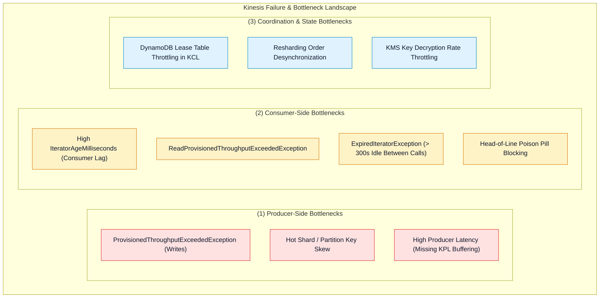
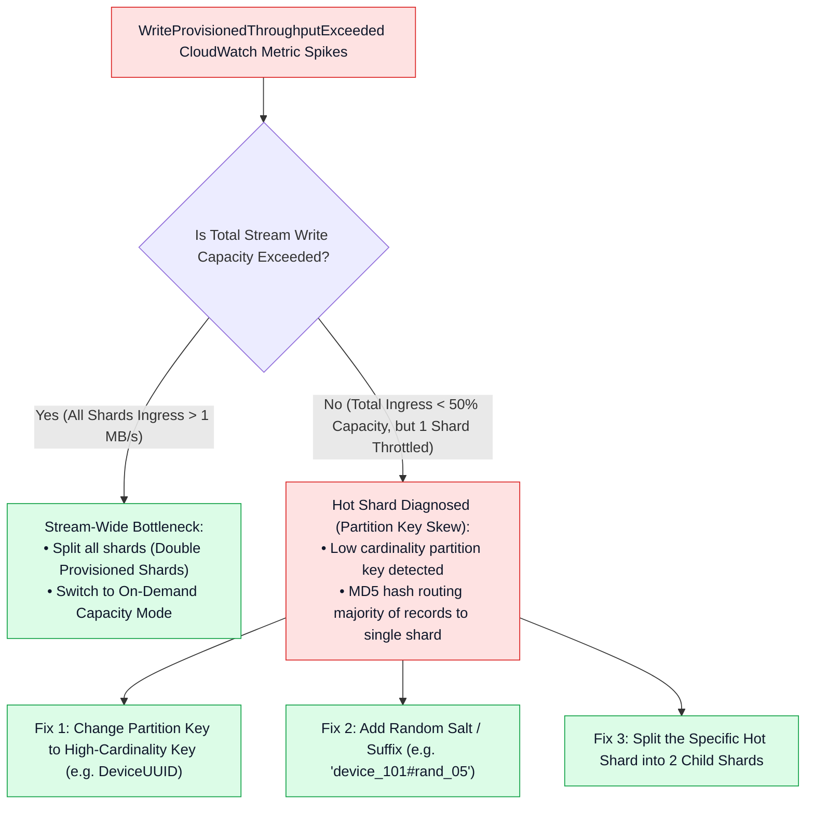
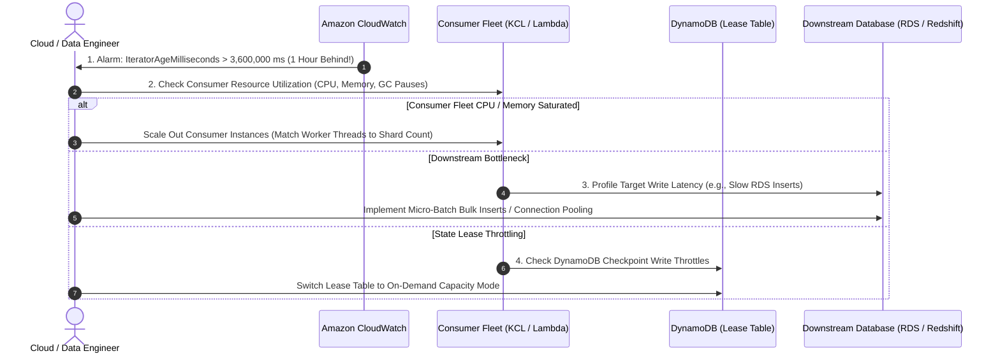
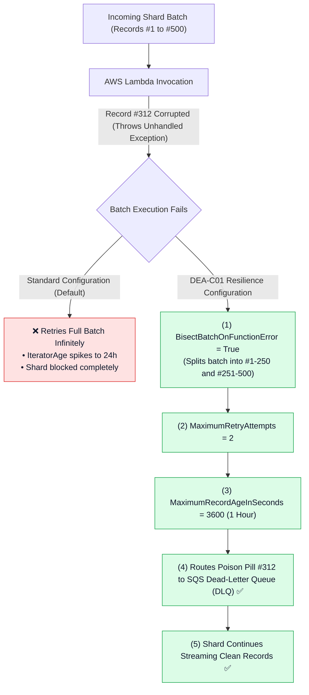
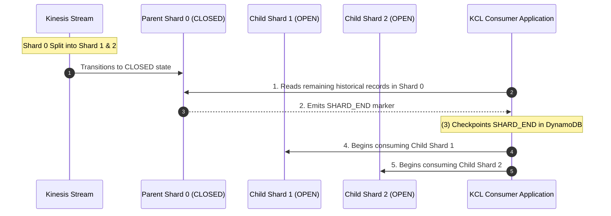

# 🔧 Kinesis Data Streams Troubleshooting & Performance Tuning

- **Category**: Analytics / Production Troubleshooting, Performance Optimization & Resilience
- **Language / ဘာသာစကား**: **English (Original)** | [မြန်မာဘာသာ (Burmese)](/mm/02-services/analytics-streaming/kinesis/kinesis-troubleshooting-and-tuning)
- **Primary Use Case**: Diagnosing producer/consumer throttling, investigating consumer lag (`IteratorAgeMilliseconds`), tuning KCL/DynamoDB lease performance, and resolving poison pill blocking.
- **Slide Reference**: Pages 420–459 in `[[AWSCertifiedDataEngineerSlides.pdf]]`
- **Hub Links**: `[[index]]` | `[[kinesis]]` | `[[kinesis-data-streams]]` | `[[kinesis-consumers-and-scaling]]` | `[[kinesis-security-and-monitoring]]`

---

## 1. High-Level Summary

Operating Amazon Kinesis Data Streams at high throughput requires systematic troubleshooting across **Producers** (write throttling, hot shards, buffering timeouts), **Stream Infrastructure** (hash-key space fragmentation, capacity limits), and **Consumers** (read throttling, `IteratorAgeMilliseconds` processing lag, KCL DynamoDB checkpoint stalls, and poison pill head-of-line blocking).

Mastering these specific failure modes and tuning mechanisms is one of the most frequently tested domain areas on the **AWS Certified Data Engineer - Associate (DEA-C01)** exam.

---

## 2. Producer Troubleshooting: Throttling & Hot Shards

### 1. Diagnosing `ProvisionedThroughputExceededException` (Writes)
When a producer writes to Kinesis Data Streams, AWS enforces two hard limits per shard:
- **1 MB / second** data ingress
- **1,000 records / second** write transactions

### 2. Producer Performance Tuning Best Practices
- **Exponential Backoff with Full Jitter**: In raw AWS SDK implementations, always configure retries using exponential backoff with randomized jitter to prevent "thundering herd" retry storms.
- **Kinesis Producer Library (KPL) Aggregation**: For micro-record payloads (e.g. 200-byte IoT telemetry), enable KPL record aggregation. Aggregation packs hundreds of user records into a single 1 MB Kinesis protocol buffer record, bypassing the 1,000 records/sec per shard limit.
- **Tune `RecordMaxBufferedTime`**: Adjust KPL buffer timeout (default: 100ms). Increasing to 250ms–500ms improves batching efficiency for high throughput, while decreasing it reduces latency for real-time systems.

---

## 3. Consumer Troubleshooting: Read Limits & `IteratorAge` Lag

### 1. Resolving `ReadProvisionedThroughputExceededException`
- **Cause**: Standard consumers share a single **2 MB / second** read throughput and max **5 `GetRecords` transactions/second** per shard. If 3 or more independent applications poll the same shard using standard fan-out, they will throttle each other.
- **Solution**:
  - Migrate high-priority or latency-sensitive consumers to **Enhanced Fan-Out (EFO)**. EFO allocates a dedicated **2 MB/second HTTP/2 push pipeline** (`SubscribeToShard`) per registered consumer, bypassing standard read limits entirely.

---

### 2. Deep Dive: `GetRecords.IteratorAgeMilliseconds` Troubleshooting Workflow

The `IteratorAgeMilliseconds` metric measures the age of the record most recently read by a consumer relative to the stream write timestamp. If this metric climbs continuously, the consumer is falling behind real-time stream ingestion.

### Common Root Causes of Consumer Lag & Solutions:

| Root Cause | Diagnostic Indicator | Solution / Remediation |
| :--- | :--- | :--- |
| **Worker Under-Provisioning** | Number of KCL worker threads < Number of stream shards. | Scale out consumer instances until `Worker Instances = Shard Count` (up to 1:1 ratio). |
| **Slow Processing Loop** | Consumer spends 500ms+ processing each individual record synchronously. | Implement asynchronous processing, in-memory worker pools, or bulk micro-batching. |
| **Downstream Target Latency** | Slow queries / write lock contention on target database (RDS / Redshift / DynamoDB). | Use bulk `COPY` / `BatchWriteItem`, enable connection pooling, or buffer through S3 first. |
| **DynamoDB Lease Throttling** | `ProvisionedThroughputExceededException` on KCL DynamoDB checkpoint table. | Increase DynamoDB Write Capacity Units (WCU) or switch DynamoDB table to **On-Demand Mode**. |
| **Garbage Collection Pauses** | Frequent JVM "Stop the World" pauses on Java KCL applications. | Optimize JVM heap flags (`-XX:+UseG1GC`, `-Xms` / `-Xmx`), increase container RAM. |

---

### 3. Fixing `ExpiredIteratorException`
- **Cause**: Shard iterators expire after **300 seconds (5 minutes)** if unused. This occurs when a consumer takes longer than 5 minutes to process a batch before calling `GetRecords` again, or if processing stalls.
- **Solution**: Catch `ExpiredIteratorException`, request a fresh iterator using `GetShardIterator` with `AFTER_SEQUENCE_NUMBER` pointing to the last committed checkpoint, and reduce consumer batch sizes (`BatchSize` / `MaxRecords`).

---

## 4. Lambda Stream Consumer Tuning & Poison Pill Isolation

When AWS Lambda processes Kinesis records via Event Source Mapping, a single malformed payload can cause infinite retries that block the entire shard (**Head-of-Line Blocking**).

### Lambda Kinesis Performance Knobs:
1. **`ParallelizationFactor` (1 to 10)**:
   - Scales concurrency **per shard**. By default, Lambda processes 1 batch per shard concurrently.
   - Increasing `ParallelizationFactor` to 5 allows Lambda to process 5 separate partition key subsets concurrently on the same shard, increasing throughput by up to 5x while guaranteeing sequential processing per partition key.
2. **`BisectBatchOnFunctionError: true`**:
   - Automatically isolates bad records by halving the failed batch recursively until the individual offending record is pinpointed.
3. **`On-Failure Destination` (Dead-Letter Queue)**:
   - Configures an Amazon SQS queue or Amazon SNS topic destination for records discarded after exceeding retry or age limits.

---

## 5. Resharding Performance & Ordering Guarantees

### Key Resharding Rules for the Exam:
1. **Preserving Order Across Shard Splits & Merges**: KCL will **never** read from child shards until all records in the parent shard have been completely read up to `SHARD_END`.
2. **Resharding API Limits**:
   - You cannot split or merge a shard if the stream is in the `UPDATING` state.
   - You can only reshard up to **5 active resharding operations** concurrently per stream.

---

## 6. Master Troubleshooting & Resolution Matrix

| Symptom / Error Message | Root Cause | Immediate Remediation | Architectural Long-Term Fix |
| :--- | :--- | :--- | :--- |
| `ProvisionedThroughputExceededException` on `PutRecord` | Write rate > 1 MB/s or > 1,000 records/s per shard. | Implement exponential backoff with jitter on producer SDK. | Add random salt to partition keys or switch to **On-Demand Mode**. |
| `ProvisionedThroughputExceededException` on `GetRecords` | Read rate > 2 MB/s or > 5 transactions/s across all standard consumers. | Reduce `GetRecords` polling frequency. | Upgrade consumers to **Enhanced Fan-Out (EFO)**. |
| `GetRecords.IteratorAgeMilliseconds` increasing steadily | Consumer processing rate slower than stream write rate. | Scale out consumer instances up to total shard count. | Increase Lambda `ParallelizationFactor` or tune downstream database writes. |
| `ExpiredIteratorException` | Consumer took > 300 seconds between `GetRecords` calls. | Catch exception and fetch new iterator from last checkpoint. | Reduce consumer `BatchSize` or speed up processing loop. |
| Shard processing blocked by single corrupted record | Poison pill unhandled exception in Lambda consumer. | Enable `BisectBatchOnFunctionError = true`. | Configure `On-Failure Destination` to Amazon SQS DLQ. |
| KCL workers throwing lease / checkpoint exceptions | DynamoDB lease table experiencing write throttling. | Increase provisioned WCU on DynamoDB lease table. | Switch DynamoDB lease table to **On-Demand Capacity Mode**. |
| High producer network latency and cost | Sending thousands of tiny unbatched micro-records. | Enable KPL **Record Aggregation** and **Record Collection**. | Use Kinesis Agent or KPL with tuned `RecordMaxBufferedTime`. |

---

## 7. DEA-C01 Exam Tips & Scenarios

> [!IMPORTANT]
> **Key Exam Decision Triggers for Kinesis Troubleshooting & Tuning**:
>
> - **"A fleet of IoT devices receives `ProvisionedThroughputExceededException` while total stream ingress is below 40% capacity"** $\rightarrow$ Diagnosed as a **Hot Shard**. Resolve by **salting the partition key** with random integers or switching partition key to `device_id`.
> - **"A Lambda function reading from Kinesis is experiencing head-of-line blocking due to malformed records"** $\rightarrow$ Configure **`BisectBatchOnFunctionError: true`**, limit **`MaximumRetryAttempts`**, and route failures to an **Amazon SQS Dead-Letter Queue (DLQ)**.
> - **"Consumer lag (`IteratorAgeMilliseconds`) is high on a high-throughput shard with diverse partition keys"** $\rightarrow$ Increase the AWS Lambda **`ParallelizationFactor`** (up to 10 concurrent invocations per shard).
> - **"Multiple microservice applications reading from the same Kinesis shard are throttling each other"** $\rightarrow$ Migrate all consumers to **Enhanced Fan-Out (EFO)** with dedicated 2 MB/s HTTP/2 push connections.
> - **"KCL consumer application crashes and logs DynamoDB throughput errors during checkpointing"** $\rightarrow$ Convert the KCL state tracking table to **DynamoDB On-Demand Capacity Mode**.
> - **"Consumer receives `ExpiredIteratorException` during batch processing"** $\rightarrow$ The processing loop exceeded the **300-second iterator timeout**. Catch the exception, obtain a new iterator with `AFTER_SEQUENCE_NUMBER`, and reduce batch sizes.

---

## 📌 Related Notes
- `[[kinesis]]` — Kinesis Streaming Ecosystem Overview Hub
- `[[kinesis-data-streams]]` — KDS Ingestion & Shard Architecture
- `[[kinesis-consumers-and-scaling]]` — Standard vs. Enhanced Fan-Out & KCL
- `[[kinesis-security-and-monitoring]]` — KMS SSE & CloudWatch Metrics
- `[[dynamodb]]` — DynamoDB On-Demand & Lease Coordination
