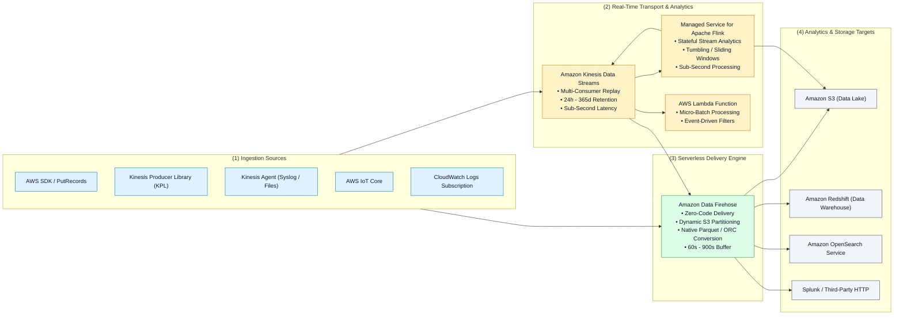
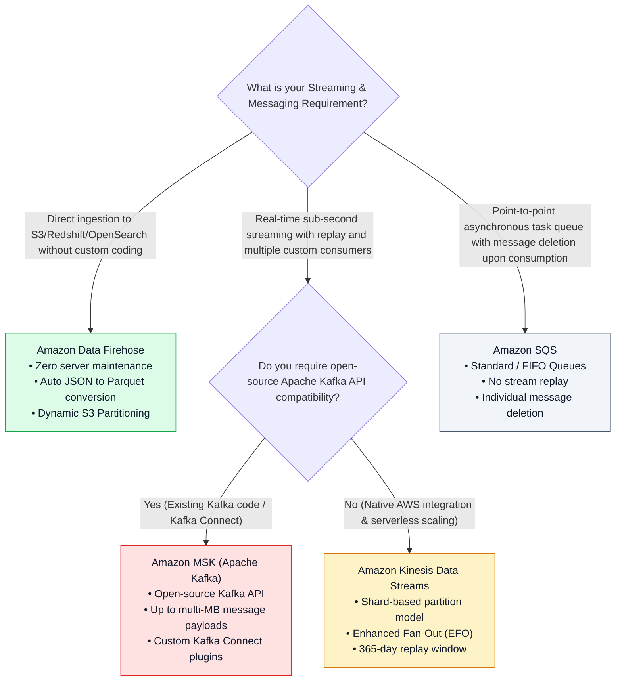

# 🌊 Amazon Kinesis Streaming Ecosystem

- **Category**: Analytics / Real-Time Data Streaming & Ingestion
- **Language / ဘာသာစကား**: **English (Original)** | [မြန်မာဘာသာ (Burmese)](/mm/02-services/analytics-streaming/kinesis/kinesis)
- **Primary Use Case**: Massive real-time stream ingestion, sub-second analytics, managed micro-batch delivery to data lakes, and continuous stream transformations.
- **Slide Reference**: Pages 414–459 in `[[AWSCertifiedDataEngineerSlides.pdf]]`
- **Hub Links**: `[[index]]` | `[[domain-1-ingestion-and-processing]]` | `[[domain-3-data-processing]]` | `[[s3]]`

---

## 1. High-Level Summary

The **Amazon Kinesis** platform provides a comprehensive suite of cloud-native streaming services designed to capture, process, and analyze continuous streams of data (such as IoT telemetry, website clickstreams, financial transactions, and application logs) in real time.

Understanding the architectural differences, latency characteristics, and operational boundaries between **Kinesis Data Streams (KDS)**, **Amazon Data Firehose (KDF)**, and **Amazon Managed Service for Apache Flink** is a core pillar of the **AWS Certified Data Engineer - Associate (DEA-C01)** certification.

---

## 2. The Four Pillars of the Kinesis Family

| Service Name | Primary Architectural Role | Latency | Retention Period | Compute / Scaling Model |
| :--- | :--- | :--- | :--- | :--- |
| **Amazon Kinesis Data Streams (KDS)** | Durable, real-time message stream with multi-consumer fan-out and replay capability. | **Sub-second (70ms – 200ms)** | 24 hours (default) up to **365 days** | **Shards** (Provisioned or On-Demand modes). |
| **Amazon Data Firehose (KDF)** | Serverless, automated delivery stream to data lakes, warehouses, and search engines. | **Near real-time (60s – 900s)** | No retention (temporary in-flight buffer only) | **Fully Serverless** (auto-scales with zero infrastructure management). |
| **Amazon Managed Service for Apache Flink** | Complex stateful stream processing, time-window aggregations, and anomaly detection. | **Sub-second (< 100ms)** | Application state checkpoints stored in RocksDB / S3 | **Kinesis Processing Units (KPUs)** (1 vCPU + 4 GB RAM per KPU). |
| **Amazon Kinesis Video Streams (KVS)** | Secure media ingestion and playback for video, audio, and thermal camera feeds. | **Real-time (< 1s)** | Configurable (hours to days) | Fully managed media storage and indexing. |

---

## 3. Streaming Technologies Decision Matrix (KDS vs. Firehose vs. MSK vs. SQS)

---

## 4. Modular Kinesis Topic Deep Dives

To prepare comprehensively for all scenario questions in the DEA-C01 examination, explore the specialized sub-topic modules below:

1. `[[kinesis-data-streams]]` — **KDS Shards, Provisioned vs. On-Demand Modes, Partition Keys & Producers (SDK, KPL, Agent)**
2. `[[kinesis-consumers-and-scaling]]` — **Standard vs. Enhanced Fan-Out (EFO), KCL DynamoDB Lease Coordination, Lambda Triggers & Resharding**
3. `[[kinesis-firehose]]` — **Destinations, Buffering Rules, Inline Lambda Transforms, Native Parquet Conversion & Dynamic Partitioning**
4. `[[kinesis-apache-flink]]` — **KPU Sizing, Tumbling / Sliding / Session Windows, Event-Time Watermarks & RocksDB Checkpoints**
5. `[[kinesis-security-and-monitoring]]` — **KMS SSE, VPC PrivateLink, Glue Schema Registry Integration & `IteratorAgeMilliseconds` Alerting**
6. `[[kinesis-architecture-and-patterns]]` — **End-to-End Real-Time Pipelines, Hot Shard Mitigation, Deduplication & Comparison Matrices**
7. `[[kinesis-troubleshooting-and-tuning]]` — **Production Troubleshooting, Hot Shards, Consumer Lag (`IteratorAge`), and Poison Pill Isolation**

---

## 5. DEA-C01 Exam Essentials

> [!IMPORTANT]
> **Top Exam Rules for Amazon Kinesis**:
>
> - **KDS vs. Firehose**: If the question asks for **sub-second latency**, **custom consumer applications (KCL / Spark)**, and **replaying historical records**, choose **Kinesis Data Streams**. If the question asks to **load streaming logs directly into S3 as Parquet without managing compute**, choose **Amazon Data Firehose**.
> - **Consumer Lag Metric**: The most critical CloudWatch metric for monitoring Kinesis consumer health is **`GetRecords.IteratorAgeMilliseconds`**. An increasing value means consumers are falling behind real-time stream ingestion.
> - **Hot Shard Resolution**: If a stream receives `ProvisionedThroughputExceededException` while total throughput is below cluster limits, the cause is a **poor partition key causing a Hot Shard**. Resolve by adding a random salt / hash suffix or splitting the hot shard.
> - **Kafka vs. Kinesis**: Choose **Amazon MSK** only when legacy compatibility with Kafka APIs, topics, consumer groups, or Kafka Connect is explicitly mandated. Choose **KDS** for turnkey serverless AWS integrations.

---

## 📌 Related Notes
- `[[kinesis-data-streams]]` — Kinesis Data Streams Core Architecture
- `[[kinesis-consumers-and-scaling]]` — Standard vs. Enhanced Fan-Out & KCL
- `[[kinesis-troubleshooting-and-tuning]]` — Troubleshooting & Performance Tuning
- `[[kinesis-firehose]]` — Amazon Data Firehose Delivery Pipelines
- `[[kinesis-apache-flink]]` — Real-Time Stateful Stream Processing
- `[[msk]]` — Amazon Managed Streaming for Apache Kafka
- `[[lambda]]` — Serverless Stream Consumers
- `[[s3]]` — S3 Data Lake Storage Architecture
