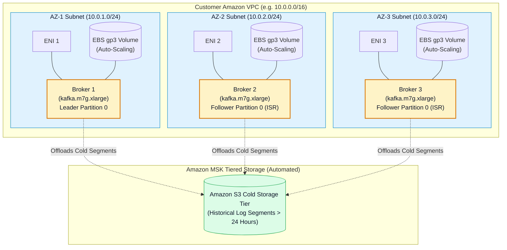
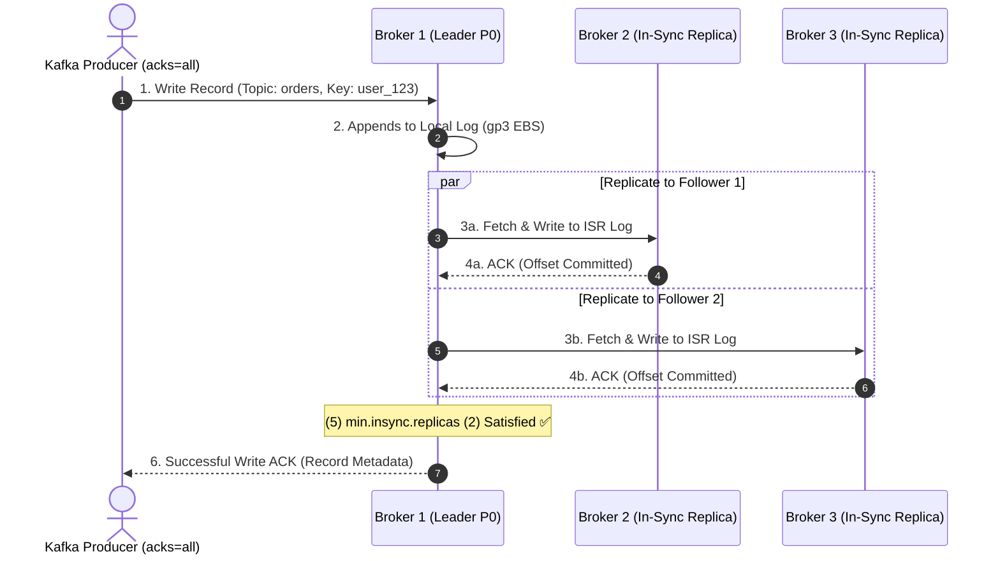
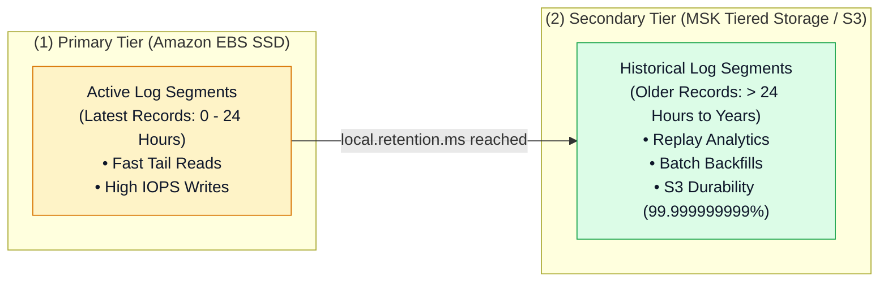

# 🏛️ Amazon MSK Cluster Architecture, Storage & High Availability

- **Category**: Analytics / Distributed Streaming Infrastructure
- **Language / ဘာသာစကား**: **English (Original)** | [မြန်မာဘာသာ (Burmese)](/mm/02-services/analytics-streaming/msk/msk-cluster-architecture)
- **Primary Use Case**: Designing fault-tolerant multi-AZ MSK broker topologies, configuring EBS storage auto-scaling, leveraging MSK Tiered Storage with S3, and understanding KRaft metadata mode.
- **Slide Reference**: Pages 450–459 in `[AWSCertifiedDataEngineerSlides.pdf](/docs/AWSCertifiedDataEngineerSlides.pdf)`
- **Hub Links**: `[[en/index|index]]` | `[[en/02-services/analytics-streaming/msk/msk|msk]]` | `[[en/02-services/analytics-streaming/msk/msk-serverless|msk-serverless]]` | `[[en/02-services/analytics-streaming/msk/msk-security-and-monitoring|msk-security-and-monitoring]]` | `[[en/02-services/analytics-streaming/kinesis/kinesis-data-streams|kinesis-data-streams]]`

---

## 1. High-Level Summary

An Amazon MSK cluster consists of Apache Kafka **Broker Nodes** deployed across multiple Availability Zones within a VPC. MSK manages the underlying EC2 instances, broker storage, broker replacement, and cluster metadata quorum (via ZooKeeper or KRaft mode).

For the **DEA-C01** exam, you must master MSK broker sizing, replication guarantees (`replication.factor`, `min.insync.replicas`, `acks=all`), EBS storage auto-scaling mechanisms, and **MSK Tiered Storage** on Amazon S3.



---

## 2. Broker Topologies & KRaft Mode

### 1. Broker Placement & Networking
- **Multi-AZ Distribution**: Amazon MSK automatically provisions brokers evenly across **2 or 3 Availability Zones** (3 AZs recommended for production high availability).
- **VPC Elastic Network Interfaces (ENIs)**: Each MSK broker is attached to a dedicated ENI in your VPC private subnet, providing private IP communication with producer and consumer applications.

### 2. ZooKeeper vs. KRaft Metadata Mode
Historically, Apache Kafka relied on a dedicated Apache ZooKeeper ensemble for cluster state and leader election. Amazon MSK supports both architectures:
- **ZooKeeper-based Clusters**: MSK provisions and manages 3 dedicated ZooKeeper nodes in the background at no extra charge.
- **KRaft-based Clusters (Kafka 3.7+)**: Uses the **Kafka Raft (KRaft) metadata quorum** protocol running directly within the broker ecosystem, eliminating separate ZooKeeper nodes, enabling faster partition failovers, and scaling clusters to millions of partitions.

---

## 3. High Availability & Zero Data Loss Guarantees

To ensure enterprise-grade resilience against single-broker or entire AZ outages, MSK clusters rely on three critical Kafka parameters:



### The Three Critical Data Resilience Pillars:
1. **`replication.factor = 3`**: Every topic partition has 1 Leader copy and 2 Follower copies distributed across 3 distinct Availability Zones.
2. **`min.insync.replicas = 2`**: Specifies the minimum number of in-sync replicas (ISR) that must acknowledge a write before the leader considers the write successful. If fewer than 2 replicas are available, the broker rejects writes with `NotEnoughReplicasException`.
3. **Producer `acks=all` (or `acks=-1`)**: The producer client waits until all in-sync replicas have committed the record before continuing, guaranteeing zero data loss even if the leader broker abruptly crashes.

---

## 4. Storage Architecture: EBS Auto-Scaling & Tiered Storage

Amazon MSK decouples compute from storage through a two-tiered architecture:

| Storage Dimension | Primary Tier (Amazon EBS gp3 / io2) | Secondary Tier (Amazon MSK Tiered Storage) |
| :--- | :--- | :--- |
| **Underlying Media** | High-performance EBS SSDs attached to brokers. | Amazon S3 managed transparently by MSK. |
| **Data Target** | Active, hot data (tail reads, latest offsets, active partition logs). | Historical, cold data (log segments older than local retention threshold). |
| **Latency** | **Single-digit milliseconds** (sub-10ms). | Tens of milliseconds (read-through cache). |
| **Cost Profile** | Standard EBS volume pricing per GB/month. | Low-cost S3 standard storage pricing (fraction of EBS cost). |
| **Max Retention** | Constrained by EBS volume size (up to 16 TiB per broker). | **Virtually unlimited** (retention for months or years). |



### 1. Amazon EBS Storage Auto-Scaling
- Amazon MSK integrates with **AWS Application Auto Scaling** to automatically increase EBS volume storage when broker disk utilization exceeds a target threshold (e.g. 85%).
- **Rule**: EBS storage volumes can only be **scaled up**, never scaled down.

### 2. Enabling MSK Tiered Storage
To enable Tiered Storage on a topic, configure the following topic-level properties:
```bash
# Enable tiered storage on topic 'events-stream'
kafka-topics.sh --bootstrap-server $BS \
  --alter --topic events-stream \
  --config remote.storage.enable=true \
  --config local.retention.ms=86400000 \
  --config retention.ms=31536000000
```
- `remote.storage.enable=true`: Activates tiered storage for the topic.
- `local.retention.ms=86400000`: Retains data on expensive broker EBS SSDs for **1 day (24 hours)**.
- `retention.ms=31536000000`: Retains historical data in Amazon S3 for **1 year (365 days)**.

---

## 5. DEA-C01 Exam Essentials

> [!IMPORTANT]
> **Key Architecture Decisions for Amazon MSK**:
>
> - **Cost-Effective Long-Term Retention**: To store streaming data in Kafka for extended periods (months/years) at minimum cost without resizing EBS disks, enable **MSK Tiered Storage**.
> - **Preventing Data Loss**: Always combine `replication.factor=3`, `min.insync.replicas=2`, and producer `acks=all`.
> - **Storage Expansion**: Broker storage can auto-scale using **Application Auto Scaling policies**, but disk capacity cannot be shrunk once expanded.
> - **Metadata Architecture**: Choose **KRaft mode** for modern MSK clusters (Kafka 3.7+) to support higher partition counts per cluster without separate ZooKeeper nodes.

---

## 📌 Related Notes
- `[[en/02-services/analytics-streaming/msk/msk|msk]]` — Amazon MSK Ecosystem Overview
- `[[en/02-services/analytics-streaming/msk/msk-serverless|msk-serverless]]` — Serverless On-Demand MSK Scaling
- `[[en/02-services/analytics-streaming/msk/msk-security-and-monitoring|msk-security-and-monitoring]]` — IAM Auth & Offset Lag Monitoring
- `[[en/02-services/storage/ebs-and-instance-store|ebs-and-instance-store]]` — EBS gp3 Volumes & IOPS
- `[[en/02-services/analytics-streaming/kinesis/kinesis-data-streams|kinesis-data-streams]]` — KDS Shard Architecture Comparison
