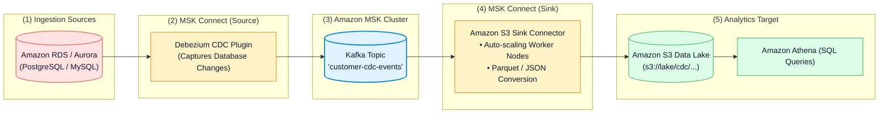
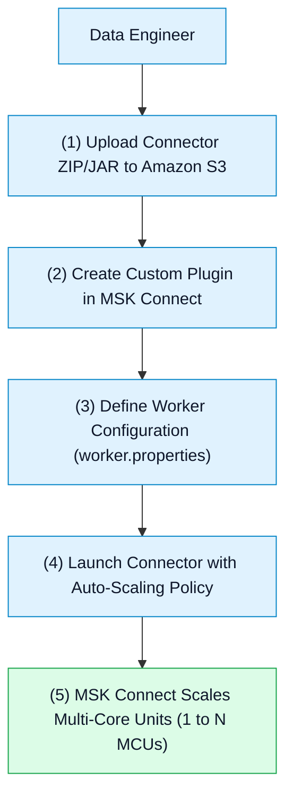

# 🔌 Amazon MSK Connect, Custom Plugins & Serverless Connectors

- **Category**: Analytics / Managed Stream Integration & Data Delivery
- **Language / ဘာသာစကား**: **English (Original)** | [မြန်မာဘာသာ (Burmese)](/mm/02-services/analytics-streaming/msk/msk-connect)
- **Primary Use Case**: Running serverless Apache Kafka Connect source and sink connectors to ingest CDC streams and deliver Kafka data directly to Amazon S3, OpenSearch, Redshift, and Snowflake without managing worker servers.
- **Slide Reference**: Pages 450–459 in `[AWSCertifiedDataEngineerSlides.pdf](/docs/AWSCertifiedDataEngineerSlides.pdf)`
- **Hub Links**: `[[en/index|index]]` | `[[en/02-services/analytics-streaming/msk/msk|msk]]` | `[[en/02-services/analytics-streaming/kinesis/kinesis-firehose|kinesis-firehose]]` | `[[en/02-services/storage/s3/s3|s3]]` | `[[en/02-services/analytics-streaming/opensearch/opensearch|opensearch]]`

---

## 1. High-Level Summary

**Amazon MSK Connect** is a fully managed, serverless feature of Amazon MSK that makes it easy to run, monitor, and auto-scale **Apache Kafka Connect** connectors.

Kafka Connect uses standard **Source Connectors** (ingesting data from external databases or message queues into Kafka) and **Sink Connectors** (exporting data from Kafka topics into downstream analytics systems like Amazon S3, Amazon OpenSearch, or Snowflake). MSK Connect provisions, maintains, and auto-scales the underlying worker infrastructure automatically.

---

## 2. Key Components of MSK Connect

1. **Custom Plugins**: Upload open-source or commercial Kafka Connect plugins (e.g. Confluent S3 Sink, Debezium MySQL Source, Snowflake Sink) packaged as `.zip` or `.jar` files in an Amazon S3 bucket.
2. **Worker Configurations**: Key-value property sets for internal connector settings, converter classes (e.g., `org.apache.kafka.connect.json.JsonConverter` or Avro converter), and offset commit intervals.
3. **Auto-Scaling Workers (MCUs)**: MSK Connect measures capacity in **MSK Multi-Core Units (MCUs)**.
   - **1 MCU = 1 vCPU + 4 GB RAM**.
   - You specify the minimum and maximum number of MCUs. MSK Connect automatically adds or removes MCUs based on CPU utilization (default trigger: 70%).

---

## 3. Top Sink & Source Connectors for DEA-C01

| Connector Name | Type | Common Architecture / Target | Exam Significance |
| :--- | :--- | :--- | :--- |
| **Amazon S3 Sink Connector** | Sink | Streams Kafka topic records to S3 data lakes with micro-batching and file rotation. | Replaces custom Lambda consumers for loading Kafka data into S3. |
| **Debezium CDC Source** | Source | Captures row-level database inserts, updates, and deletes from MySQL / PostgreSQL / SQL Server. | Real-time database CDC ingestion into MSK topics. |
| **Amazon OpenSearch Sink** | Sink | Index streaming log messages and text payloads into OpenSearch clusters. | Real-time log analytics and search indexing. |
| **Snowflake / Redshift Sink** | Sink | Continuously streams analytical records directly into data warehouses. | Near real-time data warehouse ingestion. |

---

## 4. MSK Connect vs. Amazon Data Firehose

A frequent architectural decision on the exam is choosing between **MSK Connect** and **Amazon Data Firehose**:

| Feature | Amazon MSK Connect | Amazon Data Firehose |
| :--- | :--- | :--- |
| **Primary Stream Ingestion** | **Amazon MSK** / Apache Kafka clusters. | **Kinesis Data Streams**, Direct SDK, CloudWatch Logs, IoT. |
| **Connector Ecosystem** | Open-source Apache Kafka Connect plugins (hundreds of community connectors). | AWS-managed pre-built destinations (S3, Redshift, OpenSearch, Splunk). |
| **Custom Plugins** | Supports custom third-party `.jar` plugins uploaded via S3. | AWS-managed destinations only (custom endpoints via HTTP/Lambda). |
| **Scaling & Management** | Serverless MCU auto-scaling (1–N MCUs). | Fully serverless (zero capacity knobs). |
| **Best For** | Exporting/importing data to/from **Apache Kafka** clusters. | Turnkey automated streaming delivery to S3/Redshift without Kafka. |

---

## 5. DEA-C01 Exam Essentials

> [!IMPORTANT]
> **Key Exam Decision Triggers for MSK Connect**:
>
> - **"Stream data from an Amazon MSK cluster directly into an Amazon S3 data lake with zero server maintenance"** $\rightarrow$ Deploy the **Amazon S3 Sink Connector on Amazon MSK Connect**.
> - **"Capture Change Data Capture (CDC) from an on-premises database into MSK without managing EC2 Kafka Connect workers"** $\rightarrow$ Package the **Debezium connector as a Custom Plugin in Amazon S3** and deploy on **MSK Connect**.
> - **"Capacity Scaling"** $\rightarrow$ MSK Connect scales compute automatically using **MSK Multi-Core Units (MCUs)** based on CPU utilization thresholds.

---

## 📌 Related Notes
- `[[en/02-services/analytics-streaming/msk/msk|msk]]` — Amazon MSK Master Hub
- `[[en/02-services/analytics-streaming/msk/msk-cluster-architecture|msk-cluster-architecture]]` — MSK Provisioned Brokers
- `[[en/02-services/analytics-streaming/kinesis/kinesis-firehose|kinesis-firehose]]` — Serverless Micro-Batch Delivery
- `[[en/02-services/storage/s3/s3|s3]]` — S3 Data Lake Storage Architecture
- `[[en/02-services/analytics-streaming/opensearch/opensearch|opensearch]]` — OpenSearch Analytics & Indexing
