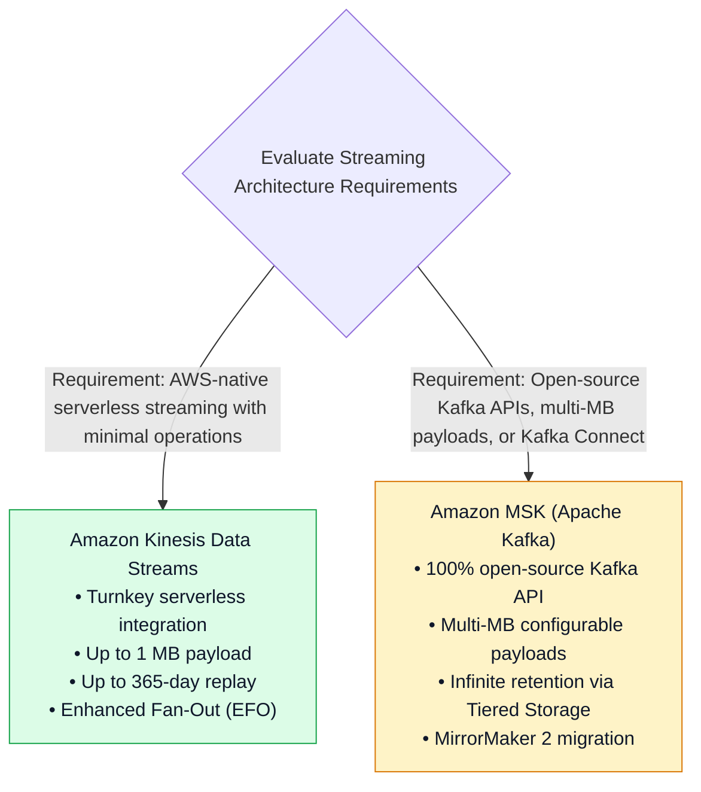
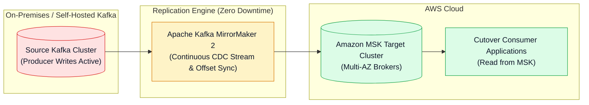
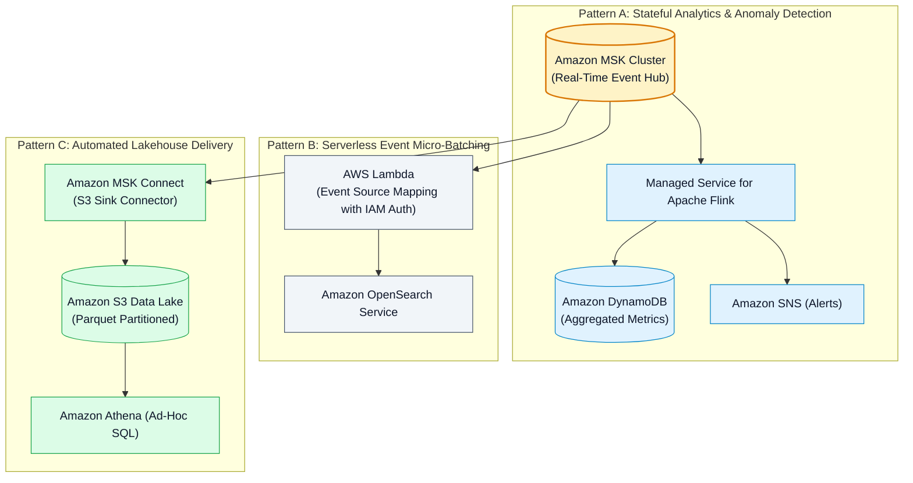

# ⚖️ Amazon MSK vs. Kinesis Comparison, Migration & Streaming Patterns

- **Category**: Analytics / System Design, Technology Evaluation & Architecture Patterns
- **Language / ဘာသာစကား**: **English (Original)** | [မြန်မာဘာသာ (Burmese)](/mm/02-services/analytics-streaming/msk/msk-kinesis-comparison-and-patterns)
- **Primary Use Case**: Evaluating trade-offs between Amazon MSK and Amazon Kinesis Data Streams, executing Kafka-to-MSK migrations using MirrorMaker 2, and designing multi-service streaming architectures.
- **Slide Reference**: Pages 414–459 in `[AWSCertifiedDataEngineerSlides.pdf](/docs/AWSCertifiedDataEngineerSlides.pdf)`
- **Hub Links**: `[[en/index|index]]` | `[[en/02-services/analytics-streaming/msk/msk|msk]]` | `[[en/02-services/analytics-streaming/kinesis/kinesis|kinesis]]` | `[[en/02-services/analytics-streaming/kinesis/kinesis-data-streams|kinesis-data-streams]]` | `[[en/02-services/analytics-streaming/kinesis/kinesis-firehose|kinesis-firehose]]`

---

## 1. High-Level Summary

Choosing between **Amazon Kinesis Data Streams (KDS)** and **Amazon Managed Streaming for Apache Kafka (Amazon MSK)** is a core architectural decision tested extensively on the **AWS Certified Data Engineer - Associate (DEA-C01)** exam.

While both services provide durable, distributed, real-time message streaming with partition-based ordering, they differ fundamentally in their ecosystem compatibility, operational complexity, scaling primitives, retention boundaries, and payload size limits.

---

## 2. Definitive Kinesis Data Streams vs. Amazon MSK Comparison Matrix

| Evaluation Dimension | Amazon Kinesis Data Streams (KDS) | Amazon MSK (Apache Kafka) |
| :--- | :--- | :--- |
| **API & Ecosystem** | AWS proprietary API & AWS SDKs. | 100% open-source **Apache Kafka APIs**, Kafka Streams, and Kafka Connect. |
| **Scaling Primitive** | **Shards** (1 MB/s IN, 2 MB/s OUT per shard). | **Broker Instances & Topic Partitions**. |
| **Capacity Modes** | **Provisioned** (manual shard count) or **On-Demand** (automatic scaling). | **Provisioned** (custom broker sizing) or **Serverless** (auto-scaling throughput). |
| **Max Payload Size** | **1 MB strict limit** (larger payloads require S3 claim check pattern). | **Configurable (multi-MB)** via `message.max.bytes` property (default 1 MB). |
| **Data Retention** | **24 hours to 365 days** (maximum 1 year). | **Virtually Unlimited** using **MSK Tiered Storage** on Amazon S3. |
| **Consumer Egress Model** | Standard Polling (shared 2 MB/s) or **Enhanced Fan-Out (EFO)** (dedicated 2 MB/s HTTP/2 push per consumer). | Standard Kafka Consumer Groups with offset tracking in `__consumer_offsets`. |
| **Managed Connectors** | Direct integration with **Amazon Data Firehose**. | **Amazon MSK Connect** for open-source Kafka Connect plugins. |
| **Security & Auth** | AWS IAM Policies & KMS SSE natively. | **AWS IAM Auth**, SASL/SCRAM, TLS Mutual Auth (mTLS), and Kafka ACLs. |
| **Target Workload** | Rapid serverless development, tight AWS service integrations (Lambda, DynamoDB, Firehose). | Enterprise Kafka migration, hybrid-cloud pipelines, custom Kafka Connect ecosystems. |

---

## 3. Migration: Self-Hosted Kafka to Amazon MSK via MirrorMaker 2

To migrate an existing on-premises or EC2-hosted Apache Kafka cluster to Amazon MSK with zero downtime, use **Apache Kafka MirrorMaker 2 (MM2)**:

### Zero-Downtime Migration Steps:
1. **Deploy Target MSK Cluster**: Provision a multi-AZ Amazon MSK cluster in the target VPC with matching topic configurations.
2. **Deploy MirrorMaker 2**: Run MM2 (on EC2, ECS, or MSK Connect) to replicate historical and live streaming records from the source cluster to MSK while synchronizing consumer group offsets.
3. **Switch Consumers**: Update consumer applications to read from the target MSK cluster.
4. **Switch Producers**: Redirect upstream producer writes to the MSK cluster and decommission the legacy self-hosted cluster.

---

## 4. Real-Time Streaming Architecture Patterns

---

## 5. DEA-C01 Master Streaming Decision Guide

> [!IMPORTANT]
> **Key Exam Decision Triggers for Kinesis vs. MSK vs. Firehose**:
>
> - **"Company wants to migrate existing Kafka producer and consumer applications to AWS with minimal code changes"** $\rightarrow$ Migrate to **Amazon MSK**.
> - **"Need to replicate an on-premises Kafka cluster to AWS with zero downtime"** $\rightarrow$ Use **Apache Kafka MirrorMaker 2 (MM2)**.
> - **"Stream 10 MB payload messages without building a custom claim-check pattern with S3"** $\rightarrow$ Use **Amazon MSK** (configure `message.max.bytes`).
> - **"Load streaming logs into S3 in Parquet format with zero server operations or coding"** $\rightarrow$ Use **Amazon Data Firehose**.
> - **"Real-time sub-second streaming with dedicated 2 MB/s push pipelines to 15 different downstream applications"** $\rightarrow$ Use **Kinesis Data Streams with Enhanced Fan-Out (EFO)**.

---

## 📌 Related Notes
- `[[en/02-services/analytics-streaming/msk/msk|msk]]` — Amazon MSK Master Hub
- `[[en/02-services/analytics-streaming/msk/msk-cluster-architecture|msk-cluster-architecture]]` — MSK Broker Architecture & Tiered Storage
- `[[en/02-services/analytics-streaming/msk/msk-connect|msk-connect]]` — Serverless S3 Sink Connectors
- `[[en/02-services/analytics-streaming/kinesis/kinesis|kinesis]]` — Amazon Kinesis Ecosystem Hub
- `[[en/02-services/analytics-streaming/kinesis/kinesis-data-streams|kinesis-data-streams]]` — KDS Ingestion & Shards
- `[[en/02-services/analytics-streaming/kinesis/kinesis-firehose|kinesis-firehose]]` — Serverless Micro-Batch Delivery
- `[[en/02-services/analytics-streaming/kinesis/kinesis-apache-flink|kinesis-apache-flink]]` — Real-Time Stateful Stream Processing
