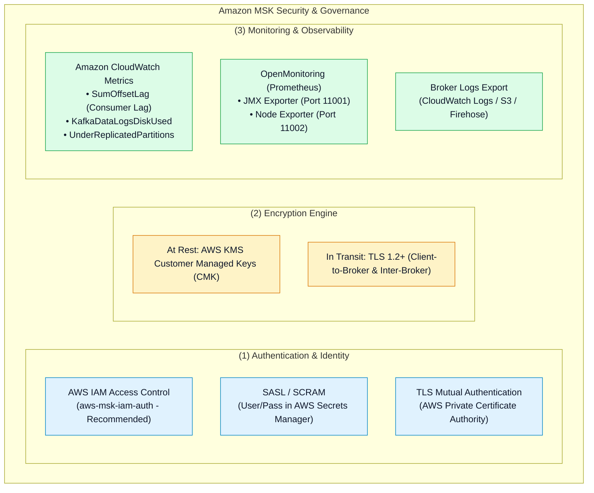
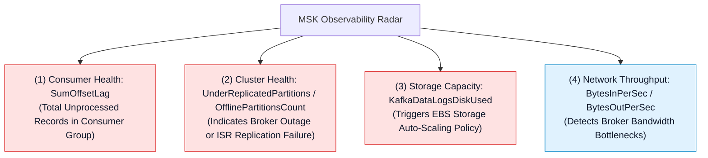

# 🛡️ Amazon MSK Security, Access Control & Observability

- **Category**: Analytics / Governance, Identity & Stream Observability
- **Language / ဘာသာစကား**: **English (Original)** | [မြန်မာဘာသာ (Burmese)](/mm/02-services/analytics-streaming/msk/msk-security-and-monitoring)
- **Primary Use Case**: Securing Kafka clusters with IAM authentication, configuring TLS encryption, monitoring consumer group lag (`SumOffsetLag`), and integrating Prometheus OpenMonitoring.
- **Slide Reference**: Pages 450–459 in `[AWSCertifiedDataEngineerSlides.pdf](/docs/AWSCertifiedDataEngineerSlides.pdf)`
- **Hub Links**: `[[index]]` | `[[msk]]` | `[[msk-cluster-architecture]]` | `[[glue-schema-registry]]`

---

## 1. High-Level Summary

Operating production Apache Kafka clusters on AWS requires a robust security framework across **Encryption** (KMS at rest, TLS in transit), **Authentication** (IAM Access Control, SASL/SCRAM, mTLS), and **Fine-Grained Authorization** (Kafka ACLs).

For monitoring, Amazon MSK exposes both native **Amazon CloudWatch** metrics and **Prometheus OpenMonitoring** (JMX and Node Exporter metrics), enabling real-time alerting on consumer lag (`SumOffsetLag`) and broker disk utilization (`KafkaDataLogsDiskUsed`).

---

## 2. Authentication & Authorization Comparison

| Authentication Mode | Credential Source | Best Use Case | DEA-C01 Exam Context |
| :--- | :--- | :--- | :--- |
| **AWS IAM Access Control** | AWS IAM Roles / IAM Policies (`aws-msk-iam-auth`). | AWS-native applications (Lambda, ECS, EMR, EC2). | **Default Recommended Option**. Eliminates secret rotation and hardcoded credentials. |
| **SASL / SCRAM** | Usernames & Passwords stored in **AWS Secrets Manager**. | External / Non-AWS legacy clients connecting over VPC or internet. | Requires associating Secrets Manager KMS encryption keys with the MSK cluster. |
| **TLS Mutual Auth (mTLS)** | X.509 client certificates issued by **AWS Private CA**. | Strict enterprise PKI and certificate-based zero-trust environments. | High operational overhead for certificate generation and lifecycle renewal. |
| **Unauthenticated / Plaintext** | None (Anonymous access). | Local dev/test environments only. | **Never recommended** for production workloads. |

---

## 3. Critical CloudWatch & OpenMonitoring Metrics

### Essential Metrics Cheat Sheet:
1. **`SumOffsetLag` (CloudWatch / JMX)**:
   - Measures the total difference between the latest offset written to a topic and the current offset processed by a consumer group.
   - A continuously rising `SumOffsetLag` indicates that consumer applications are under-provisioned, experiencing crashes, or blocked by slow downstream targets.
2. **`UnderReplicatedPartitions`**:
   - Must always equal **`0`**. A value greater than 0 means one or more follower replicas are out of sync with the leader broker (indicating network degradation or broker node failure).
3. **`KafkaDataLogsDiskUsed`**:
   - Percentage of EBS disk capacity consumed on each broker. Used to configure CloudWatch Alarms for storage expansion.

---

## 4. OpenMonitoring with Prometheus & Managed Grafana

Amazon MSK provides built-in support for **OpenMonitoring**, exposing standardized Prometheus metrics endpoints directly from broker nodes:
- **JMX Exporter (Port 11001)**: Exposes granular Apache Kafka JVM and internal broker metrics.
- **Node Exporter (Port 11002)**: Exposes OS-level hardware metrics (CPU, disk I/O, network sockets).

These metrics can be scraped seamlessly by **Amazon Managed Service for Prometheus (AMP)** and visualized in **Amazon Managed Grafana** dashboards without installing third-party agent daemons on brokers.

---

## 5. DEA-C01 Exam Essentials

> [!IMPORTANT]
> **Key Exam Decision Triggers for MSK Security & Monitoring**:
>
> - **"Secure MSK Authentication without Managing Passwords"** $\rightarrow$ Configure **AWS IAM Access Control (`aws-msk-iam-auth`)**.
> - **"Monitor Consumer Application Processing Lag"** $\rightarrow$ Set CloudWatch Alarms on the **`SumOffsetLag`** metric (analogous to Kinesis `IteratorAgeMilliseconds`).
> - **"Enterprise Prometheus Monitoring"** $\rightarrow$ Enable **MSK OpenMonitoring** to scrape JMX metrics via Amazon Managed Service for Prometheus.
> - **"Store User Credentials for SASL/SCRAM"** $\rightarrow$ Use **AWS Secrets Manager** encrypted with an AWS KMS customer managed key (CMK).

---

## 📌 Related Notes
- `[[msk]]` — Amazon MSK Master Hub
- `[[msk-cluster-architecture]]` — MSK Replication & Storage
- `[[msk-troubleshooting-and-tuning]]` — Diagnosing Lag & Timeout Errors
- `[[glue-schema-registry]]` — Data Governance & Schema Evolution
- `[[kinesis-security-and-monitoring]]` — Kinesis CloudWatch & KMS Comparison
