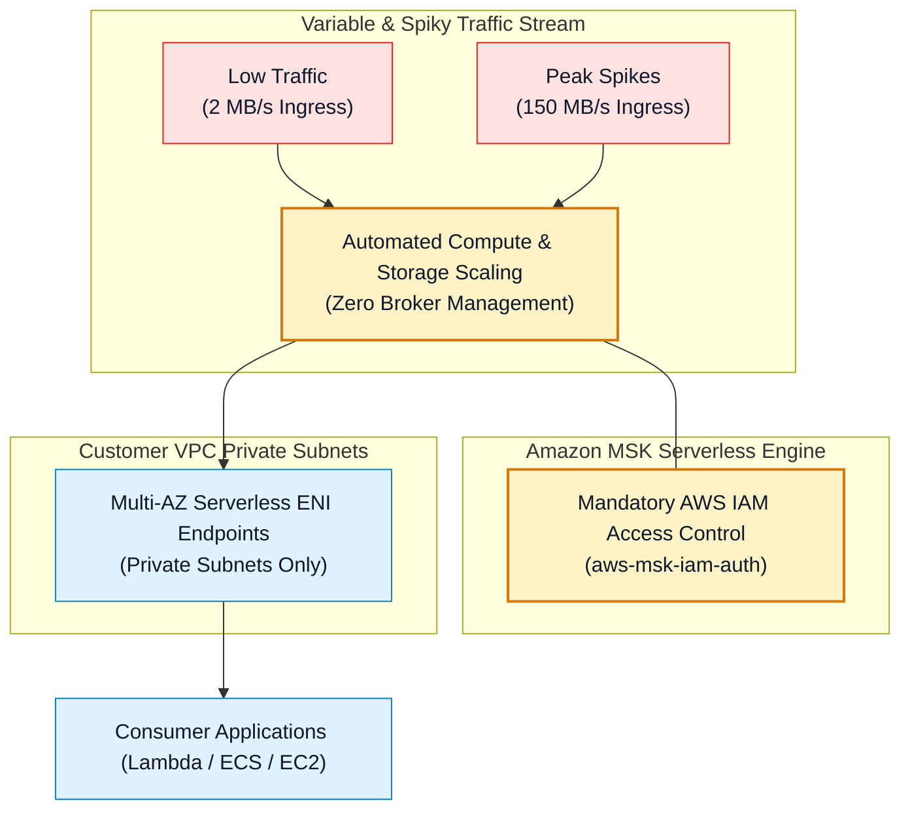
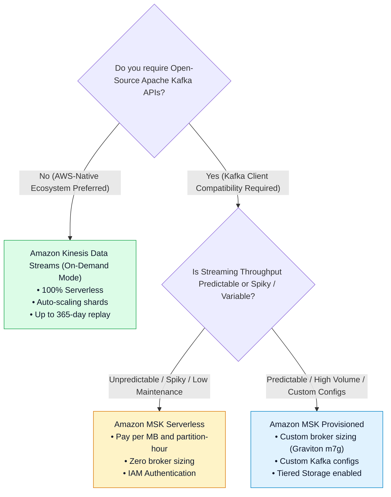

# ⚡ Amazon MSK Serverless Architecture, Capacity & Limits

- **Category**: Analytics / Serverless Streaming Architecture
- **Language / ဘာသာစကား**: **English (Original)** | [မြန်မာဘာသာ (Burmese)](/mm/02-services/analytics-streaming/msk/msk-serverless)
- **Primary Use Case**: Running Apache Kafka workloads with zero infrastructure management, automatic scaling for variable traffic, and pay-for-throughput billing.
- **Slide Reference**: Pages 450–459 in `[AWSCertifiedDataEngineerSlides.pdf](/docs/AWSCertifiedDataEngineerSlides.pdf)`
- **Hub Links**: `[[index]]` | `[[msk]]` | `[[msk-cluster-architecture]]` | `[[kinesis-data-streams]]`

---

## 1. High-Level Summary

**Amazon MSK Serverless** is a serverless cluster type for Amazon Managed Streaming for Apache Kafka that automatically provisions and scales compute and storage resources in response to streaming throughput.

With MSK Serverless, data engineers no longer need to size broker instances, configure EBS volume auto-scaling, or rebalance partitions manually across broker nodes.

---

## 2. Technical Capabilities & Quota Limits

Understanding the operational limits of MSK Serverless is essential for architectural validation on the DEA-C01 exam:

| Operational Metric | Amazon MSK Serverless Limits |
| :--- | :--- |
| **Max Write Throughput (Ingress)** | **Up to 200 MB / second** per cluster (up to 5 MB/s per partition). |
| **Max Read Throughput (Egress)** | **Up to 400 MB / second** per cluster (up to 10 MB/s per partition). |
| **Max Partitions per Cluster** | **Up to 2,400 partitions** per cluster. |
| **Max Message Payload Size** | **1 MB** default (up to 8 MB with client-side compression). |
| **Data Retention** | Up to **1 day (24 hours)** default; configurable up to **30 days**. |
| **Authentication Requirement** | **AWS IAM Access Control ONLY** (`aws-msk-iam-auth`). SASL/SCRAM and mTLS are unsupported. |
| **Network Access** | **Private VPC subnets ONLY**. Public endpoints are not supported. |

---

## 3. MSK Serverless vs. MSK Provisioned vs. Kinesis On-Demand

---

## 4. Cost Model & Billing Dimensions

Amazon MSK Serverless eliminates fixed EC2 broker costs and bills based on actual resource consumption across four distinct dimensions:
1. **Cluster Base Hours**: Fixed hourly charge for running the serverless cluster abstraction.
2. **Partition Hours**: Hourly charge per active partition.
3. **Data Ingress & Egress**: Per-GB pricing for data written to and read from the cluster.
4. **Storage GB-Hours**: Per-GB storage fees for data retained within the topic retention window.

---

## 5. DEA-C01 Exam Essentials

> [!IMPORTANT]
> **Key Exam Decision Triggers for MSK Serverless**:
>
> - **"Spiky Kafka Workloads with No Operational Overhead"** $\rightarrow$ Choose **Amazon MSK Serverless**.
> - **"Mandatory Security Configuration for MSK Serverless"** $\rightarrow$ Producer and consumer clients must authenticate using **AWS IAM Access Control** (`software.amazon.msk.auth.iam.IAMLoginModule`).
> - **"Public Access Required"** $\rightarrow$ MSK Serverless **does not support public endpoints**. If internet clients must connect directly, use **MSK Provisioned** with public brokers or front the cluster with an API Gateway / Network Load Balancer.

---

## 📌 Related Notes
- `[[msk]]` — Amazon MSK Master Hub
- `[[msk-cluster-architecture]]` — MSK Provisioned Clusters & Brokers
- `[[msk-security-and-monitoring]]` — IAM Authentication & Kafka ACLs
- `[[kinesis-data-streams]]` — Kinesis On-Demand Mode Comparison
