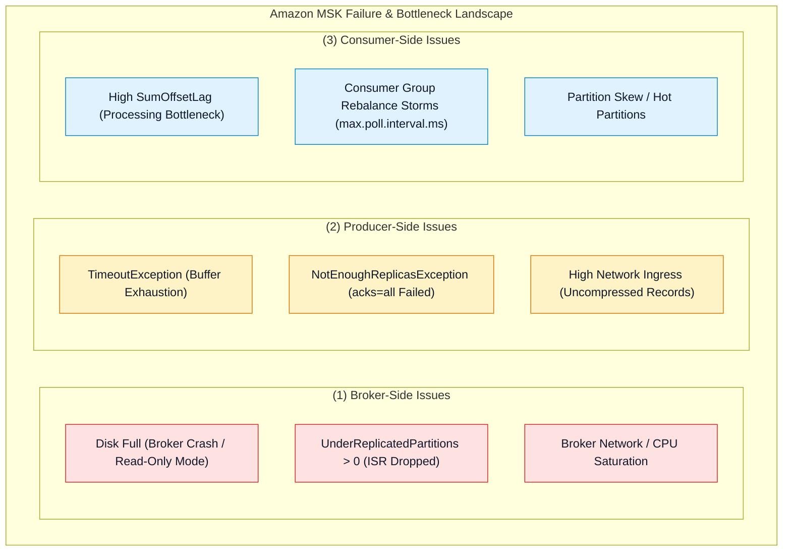
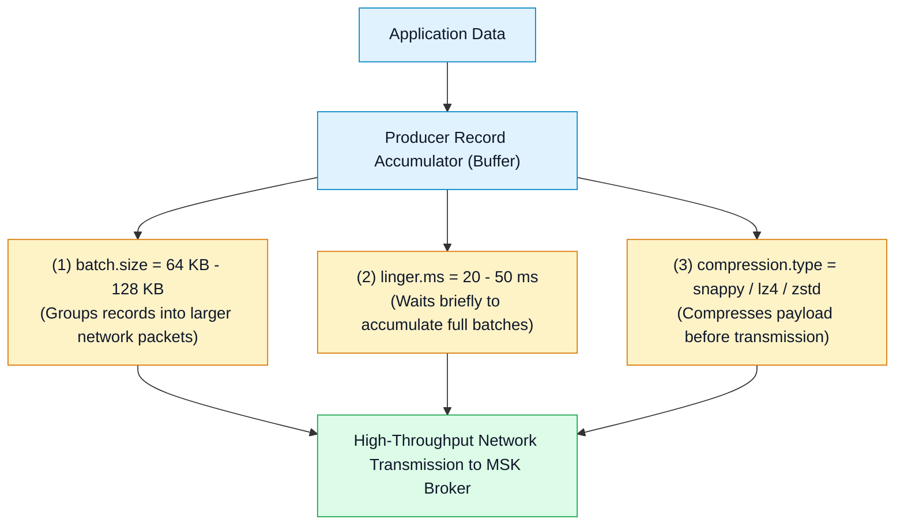
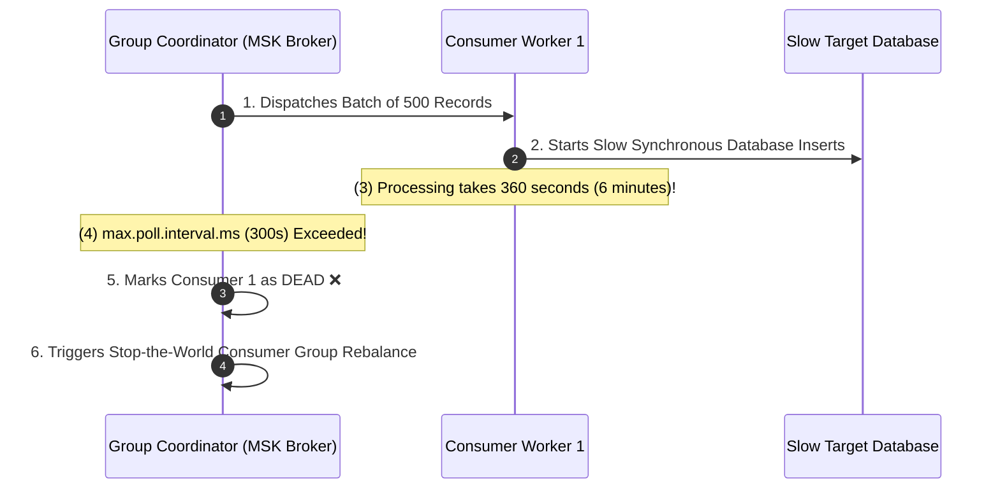

# 🔧 Amazon MSK Troubleshooting & Performance Tuning

- **Category**: Analytics / Production Troubleshooting & Cluster Optimization
- **Language / ဘာသာစကား**: **English (Original)** | [မြန်မာဘာသာ (Burmese)](/mm/02-services/analytics-streaming/msk/msk-troubleshooting-and-tuning)
- **Primary Use Case**: Diagnosing broker disk full failures, resolving producer `TimeoutException`, eliminating consumer rebalance storms, tuning producer batching, and rebalancing partition skew.
- **Slide Reference**: Pages 450–459 in `[[AWSCertifiedDataEngineerSlides.pdf]]`
- **Hub Links**: `[[index]]` | `[[msk]]` | `[[msk-cluster-architecture]]` | `[[msk-security-and-monitoring]]` | `[[kinesis-troubleshooting-and-tuning]]`

---

## 1. High-Level Summary

Troubleshooting Amazon MSK requires identifying failure modes across **Brokers** (disk exhaustion, broker crashes, ISR replica drops), **Producers** (`TimeoutException`, `NotEnoughReplicasException`, uncompressed payloads), and **Consumers** (high `SumOffsetLag`, consumer group rebalance storms caused by `max.poll.interval.ms` timeouts).

Mastering these common failure patterns and performance tuning knobs is essential for high-score performance on the **DEA-C01** exam.

---

## 2. Broker Troubleshooting: Disk Full & ISR Replication Failures

### 1. Recovering from Broker Disk Full Disasters
If a broker's EBS storage volume reaches 100% capacity, Kafka can no longer append to partition logs, causing the broker process to crash or enter read-only mode.
- **Immediate Remediation**:
  1. Increase the broker storage volume size via the AWS MSK Console or CLI (`update-broker-storage`). Note that disk capacity can only be expanded, never shrunk.
  2. Reduce topic retention periods (`retention.ms` or `retention.bytes`) to allow Kafka log cleaners to purge historical segments.
- **Long-Term Prevention**:
  - Configure **EBS Storage Auto-Scaling** (Application Auto Scaling policy).
  - Enable **Amazon MSK Tiered Storage** to automatically offload local segments older than 24 hours to Amazon S3.

---

### 2. Resolving `NotEnoughReplicasException`
- **Root Cause**: Occurs when a producer with `acks=all` writes to a topic, but the active In-Sync Replica (ISR) count falls below the topic's `min.insync.replicas` setting (e.g. 1 out of 3 brokers is down or network partitioned).
- **Remediation**: Check CloudWatch metric `UnderReplicatedPartitions`. Replace unhealthy broker nodes or adjust `min.insync.replicas` temporarily during disaster recovery.

---

## 3. Producer Troubleshooting & Performance Tuning

### Producer Tuning Knobs for Maximum Throughput:
1. **`linger.ms` & `batch.size`**:
   - By default, Kafka producers send records immediately (`linger.ms=0`).
   - Setting `linger.ms = 20` to `50` milliseconds instructs the producer to wait and batch micro-records together up to `batch.size` (e.g. 64 KB or 128 KB), increasing throughput by up to 5x while reducing CPU and network request overhead.
2. **`compression.type`**:
   - Enable `snappy` or `lz4` for high-throughput stream ingestion with negligible CPU overhead. Use `zstd` for maximum compression ratio.
3. **`retries` & `max.in.flight.requests.per.connection`**:
   - To guarantee in-order delivery with retries enabled, configure `enable.idempotence = true` (which automatically sets `max.in.flight.requests.per.connection <= 5`).

---

## 4. Consumer Troubleshooting: Lag & Rebalance Storms

### 1. Eliminating Consumer Group Rebalance Storms
A **Consumer Group Rebalance** stops message consumption while partitions are reassigned among active consumer instances.

### How to Fix Rebalance Storms:
1. **Tune `max.poll.interval.ms`**: Increase this value (e.g. 600,000 ms / 10 minutes) if downstream batch writes genuinely take longer to finish.
2. **Reduce `max.poll.records`**: Decrease batch size (e.g. from 500 to 100 records) so the consumer finishes processing well within the `max.poll.interval.ms` window.
3. **Static Group Membership (`group.instance.id`)**: Assign unique static instance IDs to containerized consumers (ECS/Kubernetes) to prevent unnecessary rebalances during routine rolling deployments.

---

## 5. Master Troubleshooting Cheat Sheet

| Error / Symptom | Root Cause | Immediate Action | Long-Term Architectural Remedy |
| :--- | :--- | :--- | :--- |
| `KafkaDataLogsDiskUsed` reaches 100% | Topic log retention exceeded broker EBS storage. | Increase EBS storage size via AWS Console/CLI. | Enable **Storage Auto-Scaling** and **MSK Tiered Storage**. |
| `org.apache.kafka.common.errors.TimeoutException` | Producer buffer exhausted due to network saturation or dead leader. | Check broker connectivity and scale producer buffer memory. | Optimize producer `batch.size`, `linger.ms`, and enable compression. |
| `NotEnoughReplicasException` | Active ISR count < `min.insync.replicas`. | Verify broker health with `UnderReplicatedPartitions`. | Ensure brokers are distributed across 3 AZs with `replication.factor=3`. |
| Rapidly increasing `SumOffsetLag` | Consumer application throughput slower than write rate. | Scale out consumer instances up to the total number of topic partitions. | Increase consumer concurrency, optimize downstream writes, or use AWS Lambda triggers. |
| Frequent consumer rebalances | Processing loop duration > `max.poll.interval.ms`. | Lower `max.poll.records` or increase `max.poll.interval.ms`. | Enable static membership (`group.instance.id`) on consumers. |
| Partition traffic heavily skewed to 1 broker | Poor message key distribution (low cardinality). | Verify producer partition key hashing. | Add random salt to partition keys or implement a custom partitioner. |

---

## 6. DEA-C01 Exam Essentials

> [!IMPORTANT]
> **Key Exam Decision Triggers for MSK Troubleshooting & Tuning**:
>
> - **"Broker disks are filling up rapidly due to high-volume historical logging"** $\rightarrow$ Enable **MSK Tiered Storage** to offload cold log segments to Amazon S3.
> - **"Consumer application keeps dropping out of the consumer group during heavy batch processing"** $\rightarrow$ The processing loop is exceeding **`max.poll.interval.ms`**. Resolve by decreasing **`max.poll.records`** or increasing the timeout.
> - **"Producers are causing high network costs and low throughput due to sending millions of tiny uncompressed messages"** $\rightarrow$ Configure producer **`linger.ms=20`**, increase **`batch.size`**, and enable **`compression.type=snappy`**.
> - **"Producer receives `NotEnoughReplicasException`"** $\rightarrow$ The number of available In-Sync Replicas (ISR) is less than **`min.insync.replicas`**.

---

## 📌 Related Notes
- `[[msk]]` — Amazon MSK Master Hub
- `[[msk-cluster-architecture]]` — Broker Topologies & Tiered Storage
- `[[msk-security-and-monitoring]]` — CloudWatch Metrics & `SumOffsetLag`
- `[[kinesis-troubleshooting-and-tuning]]` — Kinesis Data Streams Troubleshooting Comparison
