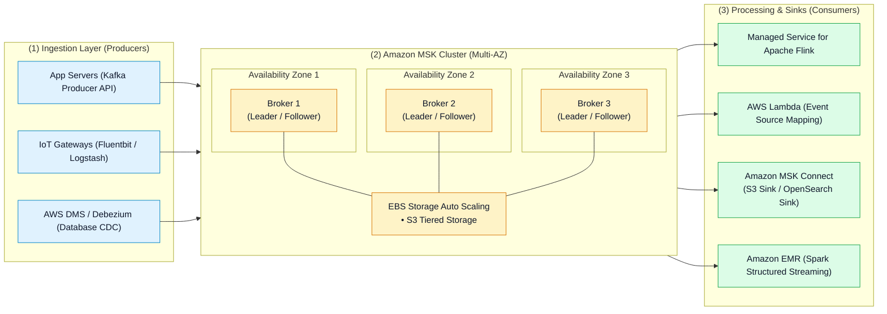
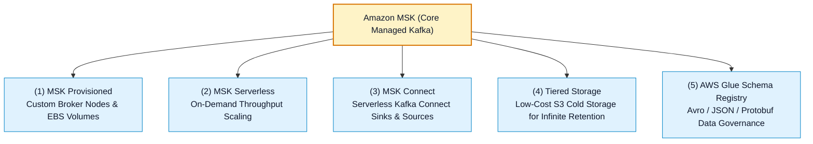

# ☕ Amazon MSK (Managed Streaming for Apache Kafka) Hub

- **Category**: Analytics / Distributed Streaming & Real-Time Data Ingestion
- **Language / ဘာသာစကား**: **English (Original)** | [မြန်မာဘာသာ (Burmese)](/mm/02-services/analytics-streaming/msk/msk)
- **Primary Use Case**: Fully managed, highly available Apache Kafka clusters for real-time streaming, event-driven microservices, open-source ecosystem compatibility, and high-throughput low-latency pub/sub pipelines.
- **Slide Reference**: Pages 450–459 in `[AWSCertifiedDataEngineerSlides.pdf](/docs/AWSCertifiedDataEngineerSlides.pdf)`
- **Hub Links**: `[[index]]` | `[[service-catalog]]` | `[[kinesis]]` | `[[glue-schema-registry]]` | `[[lambda]]`

---

## 1. High-Level Summary

**Amazon MSK (Amazon Managed Streaming for Apache Kafka)** is a fully managed AWS service that makes it easy to ingest, store, and stream real-time data using open-source **Apache Kafka**.

Amazon MSK manages the control plane, broker node provisioning, ZooKeeper / KRaft metadata management, multi-AZ high availability, storage volume auto-scaling, and patch maintenance, allowing data engineers to build distributed streaming applications using native Apache Kafka client libraries, Kafka Connect plugins, and Kafka Streams without infrastructure operational overhead.

---

## 2. Amazon MSK Deployment Modes

Amazon MSK provides two deployment models depending on throughput predictability and operational requirements:

| Dimension | Amazon MSK Provisioned | Amazon MSK Serverless |
| :--- | :--- | :--- |
| **Capacity Management** | Explicit broker instance types (`kafka.m5.large`, `kafka.t3.small`, etc.) and broker count per AZ. | Fully automated, serverless capacity scaling with zero instance sizing. |
| **Storage Architecture** | Dedicated Amazon EBS storage volumes per broker + optional **Amazon MSK Tiered Storage** (S3). | Automated managed storage that scales up and down seamlessly. |
| **Kafka Version & Metadata** | ZooKeeper or KRaft metadata management (Kafka 3.7+). | Fully managed metadata (KRaft-based). |
| **Maximum Message Size** | Configurable via broker properties (`message.max.bytes` up to multi-MB). | **1 MB** default (up to 8 MB with client compression). |
| **Network & Access** | Publicly accessible endpoints (optional) or VPC Private Subnets. | VPC Private Subnets only (IAM Authentication required). |
| **Best For** | Predictable, sustained high-volume enterprise pipelines, custom broker configs, and multi-terabyte data lakes. | Unpredictable, spiky, or low-volume streaming workloads with zero server operations. |

---

## 3. The Core Ecosystem of Amazon MSK

1. **Amazon MSK Provisioned**: Run dedicated Kafka brokers on AWS Graviton (`kafka.m7g`) or x86 instances with granular JVM tuning, custom broker configurations, and storage auto-scaling.
2. **Amazon MSK Serverless**: Automatically manages partitions, broker capacity, and throughput scaling with pay-per-use billing.
3. **Amazon MSK Connect**: Serverless runtime for Apache Kafka Connect connectors (such as Debezium CDC, Snowflake Sink, Amazon S3 Sink) without managing worker EC2 clusters.
4. **MSK Tiered Storage**: Cost-effective storage tier that offloads historical log segments from expensive broker EBS storage to Amazon S3, enabling virtually unlimited topic retention.
5. **AWS Glue Schema Registry**: Free integration that validates and enforces schema compatibility (Avro, Protobuf, JSON) between MSK producers and consumers.

---

## 4. Modular MSK Deep-Dive Topics

To master Amazon MSK for the **AWS Certified Data Engineer - Associate (DEA-C01)** exam, explore the modular sub-topics below:

1. `[[msk-cluster-architecture]]` — **Brokers, Multi-AZ Replication Factor, Storage Auto-Scaling, Tiered Storage & KRaft Mode**
2. `[[msk-serverless]]` — **Serverless Architecture, Throughput Capacity Units, Partition Limits & Cost Model**
3. `[[msk-connect]]` — **Kafka Connect Sinks & Sources, S3 Sink Connector, Custom Plugins & Worker Configurations**
4. `[[msk-security-and-monitoring]]` — **IAM Auth, SASL/SCRAM, TLS Mutual Auth, Kafka ACLs, OpenMonitoring & CloudWatch Lag Metrics**
5. `[[msk-troubleshooting-and-tuning]]` — **Broker Disk Full Recovery, Producer Timeout Exceptions, Consumer Rebalances & Partition Skew**
6. `[[msk-kinesis-comparison-and-patterns]]` — **Comprehensive KDS vs. MSK Decision Matrix, Self-Hosted Migration & Streaming Patterns**

---

## 5. DEA-C01 Exam Essentials

> [!IMPORTANT]
> **Key Exam Rules for Amazon MSK**:
>
> - **Kafka Compatibility Mandate**: If an exam question explicitly requires **open-source Apache Kafka APIs**, **existing Kafka Connect plugins**, or **payload sizes exceeding 1 MB without external S3 pointers**, choose **Amazon MSK** over Kinesis Data Streams.
> - **Storage Tiering**: To retain historical Kafka topic data for months or years without paying high EBS volume fees, enable **MSK Tiered Storage** (which transparently offloads historical log segments to Amazon S3).
> - **Authentication Standard**: The recommended and most secure authentication method for MSK on AWS is **IAM Access Control (`aws-msk-iam-auth`)**, eliminating the need to manage database passwords or client certificates.
> - **Consumer Lag Metric**: Monitor **`SumOffsetLag`** in Amazon CloudWatch or Prometheus OpenMonitoring to track how many messages consumer groups are lagging behind the latest partition offset.

---

## 📌 Related Notes
- `[[msk-cluster-architecture]]` — Broker Architecture & Storage Sizing
- `[[msk-connect]]` — Serverless Connectors to S3 and OpenSearch
- `[[msk-kinesis-comparison-and-patterns]]` — MSK vs Kinesis Architecture Comparison
- `[[kinesis]]` — Amazon Kinesis Streaming Ecosystem
- `[[glue-schema-registry]]` — Schema Evolution for MSK and KDS
- `[[lambda]]` — Serverless Stream Consumers with MSK Triggers
