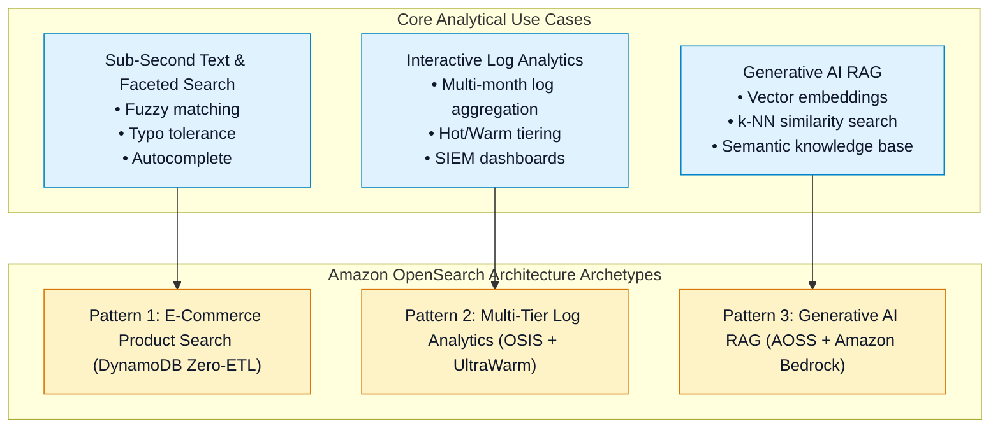
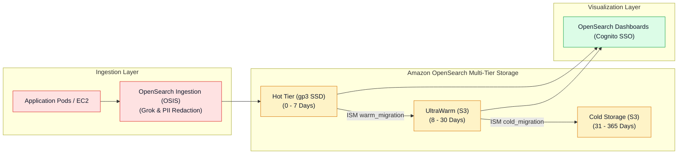
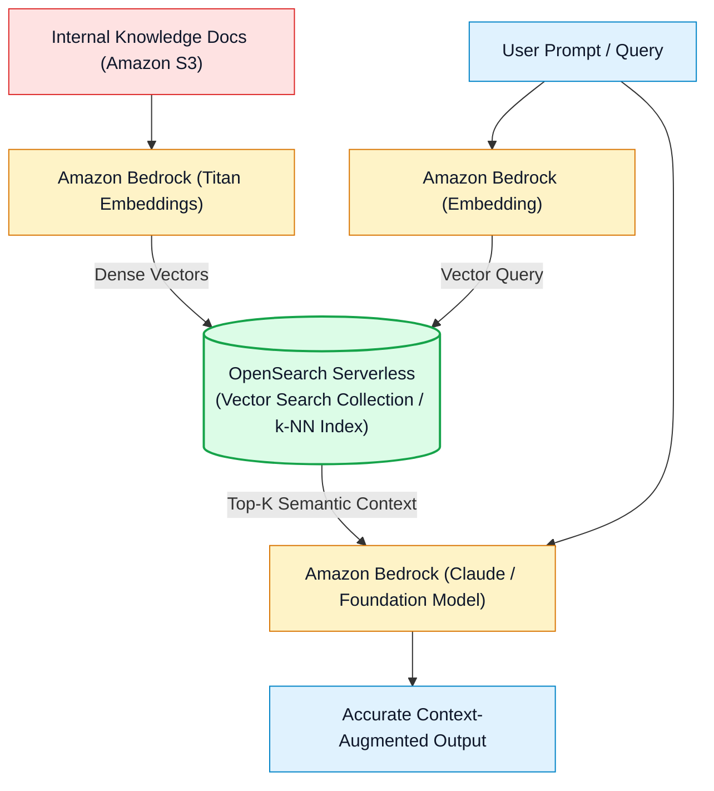

# 📐 Amazon OpenSearch Architecture Patterns & Exam Decision Matrix

- **Category**: Analytics / System Design, End-to-End Pipelines & Technology Selection
- **Language / ဘာသာစကား**: **English (Original)** | [မြန်မာဘာသာ (Burmese)](/mm/02-services/analytics-streaming/opensearch/opensearch-architecture-and-patterns)
- **Primary Use Case**: Designing enterprise log analytics pipelines, implementing Generative AI RAG vector search with Amazon Bedrock, and evaluating OpenSearch against Athena, Redshift, and CloudWatch Logs Insights.
- **Slide Reference**: Pages 460–478 in `[AWSCertifiedDataEngineerSlides.pdf](/docs/AWSCertifiedDataEngineerSlides.pdf)`
- **Hub Links**: `[[en/index|index]]` | `[[en/02-services/analytics-streaming/opensearch/opensearch|opensearch]]` | `[[en/02-services/analytics-streaming/athena/athena|athena]]` | `[[en/02-services/database/redshift|redshift]]` | `[[en/02-services/networking-monitoring/cloudwatch-and-eventbridge|cloudwatch-and-eventbridge]]`

---

## 1. High-Level Summary

Amazon OpenSearch Service plays a distinct, high-performance role within the AWS modern data architecture: **sub-second search queries**, **interactive log analytics**, and **vector similarity search**.

For the **DEA-C01** exam, you must recognize when to select OpenSearch over relational databases, SQL query engines (Athena), and data warehouses (Redshift), and understand how to architect end-to-end streaming and vector RAG pipelines.

---

## 2. Production Architecture Patterns

### Pattern 1: Enterprise Multi-Tier Log Analytics & Observability Pipeline

---

### Pattern 2: Generative AI Retrieval-Augmented Generation (RAG) Pipeline

---

## 3. Definitive AWS Analytics Service Decision Matrix

A primary differentiator tested on the DEA-C01 exam is choosing between OpenSearch, Athena, Redshift, and CloudWatch Logs Insights:

| Service | Primary Strength | Query Latency | Data Structure | Billing Model | Best Exam Scenario |
| :--- | :--- | :--- | :--- | :--- | :--- |
| **Amazon OpenSearch Service** | **Full-text search, fuzzy matching, real-time log aggregation & vector search**. | **Sub-second** ($< 1\text{ s}$). | Semi-structured **JSON documents** (Inverted Index). | Hourly node/OCU capacity + storage. | Search catalogs, SIEM log monitoring, and vector RAG. |
| **Amazon Athena** | **Serverless ad-hoc SQL queries directly on S3 data lakes**. | Seconds to minutes ($5\text{ s} - 60\text{ s}$). | Structured / Tabular (Parquet, ORC, CSV, Iceberg). | **Pay per TB scanned** ($5/TB). | Ad-hoc analytics on S3 data lake files without dedicated compute. |
| **Amazon Redshift** | **Petabyte-scale enterprise relational data warehousing & OLAP BI reporting**. | Sub-second to seconds ($< 5\text{ s}$). | Structured Relational (Columnar storage). | Node hours (Provisioned) or RPU-hours (Serverless). | Complex multi-table SQL joins, dimensional modeling, and corporate BI. |
| **CloudWatch Logs Insights** | **Ad-hoc interactive log querying natively within CloudWatch**. | Seconds ($2\text{ s} - 15\text{ s}$). | CloudWatch Log Streams. | **Pay per GB scanned** ($0.005/GB). | Quick, ad-hoc developer troubleshooting without provisioning a dedicated search cluster. |

---

## 4. DEA-C01 Master Search & Analytics Decision Guide

> [!IMPORTANT]
> **Key Exam Decision Triggers for OpenSearch vs. Alternatives**:
>
> - **"Application requires fuzzy keyword search, faceted filters, and autocomplete on an e-commerce catalog"** $\rightarrow$ Choose **Amazon OpenSearch Service**.
> - **"Data analyst needs to run ad-hoc SQL queries on historical Parquet files in S3 without managing servers or paying hourly cluster fees"** $\rightarrow$ Choose **Amazon Athena**.
> - **"Enterprise BI team needs to run complex joins across billions of historical sales records with sub-second dashboard performance"** $\rightarrow$ Choose **Amazon Redshift**.
> - **"Security team requires real-time log search and SIEM anomaly dashboards across multi-terabyte infrastructure logs"** $\rightarrow$ Route logs via **OpenSearch Ingestion (OSIS)** into **Amazon OpenSearch Service** with **UltraWarm Storage**.
> - **"Build a semantic search knowledge base for Generative AI"** $\rightarrow$ Store vector embeddings in **Amazon OpenSearch Serverless (Vector search collection)**.

---

## 📌 Related Notes
- `[[en/02-services/analytics-streaming/opensearch/opensearch|opensearch]]` — OpenSearch Master Hub
- `[[en/02-services/analytics-streaming/opensearch/opensearch-serverless|opensearch-serverless]]` — Vector Search & Serverless Collections
- `[[en/02-services/analytics-streaming/opensearch/opensearch-storage-tiers-and-ism|opensearch-storage-tiers-and-ism]]` — UltraWarm & Index State Management
- `[[en/02-services/analytics-streaming/athena/athena|athena]]` — S3 Serverless SQL Engine
- `[[en/02-services/database/redshift|redshift]]` — Enterprise Data Warehousing
- `[[en/02-services/networking-monitoring/cloudwatch-and-eventbridge|cloudwatch-and-eventbridge]]` — CloudWatch Logs & Subscription Filters
