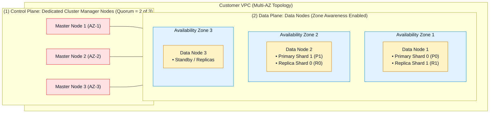
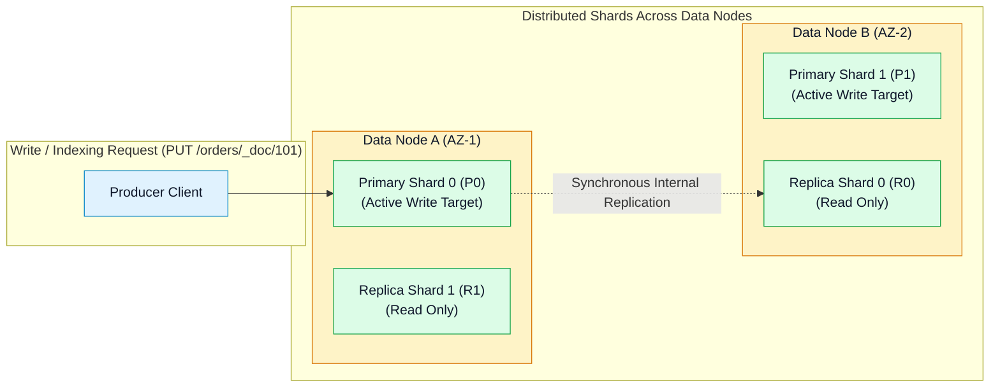

# 🏛️ Amazon OpenSearch Cluster Architecture, Sharding & Node Sizing

- **Category**: Analytics / Search Engine Architecture & Infrastructure Design
- **Language / ဘာသာစကား**: **English (Original)** | [မြန်မာဘာသာ (Burmese)](/mm/02-services/analytics-streaming/opensearch/opensearch-cluster-architecture)
- **Primary Use Case**: Designing resilient multi-AZ OpenSearch clusters, configuring dedicated cluster manager nodes, and sizing primary and replica shards according to AWS best practices.
- **Slide Reference**: Pages 460–478 in `[[AWSCertifiedDataEngineerSlides.pdf]]`
- **Hub Links**: `[[index]]` | `[[opensearch]]` | `[[opensearch-storage-tiers-and-ism]]` | `[[opensearch-troubleshooting-and-tuning]]`

---

## 1. High-Level Summary

An Amazon OpenSearch Service managed cluster consists of specialized node types deployed across multiple Availability Zones in a Virtual Private Cloud (VPC).

For the **DEA-C01** exam, you must master the division of responsibilities between **Dedicated Cluster Manager Nodes** and **Data Nodes**, how data is partitioned across **Primary and Replica Shards**, and the mathematical rules of thumb for shard sizing to prevent JVM memory exhaustion.

---

## 2. Cluster Node Roles & Topology

| Node Role | Responsibility | Sizing & Resiliency Rule |
| :--- | :--- | :--- |
| **Dedicated Cluster Manager (Master) Nodes** | Manages cluster state, routes index creation, performs health checks, tracks node additions/departures, and coordinates shard reallocation. Does NOT store index data or execute search queries. | **Always deploy 3 dedicated master nodes** in production multi-AZ setups. A quorum of `(N/2) + 1 = 2` nodes is required to prevent **split-brain** conditions. |
| **Data Nodes** | Holds Lucene indices, executes write indexing operations, and executes distributed search and aggregation queries. | Deploy across **2 or 3 Availability Zones** with **Zone Awareness** enabled. Sized based on storage, memory, and CPU needs (`r6g.search` recommended for memory-heavy search). |
| **UltraWarm Nodes** | High-density read-only nodes that cache S3-backed data in memory/local storage for interactive querying of warm indices. | Sized based on total warm storage volume (up to 3 PB per cluster). |
| **Cold Storage** | Completely decoupled S3 storage without attached compute instances. | No persistent nodes needed; mounted on demand. |

---

## 3. Sharding Architecture: Primaries vs. Replicas

Data in OpenSearch is organized into **Indices** (analogous to SQL tables), which are partitioned into **Shards** (underlying Apache Lucene instances):

### Primary vs. Replica Rules:
1. **Primary Shards**:
   - Every write operation is directed to the primary shard determined by hashing the document ID: `shard = hash(doc_id) % number_of_primary_shards`.
   - **Crucial Rule**: The number of primary shards is **fixed at index creation** and cannot be changed without creating a new index and running a **Reindex API** operation.
2. **Replica Shards**:
   - An exact copy of a primary shard that resides on a **different data node** (and different AZ).
   - Serves search queries (scaling read throughput) and provides automated failover if the primary shard's node fails.
   - **Crucial Rule**: The number of replica shards can be **dynamically increased or decreased at runtime** using the Index Settings API.

---

## 4. Shard Sizing Best Practices & Rules of Thumb

A common cause of OpenSearch cluster failure on the DEA-C01 exam is **over-sharding** (creating thousands of tiny shards, which exhausts JVM heap memory).

| Use Case | Target Shard Size Range | Sizing Rationale |
| :--- | :--- | :--- |
| **Search / E-Commerce** | **10 GiB – 30 GiB** | Smaller shards provide faster query latencies and rapid Lucene segment searching. |
| **Log Analytics / Time-Series** | **30 GiB – 50 GiB** | Larger shards optimize throughput and reduce metadata overhead for multi-terabyte log streams. |

### The Golden Sizing Rules:
- **Maximum Shard Size**: Never allow individual shards to exceed **50 GiB** (leads to slow recovery, garbage collection pauses, and failover timeouts).
- **Shards-per-JVM-Heap Ratio**: Maintain a ratio of **no more than 20 to 25 active shards per 1 GB of JVM heap memory** allocated to a data node.
  - *Example*: A node with a 32 GB JVM heap should hold a maximum of **640 – 800 shards**.
- **Primary Shard Calculation**:
  $$\text{Primary Shards} = \frac{\text{Expected Daily Ingestion (GB)}}{\text{Target Shard Size (e.g. 40 GB)}}$$

---

## 5. DEA-C01 Exam Essentials

> [!IMPORTANT]
> **Key Architecture Decision Triggers for OpenSearch**:
>
> - **"Prevent Split-Brain In A Multi-AZ Cluster"** $\rightarrow$ Provision **3 Dedicated Cluster Manager nodes** across 3 AZs.
> - **"High Read Query Throughput Required"** $\rightarrow$ Increase the **number of replica shards** dynamically (`number_of_replicas`).
> - **"JVM Memory Pressure Is Spiking Due to Excessive Small Shards"** $\rightarrow$ The cluster is suffering from **over-sharding**. Merge small daily/hourly indices into larger indices or consolidate shards using the **Shrink API** or **Index State Management (ISM)**.
> - **"Zone Awareness"** $\rightarrow$ Enable Multi-AZ with Zone Awareness to ensure primary and replica shards are never placed in the same Availability Zone.

---

## 📌 Related Notes
- `[[opensearch]]` — OpenSearch Service Master Hub
- `[[opensearch-storage-tiers-and-ism]]` — UltraWarm & Index State Management
- `[[opensearch-troubleshooting-and-tuning]]` — Diagnosing Cluster Yellow/Red States
- `[[ec2-and-graviton]]` — Graviton Silicon for OpenSearch Nodes
