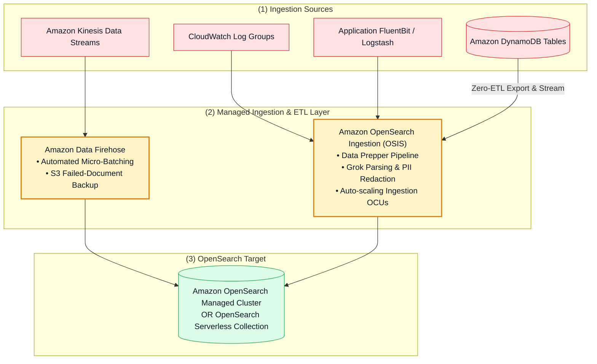
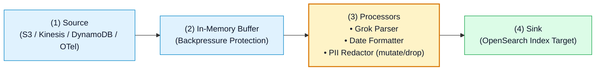

# 🚀 Amazon OpenSearch Ingestion (OSIS), Data Prepper & Integration Pipelines

- **Category**: Analytics / Real-Time Data Ingestion & Stream Processing
- **Language / ဘာသာစကား**: **English (Original)** | [မြန်မာဘာသာ (Burmese)](/mm/02-services/analytics-streaming/opensearch/opensearch-ingestion-and-pipelines)
- **Primary Use Case**: Ingesting high-throughput streaming logs into OpenSearch using serverless OpenSearch Ingestion (OSIS), Amazon Data Firehose, CloudWatch subscription filters, and Amazon DynamoDB Zero-ETL.
- **Slide Reference**: Pages 460–478 in `[[AWSCertifiedDataEngineerSlides.pdf]]`
- **Hub Links**: `[[index]]` | `[[opensearch]]` | `[[kinesis-firehose]]` | `[[dynamodb]]` | `[[cloudwatch-and-eventbridge]]`

---

## 1. High-Level Summary

Loading data into Amazon OpenSearch Service requires resilient, scalable ingestion mechanisms that parse, filter, enrich, and redact unstructured logs before indexing.

AWS provides multiple native ingestion options for OpenSearch, headlined by **Amazon OpenSearch Ingestion (OSIS)** (a serverless Data Prepper pipeline engine), **Amazon Data Firehose**, and **Amazon DynamoDB Zero-ETL integration with OpenSearch Service**.



---

## 2. Ingestion Pipeline Technologies Compared

| Ingestion Method | Server Management | Transformations & Filtering | Best Use Case | DEA-C01 Significance |
| :--- | :--- | :--- | :--- | :--- |
| **Amazon OpenSearch Ingestion (OSIS)** | Fully Serverless (scales via Ingestion OCUs). | Advanced transformations via **Data Prepper** (Grok, date parsing, PII redaction, field dropping). | Real-time log aggregation, OpenTelemetry traces, and **DynamoDB Zero-ETL**. | **Recommended native pipeline** for complex log parsing and PII masking. |
| **Amazon Data Firehose** | Fully Serverless. | Micro-batching, JSON-to-JSON inline transformations via Lambda. | High-throughput streaming delivery from Kinesis / CloudWatch to OpenSearch. | Includes **S3 Backup** for failed documents and daily index rotation (`orders-YYYY-MM-DD`). |
| **DynamoDB Zero-ETL Integration** | Fully Serverless (powered by OSIS). | Automated change stream replication. | Full-text search and fuzzy matching on DynamoDB table attributes. | Eliminates custom Lambda + DynamoDB Streams ETL glue code. |
| **CloudWatch Subscription Filter** | Serverless (pushes directly to Lambda / Firehose / OSIS). | Basic string pattern matching. | Forwarding AWS service logs to OpenSearch in near real-time. | Simplest method to stream CloudWatch logs to OpenSearch. |

---

## 3. Deep Dive: Amazon OpenSearch Ingestion (OSIS)

**Amazon OpenSearch Ingestion (OSIS)** runs managed **Data Prepper** pipelines that scale compute resources using **Ingestion OCUs** ($1\text{ Ingestion OCU} = 8\text{ GiB RAM} + 2\text{ vCPUs}$).



### OSIS Pipeline Configuration Example:
```yaml
version: "2"
log-pipeline:
  source:
    http:
      path: "/log/ingest"
  processor:
    - grok:
        match:
          log: ["%{TIMESTAMP_ISO8601:timestamp} %{LOGLEVEL:level} %{GREEDYDATA:message}"]
    - mutate:
        delete_entries:
          with_keys: ["credit_card_number", "ssn"]
  sink:
    - opensearch:
        hosts: ["https://search-my-domain.us-east-1.es.amazonaws.com"]
        index: "application-logs-%{yyyy.MM.dd}"
        aws:
          region: "us-east-1"
          sts_role_arn: "arn:aws:iam::123456789012:role/OSISPipelineRole"
```

---

## 4. Amazon DynamoDB Zero-ETL Integration with OpenSearch

Before Zero-ETL, replicating DynamoDB data to OpenSearch required enabling DynamoDB Streams, writing a custom AWS Lambda consumer function, and managing dead-letter queues.

With **DynamoDB Zero-ETL**:
1. OpenSearch Ingestion (OSIS) connects directly to the DynamoDB table.
2. OSIS performs a one-time point-in-time snapshot export to Amazon S3 to seed the OpenSearch index.
3. OSIS automatically subscribes to DynamoDB continuous point-in-time change events to keep OpenSearch search indices in continuous sync without code.

---

## 5. DEA-C01 Exam Essentials

> [!IMPORTANT]
> **Key Exam Decision Triggers for OpenSearch Ingestion**:
>
> - **"Perform full-text search on DynamoDB items with minimal code and zero maintenance"** $\rightarrow$ Configure **Amazon DynamoDB Zero-ETL integration with Amazon OpenSearch Service**.
> - **"Parse unformatted logs, redact sensitive PII credit card numbers, and load into OpenSearch"** $\rightarrow$ Use **Amazon OpenSearch Ingestion (OSIS)** with a Data Prepper `grok` and `mutate` pipeline.
> - **"Stream logs to OpenSearch with an automated fallback for unindexable documents"** $\rightarrow$ Use **Amazon Data Firehose** with **Amazon S3 Backup for Failed Documents**.
> - **"Capacity Scaling for OSIS"** $\rightarrow$ OpenSearch Ingestion pipelines scale compute automatically in **Ingestion OCUs**.

---

## 📌 Related Notes
- `[[opensearch]]` — OpenSearch Master Hub
- `[[kinesis-firehose]]` — Firehose Buffering & Destinations
- `[[dynamodb]]` — DynamoDB Architecture & Streams
- `[[cloudwatch-and-eventbridge]]` — CloudWatch Log Subscriptions
