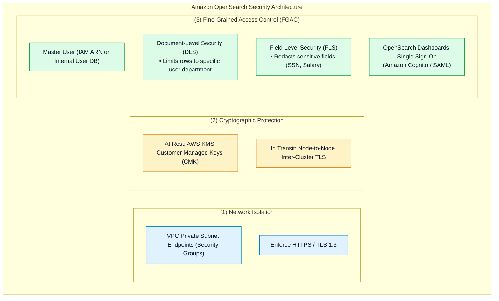
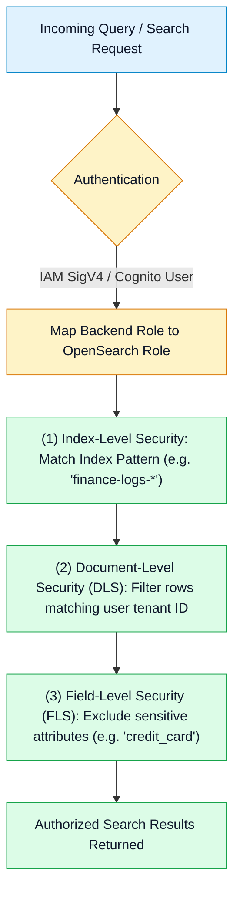

# 🛡️ Amazon OpenSearch Security, Fine-Grained Access Control & Monitoring

- **Category**: Analytics / Governance, Identity & Cluster Observability
- **Language / ဘာသာစကား**: **English (Original)** | [မြန်မာဘာသာ (Burmese)](/mm/02-services/analytics-streaming/opensearch/opensearch-security-and-monitoring)
- **Primary Use Case**: Configuring Fine-Grained Access Control (FGAC), implementing Document and Field-Level Security, securing OpenSearch Dashboards with Amazon Cognito, and monitoring critical cluster health metrics.
- **Slide Reference**: Pages 460–478 in `[[AWSCertifiedDataEngineerSlides.pdf]]`
- **Hub Links**: `[[index]]` | `[[opensearch]]` | `[[opensearch-cluster-architecture]]` | `[[opensearch-troubleshooting-and-tuning]]`

---

## 1. High-Level Summary

Securing an Amazon OpenSearch Service cluster requires a multi-layered defense model covering **Network Isolation** (VPC private subnets), **Data Encryption** (AWS KMS at rest, node-to-node TLS in transit), and **Fine-Grained Access Control (FGAC)**.

FGAC enables data engineers to implement enterprise compliance requirements by restricting data access down to individual documents (**Document-Level Security**) and hiding sensitive columns (**Field-Level Security**).



---

## 2. Fine-Grained Access Control (FGAC) Deep Dive

When Fine-Grained Access Control is enabled on an OpenSearch domain, it enforces granular authentication and authorization across three distinct layers:



### 1. Document-Level Security (DLS)
Restricts which documents a given role can see within an index based on a Lucene query string or DSL pattern:
```json
{
  "term": {
    "account_manager_id": "${attr.internal.user_id}"
  }
}
```
*Result*: Users only see documents where the `account_manager_id` matches their own assigned user ID.

### 2. Field-Level Security (FLS)
Controls which specific fields are visible in search query responses. Sensitive fields (e.g., `tax_id`, `customer_ssn`, `raw_payload`) can be blacklisted so unauthorized users never receive them over the API.

---

## 3. OpenSearch Dashboards (Kibana) Authentication

To allow analysts and security teams to log into OpenSearch Dashboards without distributing AWS IAM credentials:
1. **Amazon Cognito Integration**:
   - **Cognito User Pool**: Manages user directory, passwords, and Multi-Factor Authentication (MFA).
   - **Cognito Identity Pool**: Assumes an IAM role and authenticates users into OpenSearch Dashboards.
2. **SAML 2.0 Identity Provider**:
   - Integrates directly with enterprise identity providers (e.g. Okta, Azure Active Directory / Entra ID, PingFederate) for corporate Single Sign-On (SSO).

---

## 4. Critical CloudWatch Monitoring Metrics

| CloudWatch Metric | Normal Baseline | Critical Alarm Trigger | Root Cause & Action Required |
| :--- | :--- | :--- | :--- |
| **`ClusterStatus.red`** | **0** | $> 0$ for $\ge 1$ min | **At least one primary shard is unassigned**. Immediate risk of data loss. |
| **`ClusterStatus.yellow`** | **0** | $> 0$ for $\ge 10$ min | All primary shards allocated, but **one or more replica shards are unassigned**. Node outage or low disk space. |
| **`JVMMemoryPressure`** | $< 70\%$ | **$\ge 75\%$ (Warning)**<br/>**$\ge 92\%$ (Critical)** | JVM garbage collection bottleneck. At 92%, OpenSearch initiates **circuit breakers** and rejects incoming writes with HTTP 429. |
| **`FreeStorageSpace`** | $> 25\%$ | $\le 15\%$ | Approaching storage watermarks. Triggers cluster read-only mode if free space drops below 5%. |
| **`CPUUtilization`** | $< 60\%$ | $\ge 80\%$ | Excessive heavy aggregations or high search concurrency. Add more data nodes. |

---

## 5. DEA-C01 Exam Essentials

> [!IMPORTANT]
> **Key Exam Decision Triggers for OpenSearch Security & Monitoring**:
>
> - **"Restrict analysts so they can only query documents matching their department while redacting social security numbers"** $\rightarrow$ Enable **Fine-Grained Access Control (FGAC)** with **Document-Level Security (DLS)** and **Field-Level Security (FLS)**.
> - **"Secure Single Sign-On for OpenSearch Dashboards without IAM access keys"** $\rightarrow$ Integrate **Amazon Cognito User Pools and Identity Pools** or **SAML 2.0 SSO**.
> - **"Cluster status is RED"** $\rightarrow$ One or more **primary shards** are unassigned.
> - **"Cluster status is YELLOW"** $\rightarrow$ All primary shards are active, but one or more **replica shards** cannot be allocated (e.g. lack of available nodes in a second AZ).
> - **"Incoming writes failing with HTTP 429 Too Many Requests"** $\rightarrow$ **`JVMMemoryPressure` exceeded 92%**, activating parent circuit breakers.

---

## 📌 Related Notes
- `[[opensearch]]` — OpenSearch Master Hub
- `[[opensearch-cluster-architecture]]` — Master & Data Node Topologies
- `[[opensearch-troubleshooting-and-tuning]]` — Diagnosing Red/Yellow Status & Watermarks
- `[[cloudwatch-and-eventbridge]]` — CloudWatch Metrics & Alarms
