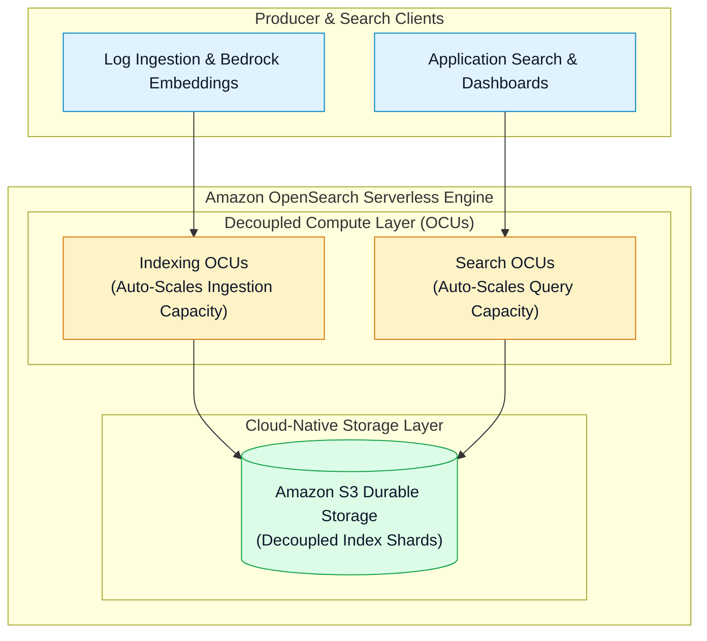
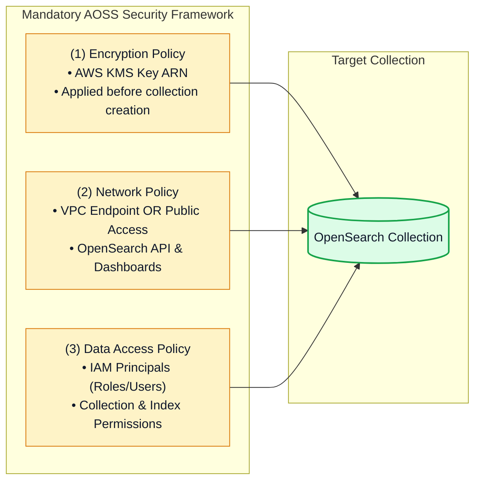

# ⚡ Amazon OpenSearch Serverless (AOSS) Architecture & Collections

- **Category**: Analytics / Serverless Search, Observability & Vector Search
- **Language / ဘာသာစကား**: **English (Original)** | [မြန်မာဘာသာ (Burmese)](/mm/02-services/analytics-streaming/opensearch/opensearch-serverless)
- **Primary Use Case**: Running full-text search, time-series log analytics, and ML vector search without managing cluster instances, node sizing, shard counts, or storage scaling.
- **Slide Reference**: Pages 460–478 in `[[AWSCertifiedDataEngineerSlides.pdf]]`
- **Hub Links**: `[[index]]` | `[[opensearch]]` | `[[opensearch-storage-tiers-and-ism]]` | `[[s3]]`

---

## 1. High-Level Summary

**Amazon OpenSearch Serverless (AOSS)** is an on-demand serverless configuration for Amazon OpenSearch Service that decouples **compute** (indexing and search) from **storage** (Amazon S3).

With OpenSearch Serverless, data engineers create logical groupings called **Collections** instead of provisioning physical EC2 instances. Compute resources automatically scale in units called **OpenSearch Compute Units (OCUs)** to match dynamic indexing throughput and query rates.

---

## 2. OpenSearch Compute Units (OCUs)

Capacity in OpenSearch Serverless is measured in **OpenSearch Compute Units (OCUs)**:
- **1 OCU = 6 GiB RAM + corresponding virtual CPU (vCPU)**.
- Compute is decoupled into two independent OCU pools:
  1. **Indexing OCUs**: Scale dynamically based on ingestion rate, parsing, and Lucene segment construction.
  2. **Search OCUs**: Scale independently based on query volume, complex aggregations, and vector similarity calculations.
- **Auto-Scaling**: AOSS automatically provisions OCUs during traffic surges and scales back down when traffic subsides. You can set minimum and maximum OCU limits to control operational costs.

---

## 3. Collection Types

A **Collection** is the fundamental logical container in OpenSearch Serverless. When creating a collection, you select one of three specialized workload types:

| Collection Type | Optimized Workload | Index Behavior & Caching | Common Use Cases |
| :--- | :--- | :--- | :--- |
| **Search** | Full-text keyword search and enterprise search applications. | Fast local SSD caching on Search OCUs for interactive, repetitive queries. | E-commerce product catalogs, website search, documentation portals. |
| **Time-series** | High-volume append-only timestamped events. | Optimized for high-throughput writes and time-bounded range queries (`@timestamp`). | Operational log analytics, application APM, security SIEM. |
| **Vector search** | Approximate k-Nearest Neighbor (k-NN) vector embeddings. | High-performance vector index graphs in memory. | Generative AI Retrieval-Augmented Generation (RAG), semantic search with **Amazon Bedrock**. |

---

## 4. The Three Mandatory AOSS Security Policies

To secure an OpenSearch Serverless collection, AWS requires defining three separate policies:

1. **Encryption Policy**: Specifies the AWS KMS customer managed key (CMK) or AWS-managed key used to encrypt all collection data at rest in Amazon S3.
2. **Network Policy**: Controls whether the collection and OpenSearch Dashboards are accessible via **VPC Endpoints (AWS PrivateLink)** or public internet endpoints.
3. **Data Access Policy**: Defines which **AWS IAM roles or users** have read/write permissions to specific collection indices (`aoss:CreateCollectionItems`, `aoss:UpdateCollectionItems`, `aoss:DescribeIndex`).

---

## 5. Managed Provisioned Cluster vs. OpenSearch Serverless

| Feature | OpenSearch Provisioned Cluster | OpenSearch Serverless (AOSS) |
| :--- | :--- | :--- |
| **Capacity Management** | Manual instance selection (`m6g`, `r6g`), master nodes, and disk sizing. | **Zero instance management**. Auto-scaled via **OCUs**. |
| **Storage Architecture** | Dedicated EBS volumes per node + optional UltraWarm/Cold S3. | Fully decoupled **Amazon S3 storage natively**. |
| **Sharding Configuration** | Requires manual primary and replica shard planning. | Sharding is **fully automated** and abstracted away. |
| **Cost Model** | Fixed hourly node pricing (24/7 provisioned cost). | Pay per OCU-hour and S3 storage GB-month. |
| **Best For** | Predictable, steady-state massive log pipelines requiring custom JVM tuning. | Unpredictable, intermittent, or spiky search, vector RAG, and low-maintenance workloads. |

---

## 6. DEA-C01 Exam Essentials

> [!IMPORTANT]
> **Key Exam Decision Triggers for OpenSearch Serverless**:
>
> - **"Build a search application or log platform with zero server management and automatic capacity scaling"** $\rightarrow$ Choose **Amazon OpenSearch Serverless (AOSS)**.
> - **"Semantic Search / Generative AI RAG pipeline with Amazon Bedrock"** $\rightarrow$ Choose **OpenSearch Serverless Vector search collection**.
> - **"AOSS Capacity Unit"** $\rightarrow$ Capacity scales in **OpenSearch Compute Units (OCUs)** (1 OCU = 6 GiB RAM + vCPU).
> - **"Mandatory Security Configuration"** $\rightarrow$ Creating an AOSS collection requires **Encryption Policy**, **Network Policy**, and **Data Access Policy**.

---

## 📌 Related Notes
- `[[opensearch]]` — OpenSearch Master Hub
- `[[opensearch-cluster-architecture]]` — Provisioned Cluster Topologies
- `[[opensearch-ingestion-and-pipelines]]` — Ingesting into OpenSearch
- `[[s3]]` — S3 Persistent Storage Layer
