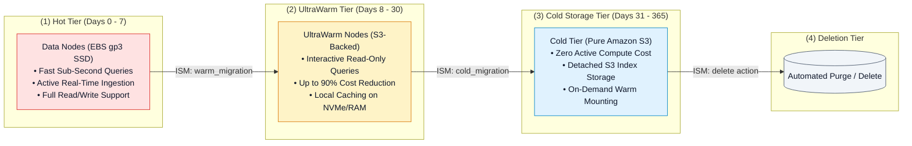
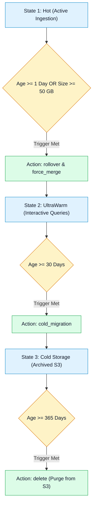

# 📦 Amazon OpenSearch Storage Tiers & Index State Management (ISM)

- **Category**: Analytics / Storage Optimization & Lifecycle Automation
- **Language / ဘာသာစကား**: **English (Original)** | [မြန်မာဘာသာ (Burmese)](/mm/02-services/analytics-streaming/opensearch/opensearch-storage-tiers-and-ism)
- **Primary Use Case**: Cost-effective log retention across Hot, UltraWarm, and Cold storage tiers, automated index rollovers, and defining Index State Management (ISM) lifecycle policies.
- **Slide Reference**: Pages 460–478 in `[AWSCertifiedDataEngineerSlides.pdf](/docs/AWSCertifiedDataEngineerSlides.pdf)`
- **Hub Links**: `[[en/index|index]]` | `[[en/02-services/analytics-streaming/opensearch/opensearch|opensearch]]` | `[[en/02-services/analytics-streaming/opensearch/opensearch-cluster-architecture|opensearch-cluster-architecture]]` | `[[en/02-services/storage/s3/s3|s3]]`

---

## 1. High-Level Summary

Managing massive time-series log data in Amazon OpenSearch Service requires balancing **sub-second query performance** with **storage cost efficiency**.

Amazon OpenSearch decouples storage across three primary tiers: **Hot**, **UltraWarm** (backed by Amazon S3 with warm node caching), and **Cold Storage** (detached S3 data). **Index State Management (ISM)** automates index transitions between these tiers without manual administrative scripts.



---

## 2. Storage Tier Comparison Matrix

| Storage Tier | Underlying Media | Read/Write Access | Query Latency | Cost Profile |
| :--- | :--- | :--- | :--- | :--- |
| **Hot Storage** | High-performance EBS SSDs (`gp3`, `io2`) or NVMe instance stores. | **Read & Write** (Active indexing target). | **Single-digit milliseconds** ($< 10\text{ ms}$). | High (standard EBS storage + data node instance hours). |
| **UltraWarm Storage** | Amazon S3 storage queried via specialized UltraWarm compute nodes. | **Read-Only** (Indices must be set to read-only before migration). | Near-hot latency (sub-second to seconds via smart caching). | **Up to 90% cheaper** than hot EBS storage. |
| **Cold Storage** | Amazon S3 managed indices completely detached from compute. | **Read-Only** (Requires mounting/warming before querying). | Minutes (must mount index to UltraWarm nodes to query). | **Lowest cost** (pure S3 storage fees, zero compute overhead). |

---

## 3. Index State Management (ISM) Policies

**Index State Management (ISM)** is an automated policy engine built into OpenSearch that manages index lifecycles based on document age, index size, or document count.



### Key ISM Actions for DEA-C01:
1. **`rollover`**: Closes the active index and creates a new index when target size (e.g. 50 GB) or age (e.g. 1 day) is reached.
2. **`force_merge`**: Merges underlying Lucene segments (`max_num_segments: 1`) to reclaim deleted document space and accelerate search performance before moving to warm storage.
3. **`read_only`**: Locks the index from further write modifications (mandatory step before UltraWarm migration).
4. **`warm_migration`**: Migrates the index from EBS hot data nodes to S3-backed UltraWarm storage.
5. **`cold_migration`**: Moves warm indices to Cold storage, releasing UltraWarm node resources.
6. **`delete`**: Permanently purges expired indices from S3.

---

## 4. Production ISM Policy Example

Below is a production-grade ISM JSON policy that enforces hot-to-warm-to-cold migration for daily logs:

```json
{
  "policy": {
    "description": "Lifecycle policy for production application logs",
    "default_state": "hot",
    "states": [
      {
        "name": "hot",
        "actions": [
          {
            "rollover": {
              "min_index_age": "1d",
              "min_primary_shard_size": "45gb"
            }
          }
        ],
        "transitions": [
          {
            "state_name": "warm",
            "conditions": {
              "min_index_age": "7d"
            }
          }
        ]
      },
      {
        "name": "warm",
        "actions": [
          {
            "replica_count": {
              "number_of_replicas": 0
            }
          },
          {
            "warm_migration": {}
          }
        ],
        "transitions": [
          {
            "state_name": "cold",
            "conditions": {
              "min_index_age": "30d"
            }
          }
        ]
      },
      {
        "name": "cold",
        "actions": [
          {
            "cold_migration": {
              "timestamp_field": "@timestamp"
            }
          }
        ],
        "transitions": [
          {
            "state_name": "delete",
            "conditions": {
              "min_index_age": "365d"
            }
          }
        ]
      },
      {
        "name": "delete",
        "actions": [
          {
            "delete": {}
          }
        ],
        "transitions": []
      }
    ]
  }
}
```

---

## 5. DEA-C01 Exam Essentials

> [!IMPORTANT]
> **Key Exam Decision Triggers for OpenSearch Storage & ISM**:
>
> - **"Cost-effective interactive querying of 6-month historical log data in OpenSearch"** $\rightarrow$ Migrate indices to **UltraWarm Storage**.
> - **"Archive 1-year compliance log data at minimal cost without deleting indices"** $\rightarrow$ Migrate indices to **Cold Storage**.
> - **"Automate shard rollover and tier migration without custom Python/Lambda scripts"** $\rightarrow$ Define an **Index State Management (ISM)** policy.
> - **"Optimize query speed and storage before moving to UltraWarm"** $\rightarrow$ Execute a **`force_merge`** action to consolidate Lucene segments into a single segment.

---

## 📌 Related Notes
- `[[en/02-services/analytics-streaming/opensearch/opensearch|opensearch]]` — OpenSearch Service Master Hub
- `[[en/02-services/analytics-streaming/opensearch/opensearch-cluster-architecture|opensearch-cluster-architecture]]` — Primary & Replica Shards
- `[[en/02-services/analytics-streaming/opensearch/opensearch-troubleshooting-and-tuning|opensearch-troubleshooting-and-tuning]]` — Disk Watermarks & Heap Pressures
- `[[en/02-services/storage/s3/s3|s3]]` — S3 Data Lake Durability & Lifecycle
