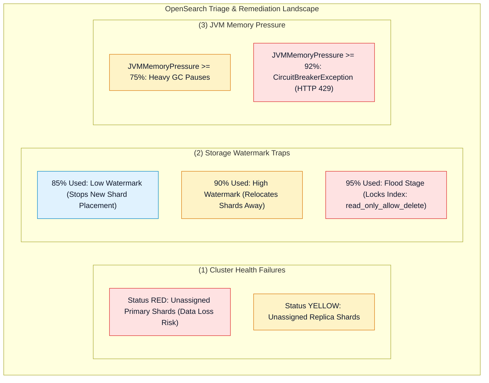
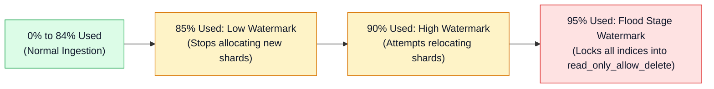

# 🔧 Amazon OpenSearch Troubleshooting & Performance Tuning

- **Category**: Analytics / Production Troubleshooting & Cluster Optimization
- **Language / ဘာသာစကား**: **English (Original)** | [မြန်မာဘာသာ (Burmese)](/mm/02-services/analytics-streaming/opensearch/opensearch-troubleshooting-and-tuning)
- **Primary Use Case**: Diagnosing Red and Yellow cluster health, resolving disk watermark write blocks (`read_only_allow_delete`), clearing JVM memory pressure, and optimizing bulk indexing throughput.
- **Slide Reference**: Pages 460–478 in `[[AWSCertifiedDataEngineerSlides.pdf]]`
- **Hub Links**: `[[index]]` | `[[opensearch]]` | `[[opensearch-cluster-architecture]]` | `[[opensearch-security-and-monitoring]]`

---

## 1. High-Level Summary

Troubleshooting Amazon OpenSearch Service requires methodical diagnosis across **Cluster Health States** (Green, Yellow, Red), **Storage Watermark Thresholds** (Low 85%, High 90%, Flood Stage 95%), and **JVM Memory Pressures** (Heap limits, Fielddata cache, Circuit Breakers).

Mastering these troubleshooting pathways and bulk indexing optimizations is essential for high performance on the **DEA-C01** exam.



---

## 2. Cluster Health Status: Red vs. Yellow Triage

| Cluster Status | Technical Definition | Common Root Causes | Immediate Diagnostic & Remediation Steps |
| :--- | :--- | :--- | :--- |
| **GREEN** | All primary and replica shards are successfully allocated across active nodes. | Healthy normal operating state. | None. |
| **YELLOW** | All **primary shards** are allocated, but **one or more replica shards** cannot be assigned. | 1. A data node crashed in an AZ.<br/>2. Number of replicas exceeds available data nodes.<br/>3. Target nodes hit disk watermarks. | Run `GET /_cluster/allocation/explain` to identify the blocking reason. Add data nodes or reduce `number_of_replicas`. |
| **RED** | At least one **primary shard** is completely unassigned and offline. | 1. Multiple simultaneous node failures.<br/>2. Disk hardware corruption.<br/>3. Unrecoverable index corruption during heavy write burst. | **Urgent**. Restore the damaged index from the latest automated S3 snapshot using the Snapshot Restore API (`POST /_snapshot/cs-automated/...`). |

---

## 3. Storage Watermarks & The `read_only_allow_delete` Block

OpenSearch enforces three progressive disk storage watermarks on every data node:



### How to Recover from a Flood Stage Lock:
When disk space hits 95%, OpenSearch enforces `index.blocks.read_only_allow_delete: true` across all indices, rejecting all new document writes with `ClusterBlockException`.

**Recovery Workflow**:
1. **Free Disk Space**: Delete expired indices or increase EBS volume storage per node in the AWS Console.
2. **Remove the Read-Only Lock**:
   ```json
   PUT /*/_settings
   {
     "index.blocks.read_only_allow_delete": null
   }
   ```

---

## 4. Resolving JVM Memory Pressure & Circuit Breakers

When CloudWatch metric **`JVMMemoryPressure`** exceeds **92%**, OpenSearch trips its **Parent Circuit Breaker**, immediately aborting memory-intensive operations and rejecting writes with **`HTTP 429 (Too Many Requests)`**.

### Root Causes & Remediation:
1. **Aggregating on Analyzed `text` Fields**:
   - Aggregating on `text` fields loads massive string dictionaries into uncompressed **Fielddata heap cache**.
   - *Fix*: Change index mappings so aggregated fields use the **`keyword`** data type (which uses disk-backed **Doc Values** instead of JVM heap).
2. **Deep Pagination**:
   - Using high `from + size` (e.g. `from: 50000`) forces nodes to sort millions of documents in JVM memory.
   - *Fix*: Use the **`search_after`** parameter or the **Point in Time (PIT)** Scroll API for deep pagination.
3. **Over-Sharding**:
   - Thousands of tiny shards consume cluster metadata and Lucene segment heap.
   - *Fix*: Consolidate shards to maintain $\le 20$ shards per 1 GB of JVM heap.

---

## 5. Bulk Indexing Performance Optimization

To achieve maximum write throughput during historical data loads or batch ingestion:

| Tuning Parameter | Bulk Load Setting | Rationale |
| :--- | :--- | :--- |
| **`refresh_interval`** | **`-1`** (or `60s`) | Disables automatic 1-second Lucene segment flushes, reducing I/O and merge overhead by up to 40%. (Reset to `1s` after load). |
| **`number_of_replicas`** | **`0`** | Avoids synchronous multi-AZ network replication during initial ingestion. (Increase to `1` after bulk load completes). |
| **Batch Payload Size** | **5 MB – 15 MB** per `_bulk` call | Optimal HTTP payload size balancing network latency and JVM buffer allocations. |
| **Auto-Generated IDs** | Use OpenSearch-generated IDs | Providing custom document IDs forces OpenSearch to perform a primary key lookup before write to prevent duplicates, degrading write speed. |

---

## 6. Master Troubleshooting Cheat Sheet

| Issue / Error Code | Root Cause | Immediate Action | Architectural Solution |
| :--- | :--- | :--- | :--- |
| `ClusterBlockException` (`read_only_allow_delete`) | Data node reached **95% disk usage**. | Delete unused indices; reset `read_only_allow_delete: null`. | Scale up EBS storage or enable **Index State Management (ISM)** to move data to UltraWarm. |
| `ClusterStatus.red > 0` | Missing/corrupt primary shard. | Check `GET /_cluster/allocation/explain`. | Restore corrupted index from automated S3 snapshot. |
| `ClusterStatus.yellow > 0` | Replica shard unassigned. | Check data node distribution across AZs. | Ensure sufficient data nodes exist in each Availability Zone. |
| `CircuitBreakingException` / `HTTP 429` | `JVMMemoryPressure >= 92%`. | Cancel heavy search queries; pause producer bulk streams. | Switch text aggregations to `keyword` (Doc Values); scale up memory-optimized nodes (`r6g`). |
| Ingestion timeouts during bulk loading | `refresh_interval` set to default 1s. | Set `refresh_interval: -1` and `number_of_replicas: 0`. | Optimize bulk batch size to 5–15 MB per request. |

---

## 7. DEA-C01 Exam Essentials

> [!IMPORTANT]
> **Key Exam Decision Triggers for OpenSearch Troubleshooting & Tuning**:
>
> - **"Cluster status turned YELLOW after an Availability Zone disruption"** $\rightarrow$ All **primary shards** are operational, but **replica shards** could not be placed in the remaining AZs.
> - **"Writes failing because index entered `read_only_allow_delete` mode"** $\rightarrow$ The data node exceeded the **95% Flood Stage Watermark**. Resolve by expanding disk storage and setting `index.blocks.read_only_allow_delete: null`.
> - **"Optimize cluster for a massive 10 TB one-time historical dataset load"** $\rightarrow$ Set **`refresh_interval: -1`** and **`number_of_replicas: 0`** before loading, then re-enable after completion.
> - **"High JVM Memory Pressure caused by aggregations"** $\rightarrow$ Migrate aggregations from `text` fields to **`keyword` fields** to utilize disk-based **Doc Values**.

---

## 📌 Related Notes
- `[[opensearch]]` — OpenSearch Master Hub
- `[[opensearch-cluster-architecture]]` — Primary & Replica Shards
- `[[opensearch-storage-tiers-and-ism]]` — UltraWarm & Cold Lifecycle
- `[[opensearch-security-and-monitoring]]` — CloudWatch Metrics & Alarms
