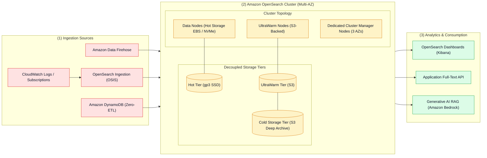
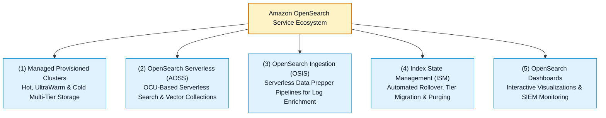

# 🔍 Amazon OpenSearch Service Hub

- **Category**: Analytics / Distributed Search, Log Analytics & Vector Search
- **Language / ဘာသာစကား**: **English (Original)** | [မြန်မာဘာသာ (Burmese)](/mm/02-services/analytics-streaming/opensearch/opensearch)
- **Primary Use Case**: Managed distributed Lucene search engine for real-time application monitoring, operational log analytics, interactive full-text search, and AI/ML vector similarity search.
- **Slide Reference**: Pages 460–478 in `[AWSCertifiedDataEngineerSlides.pdf](/docs/AWSCertifiedDataEngineerSlides.pdf)`
- **Hub Links**: `[[index]]` | `[[service-catalog]]` | `[[domain-2-data-store-management]]` | `[[kinesis-firehose]]` | `[[cloudwatch-and-eventbridge]]`

---

## 1. High-Level Summary

**Amazon OpenSearch Service** (the open-source successor to Amazon Elasticsearch Service) is a fully managed search and analytics suite powered by Apache Lucene. It enables organizations to perform real-time search, interactive log analytics, infrastructure observability, security information and event management (SIEM), and vector search for generative AI applications.

Amazon OpenSearch Service eliminates the administrative complexity of node provisioning, hardware maintenance, software patching, cluster failovers, and index lifecycle backups.

---

## 2. Amazon OpenSearch Deployment Models

Amazon OpenSearch provides two deployment models depending on operational requirements and workload predictability:

| Dimension | Amazon OpenSearch Managed Cluster | Amazon OpenSearch Serverless (AOSS) |
| :--- | :--- | :--- |
| **Capacity Management** | Explicit node instance types (`m6g.xlarge.search`, `r6g.2xlarge.search`), dedicated managers, and data node counts. | Zero instance sizing. Automatically provisions and scales **OpenSearch Compute Units (OCUs)**. |
| **Storage Architecture** | Multi-tier: **Hot Tier** (EBS/NVMe), **UltraWarm** (S3), and **Cold Storage** (archived S3). | Cloud-native decoupled architecture directly reading/writing to Amazon S3. |
| **Use Cases** | Heavy 24/7 logging, fine-tuned JVM configurations, strict index state management (ISM) policies, and legacy Elasticsearch migrations. | Unpredictable, spiky, or intermittent search workloads, time-series logging, and serverless vector search. |
| **Minimum Footprint** | Fixed hourly cost for provisioned EC2 nodes and EBS volumes. | Scales to 0 or fractional OCUs (minimum baseline billing applies per active collection). |
| **Access Control** | Fine-Grained Access Control (FGAC), internal user database, SAML, Cognito, IAM. | Data access policies, network policies, and encryption policies via AWS IAM. |

---

## 3. The Core OpenSearch Ecosystem

---

## 4. Modular OpenSearch Deep-Dive Topics

To master Amazon OpenSearch for the **AWS Certified Data Engineer - Associate (DEA-C01)** exam, study the following modular notes:

1. `[[opensearch-cluster-architecture]]` — **Cluster Manager Nodes, Data Nodes, Indices, Primary & Replica Shards, and Sizing Rules**
2. `[[opensearch-storage-tiers-and-ism]]` — **Hot, UltraWarm, Cold, Frozen Storage & Index State Management (ISM) Policies**
3. `[[opensearch-serverless]]` — **OpenSearch Serverless (AOSS), OCUs, Collection Types (Search, Time-Series, Vector) & Security Policies**
4. `[[opensearch-ingestion-and-pipelines]]` — **OpenSearch Ingestion (OSIS), Data Prepper, Firehose Direct Delivery & DynamoDB Zero-ETL**
5. `[[opensearch-security-and-monitoring]]` — **Fine-Grained Access Control (FGAC), Document/Field-Level Security, Cognito Dashboards, KMS & TLS**
6. `[[opensearch-troubleshooting-and-tuning]]` — **Red/Yellow/Green Cluster Health, Disk Watermarks, JVM Memory Pressure, Circuit Breakers & Bulk Load Tuning**
7. `[[opensearch-architecture-and-patterns]]` — **End-to-End Log Analytics, Vector Search / RAG, and OpenSearch vs. Athena vs. CloudWatch Insights Decision Matrix**

---

## 5. DEA-C01 Exam Essentials

> [!IMPORTANT]
> **Key Exam Rules for Amazon OpenSearch Service**:
>
> - **Primary Analytical Role**: OpenSearch is the primary AWS service for **sub-second keyword text search**, **log aggregation**, and **vector similarity search**. (For ad-hoc SQL on S3 data lakes, choose **Amazon Athena**; for multi-terabyte data warehousing, choose **Amazon Redshift**).
> - **Cost-Effective Historical Logs**: When retaining months of logs in OpenSearch with interactive query capabilities, move historical indices to **UltraWarm Storage** (backed by S3) using **Index State Management (ISM)**.
> - **Cluster Resilience**: Always deploy **3 Dedicated Cluster Manager nodes** across 3 Availability Zones with **1 replica shard** per primary shard to guarantee high availability without split-brain risk.
> - **Serverless Ingestion**: Use **OpenSearch Ingestion (OSIS)** to filter, aggregate, and redact sensitive PII fields before indexing data into OpenSearch.

---

## 📌 Related Notes
- `[[opensearch-cluster-architecture]]` — Sharding, Node Sizing & Resilience
- `[[opensearch-storage-tiers-and-ism]]` — UltraWarm & Index State Management
- `[[opensearch-serverless]]` — Serverless Collections & OCUs
- `[[kinesis-firehose]]` — Streaming Delivery to OpenSearch Destination
- `[[cloudwatch-and-eventbridge]]` — CloudWatch Subscription Filters
