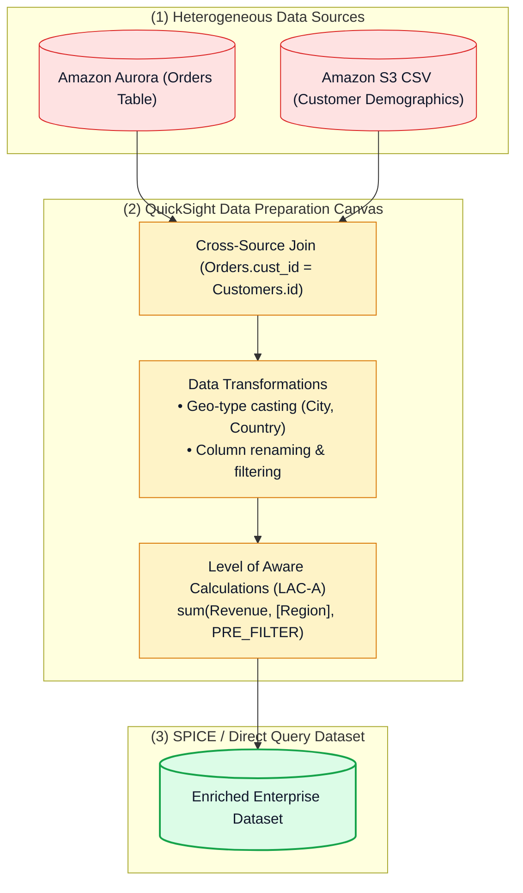
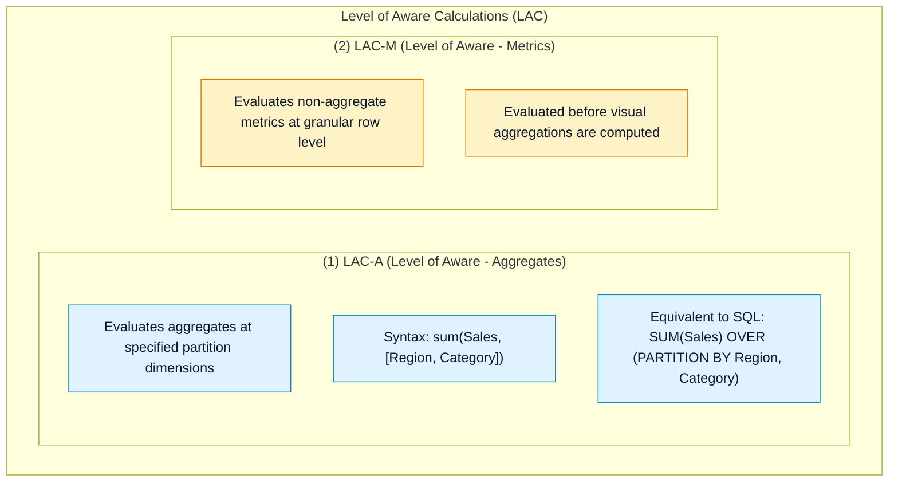
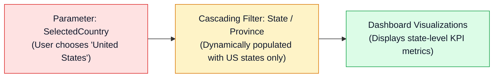

# 📐 Amazon QuickSight Data Preparation, Modeling & Level of Aware Calculations (LAC)

- **Category**: Analytics / Semantic Data Modeling & Advanced Business Calculations
- **Language / ဘာသာစကား**: **English (Original)** | [မြန်မာဘာသာ (Burmese)](/mm/02-services/analytics-streaming/quicksight/quicksight-data-preparation-and-modeling)
- **Primary Use Case**: Combining cross-source datasets, creating Custom SQL queries, building advanced Level of Aware Calculations (LAC-A / LAC-M), and configuring dynamic cascading filters.
- **Slide Reference**: Pages 479–498 in `[AWSCertifiedDataEngineerSlides.pdf](/docs/AWSCertifiedDataEngineerSlides.pdf)`
- **Hub Links**: `[[index]]` | `[[quicksight]]` | `[[quicksight-spice-engine]]` | `[[athena]]` | `[[rds-and-aurora]]`

---

## 1. High-Level Summary

Data Preparation in Amazon QuickSight allows data engineers to clean, transform, join, and enrich raw data from disparate operational and analytical sources into business-ready **Datasets**.

For the **DEA-C01** exam, you must master **cross-data-source joins**, data type casting, parameter-driven dynamic controls, and **Level of Aware Calculations (LAC-A and LAC-M)**, which allow calculations to run at independent levels of granularity from the visual canvas (analogous to SQL window functions).

---

## 2. Multi-Table & Cross-Source Joins

Amazon QuickSight supports joining tables within the same database as well as **Cross-Data-Source Joins** (e.g. joining an Amazon S3 CSV manifest with an Amazon Redshift table):

| Join Type | Behavior | Common Data Engineering Use Case |
| :--- | :--- | :--- |
| **Inner Join** | Returns rows only when matching keys exist in both tables. | Filtering orders that only belong to verified active customers. |
| **Left Outer Join** (Default) | Returns all rows from the primary table and matching rows from the secondary table. | Showing all products, even those with zero current sales. |
| **Right Outer Join** | Returns all rows from the secondary table and matching rows from the primary table. | Reporting on regional targets including regions with no local staff. |
| **Full Outer Join** | Returns all rows from both tables, populating NULLs for non-matches. | Consolidated audit reporting across two merging enterprise systems. |

> [!TIP]
> **Cross-Source Join Optimization**: Cross-data-source joins are executed inside the **SPICE engine**. Both tables are ingested into SPICE memory where the join operation is computed with high parallelism.

---

## 3. Level of Aware Calculations (LAC) Deep Dive

In standard BI tools, calculations are tightly bound to the dimensions displayed in the visual. QuickSight solves complex multi-level aggregations using **Level of Aware Calculations (LAC)**:

### Calculation Evaluation Stages:
1. **`PRE_FILTER`**:
   - Computes the aggregate value **before** visual filters are applied.
   - *Example*: Calculating an item's percentage of total company sales regardless of what country filter the user selects:
     $$\text{Percent of Global Sales} = \frac{\text{sum(Sales)}}{\text{sum(Sales, [], PRE\_FILTER)}}$$
2. **`PRE_AGG`**:
   - Computes the aggregate value **before** visual-level groupings are applied, but **after** dataset filters.
   - *Example*: Finding total customer lifetime spend before grouping by product category in a chart:
     $$\text{Customer Lifetime Spend} = \text{sum(Sales, [CustomerId], PRE\_AGG)}$$
3. **`POST_AGG`** (Default):
   - Computes after visual aggregations and visual filters have executed.

---

## 4. Parameters, Controls & Cascading Filters

1. **Parameters**: Named variables that can store single values, multiple values, or dynamic defaults based on user login. Parameters can be bound to **Controls** (dropdown lists, sliders, text boxes) and referenced in calculated fields.
2. **Cascading Filters**: Configuring filter dependencies so that selecting a value in a parent filter (e.g. `Country = Canada`) automatically restricts the available selectable options in child filters (e.g. `Province = Ontario, Quebec, BC`).

---

## 5. DEA-C01 Exam Essentials

> [!IMPORTANT]
> **Key Exam Decision Triggers for Data Preparation & Modeling**:
>
> - **"Calculate Market Share percentage that remains accurate even when users apply visual filters on specific product lines"** $\rightarrow$ Use **LAC-A with `PRE_FILTER`** (e.g. `sum(Sales) / sum(Sales, [], PRE_FILTER)`).
> - **"Combine transactional customer data in RDS with demographic survey files in S3"** $\rightarrow$ Build a **Cross-Data-Source Left Outer Join** in QuickSight Dataset preparation backed by **SPICE**.
> - **"Make dropdown filter options dynamically change based on a previous dropdown selection"** $\rightarrow$ Configure **Cascading Filters** in the Analysis Controls panel.
> - **"SQL Window Function Equivalence"** $\rightarrow$ When an exam question requires `SUM() OVER (PARTITION BY ...)` functionality in QuickSight, choose **Level of Aware Calculations (LAC-A)**.

---

## 📌 Related Notes
- `[[quicksight]]` — QuickSight Master Hub
- `[[quicksight-spice-engine]]` — SPICE In-Memory Engine
- `[[athena]]` — Querying S3 Datasets
- `[[rds-and-aurora]]` — Relational Sources for QuickSight
