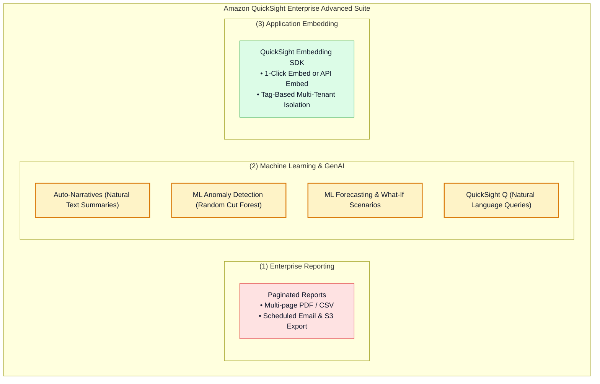
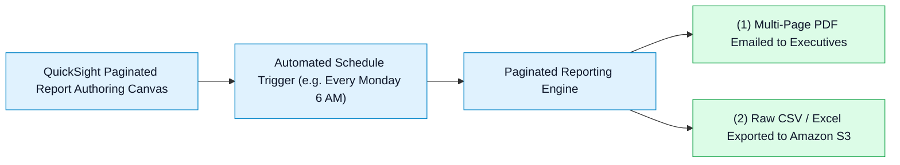
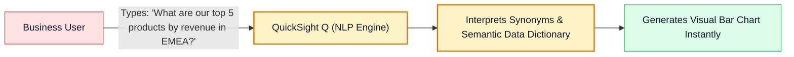
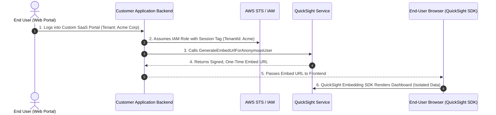

# 🚀 Amazon QuickSight Paginated Reports, ML Insights, Generative Q & Embedded Analytics

- **Category**: Analytics / Automated Reporting, Machine Learning & Embedded BI
- **Language / ဘာသာစကား**: **English (Original)** | [မြန်မာဘာသာ (Burmese)](/mm/02-services/analytics-streaming/quicksight/quicksight-reporting-ml-and-embedding)
- **Primary Use Case**: Generating scheduled multi-page executive PDF reports, leveraging ML-powered anomaly detection and forecasting, natural language querying with QuickSight Q, and embedding dashboards into custom web applications.
- **Slide Reference**: Pages 479–498 in `[[AWSCertifiedDataEngineerSlides.pdf]]`
- **Hub Links**: `[[index]]` | `[[quicksight]]` | `[[quicksight-security-rls-and-governance]]` | `[[s3]]`

---

## 1. High-Level Summary

Beyond interactive visual dashboards, Amazon QuickSight provides enterprise-grade capabilities across **Pixel-Perfect Paginated Reporting**, **Automated ML Insights** (Anomaly Detection and Forecasting), **Generative Natural Language BI (QuickSight Q)**, and **Embedded Analytics**.

For the **DEA-C01** exam, you must understand how these capabilities are configured, how ML models identify anomalies in time-series data without data science expertise, and how to embed dashboards into external portals securely.

---

## 2. Paginated Reports

While standard dashboards are optimized for interactive browser exploration on a single screen, **Paginated Reports** are designed for printed, multi-page, formatted documents:

### Key Capabilities:
- **Pixel-Perfect Formatting**: Define custom page headers, footers, page breaks, and repeatable table rows that cleanly span multiple pages.
- **Automated Distribution**: Deliver scheduled PDF reports via email to thousands of recipients (even users without QuickSight accounts) or export files directly to an Amazon S3 bucket for compliance archiving.

---

## 3. ML Insights & Anomaly Detection

Amazon QuickSight includes built-in machine learning capabilities that run directly on your SPICE datasets without requiring Amazon SageMaker or custom machine learning pipelines:

| ML Insight Feature | Underlying Technology | Business / Data Engineering Use Case |
| :--- | :--- | :--- |
| **Auto-Narratives** | Natural Language Generation (NLG). | Generates dynamic text interpretations of visual metrics (e.g. *"Revenue grew by 14% week-over-week driven by Enterprise deals"*). |
| **ML Anomaly Detection** | Random Cut Forest (RCF) algorithm. | Continuously scans up to millions of metric metrics/dimensions to discover unexpected spikes, dips, or outliers in sales, server latency, or web traffic. |
| **ML Forecasting** | Random Cut Forest & time-series models. | Projects future metric trajectories with selectable confidence intervals ($90\%, 95\%$) while excluding seasonal anomalies. |
| **What-If Analysis** | Scenario modeling. | Interactively simulates hypothetical business outcomes (e.g. *"What if logistics costs drop by 8% in Q4?"*). |

---

## 4. Generative BI: Amazon QuickSight Q

**Amazon QuickSight Q** is a machine learning-powered natural language query engine that allows business users to ask plain-English questions about their data and receive instant, interactive charts:

- **Q Topics**: Data engineers build structured **Topics** from datasets, configuring business synonyms (e.g., mapping *"revenue"*, *"sales"*, and *"turnover"* to the `gross_revenue` column).
- Eliminates the need for BI teams to build hundreds of one-off custom visual reports for ad-hoc business inquiries.

---

## 5. Embedded Analytics in Custom Applications

Amazon QuickSight enables developers to embed interactive dashboards, individual visual charts, or the QuickSight Q natural language search bar directly into custom web applications:

---

## 6. DEA-C01 Exam Essentials

> [!IMPORTANT]
> **Key Exam Decision Triggers for Reporting, ML & Embedding**:
>
> - **"Send weekly scheduled multi-page PDF financial summaries to corporate executives via email"** $\rightarrow$ Configure **QuickSight Paginated Reports**.
> - **"Automatically detect unexpected revenue dips across thousands of products without writing Python machine learning models"** $\rightarrow$ Enable **QuickSight ML Anomaly Detection**.
> - **"Allow non-technical business users to ask ad-hoc questions like 'Show total sales in Asia last quarter' and receive instant visuals"** $\rightarrow$ Deploy **Amazon QuickSight Q**.
> - **"Embed dashboards into an external multi-tenant portal where anonymous users only see their own company data"** $\rightarrow$ Use the **QuickSight Embedding SDK** with `GenerateEmbedUrlForAnonymousUser` and **Tag-Based Row-Level Security (RLS)**.

---

## 📌 Related Notes
- `[[quicksight]]` — QuickSight Master Hub
- `[[quicksight-spice-engine]]` — SPICE In-Memory Acceleration
- `[[quicksight-security-rls-and-governance]]` — Tag-Based RLS for Multi-Tenant Embedding
- `[[s3]]` — S3 Export Target for Paginated Reports
