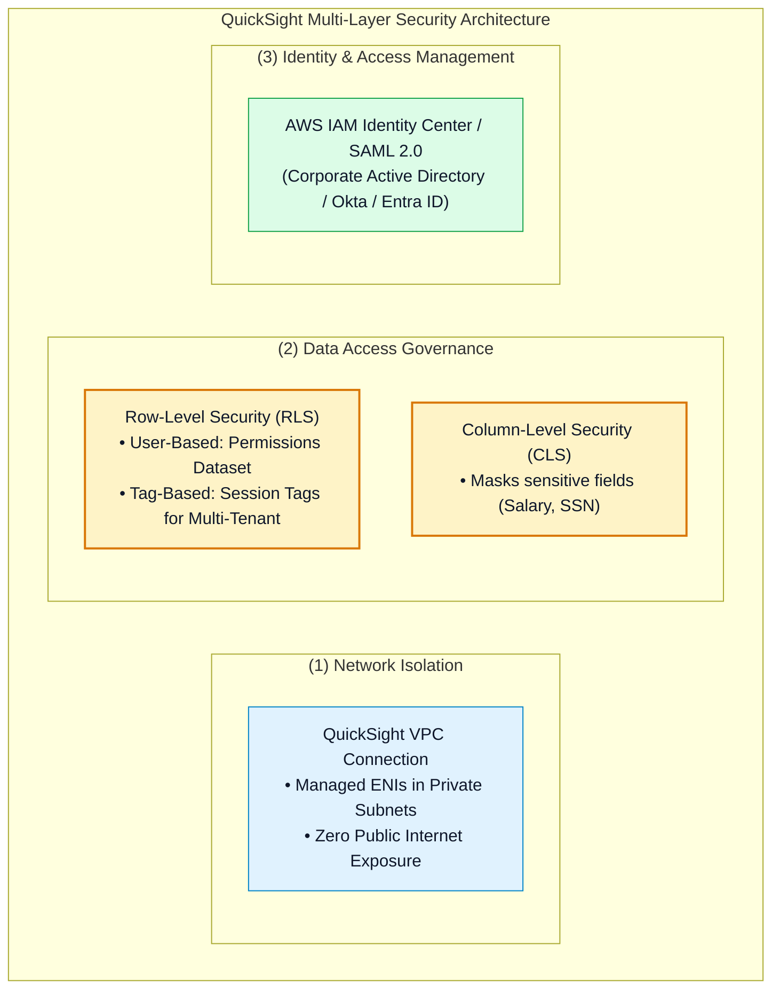
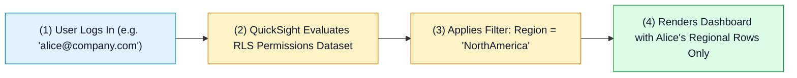
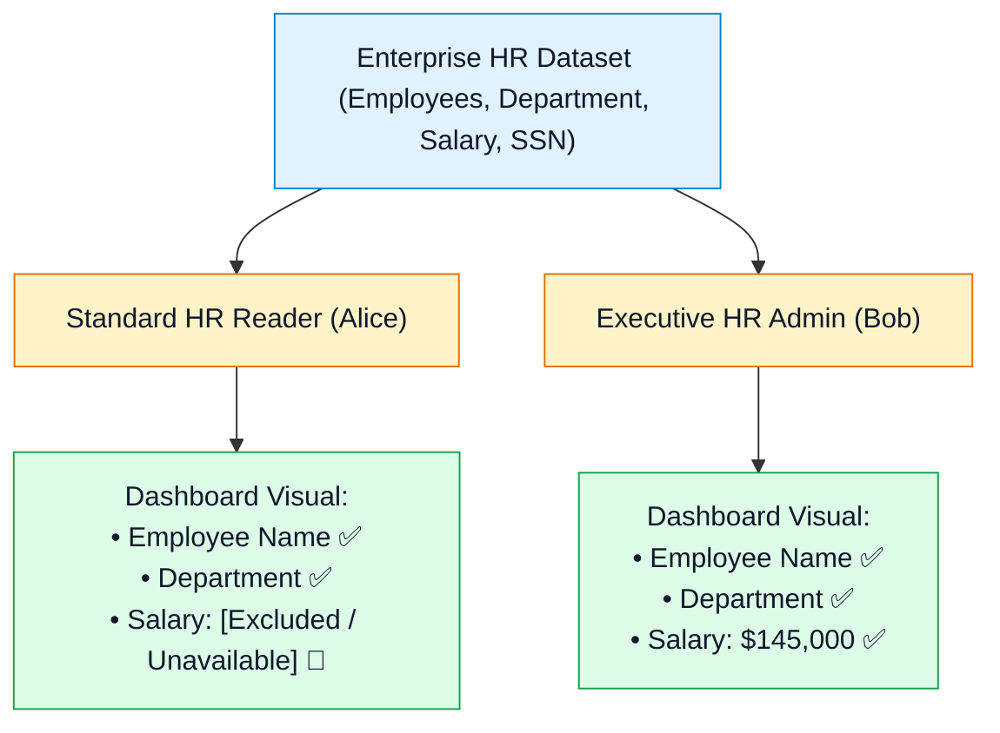
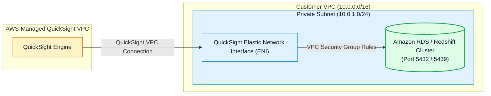

# 🛡️ Amazon QuickSight Security, Row/Column-Level Security (RLS/CLS) & VPC Governance

- **Category**: Analytics / Governance, Multi-Tenant Security & Network Isolation
- **Language / ဘာသာစကား**: **English (Original)** | [မြန်မာဘာသာ (Burmese)](/mm/02-services/analytics-streaming/quicksight/quicksight-security-rls-and-governance)
- **Primary Use Case**: Restricting dashboard rows and columns based on user identity (RLS & CLS), connecting to private databases via QuickSight VPC connections, and managing enterprise SSO with IAM Identity Center.
- **Slide Reference**: Pages 479–498 in `[AWSCertifiedDataEngineerSlides.pdf](/docs/AWSCertifiedDataEngineerSlides.pdf)`
- **Hub Links**: `[[en/index|index]]` | `[[en/02-services/analytics-streaming/quicksight/quicksight|quicksight]]` | `[[en/02-services/database/redshift|redshift]]` | `[[en/02-services/database/rds-and-aurora|rds-and-aurora]]` | `[[en/01-domains/domain-3-data-operations-and-support|domain-3-data-operations-and-support]]`

---

## 1. High-Level Summary

Enterprise business intelligence requires strict data governance to ensure users only access the exact subset of records and attributes authorized for their role.

Amazon QuickSight provides multi-layered governance through **User-Based Row-Level Security (RLS)**, **Tag-Based RLS for Multi-Tenant Embedding**, **Column-Level Security (CLS)** to mask PII, and **Amazon QuickSight VPC Connections** to query private databases without internet exposure.

---

## 2. Row-Level Security (RLS) Deep Dive

Row-Level Security restricts the rows of data visible to a user or group when viewing an analysis or dashboard:

### 1. User-Based RLS (Permissions Dataset)
You create a dedicated permissions dataset containing `UserName` or `GroupName` columns alongside data filter columns:

| UserName | GroupName | Region | Segment |
| :--- | :--- | :--- | :--- |
| `alice` | | `NorthAmerica` | `Enterprise` |
| `bob` | | `EMEA` | |
| | `SalesLeadership` | | |

- **Alice**: Sees only records where `Region = 'NorthAmerica'` AND `Segment = 'Enterprise'`.
- **Bob**: Sees all segments for `Region = 'EMEA'` (leaving `Segment` blank matches all segments).
- **SalesLeadership Group**: Sees all regions and all segments (unrestricted access).

---

### 2. Tag-Based RLS (for Multi-Tenant Embedded Analytics)
When embedding dashboards into customer-facing SaaS applications:
- Avoid creating thousands of individual QuickSight user accounts.
- Use **AWS STS Session Tags** (e.g. `TenantId: Customer_A`) passed during `GenerateEmbedUrlForRegisteredUser` or `GenerateEmbedUrlForAnonymousUser` API calls.
- QuickSight dynamically filters dataset rows matching the session tag.

---

## 3. Column-Level Security (CLS)

**Column-Level Security (CLS)** restricts access to specific sensitive columns within a dataset:

- You configure CLS on the dataset edit screen by selecting sensitive fields (e.g. `Salary`, `SocialSecurityNumber`) and assigning them to an authorized IAM / QuickSight group (`ExecutiveLeadership`).
- Unauthorized users can still view the dashboard, but protected columns are omitted from queries and visual calculations without breaking dashboard rendering.

---

## 4. Private VPC Connections for Database Ingestion

By default, Amazon QuickSight runs inside an AWS-managed service VPC. If your Amazon RDS, Aurora, or Redshift clusters are located in **private subnets with no public internet access**, QuickSight cannot connect over public IPs.

### Configuration Steps:
1. Create a **QuickSight VPC Connection** specifying the VPC ID, Subnet IDs, and Security Group.
2. QuickSight provisions dedicated **Elastic Network Interfaces (ENIs)** in your private subnets.
3. Configure the database Security Group to allow inbound traffic from the QuickSight Security Group on the database port.

---

## 5. DEA-C01 Exam Essentials

> [!IMPORTANT]
> **Key Exam Decision Triggers for QuickSight Security**:
>
> - **"Ensure sales managers can only view sales data for their specific region on a shared enterprise dashboard"** $\rightarrow$ Configure **User-Based Row-Level Security (RLS)** with a permissions dataset.
> - **"Embed dashboards into a multi-tenant SaaS portal where external tenants must only see their own company data without individual IAM logins"** $\rightarrow$ Implement **Tag-Based Row-Level Security (RLS)** using STS session tags.
> - **"Prevent unauthorized financial analysts from seeing employee salary figures in a shared dataset"** $\rightarrow$ Enable **Column-Level Security (CLS)** on the `Salary` field.
> - **"QuickSight fails to connect to an Amazon RDS PostgreSQL instance in a private subnet"** $\rightarrow$ Create an **Amazon QuickSight VPC Connection** and verify security group ingress rules on port 5432.

---

## 📌 Related Notes
- `[[en/02-services/analytics-streaming/quicksight/quicksight|quicksight]]` — QuickSight Master Hub
- `[[en/02-services/analytics-streaming/quicksight/quicksight-spice-engine|quicksight-spice-engine]]` — SPICE In-Memory Engine
- `[[en/02-services/database/redshift|redshift]]` — Securing Amazon Redshift Clusters
- `[[en/02-services/database/rds-and-aurora|rds-and-aurora]]` — Private VPC Database Connectivity
