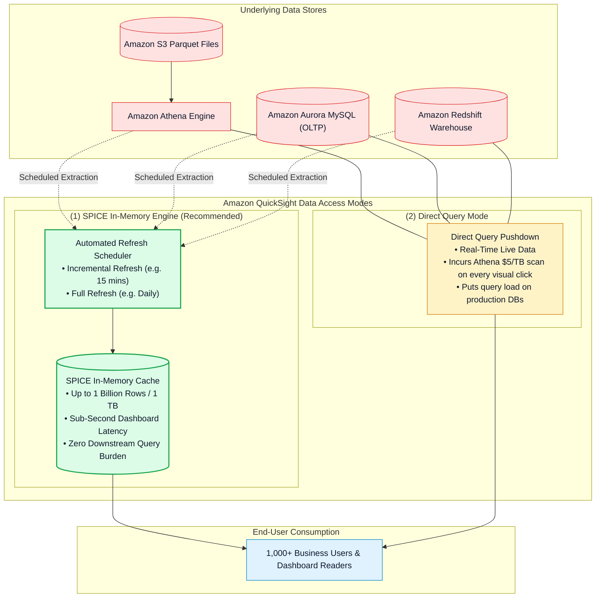
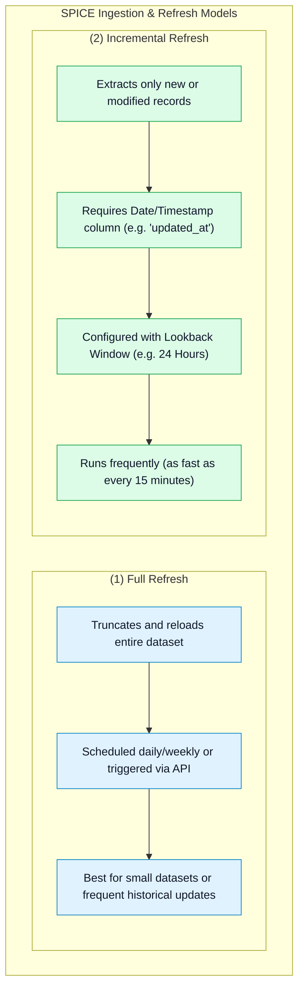
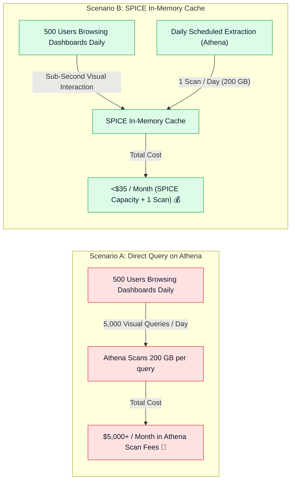

# ⚡ Amazon QuickSight SPICE In-Memory Engine, Refresh Strategies & Cost Optimization

- **Category**: Analytics / High-Performance In-Memory Analytics & Query Caching
- **Language / ဘာသာစကား**: **English (Original)** | [မြန်မာဘာသာ (Burmese)](/mm/02-services/analytics-streaming/quicksight/quicksight-spice-engine)
- **Primary Use Case**: Accelerating dashboard queries to sub-second speeds, configuring Full vs. Incremental SPICE refreshes, and drastically reducing Amazon Athena and database scan costs.
- **Slide Reference**: Pages 479–498 in `[[AWSCertifiedDataEngineerSlides.pdf]]`
- **Hub Links**: `[[index]]` | `[[quicksight]]` | `[[athena]]` | `[[redshift]]` | `[[rds-and-aurora]]`

---

## 1. High-Level Summary

**SPICE (Superfast, Parallel, In-memory Calculation Engine)** is Amazon QuickSight's columnar, in-memory data store engineered to deliver sub-second response times for complex aggregations, filters, and pivot tables across hundreds of millions of records.

For the **DEA-C01** exam, understanding when to use **SPICE vs. Direct Query**, how to configure **Incremental Refresh with a Lookback Window**, and how SPICE dramatically slashes **Athena data scanning costs** is a critical architectural skill.



---

## 2. SPICE vs. Direct Query Mode Comparison Matrix

| Evaluation Dimension | SPICE (In-Memory Mode) | Direct Query Mode |
| :--- | :--- | :--- |
| **Query Latency** | **Sub-second** ($< 500\text{ ms}$) consistently. | Seconds to minutes (bounded by underlying database/Athena engine). |
| **Data Freshness** | As fresh as the last scheduled or API refresh (e.g. 15 mins / hourly). | **100% real-time live** data from source database. |
| **Downstream Impact** | **Zero impact** on source database during user browsing. | Every visual click/filter executes a live query on the source database. |
| **Athena Cost Impact** | **Fixed, low cost**. Scans data only during scheduled ingestion. | **Extremely expensive**. Every dashboard reload or filter change scans data at **\$5 per TB**. |
| **Maximum Dataset Size** | Up to **1 Billion rows (or 1 TB)** per dataset (Enterprise Edition). | Unlimited (constrained only by the source database capacity). |
| **Best Used For** | Fast interactive dashboards, executive KPI reports, shielding OLTP databases, and S3 data lakes. | Strict real-time operational monitoring, datasets exceeding 1 TB, or pre-optimized Redshift clusters. |

---

## 3. SPICE Refresh Strategies



### 1. Incremental Refresh Mechanics:
- **Timestamp Field Requirement**: The source dataset must contain a `date` or `timestamp` column (e.g. `order_timestamp` or `last_modified_date`).
- **Lookback Window**: QuickSight pulls records from `current_time - lookback_window`.
  - *Example*: A lookback window of **24 hours** ensures that any delayed order status updates (or late-arriving CDC records) within the past 24 hours are updated in SPICE without needing a full multi-gigabyte table scan.

### 2. Event-Driven Programmatic Refresh:
Instead of static clock schedules, modern data engineering pipelines trigger SPICE refreshes immediately upon ETL job completion using the AWS SDK / boto3 API:
```python
import boto3

quicksight = boto3.client('quicksight')

response = quicksight.create_ingestion(
    DataSetId='orders-dataset-id',
    IngestionId='ingest-job-2026-08-19-01',
    AwsAccountId='123456789012',
    IngestionType='INCREMENTAL_REFRESH'  # or 'FULL_REFRESH'
)
```

---

## 4. Cost Optimization: Slashing Athena & Database Query Bills



### Cost Optimization Rules:
1. **Athena Scan Reduction**: Querying S3 data lakes directly with Athena from QuickSight can lead to runaway cloud bills because each visual filter change or page refresh issues a new SQL query scanning raw files. Importing the Athena table into **SPICE** isolates Athena scanning to scheduled ingestion intervals.
2. **Protecting Production Databases**: Direct Query sends unpredictable concurrent SQL queries to operational databases (Aurora/RDS). SPICE prevents analytical query contention on OLTP application workloads.

---

## 5. DEA-C01 Exam Essentials

> [!IMPORTANT]
> **Key Exam Decision Triggers for SPICE**:
>
> - **"Business analysts complain that dashboards querying an S3 data lake via Athena are slow and incurring huge scanning costs"** $\rightarrow$ Change dataset access mode from **Direct Query** to **SPICE**.
> - **"Frequently update a multi-million row SPICE dataset with newly arrived records without running a slow full reload"** $\rightarrow$ Configure **Incremental Refresh** on a timestamp column with a **Lookback Window**.
> - **"Refresh SPICE immediately after an AWS Glue ETL job finishes writing to S3"** $\rightarrow$ Call the **QuickSight `CreateIngestion` API** inside an AWS Step Functions state machine or Lambda function.
> - **"Enterprise Capacity Limit"** $\rightarrow$ SPICE supports up to **1 Billion rows (or 1 TB)** per dataset in Enterprise Edition.

---

## 📌 Related Notes
- `[[quicksight]]` — QuickSight Master Hub
- `[[quicksight-data-preparation-and-modeling]]` — Dataset Joins & Calculated Fields
- `[[athena]]` — Amazon Athena Query Engine
- `[[redshift]]` — Amazon Redshift Data Warehousing
- `[[glue-etl-jobs]]` — Orchestrating ETL Pipelines before SPICE Ingestion
