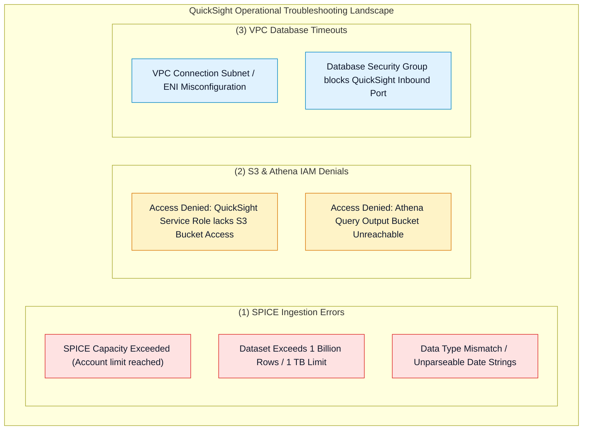
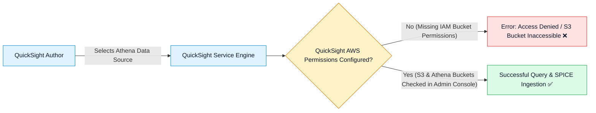
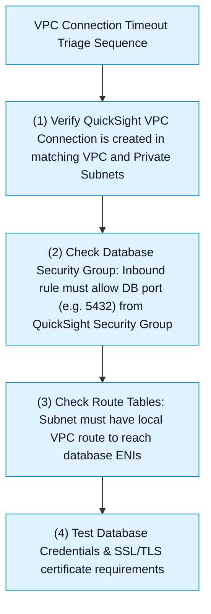

# 🔧 Amazon QuickSight Troubleshooting, Permissions & BI Architecture Patterns

- **Category**: Analytics / Production Troubleshooting, Permissions & BI System Design
- **Language / ဘာသာစကား**: **English (Original)** | [မြန်မာဘာသာ (Burmese)](/mm/02-services/analytics-streaming/quicksight/quicksight-troubleshooting-and-patterns)
- **Primary Use Case**: Resolving SPICE ingestion failures, diagnosing Amazon S3 and Athena IAM permission denials, fixing VPC database timeouts, and evaluating QuickSight against other analytical services.
- **Slide Reference**: Pages 479–498 in `[AWSCertifiedDataEngineerSlides.pdf](/docs/AWSCertifiedDataEngineerSlides.pdf)`
- **Hub Links**: `[[en/index|index]]` | `[[en/02-services/analytics-streaming/quicksight/quicksight|quicksight]]` | `[[en/02-services/analytics-streaming/quicksight/quicksight-spice-engine|quicksight-spice-engine]]` | `[[en/02-services/analytics-streaming/athena/athena|athena]]` | `[[en/02-services/database/redshift|redshift]]`

---

## 1. High-Level Summary

Operating Amazon QuickSight in production requires structured diagnostic workflows to handle **SPICE Capacity Exceeded Errors**, **S3 / Athena Access Denials**, and **VPC Security Group Timeouts**.

Mastering these common troubleshooting scenarios and understanding the AWS BI service decision matrix are critical for scoring high on the **DEA-C01** exam.

---

## 2. Resolving SPICE Ingestion Failures

### 1. `SPICE Capacity Exceeded`
- **Root Cause**: The total volume of datasets loaded into SPICE exceeds the purchased SPICE storage capacity for the AWS account / region.
- **Remediation**:
  1. *Immediate Action*: Purchase additional SPICE capacity in the **Manage QuickSight $\rightarrow$ SPICE Capacity** console (\$0.25/GB-month).
  2. *Architectural Remedy*: Edit the dataset to remove unused high-cardinality text columns, apply row-level filters to exclude historical records older than 2 years, or delete deprecated SPICE datasets.

---

### 2. `Dataset Size Exceeds Limit (1 Billion Rows / 1 TB)`
- **Root Cause**: A single dataset exceeds the hard limit of 1 Billion rows or 1 TB in QuickSight Enterprise Edition.
- **Remediation**:
  - Pre-aggregate the data upstream using **AWS Glue ETL** or **Amazon EMR (Spark)** before importing into QuickSight.
  - Or switch from SPICE to **Direct Query Mode** connected to Amazon Redshift or Snowflake.

---

## 3. Resolving S3 & Athena IAM Permission Denials

A very frequent issue on the DEA-C01 exam is when QuickSight fails to query an Athena table or S3 bucket with an `Access Denied` error:

### Resolution Steps:
1. Navigate to **Manage QuickSight** $\rightarrow$ **Security & Permissions**.
2. Under **QuickSight access to AWS services**, verify that **Amazon S3** and **Amazon Athena** are enabled.
3. Click **Select S3 Buckets** and explicitly grant QuickSight read access to the underlying data lake bucket AND write access to the **Athena query results staging bucket** (`s3://aws-athena-query-results-...`).

---

## 4. Diagnosing VPC Private Database Timeouts

When QuickSight attempts to connect to an Amazon RDS MySQL, PostgreSQL, or Amazon Redshift cluster located in a private VPC subnet and encounters a `Connection Timeout`:

---

## 5. Master Troubleshooting Cheat Sheet

| Symptom / Error Message | Root Cause | Immediate Remediation | Long-Term Architectural Fix |
| :--- | :--- | :--- | :--- |
| `SPICE capacity limit exceeded` | Account-level SPICE storage is full. | Purchase more SPICE capacity or delete old datasets. | Filter unnecessary columns/rows during data prep. |
| `S3 Access Denied / Bucket not found` | QuickSight service role lacks bucket IAM permissions. | In QuickSight Admin console, check the S3 bucket box. | Grant bucket permissions via QuickSight Security & Permissions settings. |
| `Athena query result bucket access denied` | QuickSight cannot write/read Athena staging bucket. | Grant QuickSight access to `aws-athena-query-results-*`. | Configure dedicated Athena workgroup output bucket. |
| `Connection timed out` (RDS / Redshift) | Security Group blocking QuickSight ENI. | Add inbound rule on DB Security Group allowing QuickSight SG. | Create and attach a managed QuickSight VPC Connection. |
| Dashboard visual displays `Unavailable` for some users | Column-Level Security (CLS) is active. | User is not a member of the authorized CLS group. | Expected behavior for restricted sensitive fields (PII/Salary). |

---

## 6. Definitive AWS BI & Reporting Decision Matrix

| Analytics Requirement | Amazon QuickSight | Amazon Athena | Amazon OpenSearch Dashboards | Amazon Redshift |
| :--- | :--- | :--- | :--- | :--- |
| **Primary Use Case** | Executive dashboards, SPICE BI, paginated reporting, RLS/CLS. | Ad-hoc serverless SQL queries on S3 data lakes. | Operational log visualization, infrastructure APM, SIEM. | Enterprise OLAP data warehousing & complex SQL joins. |
| **User Persona** | Business analysts, executive leadership, SaaS tenants. | Data engineers, SQL developers. | DevOps, SREs, security analysts. | BI engineers, enterprise data warehouse teams. |
| **Data Source Format** | SPICE in-memory or Direct Query to any database/lake. | Parquet, ORC, CSV, JSON, Iceberg in S3. | OpenSearch indices (JSON documents). | Relational columnar tables. |
| **Pricing Model** | Authors (\$18-\$24/mo), Readers (\$0.30/session max \$5/mo). | **\$5 per TB scanned**. | Included with OpenSearch cluster / Serverless OCU. | Provisioned node-hours or Serverless RPUs. |

---

## 7. DEA-C01 Exam Essentials

> [!IMPORTANT]
> **Key Exam Decision Triggers for QuickSight Troubleshooting & Design**:
>
> - **"Author cannot access an Athena table or S3 data lake from QuickSight due to access denied errors"** $\rightarrow$ Configure permissions in **Manage QuickSight $\rightarrow$ Security & Permissions** and check the S3 data and Athena result buckets.
> - **"QuickSight cannot connect to an Amazon Redshift cluster in a private VPC subnet"** $\rightarrow$ Create a **QuickSight VPC Connection** and update the Redshift security group to permit inbound traffic from the QuickSight security group on port **5439**.
> - **"Executive reporting requires automated pixel-perfect multi-page PDF delivery every Monday morning"** $\rightarrow$ Use **QuickSight Paginated Reports**.
> - **"BI Tool with Reader Pricing"** $\rightarrow$ QuickSight Reader sessions cost **\$0.30 per 30-minute session capped at \$5/month**, making it the most cost-effective solution for thousands of occasional dashboard viewers.

---

## 📌 Related Notes
- `[[en/02-services/analytics-streaming/quicksight/quicksight|quicksight]]` — QuickSight Master Hub
- `[[en/02-services/analytics-streaming/quicksight/quicksight-spice-engine|quicksight-spice-engine]]` — SPICE In-Memory Engine & Incremental Refresh
- `[[en/02-services/analytics-streaming/quicksight/quicksight-security-rls-and-governance|quicksight-security-rls-and-governance]]` — Row-Level & Column-Level Security
- `[[en/02-services/analytics-streaming/athena/athena|athena]]` — Amazon Athena Query Staging
- `[[en/02-services/database/redshift|redshift]]` — Amazon Redshift Architecture
