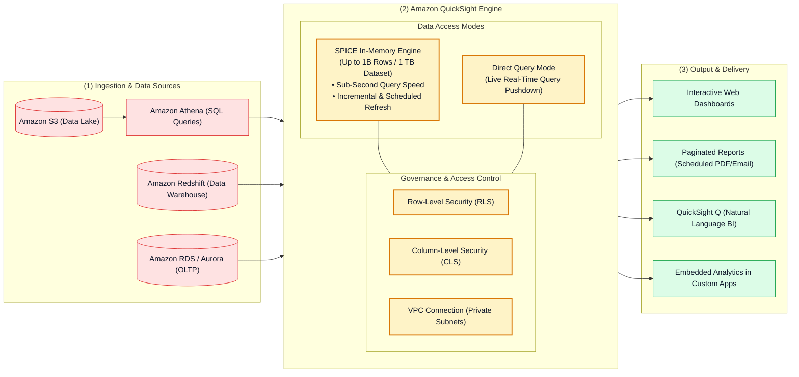
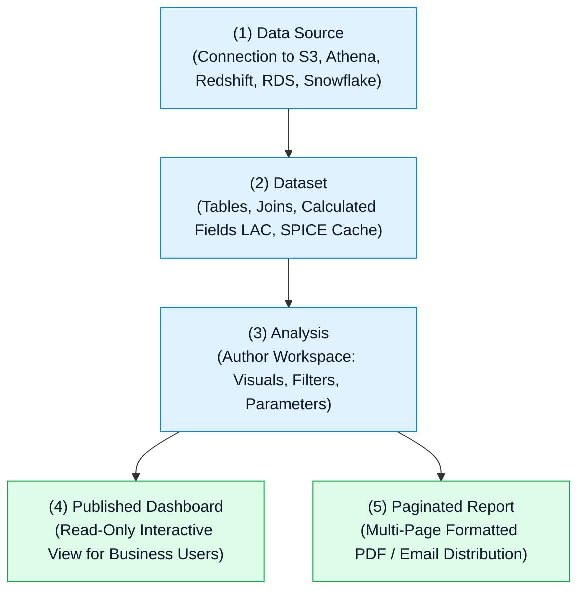

# 📊 Amazon QuickSight Hub (Cloud-Native Business Intelligence)

- **Category**: Analytics / Cloud Business Intelligence & Interactive Reporting
- **Language / ဘာသာစကား**: **English (Original)** | [မြန်မာဘာသာ (Burmese)](/mm/02-services/analytics-streaming/quicksight/quicksight)
- **Primary Use Case**: Serverless business intelligence, sub-second interactive dashboards, SPICE in-memory calculation engine, ML-powered anomaly detection, paginated executive reports, and embedded analytics.
- **Slide Reference**: Pages 479–498 in `[AWSCertifiedDataEngineerSlides.pdf](/docs/AWSCertifiedDataEngineerSlides.pdf)`
- **Hub Links**: `[[en/index|index]]` | `[[en/00-hub/service-catalog|service-catalog]]` | `[[en/01-domains/domain-3-data-operations-and-support|domain-3-data-operations-and-support]]` | `[[en/02-services/analytics-streaming/athena/athena|athena]]` | `[[en/02-services/database/redshift|redshift]]`

---

## 1. High-Level Summary

**Amazon QuickSight** is a cloud-native, serverless Business Intelligence (BI) service designed to deliver fast, interactive dashboards, ad-hoc data analysis, paginated PDF/CSV reports, and machine learning insights to thousands of concurrent users.

Amazon QuickSight eliminates server provisioning, licensing lock-ins, and complex desktop client management. It connects seamlessly to AWS data stores (Amazon Athena, Amazon Redshift, Amazon S3, Amazon RDS, Amazon Aurora, Amazon OpenSearch) as well as third-party databases and SaaS platforms.

---

## 2. Amazon QuickSight Editions & User Roles

| Edition / Dimension | Standard Edition | Enterprise Edition (Recommended) |
| :--- | :--- | :--- |
| **SPICE Capacity per Dataset** | Up to **25 Million rows** (or 25 GB). | Up to **1 Billion rows** (or 1 TB per dataset). |
| **Security & Governance** | Basic IAM authentication, IAM dataset permissions. | **Row-Level Security (RLS)**, **Column-Level Security (CLS)**, IAM Identity Center (SSO), Private VPC connections, and HIPAA/SOC compliance. |
| **Advanced Capabilities** | Basic interactive dashboards. | **Paginated Reporting**, **QuickSight Q (GenAI)**, **ML Insights**, and 1-hour scheduled/incremental SPICE refreshes. |
| **User Role Types** | **Author** (Creates analyses/dashboards), **Admin** (Manages SPICE/users). | **Reader** (Pay-per-session viewer), **Author**, **Admin**, and **Reader Capacity Pricing**. |

---

## 3. The Core QuickSight Asset Hierarchy

1. **Data Source**: Stores connection credentials, VPC endpoint configuration, database hostnames, and SSL settings.
2. **Dataset**: Prepares and models data from one or more data sources, defines field data types, sets up table joins, applies Calculated Fields (Level of Aware Calculations), and chooses between **SPICE** and **Direct Query**.
3. **Analysis**: The interactive authoring canvas where BI engineers build charts, pivot tables, maps, and KPIs.
4. **Dashboard**: A secured, published read-only release of an analysis shared with Readers or embedded into applications.

---

## 4. Modular QuickSight Deep-Dive Topics

To master Amazon QuickSight for the **AWS Certified Data Engineer - Associate (DEA-C01)** exam, study the following modular notes:

1. `[[en/02-services/analytics-streaming/quicksight/quicksight-spice-engine|quicksight-spice-engine]]` — **SPICE In-Memory Calculation Engine, Direct Query vs. SPICE, Incremental Refresh & Cost Offloading**
2. `[[en/02-services/analytics-streaming/quicksight/quicksight-data-preparation-and-modeling|quicksight-data-preparation-and-modeling]]` — **Data Sources, Multi-Table Joins, Level of Aware Calculations (LAC-A / LAC-M), Parameters & Cascading Filters**
3. `[[en/02-services/analytics-streaming/quicksight/quicksight-security-rls-and-governance|quicksight-security-rls-and-governance]]` — **Row-Level Security (RLS), Column-Level Security (CLS), VPC Connections, and IAM Identity Center (SSO)**
4. `[[en/02-services/analytics-streaming/quicksight/quicksight-reporting-ml-and-embedding|quicksight-reporting-ml-and-embedding]]` — **Paginated Reports, ML Insights Anomaly Detection, QuickSight Q (GenAI) & Embedded Analytics**
5. `[[en/02-services/analytics-streaming/quicksight/quicksight-troubleshooting-and-patterns|quicksight-troubleshooting-and-patterns]]` — **SPICE Ingestion Errors, Athena/S3 Permissions, VPC Timeouts & BI Service Decision Matrix**

---

## 5. DEA-C01 Exam Essentials

> [!IMPORTANT]
> **Key Exam Rules for Amazon QuickSight**:
>
> - **Sub-Second Dashboard Performance on Massive Datasets**: Always import data into **SPICE** (Superfast, Parallel, In-memory Calculation Engine) rather than using Direct Query.
> - **Cost Optimization for Athena Queries**: Visualizing large S3 data lakes with QuickSight using Direct Query incurs \$5 per TB scanned on every visual refresh. Importing the Athena dataset into **SPICE** scans data once and serves millions of user dashboard refreshes at **zero additional Athena query cost**.
> - **Multi-Tenant Security**: Restrict dashboard data so regional managers only see their own territory by configuring **User-Based Row-Level Security (RLS)** with a permissions dataset.
> - **Private Database Ingestion**: To connect QuickSight to an Amazon RDS or Redshift cluster inside a private VPC subnet with no public internet access, configure an **Amazon QuickSight VPC Connection**.

---

## 📌 Related Notes
- `[[en/02-services/analytics-streaming/quicksight/quicksight-spice-engine|quicksight-spice-engine]]` — SPICE Capacity, Incremental Refresh & Cost Offload
- `[[en/02-services/analytics-streaming/quicksight/quicksight-security-rls-and-governance|quicksight-security-rls-and-governance]]` — Row-Level & Column-Level Security
- `[[en/02-services/analytics-streaming/athena/athena|athena]]` — Serverless SQL Data Lake Engine
- `[[en/02-services/database/redshift|redshift]]` — Enterprise Data Warehouse Storage
- `[[en/01-domains/domain-3-data-operations-and-support|domain-3-data-operations-and-support]]` — Governance & Operational Excellence
