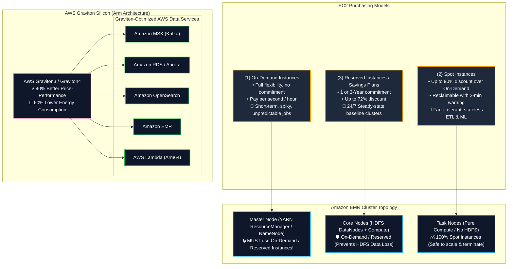
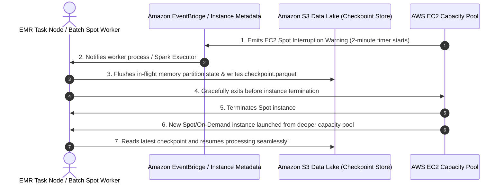
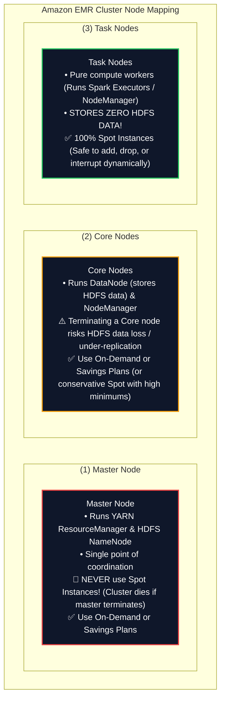
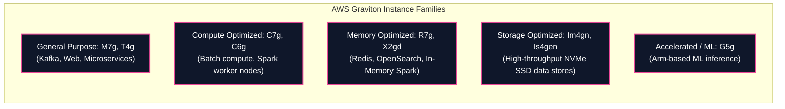

# 🖥️ Amazon EC2 & AWS Graviton in Big Data (Purchasing Models & Arm Architecture)

- **Category**: Compute (Virtual Machine Infrastructure, Spot Pricing & Arm Processors)
- **Language / ဘာသာစကား**: **English (Original)** | [မြန်မာဘာသာ (Burmese)](/mm/02-services/compute-containers/ec2-and-graviton)
- **Primary Use Case**: Compute backbone for self-hosted data platforms, underlying instance topology for [[emr]] clusters (Master, Core, Task nodes), and maximizing price-performance using custom **AWS Graviton** silicon across [[msk-kafka]], [[rds-and-aurora]], [[opensearch]], and [[lambda]].
- **Slide Reference**: Pages 286–288 in `[[AWSCertifiedDataEngineerSlides.pdf]]`
- **Hub Links**: [[index]] | [[service-catalog]] | [[domain-1-ingestion-and-processing]] | [[domain-2-data-store-management]] | [[emr]] | [[batch]] | [[ecr-ecs-eks]] | [[lambda]]

---

## 1. High-Level Summary

**Amazon Elastic Compute Cloud (Amazon EC2)** provides scalable on-demand compute capacity in the AWS Cloud. In data engineering architectures, EC2 instances form the core compute substrate powering distributed big data clusters (**Amazon EMR**), managed databases (**Amazon RDS/Aurora**), streaming brokers (**Amazon MSK**), and custom containerized ETL fleets.

**AWS Graviton Processors** are custom 64-bit Arm Neoverse-based microprocessors engineered by AWS to deliver up to **40% better price-performance** over comparable x86 processors across databases, analytics, memory caches, and containerized microservices.

For the **AWS Certified Data Engineer – Associate (DEA-C01)** exam, you must master:
1. **EC2 Purchasing Models**: On-Demand vs. Spot Instances vs. Reserved Instances (RI) / Savings Plans.
2. **Spot Instances for Analytics**: Leveraging Spot for stateless, fault-tolerant workloads (e.g. EMR Task nodes, AWS Batch) with **S3 state checkpointing** to survive 2-minute interruption notices.
3. **EMR Cluster Node Architecture**: Mapping EC2 purchasing models across **Master Nodes** (On-Demand), **Core Nodes** (On-Demand/Reserved), and **Task Nodes** (Spot).
4. **AWS Graviton Instance Families**: Identifying Graviton-powered instance types (`c7g`, `m7g`, `r7g`, `is4gen`) across AWS analytics and data services.

---

## 2. EC2 Purchasing Options for Data Engineering Workloads

| Purchasing Option | Cost Discount | Interruption Risk | Best Data Engineering Workload |
| :--- | :--- | :--- | :--- |
| **On-Demand** | Baseline price ($0\%$) | **None** (Guaranteed availability until stopped) | • Dev/Test environments • Short, non-interruptible one-off data processing • EMR Master nodes |
| **Spot Instances** | **Up to 90% discount** | ⚠️ **Can be reclaimed by AWS with a 2-minute warning** | • **EMR Task Nodes** (Pure compute, no HDFS storage) • **AWS Batch jobs with S3 checkpointing** • Distributed ML model training & hyperparameter tuning |
| **Compute Savings Plans / EC2 Instance Savings Plans** | **Up to 72% discount** | **None** (1-year or 3-year hourly spend commitment) | • 24/7 Production databases ([[rds-and-aurora]]) • Long-running continuous **EMR Master & Core nodes** • 24/7 **Amazon MSK** Kafka broker fleets |

---

## 3. Spot Instances & Fault-Tolerant Big Data Topologies

Spot Instances represent unused EC2 compute capacity available at steep discounts. However, when AWS needs capacity back, the instance receives a **2-minute rebalance recommendation / interruption notice**.

### EMR Cluster Node Mapping Strategy (Top Exam Focus):

---

## 4. AWS Graviton Processors in Data Engineering

AWS Graviton processors are custom-built 64-bit Arm processors designed by AWS using 7nm/5nm silicon technology:

### Graviton Adoption Across AWS Managed Data Services

| Managed Service | Graviton Instance Option | Benefits for Data Engineering |
| :--- | :--- | :--- |
| **Amazon EMR** | `c7g`, `m7g`, `r7g` | Up to **30% lower cost** and **15% higher performance** for Apache Spark, Hive, and Presto jobs compared to equivalent x86 instances. |
| **Amazon MSK (Kafka)** | `kafka.m7g.*` | Higher network throughput per dollar and reduced tail latency for high-volume streaming ingest. |
| **Amazon RDS & Aurora** | `db.r7g.*`, `db.m7g.*` | Delivers up to **20% better transaction throughput** for PostgreSQL and MySQL workloads at lower cost. |
| **Amazon OpenSearch** | `r7g.search.*`, `m7g.search.*`| Up to **38% indexing throughput improvement** and 20% query latency reduction for search clusters. |
| **AWS Lambda** | **`arm64` Architecture** | **20% lower price** per millisecond of compute duration compared to `x86_64` for identical Python/Node/Java functions. |

---

## 5. High-Yield DEA-C01 Exam Tips & Traps

> [!IMPORTANT]
> **Key Exam Trigger Keywords**:
> - **"Cost-optimized compute for fault-tolerant, stateless ETL and machine learning with checkpointing"** $\rightarrow$ **EC2 Spot Instances**.
> - **"EMR Task nodes compute selection"** $\rightarrow$ **Spot Instances** (Task nodes store no HDFS data and can be terminated safely).
> - **"EMR Master node compute selection"** $\rightarrow$ **On-Demand or Reserved Instances** (Never Spot!).
> - **"Best price-performance for managed data services (EMR, MSK, RDS, OpenSearch, Lambda)"** $\rightarrow$ **AWS Graviton (Arm-based instance types with 'g' suffix, e.g. `m7g`, `r7g`, `c7g`)**.

> [!WARNING]
> **Exam Traps & Failure Modes**:
> 1. **Spot Instances for EMR Master Nodes Trap**:
>    - Never select Spot Instances for the **Master Node** of an Amazon EMR cluster. If the master node is reclaimed, the entire cluster fails and all job progress is lost!
> 2. **Spot Interruption Mitigation**:
>    - When using Spot instances for data processing, always implement **state checkpointing to Amazon S3** so that when an instance is reclaimed, the retry job resumes from the latest checkpoint rather than restarting from scratch.
> 3. **Graviton Binary Compatibility**:
>    - Graviton runs on the **Arm64** instruction set. While Python, PySpark, Java, and Node.js code run with zero modifications, custom compiled C/C++ or Go binaries packaged into Docker containers must be compiled specifically for `linux/arm64`.

---

## 📌 Related Notes

- [[emr]] — Amazon EMR cluster architecture, Master/Core/Task node mapping
- [[batch]] — AWS Batch for spot-driven containerized batch computing
- [[lambda]] — AWS Lambda Arm64 Graviton execution architecture
- [[ecr-ecs-eks]] — Running containers on EC2, Fargate, and EKS
- [[msk-kafka]] — Amazon MSK Graviton broker deployment
- [[domain-1-ingestion-and-processing]] — DEA-C01 Domain 1 Study Guide
- [[service-comparisons]] — Master DEA-C01 Service Decision Matrix
