# 🐳 Amazon ECR, Amazon ECS & Amazon EKS (Containers & Kubernetes on AWS)

- **Category**: Compute & Containers (Container Registry, Serverless Containers & Kubernetes Orchestration)
- **Language / ဘာသာစကား**: **English (Original)** | [မြန်မာဘာသာ (Burmese)](file:///home/monetine/Workspace/Wathon/aws-dea-c01/content/mm/02-services/compute-containers/ecr-ecs-eks.md)
- **Primary Use Case**: Storing container images in Amazon ECR, running containerized microservices & data processing on Amazon ECS (EC2/Fargate), and running distributed big data engines (notably **Amazon EMR on EKS**) on managed Kubernetes.
- **Slide Reference**: Pages 313–330 in `[[AWSCertifiedDataEngineerSlides.pdf]]`
- **Hub Links**: [[index]] | [[service-catalog]] | [[domain-1-ingestion-and-processing]] | [[batch]] | [[lambda]] | [[emr]] | [[efs-and-fsx]] | [[s3]] | [[glue]] | [[step-functions]]

---

## 1. High-Level Summary

Containers package application code, runtime environments, system libraries, and configurations into standardized, isolated, and immutable units that run reliably across development, testing, and cloud production environments.

In modern AWS data engineering architectures:
1. **Amazon Elastic Container Registry (Amazon ECR)**: Secure, scalable private Docker and OCI-compliant registry storing custom ETL container images, machine learning model scoring containers, and [[batch]] job definitions.
2. **Amazon Elastic Container Service (Amazon ECS)**: AWS-native, highly opinionated container orchestration platform supporting both traditional **Amazon EC2 Launch Types** and serverless **AWS Fargate** compute.
3. **Amazon Elastic Kubernetes Service (Amazon EKS)**: Managed Kubernetes platform enabling enterprises to run distributed big data analytics engines—specifically **Amazon EMR on EKS** (Apache Spark)—alongside operational microservices on a single shared compute cluster.
4. **AWS Fargate**: Serverless compute engine for both Amazon ECS and Amazon EKS that eliminates the need to provision, configure, patch, or scale virtual machine clusters.

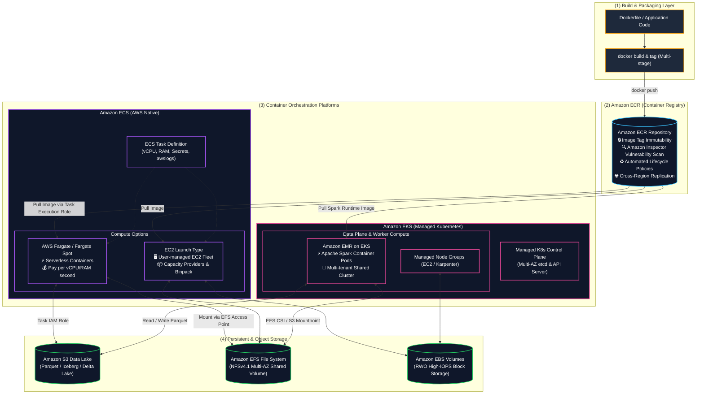

---

## 2. Container Fundamentals in Data Engineering

In data architectures, containers provide distinct advantages over traditional virtual machines and serverless functions:

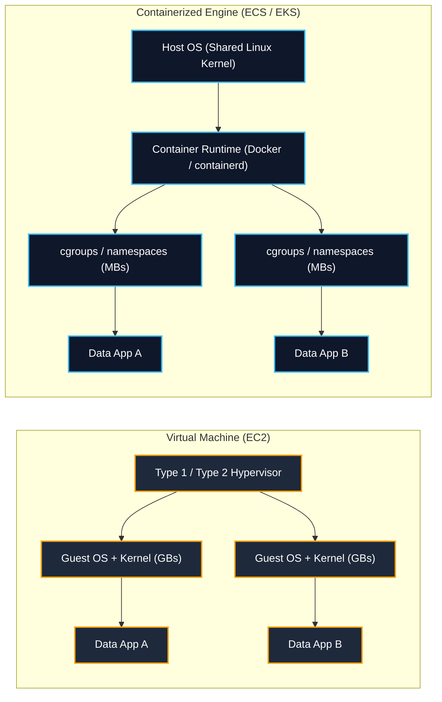

### Key Packaging Best Practices for Data Workloads:
1. **Multi-Stage Builds**: Separate compile/build dependencies from the final execution runtime. Minimizes image size, speeds up ECR pull times across auto-scaling worker nodes, and eliminates attack surfaces.
2. **Minimal Base Images**: Use `distroless` or `alpine` base images. Avoid full Ubuntu/Debian operating system images for production ETL pipelines.
3. **Non-Root Execution**: Configure `USER 10001:10001` in Dockerfiles to prevent container escape exploits.
4. **Layer Caching Optimization**: Place infrequently changing steps (e.g. `pip install pyarrow pyspark pandas`) at the top of the `Dockerfile` and dynamic application code (`COPY ./src /app`) at the bottom.

---

## 3. Amazon Elastic Container Registry (Amazon ECR)

Amazon ECR is a fully managed, OCI-compliant container registry that makes it easy to store, manage, share, and deploy container images:

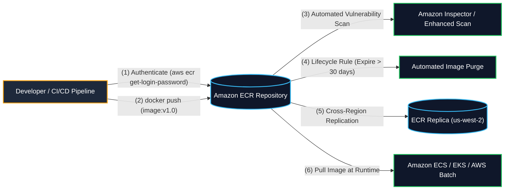

### 1. Image Tag Immutability
- **Core Mechanism**: Prevents image tags (such as `:prod`, `:v1.2.0`, or `:latest`) from being overwritten by subsequent pushes.
- **Data Engineering Significance**: Guarantees deterministic, reproducible ETL pipeline runs. Prevents unintended deployment of untested code if a developer inadvertently pushes to an existing release tag.

### 2. Vulnerability Scanning: Basic vs. Enhanced
- **Basic Scanning**: Scans container images for Common Vulnerabilities and Exposures (CVEs) using the open-source Clair engine. Can be configured to scan **on push** or manually.
- **Enhanced Scanning (Amazon Inspector Integration)**:
  - Continuous automated scanning of repositories for both OS-level and programming language package vulnerabilities (e.g., Python `pip`, Java JARs, Node.js packages).
  - Automatically re-scans stored container images when new CVE disclosures are published without requiring re-pushing.
  - Emits Amazon EventBridge events for findings, triggering automated remediation or pipeline blocks.

### 3. ECR Lifecycle Policies
Lifecycle policies automate the cleanup of stale container images to control storage costs:
```json
{
  "rules": [
    {
      "rulePriority": 1,
      "description": "Expire untagged images older than 7 days",
      "selection": {
        "tagStatus": "untagged",
        "countType": "sinceImagePushed",
        "countUnit": "days",
        "countNumber": 7
      },
      "action": {
        "type": "expire"
      }
    },
    {
      "rulePriority": 2,
      "description": "Keep only the last 30 tagged production images",
      "selection": {
        "tagStatus": "tagged",
        "tagPrefixList": ["prod-", "release-"],
        "countType": "imageCountMoreThan",
        "countNumber": 30
      },
      "action": {
        "type": "expire"
      }
    }
  ]
}
```

### 4. Cross-Region & Cross-Account Replication
- Automatically replicates container images across AWS Regions and AWS Accounts.
- Replicas inherit encryption via AWS KMS customer-managed keys (CMKs).
- Reduces cross-region data transfer latency and egress costs when deploying multi-region EKS/ECS clusters.

### 5. Pull Through Cache
- Automatically caches public container images from upstream registries (**Docker Hub**, **Quay.io**, **Amazon ECR Public**, **Kubernetes `registry.k8s.io`**) directly into your private ECR namespace.
- **Benefits**:
  - Eliminates upstream rate-limiting (e.g. Docker Hub pull limits).
  - Shields workloads from external network failures or upstream outages.
  - Allows Amazon Inspector to scan third-party base images automatically.

### 6. Private VPC Endpoints for ECR (Exam Critical)
To pull container images from ECR within a private subnet without internet access (no NAT Gateway):
1. **Interface VPC Endpoint**: `com.amazonaws.<region>.ecr.api` (for ECR control plane API calls like authentication).
2. **Interface VPC Endpoint**: `com.amazonaws.<region>.ecr.dkr` (for Docker registry commands and image manifest fetching).
3. **Gateway VPC Endpoint**: `com.amazonaws.<region>.s3` (ECR stores actual container image layer blobs in **Amazon S3**; tasks MUST be able to download S3 image layers without crossing the public internet!).

---

## 4. Amazon Elastic Container Service (Amazon ECS)

Amazon ECS is a fully managed, opinionated AWS-native container orchestration service:

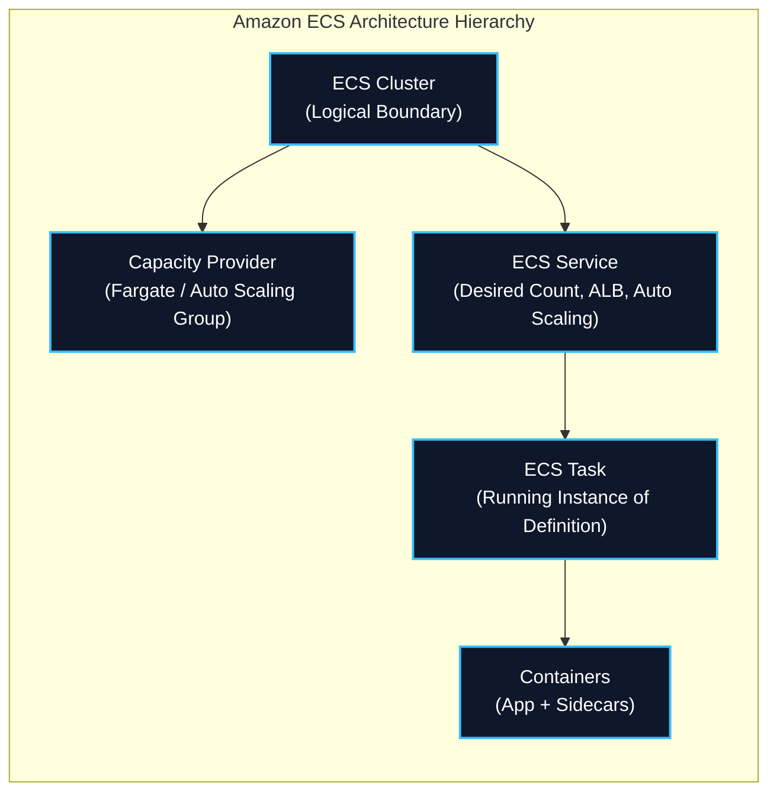

### 1. Launch Types: EC2 vs. AWS Fargate

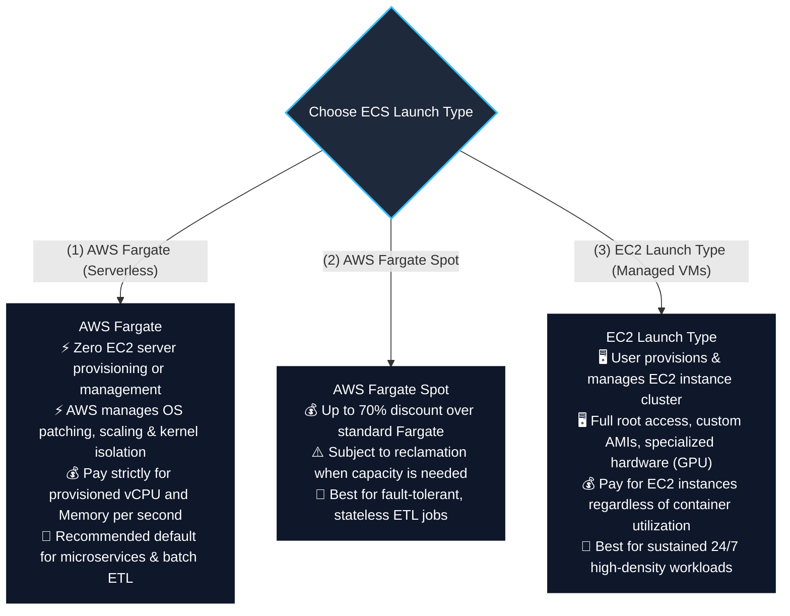

### Launch Types Comparison Matrix

| Architectural Feature | AWS Fargate (Serverless) | AWS Fargate Spot | EC2 Launch Type |
| :--- | :--- | :--- | :--- |
| **Server Management** | **Zero server management** | **Zero server management** | **Customer manages EC2 cluster** (OS, patching, ASG) |
| **Pricing Model** | Pay per vCPU & GB memory per second | Up to **70% discount** over standard Fargate | Pay for running EC2 instances (even if half empty) |
| **Interruption Warning** | No interruptions | 2-minute interruption notice | Standard Spot 2-minute notice (if EC2 Spot used) |
| **Startup Time** | Fast (~30–60 seconds per container) | Fast (~30–60 seconds) | Instant if capacity exists; slower if ASG scales |
| **Custom AMIs / GPUs** | Standard AWS Linux container environment | Standard AWS Linux | Supports custom AMIs, GPU instances (`g5`, `p4d`), custom kernels |
| **Persistent Storage** | **Amazon EFS** (via Access Points) | **Amazon EFS** (via Access Points) | **Amazon EBS** or **Amazon EFS** |
| **Best DEA-C01 Fit** | **Spiky, unpredictable ETL pipelines, microservices, ad-hoc batch processing** | **Stateless, fault-tolerant batch ETL with checkpointing** | **Predictable 24/7 sustained processing, specialized GPU training** |

---

### 2. ECS IAM Role Separation: Task Execution Role vs. Task Role (Core Exam Focus)

Understanding the strict boundary between these two IAM roles is tested extensively on the DEA-C01 exam:

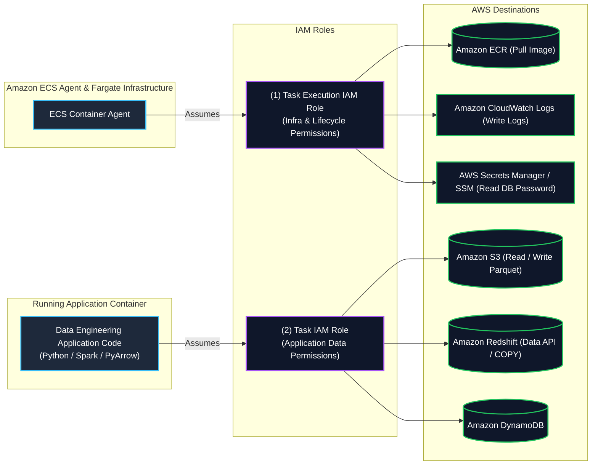

#### Detailed IAM Role Comparison:

| Parameter | Task Execution Role (`executionRoleArn`) | Task Role (`taskRoleArn`) |
| :--- | :--- | :--- |
| **Assumed By** | **ECS Container Agent** & Fargate Infrastructure | **Application Code** inside the container |
| **Purpose** | Authorizes ECS to launch, pull images, and configure the container | Authorizes the application to interact with AWS data services |
| **Typical Permissions** | • `ecr:GetAuthorizationToken`<br/>• `ecr:BatchGetImage`<br/>• `logs:CreateLogStream`<br/>• `logs:PutLogEvents`<br/>• `secretsmanager:GetSecretValue`<br/>• `ssm:GetParameters` | • `s3:GetObject`, `s3:PutObject`<br/>• `dynamodb:Query`, `dynamodb:PutItem`<br/>• `redshift-data:ExecuteStatement`<br/>• `kms:Decrypt`<br/>• `kinesis:PutRecord` |
| **Failure Symptom** | Container fails to launch (`CannotPullContainerError`, `ResourceInitializationError`) | Application crashes with `AccessDeniedException` when querying S3 or DynamoDB |

#### Sample Task Definition Snippet Demonstrating Both Roles & Secrets Injection:
```json
{
  "family": "data-pipeline-task",
  "networkMode": "awsvpc",
  "requiresCompatibilities": ["FARGATE"],
  "cpu": "1024",
  "memory": "2048",
  "executionRoleArn": "arn:aws:iam::123456789012:role/ecsTaskExecutionRole",
  "taskRoleArn": "arn:aws:iam::123456789012:role/dataIngestionAppTaskRole",
  "containerDefinitions": [
    {
      "name": "parquet-transformer",
      "image": "123456789012.dkr.ecr.us-east-1.amazonaws.com/etl-transformer:v1.0",
      "essential": true,
      "secrets": [
        {
          "name": "DB_PASSWORD",
          "valueFrom": "arn:aws:secretsmanager:us-east-1:123456789012:secret:db-creds:password::"
        }
      ],
      "logConfiguration": {
        "logDriver": "awslogs",
        "options": {
          "awslogs-group": "/ecs/data-pipeline",
          "awslogs-region": "us-east-1",
          "awslogs-stream-prefix": "transformer"
        }
      }
    }
  ]
}
```

---

### 3. ECS Networking Modes

| Network Mode | Description | Port Mapping | Compatibility |
| :--- | :--- | :--- | :--- |
| **`awsvpc`** | Every task is allocated its own **Elastic Network Interface (ENI)** and private IPv4 address. Behaves like a first-class EC2 instance on the VPC. | Container port matches host port directly. | **Required for AWS Fargate**; supported on EC2. |
| **`bridge`** | Uses Docker's built-in virtual bridge network on the EC2 host. | Allows dynamic host port mapping (Host port 0 maps to dynamic ephemeral port). | EC2 only. |
| **`host`** | Bypasses Docker network isolation; container binds directly to the EC2 host's physical network interface. | Highest network packet throughput and lowest latency. | EC2 only. |
| **`none`** | Container has no external network connectivity. | None. | EC2 and Fargate. |

---

### 4. ECS Task Placement Strategies & Constraints (EC2 Launch Type)

When running on user-managed EC2 clusters, ECS allows algorithmic control over task placement:

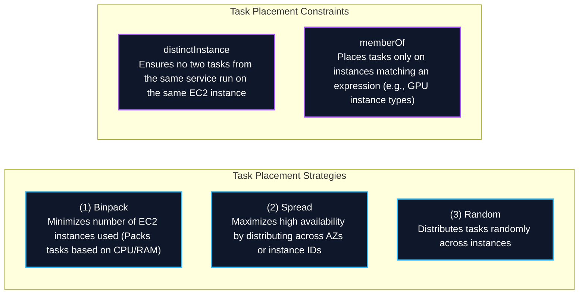

- **Data Engineering Cost Tip**: Combining `spread(attribute:ecs.availability-zone)` with `binpack(memory)` achieves both Multi-AZ high availability and minimal EC2 compute instance wastage.

---

### 5. Persistent Storage with Amazon EFS & Amazon EBS

Containers are stateless and ephemeral by default. AWS ECS provides two main persistent storage options:

1. **Amazon EFS Integration (Multi-AZ Shared File System)**:
   - Mounts an **Amazon EFS** file system directly into containers via **EFS Access Points**.
   - **Supported on both AWS Fargate and EC2 launch types**.
   - Provides shared `ReadWriteMany` (RWX) access across hundreds of concurrent container tasks.
   - Enforces POSIX user identity (`UID`/`GID`) and directory path restriction.
2. **Amazon EBS Task Volume Attachment**:
   - Enables attaching dedicated high-performance **Amazon EBS** volumes directly to ECS tasks.
   - Volume lifecycle is managed automatically alongside the task lifecycle.

---

## 5. Amazon Elastic Kubernetes Service (Amazon EKS)

**Amazon EKS** is a managed Kubernetes service that provisions, scales, and operates the Kubernetes control plane (API servers, `etcd` database) across multiple AWS Availability Zones.

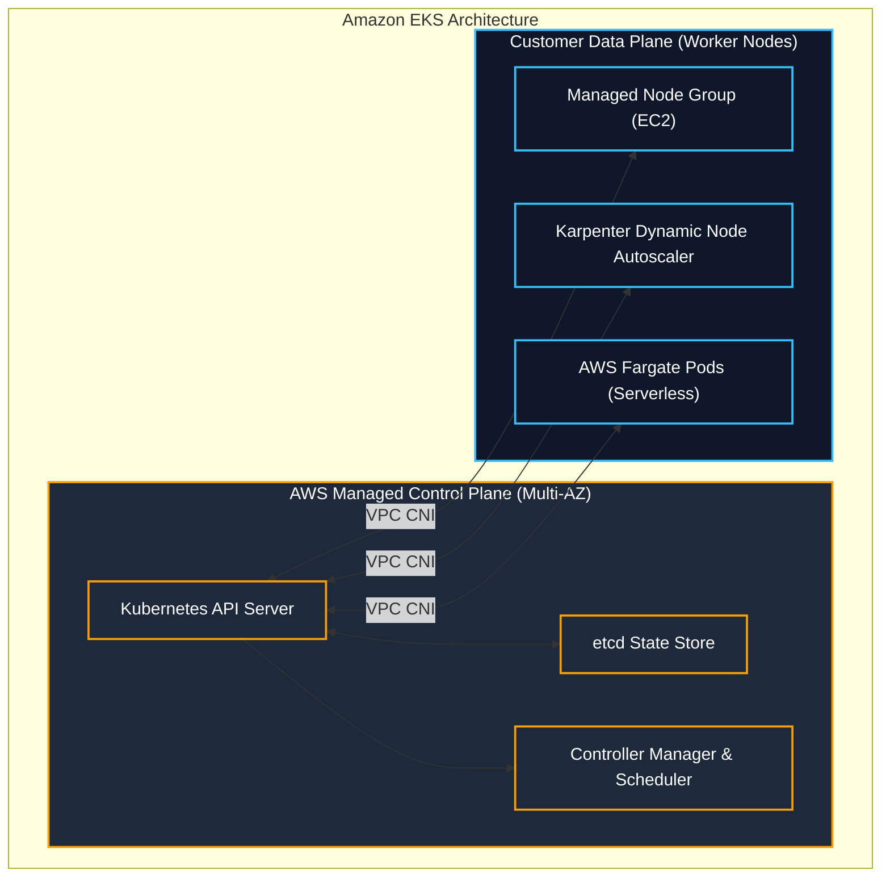

### 1. Kubernetes IAM: IRSA & EKS Pod Identity
To achieve the principle of least privilege, pods running on EKS should never inherit the IAM role of the underlying EC2 worker node:
- **IAM Roles for Service Accounts (IRSA)**: Uses an OpenID Connect (OIDC) identity provider to allow Kubernetes `ServiceAccount` tokens to assume specific AWS IAM roles.
- **EKS Pod Identity**: Simplifies IAM association by mapping IAM roles directly to ServiceAccounts via the EKS Pod Identity agent without managing complex OIDC trust policies.

---

### 2. Kubernetes Storage: AWS Container Storage Interface (CSI) Drivers

| Storage Type | AWS CSI Driver | Kubernetes Volume Mode | Best Data Engineering Use Case |
| :--- | :--- | :--- | :--- |
| **Amazon EBS** | `ebs.csi.aws.com` | `ReadWriteOnce` (RWO - Single Pod) | Self-hosted Kafka brokers, PostgreSQL, Cassandra, OpenSearch |
| **Amazon EFS** | `efs.csi.aws.com` | `ReadWriteMany` (RWX - Multi-Node) | Shared Airflow DAG folders, JupyterHub multi-user home directories |
| **AWS FSx for Lustre** | `fsx.csi.aws.com` | `ReadWriteMany` (RWX - High-Throughput) | Sub-millisecond distributed ML model training & HPC staging |
| **Mountpoint for Amazon S3** | `s3.csi.aws.com` | `ReadOnlyMany` / `ReadWriteMany` | Direct POSIX read access to S3 object buckets at high throughput |

---

## 6. Amazon EMR on EKS (Core Big Data Exam Focus)

**Amazon EMR on EKS** is a deployment option that enables data engineers to run **Apache Spark** applications on managed Amazon EKS clusters:

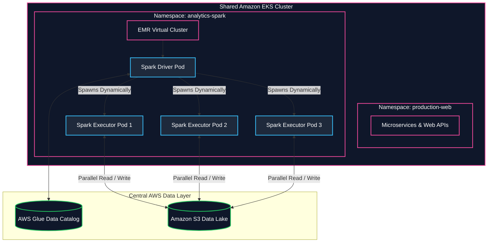

### Why Choose EMR on EKS?
1. **Infrastructure Consolidation**: Consolidates compute resources by running Spark big data pipelines on the same Kubernetes cluster as web applications and APIs, eliminating idle EC2 cluster waste.
2. **Dynamic Pod Lifecycle**: EMR dynamically provisions Spark driver and executor pods when a job starts and terminates them immediately upon job completion.
3. **Up to 3x Faster**: Utilizes the performance-optimized **EMR runtime for Apache Spark** (up to 3x faster and 68% lower cost than open-source Spark on Kubernetes).
4. **Per-Job Isolation**: Different teams can run different versions of Spark and custom Docker container images with distinct IAM execution roles on the same cluster.
5. **Native Integration**: Seamlessly connects with [[glue]] Data Catalog and [[lake-formation]] for data governance.

---

## 7. AWS Batch & AWS App Runner in Container Architectures

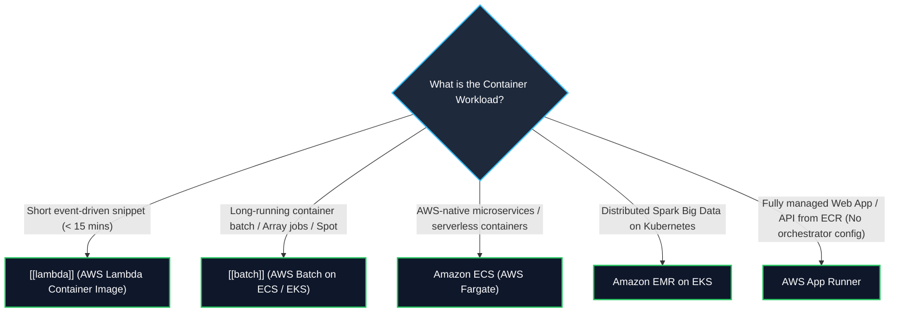

- **AWS Batch with Containers**: Leverages Amazon ECS or EKS under the hood to schedule parallel array jobs (up to 10,000 tasks) across EC2 Spot fleets.
- **AWS App Runner**: Provides fully managed, serverless execution of containerized web applications and APIs directly from ECR or source code, abstracting away VPCs, load balancers, and orchestrators.

---

## 8. Master Decision Frameworks & Comparison Matrices

### Master Container & Compute Comparative Matrix

| Dimension | AWS Lambda | AWS Batch | Amazon ECS (Fargate) | Amazon EKS (EMR on EKS) | Amazon EMR (EC2) |
| :--- | :--- | :--- | :--- | :--- | :--- |
| **Packaging** | Zip archive or Container (up to 10 GB) | Docker Container | Docker Container | Docker Container / K8s Pods | EC2 AMIs / Bootstrap Actions |
| **Max Runtime** | ⏱️ **15 Minutes** | Unlimited | Unlimited | Unlimited | Unlimited |
| **Orchestration** | AWS-managed event triggers | Job Queues & Dependencies | ECS Task Definitions / Services | Kubernetes Manifests / Helm | YARN ResourceManager |
| **Big Data Engine** | Custom Python scripts | Non-Spark batch containers | Custom container pipelines | **EMR Spark on Kubernetes** | Native Spark, Hadoop, Presto |
| **Storage Persistence** | `/tmp` (10 GB) or EFS | EBS, Spot scratch, EFS | **Amazon EFS / Amazon EBS** | **EBS, EFS, FSx for Lustre, S3 CSI** | HDFS, S3 (EMRFS) |
| **Spot Cost Savings** | ❌ Standard duration pricing | ✅ **Native Spot integration** (up to 90% off) | ✅ **Fargate Spot** (up to 70% off) | ✅ **EC2 Spot Node Groups** (up to 90% off) | ✅ **Spot Task nodes** (up to 90% off) |

---

## 9. Production Architecture Patterns

### Pattern 1: Serverless Event-Driven Containerized ETL (ECS Fargate + S3)

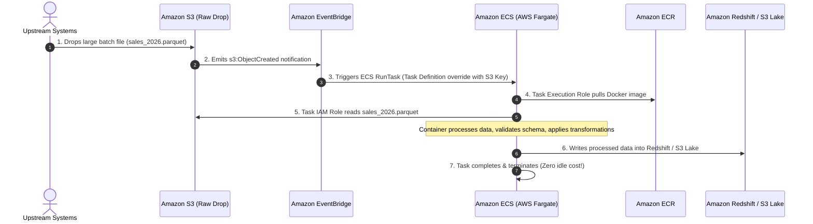

### Pattern 2: Enterprise Secure Container Supply Chain

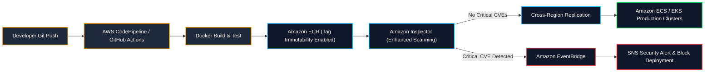

---

## 10. Common Failures, Troubleshooting & Anti-Patterns

| Error / Failure Mode | Root Cause | DEA-C01 Resolution |
| :--- | :--- | :--- |
| **`CannotPullContainerError`** | ECS task in private subnet cannot reach ECR registry. | • Attach a **NAT Gateway** to public subnet, OR<br/>• Provision **Interface VPC Endpoints** (`ecr.api`, `ecr.dkr`) **AND** a **Gateway VPC Endpoint for Amazon S3**. |
| **`OutOfMemory (OOM) / Exit Code 137`** | Container exceeded its allocated memory limit in the Task Definition. | Increase container memory reservation or task memory allocation in the Task Definition. |
| **`AccessDeniedException` on S3 read** | IAM permissions missing from the **Task IAM Role**. | Attach `s3:GetObject` to the **Task IAM Role** (Not the Task Execution Role or EC2 Instance Profile!). |
| **`ResourceInitializationError` on Secrets** | ECS agent cannot retrieve database secret from AWS Secrets Manager. | Grant `secretsmanager:GetSecretValue` and `kms:Decrypt` to the **Task Execution IAM Role**. |
| **Image tag overwrite in CI/CD** | Image tag overwritten accidentally during pipeline run. | Enable **Image Tag Immutability** on the Amazon ECR repository. |

---

## 11. High-Yield DEA-C01 Exam Tips & Traps

> [!IMPORTANT]
> **Key Exam Trigger Keywords**:
> - **"Run containerized applications on AWS without managing underlying EC2 instances"** $\rightarrow$ **Amazon ECS with AWS Fargate launch type**.
> - **"Share Kubernetes cluster resources between microservices and Apache Spark data engineering jobs"** $\rightarrow$ **Amazon EMR on EKS**.
> - **"Grant containerized application running in ECS permissions to access S3 or DynamoDB"** $\rightarrow$ **Attach IAM policy to the ECS Task IAM Role** (Not the Task Execution Role or EC2 Instance Profile!).
> - **"Prevent overwriting container images in CI/CD pipelines"** $\rightarrow$ **Enable Image Tag Immutability on Amazon ECR**.
> - **"Persistent shared multi-task file storage for Fargate containers"** $\rightarrow$ **Mount Amazon EFS via EFS Access Points**.
> - **"Pull container images from ECR in a private VPC with no internet gateway or NAT gateway"** $\rightarrow$ **Interface VPC Endpoints for ECR (`ecr.api`, `ecr.dkr`) + Gateway VPC Endpoint for Amazon S3**.

> [!WARNING]
> **Exam Traps & Failure Modes**:
> 1. **Task Role vs. Task Execution Role Trap**:
>    - If a containerized application gets `AccessDenied` when attempting to read from Amazon S3, modifying the **Task Execution Role** will NOT resolve the issue. You must grant `s3:GetObject` to the **Task Role**!
> 2. **EMR on EC2 vs. EMR on EKS**:
>    - Choose **EMR on EKS** when the organization already runs Kubernetes and wants to **share compute infrastructure across analytics and operational teams**. Choose **EMR on EC2** when you need fine-grained control over Hadoop/YARN configurations, HBase, or dedicated long-running clusters.
> 3. **EBS vs. EFS on Fargate**:
>    - AWS Fargate supports mounting **Amazon EFS** for shared multi-AZ persistent storage. It does **NOT** support attaching arbitrary Amazon EBS volumes directly to Fargate tasks without task-level volume management.

---

## 📌 Related Notes

- [[batch]] — AWS Batch for managed containerized batch compute and Spot optimization
- [[lambda]] — AWS Lambda for serverless micro-batch processing and container image packaging
- [[emr]] — Amazon EMR distributed analytics and EMR on EKS architecture
- [[efs-and-fsx]] — Amazon EFS shared storage integration with containers
- [[s3]] — Amazon S3 Data Lake target for containerized ETL pipelines
- [[glue]] — AWS Glue serverless Spark ETL and Data Catalog integration
- [[step-functions]] — Orchestrating ECS/EKS containerized pipelines
- [[domain-1-ingestion-and-processing]] — DEA-C01 Domain 1 Study Guide
- [[service-comparisons]] — Master DEA-C01 Service Decision Matrix
