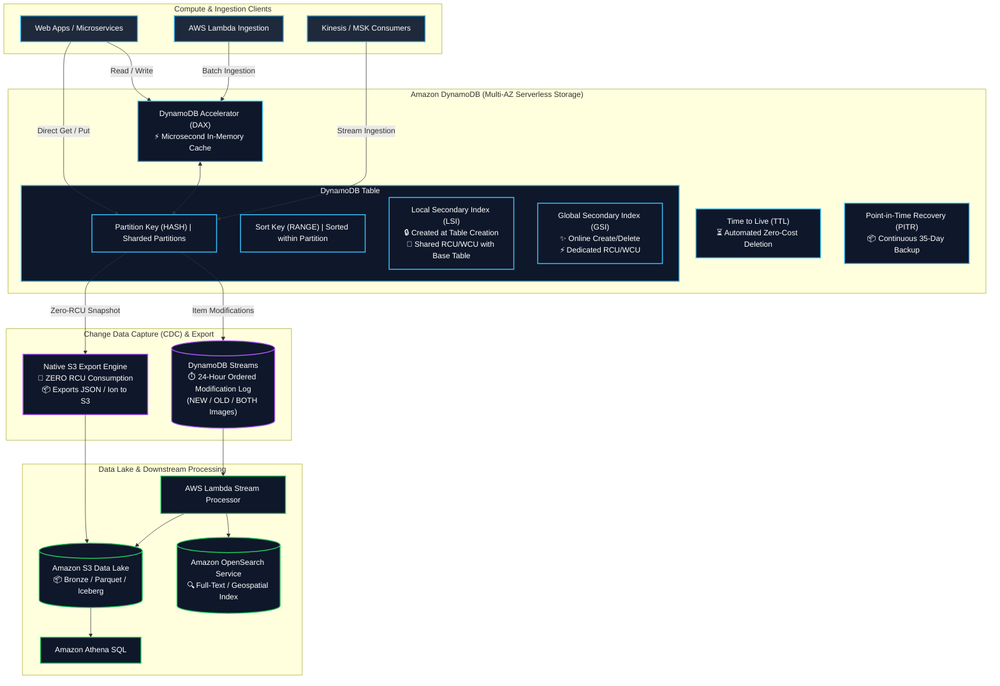
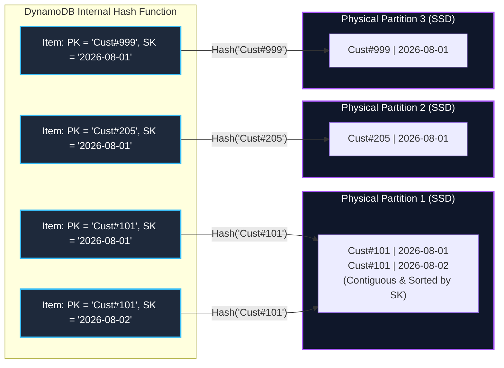
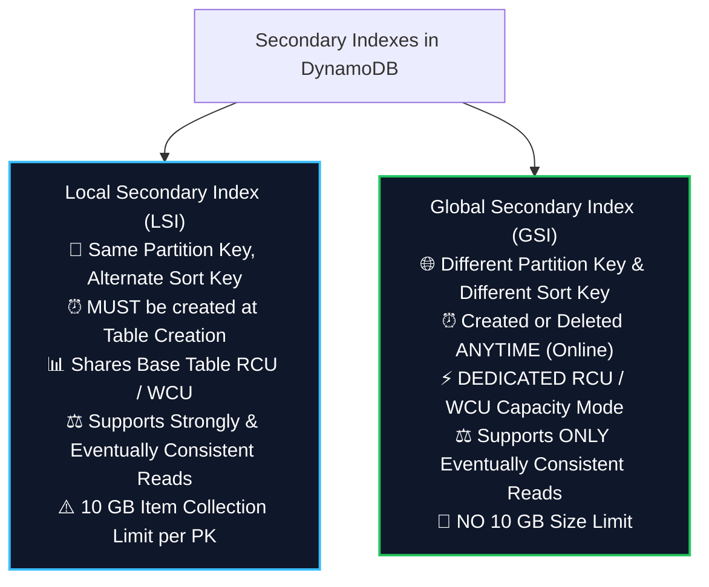
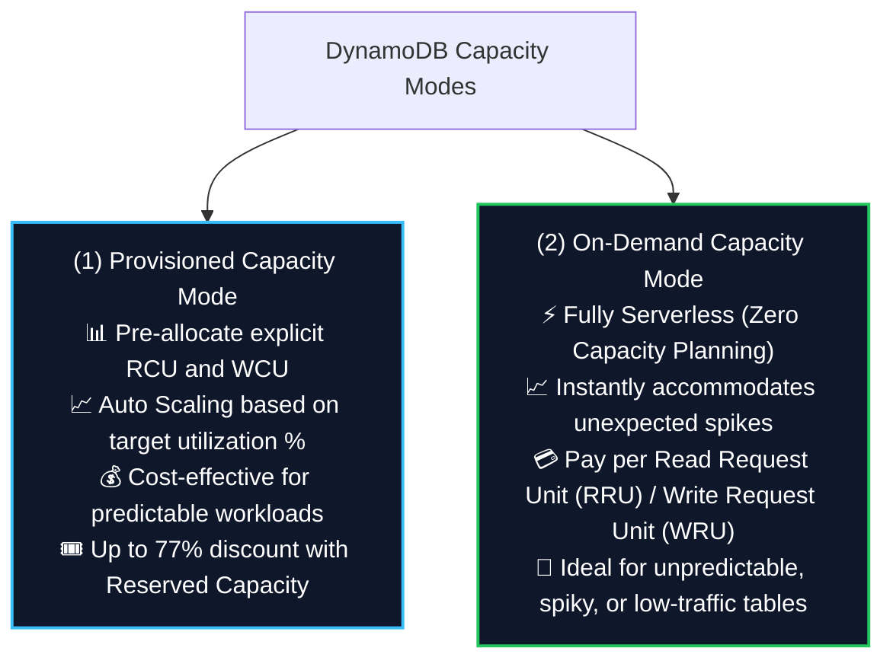
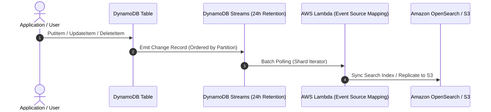
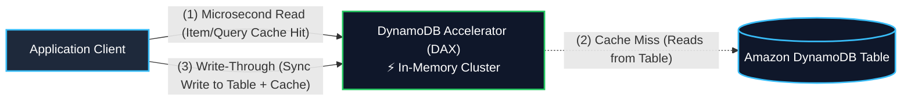
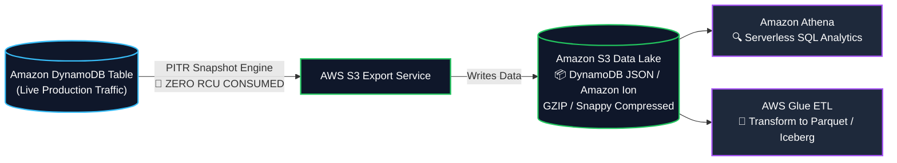

# ⚡ Amazon DynamoDB (Serverless NoSQL Key-Value & Document Database)

- **Category**: Database (Serverless NoSQL Key-Value & Document)
- **Language / ဘာသာစကား**: **English (Original)** | [မြန်မာဘာသာ (Burmese)](/mm/02-services/database/dynamodb)
- **Primary Use Case**: Ultra-low-latency single-digit millisecond operational data store, real-time feature stores, streaming pipeline state tracking, Change Data Capture (CDC) with DynamoDB Streams, and distributed metadata catalogs.
- **Slide Reference**: Pages 156–195 in `[AWSCertifiedDataEngineerSlides.pdf](/docs/AWSCertifiedDataEngineerSlides.pdf)`
- **Hub Links**: [[en/index|index]] | [[en/00-hub/service-catalog|service-catalog]] | [[en/01-domains/domain-2-data-store-management|domain-2-data-store-management]] | [[en/01-domains/domain-1-ingestion-and-processing|domain-1-ingestion-and-processing]] | [[en/02-services/storage/s3/s3|s3]] | [[en/02-services/compute-containers/lambda|lambda]] | [[en/02-services/analytics-streaming/glue/glue|glue]] | [[en/02-services/database/redshift|redshift]]

---

## 1. High-Level Summary

**Amazon DynamoDB** is a fully managed, serverless, multi-Region, multi-active NoSQL database designed to deliver single-digit millisecond latency at any scale. It automatically spreads data and traffic across physical partitions on SSD storage replicated across three Availability Zones (AZs) within an AWS Region.

For the **AWS Certified Data Engineer – Associate (DEA-C01)** exam, DynamoDB is tested extensively across:
1. **Primary Key Design & Partitioning**: Partition Keys (HASH), Composite Keys (HASH + RANGE), write sharding, and avoiding hot partitions.
2. **Secondary Indexes (LSI vs. GSI)**: Schema modification rules, consistency guarantees, capacity allocation, and GSI write backpressure.
3. **Throughput Modes & Exact Capacity Calculations**: Calculating RCUs and WCUs for strong, eventual, and transactional operations on On-Demand vs. Provisioned tables.
4. **Change Data Capture (CDC)**: Processing item-level modifications using **DynamoDB Streams** (or Kinesis Data Streams for DynamoDB) with AWS Lambda, EventBridge, and S3 Data Lakes.
5. **Zero-Impact Data Lake Integration**: Exporting petabyte-scale DynamoDB tables to **Amazon S3** without consuming table RCU.
6. **In-Memory Caching & Expiration**: Microsecond query acceleration using **DynamoDB Accelerator (DAX)** and automated lifecycle expiration via **Time to Live (TTL)**.

---

## 2. DynamoDB Data Model & Partition Key Architecture

DynamoDB stores data in **Tables**, which contain **Items** (rows), and each item contains **Attributes** (columns). Items can have varying schemas (schemaless), with a maximum item size of **400 KB**.

### Primary Key Types

1. **Simple Primary Key (Partition Key / HASH)**:
   - Consists of a single attribute (e.g., `user_id`).
   - An internal hash function maps the Partition Key value to a specific physical storage partition.
   - No two items in the table can have the same Partition Key.
2. **Composite Primary Key (Partition Key + Sort Key / HASH + RANGE)**:
   - Consists of two attributes: a **Partition Key** (HASH) and a **Sort Key** (RANGE) (e.g., `device_id` (PK) + `timestamp` (SK)).
   - Items with the same Partition Key are stored contiguously in the same physical partition, sorted in ascending order by Sort Key.
   - Enables rich range queries: `=`, `<`, `<=`, `>`, `>=`, `BETWEEN`, and `begins_with()`.

### Partition Limits & Hot Partitions

- **Physical Partition Limits**: Each internal partition supports up to **10 GB of data**, **1,000 WCUs**, and **3,000 RCUs**.
- **Hot Partition Issue**: If a workload frequently reads or writes to a low-cardinality Partition Key (e.g., `Status = 'ACTIVE'` or `Date = '2026-08-10'`), a single physical partition handles all requests and hits throughput limits, causing `ProvisionedThroughputExceededException`.
- **Mitigation (Write Sharding)**:
  - Add a randomized or calculated suffix to the Partition Key (e.g., `Date_Suffix` where suffix is a random integer from `1` to `N`, such as `2026-08-10.1`, `2026-08-10.2`).
  - Distributes the writes across $N$ physical partitions uniformly.

---

## 3. Secondary Indexes Deep Dive: LSI vs. GSI

Secondary indexes allow querying data using alternate attributes beyond the primary key. Understanding the architectural differences between **Local Secondary Indexes (LSI)** and **Global Secondary Indexes (GSI)** is one of the most critical exam topics.

### Comprehensive LSI vs. GSI Comparison Matrix

| Architectural Feature | Local Secondary Index (LSI) | Global Secondary Index (GSI) |
| :--- | :--- | :--- |
| **Partition Key (PK)** | **Must match the base table PK exactly** | Can define a **completely different PK** |
| **Sort Key (SK)** | Alternate attribute chosen as SK | Optional alternate attribute as SK |
| **Creation Timing** | **Table creation time ONLY** (Immutable thereafter) | **Anytime** (Create, update, delete on live table) |
| **Index Limits** | Maximum **5 LSIs** per table | Up to **20 GSIs** per table (quota adjustable) |
| **Capacity Sizing** | **Shares RCU and WCU with base table** | **Has its own independent provisioned/on-demand capacity** |
| **Read Consistency** | Supports **Strongly Consistent** & Eventually Consistent | Supports **Eventually Consistent Reads ONLY** |
| **Storage & Collection Limit** | Max **10 GB** item collection per Partition Key | **No partition size limits** (PBs scalable) |
| **Write Throttling Impact** | Throttles if base table WCU is exhausted | **GSI Write Backpressure**: If GSI is throttled, **base table writes will also be throttled!** |

### Index Attribute Projections
When querying an index, projecting only required attributes minimizes storage cost and avoids expensive base table fetches:
- `KEYS_ONLY`: Index contains only the base table PK, SK, and index keys (smallest storage footprint).
- `INCLUDE`: Index contains key attributes plus explicitly specified non-key attributes.
- `ALL`: Index duplicates all attributes from the base table (highest storage cost, but guarantees zero base table fetches).

> [!WARNING]
> **The GSI Write Backpressure Trap (High-Frequency Exam Trap)**:
> In DynamoDB, write operations on a base table are asynchronously replicated to all its GSIs. If a GSI has insufficient write capacity (WCU) and becomes throttled, **DynamoDB will throttle writes on the BASE TABLE as well**, even if the base table itself has ample unconsumed WCU! Always ensure GSI WCUs equal or exceed base table WCUs (or use On-Demand mode).

---

## 4. Capacity Modes, Read Consistency & Mathematical Calculations

DynamoDB offers two capacity management modes: **Provisioned Mode** (with auto-scaling) and **On-Demand Mode**.

---

### Exact Capacity Unit Definitions & Mathematical Formulas

Understanding how to calculate required **RCUs** and **WCUs** is guaranteed to appear on the DEA-C01 exam.

#### 1. Read Capacity Units (RCU)
- **Baseline Rule**: 1 RCU represents:
  - **1 Strongly Consistent Read** per second for an item up to **4 KB** in size.
  - **2 Eventually Consistent Reads** per second for an item up to **4 KB** (i.e., **0.5 RCU** per 4 KB item).
  - **0.5 Transactional Read** per second for an item up to **4 KB** (i.e., **2 RCU** per 4 KB item).

$$\text{RCU (Strongly Consistent)} = \left\lceil \frac{\text{Item Size in KB}}{4\text{ KB}} \right\rceil \times \text{Reads per second}$$

$$\text{RCU (Eventually Consistent)} = \left\lceil \frac{\text{Item Size in KB}}{4\text{ KB}} \right\rceil \times \text{Reads per second} \times 0.5$$

$$\text{RCU (Transactional)} = \left\lceil \frac{\text{Item Size in KB}}{4\text{ KB}} \right\rceil \times \text{Reads per second} \times 2$$

#### 2. Write Capacity Units (WCU)
- **Baseline Rule**: 1 WCU represents:
  - **1 Standard Write** per second for an item up to **1 KB** in size.
  - **0.5 Transactional Write** per second for an item up to **1 KB** (i.e., **2 WCU** per 1 KB item).

$$\text{WCU (Standard Write)} = \left\lceil \frac{\text{Item Size in KB}}{1\text{ KB}} \right\rceil \times \text{Writes per second}$$

$$\text{WCU (Transactional Write)} = \left\lceil \frac{\text{Item Size in KB}}{1\text{ KB}} \right\rceil \times \text{Writes per second} \times 2$$

---

### Step-by-Step Calculation Examples (Exam Style)

#### Example 1: Read Capacity Calculation
- **Scenario**: An application requires **100 reads per second**. Each item is **10 KB** in size.
- **Step 1 (Block rounding)**: Round up item size to the nearest 4 KB chunk $\rightarrow \lceil 10\text{ KB} / 4\text{ KB} \rceil = \lceil 2.5 \rceil = \mathbf{3\text{ chunks}}$.
- **Strongly Consistent**: $3 \times 100 = \mathbf{300\text{ RCU}}$.
- **Eventually Consistent**: $3 \times 100 \times 0.5 = \mathbf{150\text{ RCU}}$.
- **Transactional Read**: $3 \times 100 \times 2 = \mathbf{600\text{ RCU}}$.

#### Example 2: Write Capacity Calculation
- **Scenario**: An IoT pipeline writes **50 records per second**. Each record is **3.5 KB** in size.
- **Step 1 (Block rounding)**: Round up item size to the nearest 1 KB chunk $\rightarrow \lceil 3.5\text{ KB} / 1\text{ KB} \rceil = \lceil 3.5 \rceil = \mathbf{4\text{ chunks}}$.
- **Standard Write**: $4 \times 50 = \mathbf{200\text{ WCU}}$.
- **Transactional Write**: $4 \times 50 \times 2 = \mathbf{400\text{ WCU}}$.

---

## 5. Query vs. Scan Operations

| Dimension | `Query` Operation | `Scan` Operation |
| :--- | :--- | :--- |
| **Mechanism** | Directly locates items using the **Partition Key (`=`)** and optional **Sort Key conditions** (`=`, `<`, `BETWEEN`, `begins_with`) | Reads **every single item** across the entire table partition by partition |
| **Efficiency** | **Highly efficient**; consumes RCU only for matching items read | **Extremely expensive & slow**; consumes RCU for all items scanned |
| **Data Size Limit** | Returns up to **1 MB** of matching data per request (supports pagination via `LastEvaluatedKey`) | Scans up to **1 MB** before applying filters (requires pagination) |
| **Filter Expressions** | Applied *after* reading items matching PK/SK (does not reduce consumed RCU, but reduces network transfer) | Applied *after* scanning table (full table RCU consumed) |
| **Optimization Strategy** | Design composite primary keys and GSIs to query specific data access patterns | Use **Parallel Scan** across multiple worker threads or export to S3 |

### Accelerating Large Table Scans: Parallel Scan
If a full table scan is mandatory (e.g., bulk export or feeding an Apache Spark ETL job), use **Parallel Scan**:
- Divides the table into logical segments (`Segment` and `TotalSegments` parameters in API).
- Multiple threads or [[en/02-services/analytics-streaming/emr/emr|emr]] / [[en/02-services/analytics-streaming/glue/glue|glue]] worker tasks scan their dedicated segment in parallel, saturating provisioned throughput and finishing drastically faster.

---

## 6. Change Data Capture (CDC): DynamoDB Streams

**DynamoDB Streams** captures a time-ordered sequence of item-level modifications (INSERT, MODIFY, REMOVE) across the table in near real-time, retaining changes for **24 hours**.

### Stream View Types

When enabling DynamoDB Streams, you choose the information written to each stream record:
1. `KEYS_ONLY`: Only key attributes of the modified item.
2. `NEW_IMAGE`: The entire item as it appears after modification.
3. `OLD_IMAGE`: The entire item as it appeared before modification.
4. `NEW_AND_OLD_IMAGES`: Both the prior and updated state of the item (ideal for audit logs and Delta lake merge updates).

### DynamoDB Streams vs. Kinesis Data Streams for DynamoDB

| Feature | DynamoDB Streams | Amazon Kinesis Data Streams for DynamoDB |
| :--- | :--- | :--- |
| **Data Retention** | **24 Hours strictly** | **Up to 365 Days** (Configurable) |
| **Concurrent Consumers** | Up to **2 processes per shard** | **Up to 5 (Standard)** or **20+ (Enhanced Fan-Out)** |
| **Downstream Integrations** | AWS Lambda native trigger, KCL | Kinesis Data Firehose, Kinesis Analytics (Flink), EventBridge |
| **Primary Use Case** | Immediate event-driven triggers (Lambda, state machines) | Multi-subscriber data pipelines, long-term stream buffering, S3 Data Lake streaming |

---

## 7. Performance Optimization: DAX & Time to Live (TTL)

### 1. DynamoDB Accelerator (DAX)

**DAX** is a fully managed, highly available, multi-AZ in-memory cache cluster built specifically for DynamoDB.

- **Microsecond Latencies**: Reduces read latencies from single-digit milliseconds to **microseconds** for high-volume read workloads.
- **Seamless Drop-In**: Zero application logic rewriting; developers simply point the standard DynamoDB SDK to the DAX cluster endpoint.
- **Cache Architecture**:
  - **Item Cache**: Caches individual items retrieved via `GetItem` / `BatchGetItem`.
  - **Query Cache**: Caches collections of items retrieved via `Query` / `Scan`.
- **Write-Through**: Writes made through DAX update both the cache and the underlying DynamoDB table synchronously.
- **When NOT to use DAX**:
  - Strongly consistent read requirements (DAX passes strongly consistent reads directly to DynamoDB without caching).
  - Write-heavy workloads (DAX does not accelerate writes).

---

### 2. Time to Live (TTL)

**TTL** automatically expires and deletes stale items from your table in the background at **zero cost** (consumes **0 WCU** and **0 RCU**).

- **Configuration**: Designate an attribute storing a **Unix Epoch timestamp in seconds** (e.g., `1786272000`).
- **Mechanics**: DynamoDB background scanners continuously identify expired items and delete them within 48 hours of expiration.
- **CDC Integration**: Deleted items are written to **DynamoDB Streams** with a special metadata tag (`principalId: "dynamodb.amazonaws.com"`), allowing Lambda to capture expired items and archive them to **Amazon S3 Glacier** before they disappear!

---

## 8. DynamoDB Data Lake Integration: Native S3 Export & Import

Exporting large DynamoDB tables to Amazon S3 for analytics querying via [[en/02-services/analytics-streaming/athena/athena|athena]] or ETL processing via [[en/02-services/analytics-streaming/glue/glue|glue]] is a cornerstone DEA-C01 architectural pattern.

### Native S3 Export Advantages (Top Exam Rule)

1. **Zero RCU Impact**: Uses internal Point-in-Time Recovery (PITR) snapshot mechanisms. **Consumes 0 Read Capacity Units (RCUs)** from the live table, preventing performance degradation or throttling on production workloads.
2. **Point-in-Time Precision**: Can export the exact state of the table at any second within the last 35 days (requires PITR enabled).
3. **Output Formats**: Outputs data in **DynamoDB JSON** or **Amazon Ion** format with GZIP or Snappy compression.
4. **Cross-Account & Cross-Region**: Can export directly to S3 buckets owned by other AWS accounts or in other Regions.

---

## 9. Global Tables (Multi-Region Active-Active Replication)

- **Architecture**: Fully managed multi-Region, active-active database replication.
- **Sub-Second Replication**: Replicates item changes across selected AWS Regions in near real-time using underlying DynamoDB Streams (`NEW_AND_OLD_IMAGES`).
- **Conflict Resolution**: Uses **Last-Writer-Wins (LWW)** based on timestamp metadata.
- **Disaster Recovery & Latency**: Enables local read and write latencies for globally distributed users while providing active-active failover with zero downtime.

---

## 10. Data Engineering Architecture Patterns

### Pattern A: Real-Time Change Data Capture (CDC) to OpenSearch & Data Lake

- **Challenge**: An e-commerce catalog in DynamoDB needs fast full-text product search and daily historical analytics without impacting operational database performance.
- **Solution**:
  - Enable **DynamoDB Streams** (`NEW_AND_OLD_IMAGES`).
  - Attach an **AWS Lambda** function to the stream.
  - Lambda indexes new and modified products in **Amazon OpenSearch Service** for sub-second search queries.
  - Lambda streams batched updates to **Amazon Kinesis Data Firehose**, which converts records into Parquet and stores them in **Amazon S3** for Athena querying.

### Pattern B: Serverless State Tracking & Distributed Job Idempotency

- **Challenge**: Distributed ETL pipelines (AWS Step Functions, Glue, Lambda) must prevent duplicate processing of the same transaction ID (idempotency) and track execution stage progress.
- **Solution**:
  - Use DynamoDB with a composite key: `PipelineID` (PK) + `TransactionID` (SK).
  - Use **Conditional Writes** (`attribute_not_exists(TransactionID)`) to ensure records are processed exactly once.
  - Set a **TTL** attribute to auto-expire state records after 30 days.

---

## 11. High-Frequency DEA-C01 Exam Tips & Traps

> [!IMPORTANT]
> **Key Exam Trigger Keywords**:
>
> - **"Single-digit millisecond latency operational NoSQL key-value store"** $\rightarrow$ **Amazon DynamoDB**.
> - **"Microsecond read latency for high-traffic read-heavy caching on DynamoDB"** $\rightarrow$ **DynamoDB Accelerator (DAX)**.
> - **"Capture real-time item modifications (CDC) for downstream processing"** $\rightarrow$ **DynamoDB Streams with AWS Lambda**.
> - **"Export large DynamoDB table to S3 Data Lake without impacting production performance or consuming RCU"** $\rightarrow$ **DynamoDB Native S3 Export (uses PITR snapshots)**.
> - **"Automatically delete old session or log items at zero cost without consuming WCU"** $\rightarrow$ **DynamoDB Time to Live (TTL)** with Epoch timestamp.
> - **"Query an existing table on a non-key attribute after table creation"** $\rightarrow$ **Global Secondary Index (GSI)**.
> - **"Enforce strict atomic all-or-nothing writes across multiple items/tables"** $\rightarrow$ **DynamoDB Transactions (`TransactWriteItems`)**.

> [!WARNING]
> **Common Exam Traps & Pitfalls**:
>
> 1. **LSI vs. GSI Creation Trap**:
>    - LSIs **CANNOT** be added after table creation; they must be defined during initial table setup.
>    - GSIs can be created, updated, or deleted at any time on live tables.
> 2. **GSI Throttling Backpressure**:
>    - If a GSI runs out of write capacity, **writes to the base table will fail with throttling errors**. Ensure GSI WCUs match base table throughput or use On-Demand mode.
> 3. **Scan vs. Query Cost Trap**:
>    - Avoid `Scan` operations for online queries. A `Scan` with a `FilterExpression` still consumes RCU for the entire table! Use `Query` on primary keys or GSIs instead.
> 4. **RCU / WCU Calculation Rounding**:
>    - Reads round up to the nearest **4 KB** boundary; Writes round up to the nearest **1 KB** boundary.
>    - Eventual reads = 0.5 RCU per 4 KB; Strong reads = 1 RCU per 4 KB; Transactional reads = 2 RCU per 4 KB.
>    - Standard writes = 1 WCU per 1 KB; Transactional writes = 2 WCU per 1 KB.
> 5. **TTL Attribute Format**:
>    - TTL attribute must be a **Number data type** representing **Unix Epoch time in seconds** (not milliseconds, ISO-8601 strings, or date objects).

---

## 📌 Related Notes

- [[en/02-services/compute-containers/lambda|lambda]] — Serverless compute integration with DynamoDB Streams
- [[en/02-services/storage/s3/s3|s3]] — Amazon S3 Data Lake target for DynamoDB exports and archives
- [[en/02-services/analytics-streaming/glue/glue|glue]] — AWS Glue ETL connectors for DynamoDB tables
- [[en/02-services/analytics-streaming/athena/athena|athena]] — Querying exported DynamoDB tables in S3
- [[en/02-services/analytics-streaming/opensearch/opensearch|opensearch]] — Search index replication from DynamoDB Streams
- [[en/02-services/analytics-streaming/kinesis/kinesis|kinesis]] — Kinesis Data Streams for DynamoDB CDC pipelines
- [[en/02-services/security-governance/aws-backup|aws-backup]] — Centralized backup plans, PITR, and Vault Lock protection for DynamoDB
- [[en/01-domains/domain-2-data-store-management|domain-2-data-store-management]] — DEA-C01 Domain 2 Study Guide
