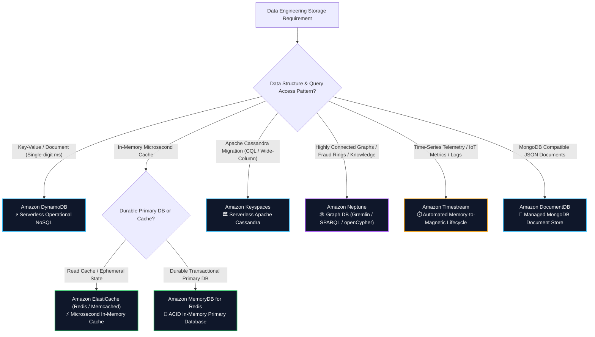
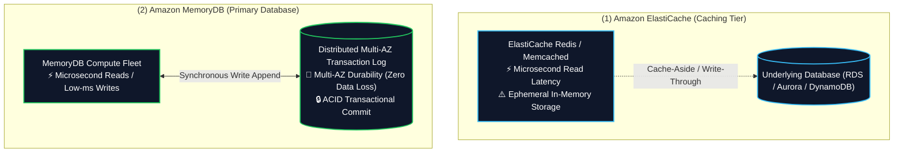
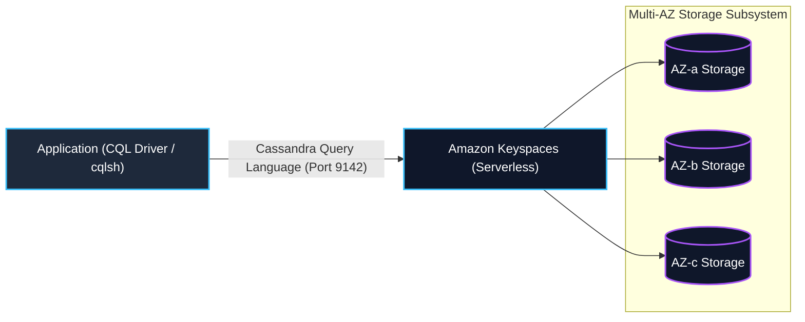
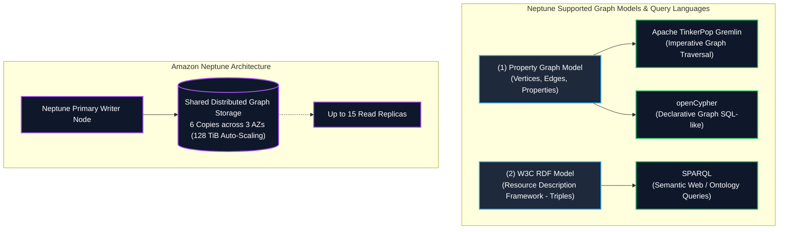
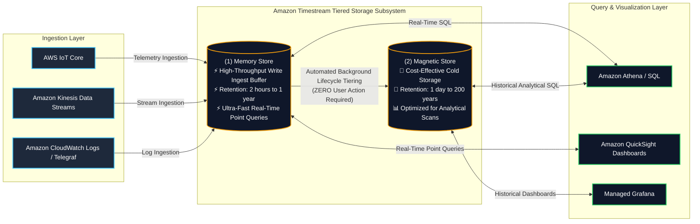
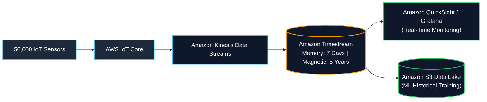

# 🔮 Specialized AWS Databases (ElastiCache, MemoryDB, Keyspaces, Neptune, Timestream, DocumentDB)

- **Category**: Database (Purpose-Built NoSQL & Specialized Engines)
- **Language / ဘာသာစကား**: **English (Original)** | [မြန်မာဘာသာ (Burmese)](/mm/02-services/database/nosql-specialized-databases)
- **Primary Use Case**: Microsecond in-memory caching, durable in-memory primary databases, managed Apache Cassandra, relationship graph traversal, time-series IoT telemetry, and managed MongoDB document storage.
- **Slide Reference**: Pages 214–219 in `[AWSCertifiedDataEngineerSlides.pdf](/docs/AWSCertifiedDataEngineerSlides.pdf)`
- **Hub Links**: [[index]] | [[service-catalog]] | [[domain-2-data-store-management]] | [[domain-1-ingestion-and-processing]] | [[dynamodb]] | [[rds-and-aurora]] | [[redshift]] | [[kinesis]]

---

## 1. High-Level Summary & Purpose-Built Database Strategy

AWS advocates for a **Purpose-Built Database Strategy**: rather than forcing diverse access patterns into a single relational database engine, data engineers select specialized database technologies optimized for specific data structures, query languages, and latency SLAs.

For the **AWS Certified Data Engineer – Associate (DEA-C01)** exam, you must recognize when to select each specialized database:

---

## 2. Amazon ElastiCache vs. Amazon MemoryDB for Redis

### 1. Amazon ElastiCache (Redis OSS / Valkey vs. Memcached)

**Amazon ElastiCache** is a fully managed in-memory data store service delivering sub-millisecond response times.

| Architectural Dimension | ElastiCache Redis / Valkey | ElastiCache Memcached |
| :--- | :--- | :--- |
| **Complex Data Types** | ✅ **Yes** (Strings, Lists, Sets, Sorted Sets, Hashes, Bitmaps, HyperLogLogs, Geospatial) | ❌ **No** (Simple key-value strings and objects only) |
| **Multi-AZ & High Availability** | ✅ **Yes** (Primary with up to 5 read replicas + automated failover) | ❌ **No** (Independent nodes in a cluster without replication) |
| **Data Persistence / Backup** | ✅ **Yes** (RDB snapshots to S3, Append-Only File AOF) | ❌ **No** (Pure volatile memory; data wiped on restart) |
| **Horizontal Sharding** | ✅ **Yes** (Cluster mode with up to 500 shards) | ✅ **Yes** (Multithreaded node scale-out) |
| **Pub/Sub Messaging** | ✅ **Yes** (Built-in publish/subscribe channels) | ❌ **No** |
| **Primary Data Engineering Use Case** | Session management, leaderboard ranking, rate limiting, geospatial caching | Pure multithreaded caching of database queries and web page fragments |

#### Key Caching Strategies for Data Pipelines
1. **Lazy Loading (Cache-Aside)**:
   - Application queries cache first. If a cache miss occurs, the application reads from the primary database, populates the cache with a **Time To Live (TTL)**, and returns data.
   - *Pros*: Only requested data is cached.
   - *Cons*: Cache miss penalty on initial read; potential for stale data if database is updated directly.
2. **Write-Through**:
   - Application writes to the database and the cache simultaneously.
   - *Pros*: Data in cache is never stale.
   - *Cons*: Write latency overhead; cache churn (caching data that may never be read).

---

### 2. Amazon MemoryDB for Redis (Primary In-Memory Database)

- **Architecture**: A Redis-compatible, durable in-memory database built on a **distributed Multi-AZ transaction log**.
- **Durability Guarantee**: Writes are committed to the distributed transaction log across multiple AZs before acknowledging success to the client.
- **ElastiCache vs. MemoryDB Decision Rule**:
  - Choose **Amazon ElastiCache** when you need a high-speed caching tier sitting in front of a persistent database (e.g., RDS or DynamoDB) where losing cached data on node replacement is acceptable.
  - Choose **Amazon MemoryDB** when your application uses Redis as its **primary, authoritative transactional database** and requires zero data loss durability across Multi-AZ failures.

---

## 3. Amazon Keyspaces (for Apache Cassandra)

**Amazon Keyspaces** is a scalable, highly available, and fully managed serverless Apache Cassandra-compatible database service.

### Key Architectural Characteristics
1. **Zero Infrastructure Management**: Eliminates managing Apache Cassandra clusters, JVM garbage collection tuning, compaction strategies, and node repair tasks.
2. **Serverless Capacity Modes**:
   - **On-Demand Capacity**: Pay per read/write request; handles unpredictable workloads.
   - **Provisioned Capacity**: Pre-allocate Read/Write Capacity Units with Application Auto Scaling.
3. **Data Model**: Wide-column tables using **CQL (Cassandra Query Language)** with Partition Keys (hash distribution) and Clustering Columns (sorting within partitions).
4. **Built-in Enterprise Features**:
   - **Point-in-Time Recovery (PITR)**: Continuous automated backups up to 35 days.
   - **Time to Live (TTL)**: Automatically expires records at zero resource cost.
   - **Multi-AZ Durability**: 99.999% durability replicated across 3 AZs.
5. **Top DEA-C01 Use Case**: Migrating on-premises **Apache Cassandra** applications to AWS without rewriting application code or CQL data access logic.

---

## 4. Amazon Neptune (Graph Database Engine)

**Amazon Neptune** is a purpose-built, high-performance graph database optimized for storing complex relationships and traversing billions of connected data points with millisecond latency.

### 1. Graph Data Models & Languages
- **Property Graph**: Data is modeled as **Nodes/Vertices** (entities), **Edges** (relationships), and **Properties** (key-value attributes).
  - *Query Languages*: **Apache TinkerPop Gremlin** (imperative traversal) and **openCypher** (declarative pattern matching).
- **W3C RDF (Resource Description Framework)**: Data is modeled as **Subject-Predicate-Object triples** (e.g., `Alice` $\rightarrow$ `isFriendWith` $\rightarrow$ `Bob`).
  - *Query Language*: **SPARQL**.

### 2. Advanced Neptune Capabilities
- **Neptune Serverless**: Automatically scales graph compute capacity in Neptune Capacity Units (NCUs) up and down in fine-grained steps.
- **Neptune Analytics**: An in-memory analytics engine that loads graph data to execute vector search and complex graph algorithms (PageRank, Connected Components, Shortest Path) across tens of billions of edges in seconds.
- **Neptune ML**: Integrates natively with Amazon SageMaker to perform Graph Neural Network (GNN) predictions directly via Gremlin/openCypher queries.

### 3. Top DEA-C01 Use Cases for Neptune
- **Fraud Detection Rings**: Uncovering fraud rings where multiple accounts share addresses, credit cards, or phone numbers.
- **Identity Resolution & Knowledge Graphs**: Linking disparate user profiles across devices into a unified 360-degree customer graph.
- **Recommendation Engines**: Finding friends-of-friends or related products based on multi-hop network paths.

---

## 5. Amazon Timestream (Serverless Time-Series Database)

**Amazon Timestream** is a serverless, purpose-built time-series database designed to ingest, store, and analyze trillions of time-stamped events per day from IoT sensors, application metrics, clickstreams, and operational telemetry.

### 1. Automated Two-Tier Storage Lifecycle (Crucial Exam Concept)

1. **Memory Store (Ingestion Buffer)**:
   - Optimized for high-throughput concurrent writes and sub-second point queries on recent data.
   - Configurable retention: **2 hours to 1 year**.
2. **Magnetic Store (Historical Archive)**:
   - Cost-effective, highly durable storage optimized for large historical analytical queries.
   - Configurable retention: **1 day to 200 years**.
3. **Automated Data Tiering**:
   - Timestream **automatically moves data from Memory Store to Magnetic Store** based on your configured retention period without writing custom ETL jobs or lifecycle scripts.

### 2. Timestream Data Model
- **Dimensions**: Metadata attributes identifying the data source (e.g., `device_id`, `region`, `sensor_model`). Dimensions are indexed for fast filtering.
- **Measure Name & Measure Value**: The actual metric recorded (e.g., `temperature = 78.4`, `cpu_usage = 92.1`). Supports multi-measure records (storing multiple metrics in a single timestamped event).
- **Time**: Nanosecond-precision timestamp.

### 3. Built-in Time-Series SQL Functions
Timestream uses ANSI SQL with built-in analytical functions:
- **Interpolation**: Filling missing sensor gaps with linear or step interpolation.
- **Smoothing & Moving Averages**: Rolling calculations across variable time windows.
- **Downsampling / Aggregation**: Computing hourly/daily rollups on raw telemetry.

---

## 6. Amazon DocumentDB (with MongoDB compatibility)

**Amazon DocumentDB** is a fully managed, scale-out document database service designed for storing, querying, and indexing JSON/BSON data at scale.

- **Architecture**: Decouples compute from storage (similar to Amazon Aurora):
  - Shared distributed storage volume replicated **6 times across 3 AZs** (up to 128 TiB auto-scaling storage).
  - Up to **15 read replicas** with sub-10ms replication latency.
- **Compatibility**: Compatible with Apache 2.0 open-source MongoDB 3.6, 4.0, and 5.0 APIs and drivers.
- **Top DEA-C01 Use Case**: Migrating self-hosted **MongoDB** clusters to AWS without rewriting application queries or data models.

---

## 7. Comprehensive Database Selection Matrix for Data Engineers

| Service | Primary Data Model | Query Interface / API | Concurrency & Latency | Storage Lifecycle & Tiering | Top DEA-C01 Exam Fit |
| :--- | :--- | :--- | :--- | :--- | :--- |
| **Amazon DynamoDB** | Key-Value / Document | DynamoDB SDK / PartiQL | Millions req/s, single-digit ms | TTL to DynamoDB Streams / S3 Export | Operational NoSQL, session state, real-time CDC |
| **Amazon ElastiCache** | In-Memory Key-Value & Data Structures | Redis OSS / Memcached API | Millions req/s, **Microseconds** | Volatile in-memory with LRU/TTL eviction | Read cache for databases, web sessions, leaderboards |
| **Amazon MemoryDB** | In-Memory Document & Structures | Redis API (ACID Durable) | Sub-ms reads, low-ms writes | In-memory with Multi-AZ transaction log | Primary transactional database using Redis data types |
| **Amazon Keyspaces** | Wide-Column Store | CQL (Cassandra Query Language) | Massive write scale, low ms | Native TTL & PITR backup | Managed Apache Cassandra migration |
| **Amazon Neptune** | Property Graph / W3C RDF | Gremlin, openCypher, SPARQL | Complex multi-hop graph queries | 128 TiB auto-scaling shared storage | Fraud ring detection, knowledge graphs, social networks |
| **Amazon Timestream** | Time-Series (Telemetry) | ANSI SQL + Time-Series Functions | High-throughput ingestion | **Automated Memory-to-Magnetic lifecycle** | IoT metrics, application monitoring, sensor analytics |
| **Amazon DocumentDB** | JSON / BSON Documents | MongoDB API | Read-heavy scale-out, low ms | 128 TiB auto-scaling shared storage | Managed MongoDB workload migration |
| **Amazon Redshift** | Columnar Relational (OLAP) | PostgreSQL-compatible SQL | Complex analytical joins on PBs | S3 Spectrum tiering & RMS storage | Data warehousing, enterprise BI, complex SQL queries |

---

## 8. Data Engineering Production Architecture Patterns

### Pattern A: Real-Time IoT Telemetry & Predictive Maintenance Pipeline

- **Challenge**: An industrial manufacturing plant monitors 50,000 machines emitting temperature, vibration, and pressure telemetry every second. The system requires real-time alerting and 5-year historical trend analytics.
- **Solution**:
  - Sensors stream data into **AWS IoT Core** $\rightarrow$ **Amazon Kinesis Data Streams**.
  - Kinesis writes directly to **Amazon Timestream**.
  - Timestream retains data in **Memory Store for 7 days** (serving real-time Grafana dashboards) and automatically tiers to **Magnetic Store for 5 years**.
  - Scheduled queries aggregate hourly averages and save Parquet datasets to **Amazon S3** for machine learning training in [[sagemaker-and-ai]].

### Pattern B: Real-Time Financial Fraud Ring Detection with Neptune

- **Challenge**: Fraudulent actors create synthetic identities using shared bank accounts, phone numbers, and IP addresses across thousands of credit card applications. Relational SQL join queries take minutes and time out.
- **Solution**:
  - Ingest transaction records into **Amazon Neptune** via AWS Lambda.
  - Neptune models users, cards, devices, and addresses as vertices, and shared interactions as edges.
  - Real-time **Gremlin / openCypher** graph traversal queries traverse 4+ hops in milliseconds to detect circular rings and immediately flag transactions for review.

---

## 9. DEA-C01 High-Frequency Exam Tips & Traps

> [!IMPORTANT]
> **Key Exam Trigger Keywords**:
>
> - **"Time-stamped IoT telemetry or metrics with automated lifecycle tiering from memory to cold storage"** $\rightarrow$ **Amazon Timestream**.
> - **"Relationship graph traversal, fraud ring detection, social connections, Apache TinkerPop Gremlin / SPARQL / openCypher"** $\rightarrow$ **Amazon Neptune**.
> - **"Migrate on-premises Apache Cassandra workload without code changes using CQL"** $\rightarrow$ **Amazon Keyspaces**.
> - **"Microsecond in-memory read caching with complex data structures (sets, sorted sets, leaderboards)"** $\rightarrow$ **Amazon ElastiCache for Redis**.
> - **"Primary in-memory database with ACID transactional durability across Multi-AZ"** $\rightarrow$ **Amazon MemoryDB for Redis**.
> - **"Migrate MongoDB JSON documents to a fully managed AWS database"** $\rightarrow$ **Amazon DocumentDB**.

> [!WARNING]
> **Common Exam Traps & Pitfalls**:
>
> 1. **ElastiCache vs. MemoryDB Trap**:
>    - If the scenario describes an **in-memory cache** on top of a relational database, select **ElastiCache**.
>    - If the scenario describes a **primary transactional database** with zero tolerance for data loss on node crashes, select **MemoryDB**.
> 2. **Timestream Storage Tiering Trap**:
>    - Timestream data lifecycle transition from Memory to Magnetic store is **100% automated**. You do *not* need AWS Lambda, AWS Glue, or S3 lifecycle rules to move time-series data between tiers.
> 3. **Neptune Query Language Trap**:
>    - Neptune supports **Gremlin** and **openCypher** for Property Graphs, and **SPARQL** for RDF graphs. Neptune does *not* use standard SQL!
> 4. **Keyspaces vs. DynamoDB**:
>    - Both are wide-column/key-value NoSQL engines. If the question mentions **Cassandra Query Language (CQL)** or **Apache Cassandra migration**, choose **Keyspaces**. For general AWS-native serverless key-value/document stores, choose **DynamoDB**.

---

## 📌 Related Notes

- [[dynamodb]] — Serverless NoSQL operational database and DynamoDB Streams
- [[rds-and-aurora]] — Relational OLTP database engines and Aurora distributed storage
- [[redshift]] — Petabyte-scale OLAP data warehouse
- [[kinesis]] — Ingesting streaming telemetry into specialized databases
- [[s3]] — S3 Data Lake archiving and downstream analytics
- [[sagemaker-and-ai]] — Machine learning feature extraction and Neptune ML
- [[service-comparisons]] — Master DEA-C01 Service Decision Matrix
- [[domain-2-data-store-management]] — DEA-C01 Domain 2 Study Guide
