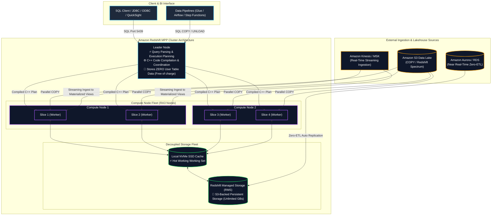
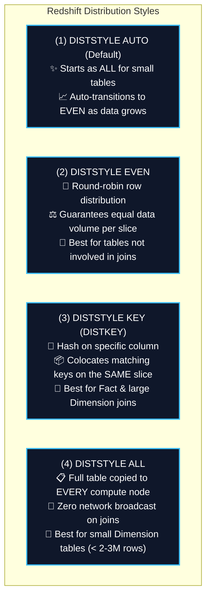
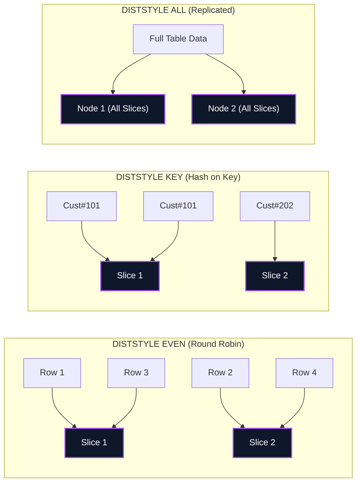
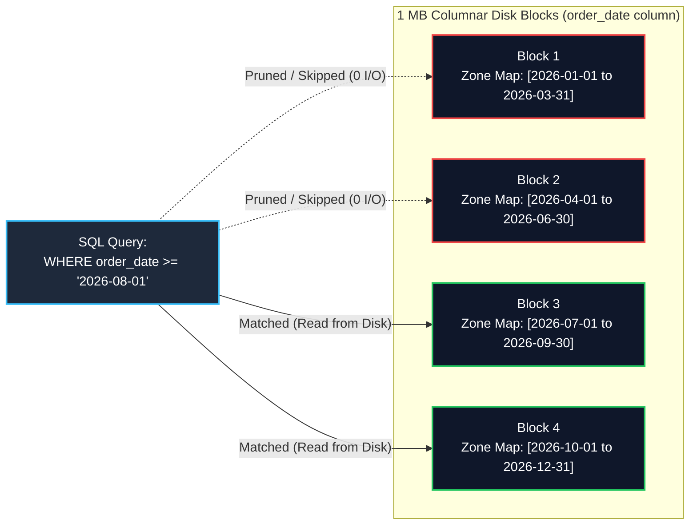
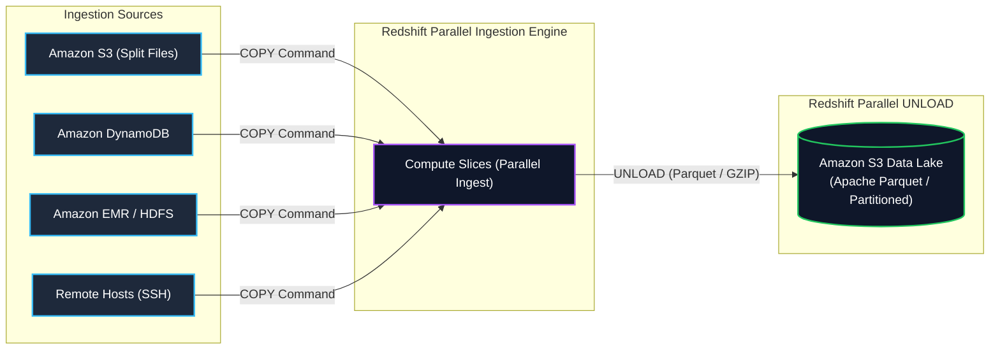
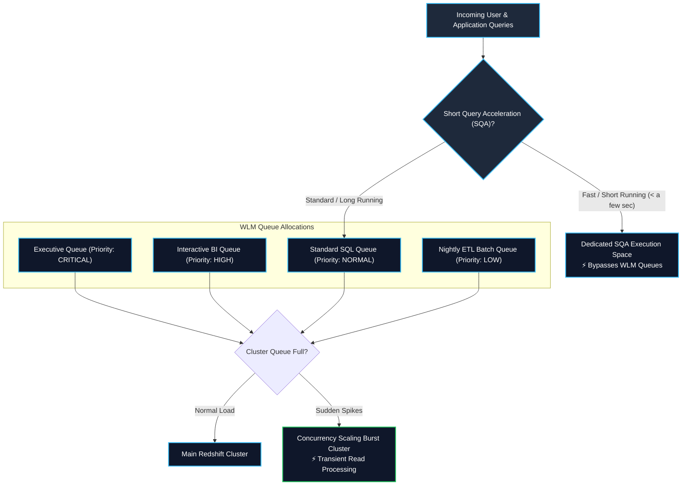
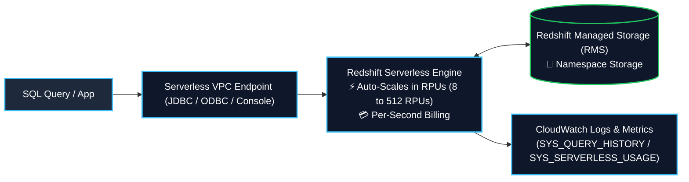
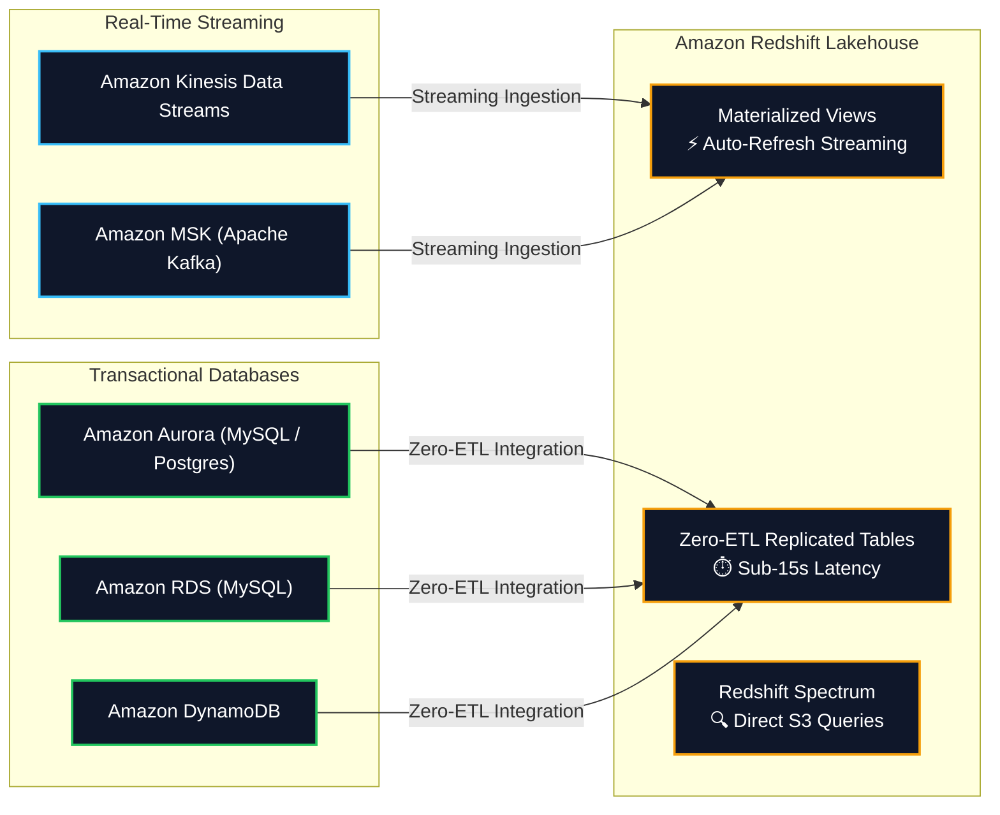

# 🔴 Amazon Redshift (Petabyte-Scale Cloud Data Warehouse & Lakehouse)

- **Category**: Database (Petabyte-Scale Columnar OLAP Data Warehouse)
- **Language / ဘာသာစကား**: **English (Original)** | [မြန်မာဘာသာ (Burmese)](file:///home/monetine/Workspace/Wathon/aws-dea-c01/content/mm/02-services/database/redshift.md)
- **Primary Use Case**: Enterprise data warehousing, high-performance complex SQL analytics, BI reporting, Data Lakehouse querying with Redshift Spectrum, Serverless data processing, Zero-ETL replication, and real-time streaming ingestion.
- **Slide Reference**: Pages 220–265 in `[[AWSCertifiedDataEngineerSlides.pdf]]`
- **Hub Links**: [[index]] | [[service-catalog]] | [[domain-2-data-store-management]] | [[domain-1-ingestion-and-processing]] | [[athena]] | [[glue]] | [[s3]] | [[rds-and-aurora]] | [[kinesis]] | [[kms-and-secrets]]

---

## 1. High-Level Summary

**Amazon Redshift** is a fully managed, petabyte-scale, columnar Massively Parallel Processing (MPP) data warehouse service. It delivers up to **10x higher performance** than traditional relational databases for analytical queries (OLAP) by distributing and parallelizing query execution across a cluster of compute nodes, utilizing columnar storage, and leveraging hardware-accelerated local cache combined with decoupled cloud storage.

For the **AWS Certified Data Engineer – Associate (DEA-C01)** exam, Redshift is tested across:
1. **MPP & Decoupled Storage Architecture**: Leader node coordination, compute node slices, and persistent S3-backed **Redshift Managed Storage (RMS)**.
2. **Table Design & Performance Tuning**: Selecting optimal **Distribution Styles (`DISTSTYLE KEY / ALL / EVEN / AUTO`)** and **Sort Keys (`Compound` vs. `Interleaved` & Zone Maps)**.
3. **High-Throughput Bulk Ingestion**: Parallel loading using the **`COPY` command**, manifest files, S3 file splitting math ($N \times \text{Slices}$), and columnar encodings (**`AZ64` / `ZSTD`**).
4. **Data Lakehouse & Federation**: Querying exabytes of open-format S3 data with **Redshift Spectrum**, and transactional operational data via **Federated Queries** and **Zero-ETL Ingestion**.
5. **Workload Management (WLM) & Scalability**: Automatic WLM, Short Query Acceleration (SQA), Concurrency Scaling, and **Redshift Serverless (RPUs)**.
6. **Data Sharing, Data API & In-Database ML**: Zero-copy cross-cluster **Redshift Data Sharing**, asynchronous **Redshift Data API**, and SQL-based **Redshift ML**.



---

## 2. Massively Parallel Processing (MPP) & Storage Architecture

### 1. Leader Node vs. Compute Nodes & Slices
- **Leader Node**:
  - Serves as the master endpoint for JDBC/ODBC client connections.
  - Parses incoming SQL statements, builds optimized query execution trees, compiles them into executable C++ binaries, and distributes the code to compute nodes.
  - Aggregates intermediate query results from compute nodes before returning final records to the client.
  - **Cost Rule**: The leader node is **free of charge** when running clusters with two or more compute nodes. User table data is **never stored on the leader node**.
- **Compute Nodes & Slices**:
  - Compute nodes execute the compiled query code on their assigned data partitions in parallel.
  - Each compute node is subdivided into logical processing units called **Slices**.
  - Each slice is allocated dedicated CPU, memory, and disk space (e.g., `ra3.4xlarge` has 4 slices; `ra3.16xlarge` has 16 slices).
  - All slices in the cluster process query steps simultaneously.

### 2. Node Families: RA3 vs. Dense Compute (DC2)

| Node Family | Architecture & Storage Model | Best DEA-C01 Use Case |
| :--- | :--- | :--- |
| **RA3 Nodes (`ra3.xlplus`, `ra3.4xlarge`, `ra3.16xlarge`)** | **Decoupled Compute & Storage**: High-performance local NVMe SSD cache combined with persistent **Redshift Managed Storage (RMS)** backed by Amazon S3. Storage scales automatically up to **128 TB per node**. | **Recommended modern default** for all production workloads. Allows scaling compute and storage independently. |
| **Dense Compute (`dc2.large`, `dc2.8xlarge`)** | **Tightly Coupled Compute & Local SSD**: Fixed local NVMe SSD storage. Cannot scale storage without adding more compute nodes. | Small data marts (< 500 GB) or development environments requiring intensive compute with static storage. |

### 3. Columnar Storage & 1 MB Blocks
- **Columnar Layout**: Data is organized physically on disk by column rather than by row. Drastically reduces disk I/O because queries only retrieve columns explicitly requested in the SQL `SELECT` list.
- **1 MB Immutable Blocks**: Redshift stores data in 1 MB disk blocks. Each block contains values for a single column, enabling high compression ratios.

---

## 3. Table Design: Distribution Styles (`DISTSTYLE`)

Choosing the correct Distribution Style (`DISTSTYLE`) minimizes network I/O and data movement across compute slices during `JOIN` and `GROUP BY` operations.





### Distribution Style Matrix & Decision Rules

| Style | Syntax Example | Placement Behavior | Ideal Data Engineering Use Case |
| :--- | :--- | :--- | :--- |
| **`KEY`** | `DISTSTYLE KEY DISTKEY(customer_id)` | Hashing algorithm places rows with matching key values on the **exact same slice**. | **Large Fact Tables** joined frequently with large Dimension tables on the same join key. |
| **`ALL`** | `DISTSTYLE ALL` | Replicates the **entire table to node 0 of every compute node**. | **Small, slowly changing Dimension Tables** (< 2–3 million rows or < a few GBs). |
| **`EVEN`** | `DISTSTYLE EVEN` | Distributes rows evenly across all slices in a **round-robin** pattern. | Tables that are not joined with other tables, or when no clear join key exists. |
| **`AUTO`** | `DISTSTYLE AUTO` | Redshift manages distribution: assigns `ALL` when table is small, transitions to `EVEN` as data grows. | Default when query access patterns are not yet established. |

### Diagnosing Data Redistribution in Query Plans (`EXPLAIN`)
- **`DS_DIST_NONE` (Optimal)**: Zero network data movement. Both tables are colocated on the same slices via matching `DISTKEY`s or `DISTSTYLE ALL`.
- **`DS_BCAST_INNER` (Acceptable for Small Tables)**: The inner table is broadcast across the network to all compute nodes.
- **`DS_DIST_BOTH` (Worst Performance)**: Both tables must be redistributed across the network. Indicates poorly designed or missing `DISTKEY`s!

---

## 4. Table Design: Sort Keys, Zone Maps & Compression

### 1. In-Memory Zone Maps (Block-Skipping Mechanism)
- For every 1 MB disk block, Redshift automatically stores the **`MIN` and `MAX` values** of each column in memory (**Zone Maps**).
- When a query filters with a `WHERE` clause (e.g., `WHERE order_date BETWEEN '2026-08-01' AND '2026-08-10'`), Redshift consults Zone Maps to **completely skip (prune) non-matching 1 MB disk blocks**, avoiding unnecessary disk I/O.



### 2. Compound Sort Key vs. Interleaved Sort Key

| Sort Key Type | Technical Mechanics | Best Query Pattern |
| :--- | :--- | :--- |
| **Compound Sort Key (Default)** | Strict hierarchical sort order `(col1, col2)`. Sorts by `col1` first, then by `col2` within `col1`. | Queries that filter on the **prefix / leading columns** (e.g., `WHERE col1 = 'val'` or `WHERE col1 = 'val' AND col2 = 'val'`). Excellent for date/timestamp series. |
| **Interleaved Sort Key** | Equal weighting to every column in the sort key. | Queries that filter on **arbitrary, independent combinations of columns** (e.g., `WHERE col2 = 'val'` alone). |
| **Maintenance Warning** | Low maintenance overhead. | High maintenance: requires frequent `VACUUM REINDEX` after bulk data ingestion; degrades if unsorted. |

### 3. Column Compression Encodings
- **`AZ64`**: Proprietary AWS algorithm designed for numeric (`INT`, `BIGINT`, `DECIMAL`), `DATE`, and `TIMESTAMP` columns. Provides highest compression ratio and fastest query execution using SIMD hardware vectorization.
- **`ZSTD`**: High general-purpose compression for wide strings, unstructured text, and `VARCHAR`.
- **`RAW`**: Uncompressed (default for sort key leading columns to maximize range scan speed).

---

## 5. Bulk Data Ingestion & Export (`COPY` & `UNLOAD`)



### 1. `COPY` Command Best Practices (Golden Exam Rules)
- **NEVER use SQL `INSERT` for bulk data**: Single `INSERT` statements route through the Leader node sequentially and write uncompressed blocks. Always use the parallel `COPY` command.
- **S3 File Splitting Math**: Split S3 input files into a **multiple of the total number of slices** in the cluster ($N \times \text{Slices}$). For a 16-slice cluster, split data into 16, 32, or 64 files of equal size (1 MB to 1 GB compressed).
- **Manifest Files**: Use a JSON manifest file (`manifest`) to specify exact S3 file paths and avoid loading unintended files with common prefixes.
- **Example `COPY` Command**:
```sql
COPY public.customer_transactions
FROM 's3://my-analytics-lake/manifests/2026_transactions.manifest'
IAM_ROLE 'arn:aws:iam::123456789012:role/RedshiftS3LoadRole'
FORMAT AS PARQUET
MANIFEST;
```

### 2. Parallel `UNLOAD` to Amazon S3
- Exports query results in parallel from all compute slices to Amazon S3 in **Apache Parquet**, CSV, or text format:
```sql
UNLOAD ('SELECT * FROM customer_sales WHERE sale_date >= \'2026-01-01\'')
TO 's3://my-lakehouse-bucket/unloaded_sales/'
IAM_ROLE 'arn:aws:iam::123456789012:role/RedshiftUnloadRole'
FORMAT AS PARQUET
PARTITION BY (sale_region)
MANIFEST;
```
- **Parquet Unload Advantages**: 2x faster than text unload, uses up to 6x less storage in S3, and is immediately queryable by Athena, EMR, and Redshift Spectrum.

### 3. Spatial Data Types & `DBLINK`
- **Spatial Types**: Native support for `GEOMETRY` and `GEOGRAPHY` data types for geospatial SQL functions (`ST_Distance`, `ST_Contains`).
- **`DBLINK`**: Enables connecting Redshift directly to PostgreSQL / RDS PostgreSQL databases for cross-database querying.

---

## 6. Workload Management (WLM), Concurrency Scaling & SQA

Workload Management (WLM) prevents long-running, resource-heavy ETL queries from blocking fast interactive BI queries.



### 1. Automatic WLM (Auto WLM)
- Uses machine learning to dynamically manage query queues, concurrency levels, and memory allocation.
- Creates up to **8 queues** (default 5 queues with even memory allocation).
- **Query Priorities**: Set priority levels (`CRITICAL`, `HIGH`, `NORMAL`, `LOW`) based on user groups.

### 2. Manual WLM
- Explicitly configured service classes with fixed memory percentages and concurrency levels.
- Default configuration: 1 queue with a concurrency level of 5 (processes 5 queries simultaneously) + 1 Superuser queue with concurrency level 1.

### 3. Short Query Acceleration (SQA)
- Uses machine learning to identify fast-running queries and routes them to a dedicated SQA execution space.
- Prevents fast dashboard queries from waiting behind massive long-running ETL aggregations.

### 4. Concurrency Scaling
- Automatically adds transient compute cluster capacity to handle sudden bursts of concurrent read queries with zero wait time.
- **Credit Rule**: Redshift clusters earn **1 hour of free Concurrency Scaling credits** for every 24 hours the cluster is actively running.

---

## 7. Cluster Operations, Maintenance & Diagnostics

### 1. Cluster Resizing: Elastic Resize vs. Classic Resize

| Dimension | Elastic Resize (Recommended) | Classic Resize |
| :--- | :--- | :--- |
| **Operation Duration** | **Minutes (typically < 10–15 mins)** | **Hours to Days** (Copies entire dataset row-by-row) |
| **Availability During Resize** | Cluster is **unavailable / read-only** for only a few minutes during node restart | Cluster is in **read-only mode** for the entire multi-hour duration |
| **Node Flexibility** | Add/remove nodes of the same type (or double/half node count); can change between RA3 node types | Can change to any arbitrary node type or configuration |
| **Disk Space Redistribution** | Metadata pointers updated instantly on Redshift Managed Storage (RMS) | Full physical data copy into a newly provisioned cluster |

### 2. The `VACUUM` & `ANALYZE` Commands
- **`VACUUM FULL`**: Reclaims disk space from deleted rows and restores sort order for all unsorted rows (most comprehensive).
- **`VACUUM SORT ONLY`**: Restores sort order without reclaiming deleted disk space.
- **`VACUUM DELETE ONLY`**: Reclaims deleted disk space without re-sorting.
- **`VACUUM REINDEX`**: Rebuilds the interleaved sort index (mandatory after bulk loads into tables with Interleaved Sort Keys).
- **Auto Vacuum**: Redshift automatically runs background vacuum operations during periods of cluster inactivity.
- **`ANALYZE`**: Updates optimizer table statistics metadata, allowing the query planner to generate optimal execution plans.

### 3. System Tables & Diagnostic Views

| Prefix | Type | Storage & Description |
| :--- | :--- | :--- |
| **`SYS_`** | Serverless & Provisioned Monitoring | Monitors query history, load metrics, and serverless usage (`SYS_QUERY_HISTORY`, `SYS_LOAD_HISTORY`). |
| **`STV_`** | Snapshot Data | Transient in-memory snapshots of current system execution. |
| **`SVV_`** | Object Metadata | Views referencing STV tables to show database object metadata (`SVV_TABLE_INFO`, `SVV_EXTERNAL_SCHEMAS`). |
| **`STL_`** | Disk Persisted Logs | Persistent log views on disk (`STL_LOAD_ERRORS`, `STL_QUERY`, `STL_WLM_QUERY`). |
| **`SVCS_` / `SVL_`** | Query Details | Execution details on main and Concurrency Scaling clusters (`SVL_QLOG`). |

---

## 8. Amazon Redshift Serverless

**Amazon Redshift Serverless** automatically provisions and scales data warehouse capacity in response to dynamic workloads, charging only for active query run time.



### Technical Details of Redshift Serverless
1. **Redshift Processing Units (RPUs)**:
   - Capacity is measured in **RPUs**. You pay for **RPU-hours per second** of query execution plus storage.
   - **Base Capacity**: Configurable from **8 to 512 RPUs** (defaults to AUTO).
   - **Max Usage Limits**: Set max RPU limits to control daily or monthly cost caps.
2. **Serverless Setup & IAM**:
   - Configured with a **Workgroup** (compute configuration, VPC subnets, security groups) and a **Namespace** (database name, admin credentials, KMS encryption, audit logging).
   - Requires IAM policy with `redshift-serverless:*` permissions.
3. **What Serverless Does NOT Have**:
   - No Parameter Groups.
   - No manual Workload Management (WLM) configuration (handled automatically via ML).
   - No maintenance windows or manual version track configurations.
   - Must be accessed inside a VPC (or VPC endpoint).
4. **Monitoring Serverless**:
   - System views: `SYS_QUERY_HISTORY`, `SYS_LOAD_HISTORY`, `SYS_SERVERLESS_USAGE`.
   - CloudWatch logs delivered automatically under `/aws/redshift/serverless/`.

---

## 9. Data Lakehouse, Federation & Modern Ecosystem Integrations



### 1. Redshift Spectrum & Lakehouse Querying
- Query exabytes of open-format data (Parquet, ORC, JSON, CSV) in **Amazon S3 Data Lakes** without loading it into Redshift tables.
- Uses **AWS Glue Data Catalog** for table schemas (`CREATE EXTERNAL SCHEMA ... FROM DATA CATALOG`).
- External tables can be joined with local Redshift tables in a single SQL query at **$5.00 per TB scanned**.

### 2. Redshift Federated Queries
- Ties Redshift directly to live operational databases in **Amazon RDS** and **Amazon Aurora (PostgreSQL and MySQL)** without ETL pipelines.
- Store database credentials in **AWS Secrets Manager** and create external schema (`CREATE EXTERNAL SCHEMA ... FROM POSTGRES/MYSQL`).

### 3. Redshift Materialized Views
- Precomputes complex multi-table joins and aggregations for recurring BI dashboards.
- Supports incremental refresh (`REFRESH MATERIALIZED VIEW` or `AUTO REFRESH YES`).

### 4. Amazon Redshift Zero-ETL Integration
- Fully managed near real-time (< 15 seconds) transactional replication from **Amazon Aurora**, **Amazon RDS**, and **Amazon DynamoDB** into Redshift.

### 5. Amazon Redshift Streaming Ingestion
- Ingests streaming data directly from **Amazon Kinesis Data Streams** and **Amazon MSK** into Redshift Materialized Views with sub-second latency without S3 staging.

### 6. Redshift Data Sharing
- Enables secure, live, read-only data sharing across Redshift clusters, AWS accounts, or AWS Regions **without copying data or building ETL pipelines**.
- Requires **RA3 node types** and **encrypted clusters**.

### 7. Redshift Lambda User-Defined Functions (UDFs)
- Allows invoking custom AWS Lambda functions directly inside Redshift SQL statements using `CREATE EXTERNAL FUNCTION`.
- Redshift communicates with Lambda using batched JSON payloads.

### 8. Amazon Redshift Data API
- Executes SQL statements via secure asynchronous HTTP/REST endpoints without managing persistent JDBC/ODBC connections or drivers.
- Integrates with **AWS Step Functions**, **Amazon EventBridge**, and AWS SDKs.
- Quotas: 24-hour max query duration, 100 MB result size, 500 active queries, 100 KB statement size.

### 9. Amazon Redshift ML
- Train, compile, and run SageMaker machine learning models directly using standard SQL (`CREATE MODEL ...`).

---

## 10. Security, Governance & Anti-Patterns

### 1. Redshift Security & Encryption
- **Hardware Security Module (HSM)**: Configure trusted connections between Redshift and HSM using client and server certificates. (To migrate an unencrypted cluster to HSM, create a new encrypted cluster and restore data).
- **AWS KMS Encryption**: AES-256 encryption at rest covering data blocks, snapshots, and replicas.
- **Cross-Region Snapshot Copy**: Requires creating a KMS key in the destination Region and associating it with a **Snapshot Copy Grant**.
- **Access Control**: SQL `GRANT` and `REVOKE` commands, Column-Level Security (CLS), and Row-Level Security (RLS).

### 2. Redshift Anti-Patterns (When NOT to use Redshift)
- **Small Datasets ($< \text{a few GBs}$)**: Use **Amazon RDS** instead.
- **OLTP / Transactional Workloads**: Use **Amazon RDS** or **Amazon DynamoDB** instead. Redshift is optimized for OLAP aggregations, not rapid single-row inserts/updates.
- **Unstructured Data**: ETL and structure data first using **Amazon EMR** or **AWS Glue**.
- **BLOB Data (Images, Audio, Videos)**: Store binary files in **Amazon S3** and store only S3 URI string references in Redshift.

---

## 11. High-Frequency DEA-C01 Exam Tips & Traps

> [!IMPORTANT]
> **Key Exam Trigger Keywords**:
>
> - **"Petabyte-scale columnar OLAP data warehouse with complex SQL joins"** $\rightarrow$ **Amazon Redshift**.
> - **"Query S3 data lake using SQL without loading data into warehouse"** $\rightarrow$ **Redshift Spectrum** (via Glue Catalog).
> - **"Asynchronous SQL query execution for Step Functions ETL without JDBC drivers"** $\rightarrow$ **Redshift Data API**.
> - **"Zero-copy live read-only data sharing across clusters/accounts"** $\rightarrow$ **Redshift Data Sharing** (requires RA3 & encryption).
> - **"Near real-time replication from Aurora to Redshift without custom Glue pipelines"** $\rightarrow$ **Amazon Redshift Zero-ETL integration**.
> - **"Fastest bulk load into Redshift"** $\rightarrow$ **`COPY` command from S3 with files split into multiples of slice count**.
> - **"Avoid network broadcast on fact-dimension joins"** $\rightarrow$ **`DISTSTYLE ALL` on small dimension, `DISTSTYLE KEY` on fact table**.
> - **"Prevent short interactive dashboard queries from getting stuck behind long ETL jobs"** $\rightarrow$ **Short Query Acceleration (SQA)**.

> [!WARNING]
> **Common Exam Traps & Pitfalls**:
>
> 1. **SQL `INSERT` vs. `COPY`**: Never use SQL `INSERT` statements for bulk data loading in Redshift. Always choose `COPY`.
> 2. **S3 File Count for `COPY`**: Loading one giant 100 GB file uses only 1 slice, leaving all other slices idle. Always split files to match or multiply the slice count.
> 3. **`DISTSTYLE ALL` on Large Fact Tables**: Never apply `DISTSTYLE ALL` to massive fact tables; it will duplicate billions of rows to every node, exhausting storage.
> 4. **Redshift Serverless Limitations**: Redshift Serverless does not support manual WLM or Parameter Groups.
> 5. **Cross-Region KMS Snapshot Copies**: Requires creating a KMS key in the destination Region and associating it with a **Snapshot Copy Grant**.

---

## 📌 Related Notes

- [[athena]] — Serverless SQL on S3 vs. Redshift Spectrum
- [[s3]] — Amazon S3 Data Lake target for COPY and UNLOAD commands
- [[glue]] — AWS Glue Data Catalog integration for Redshift Spectrum
- [[rds-and-aurora]] — Amazon Aurora Zero-ETL integration with Redshift
- [[kinesis]] — Streaming ingestion into Redshift Materialized Views
- [[dynamodb]] — Exporting DynamoDB to S3 and Redshift
- [[kms-and-secrets]] — KMS encryption and Secrets Manager integration
- [[service-comparisons]] — Master DEA-C01 Service Decision Matrix
- [[domain-2-data-store-management]] — DEA-C01 Domain 2 Study Guide
