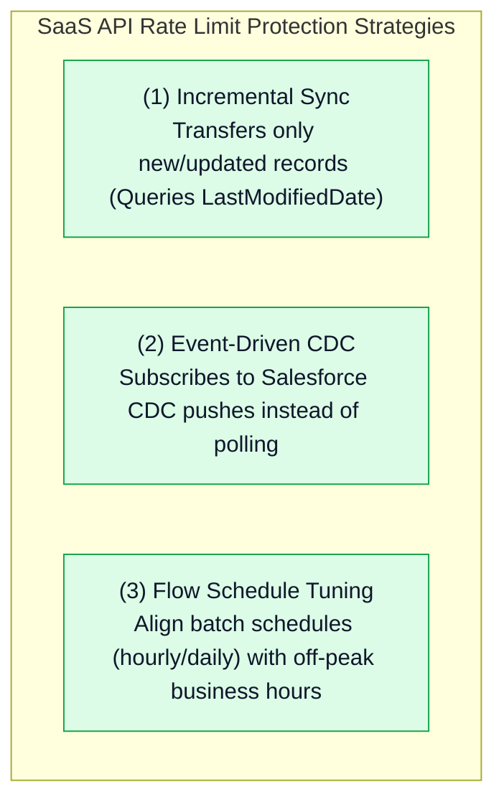

# 🔍 Amazon AppFlow Comparison, API Quota Management & Production Troubleshooting

- **Category**: Application Integration / Service Comparison, API Governance & Production Triage
- **Language / ဘာသာစကား**: **English (Original)** | [မြန်မာဘာသာ (Burmese)](/mm/02-services/integration/appflow/appflow-comparison-and-troubleshooting)
- **Primary Use Case**: Comparing AppFlow against AWS Glue, Lambda, and EventBridge, managing SaaS API quotas, and resolving common production authentication, staging, and network errors.
- **Slide Reference**: Pages 530–537 in `[[AWSCertifiedDataEngineerSlides.pdf]]`
- **Hub Links**: `[[index]]` | `[[appflow]]` | `[[glue]]` | `[[cloudwatch-and-eventbridge]]` | `[[domain-3-data-operations-and-support]]`

---

## 1. High-Level Summary

Choosing the right tool for SaaS data integration is a core data engineering responsibility. While custom scripts in AWS Lambda or complex AWS Glue jobs can ingest SaaS data, **Amazon AppFlow** is specifically engineered as a zero-code, fully managed solution that minimizes operational overhead and natively integrates with AWS security services.

For the **DEA-C01** exam, you must know when to pick AppFlow over AWS Glue or EventBridge, how to prevent **SaaS API rate limiting**, and how to debug **Redshift staging bucket permission issues**.

---

## 2. Ingestion Service Comparison Matrix

| Evaluation Dimension | Amazon AppFlow | AWS Glue (Spark / Python) | Amazon EventBridge | Custom AWS Lambda |
| :--- | :--- | :--- | :--- | :--- |
| **Primary Design** | **Zero-Code SaaS Ingestion** & bidirectional sync. | Heavy ETL, data lake transformations & Spark jobs. | Serverless Event Bus & SaaS Event Routing. | Custom microservice code & lightweight execution. |
| **SaaS Connectors** | **Native Pre-Built Connectors** (Salesforce, SAP, ServiceNow, Zendesk). | Generic JDBC / Custom connectors (Glue Marketplace). | **Native SaaS Partner Event Sources** (webhook push). | Custom REST API calls written in Python/Node.js. |
| **Code Required** | **None** (UI / CloudFormation / Terraform). | High (PySpark / Scala / Python scripts). | None (JSON Event Pattern Rules). | High (Custom code, auth handling, error retries). |
| **Max Data Volume** | **Up to 100 GB per flow run**. | Terabytes to Petabytes (distributed Spark clusters). | Payloads up to **256 KB**. | Payloads up to 6 MB (Synchronous) / 256 KB (SQS). |
| **Transformations** | Field mapping, PII masking, filtering, Parquet conversion. | **Arbitrary complex transformations**, joins, aggregations, ML. | Content filtering, input payload reshaping. | Custom code transformations. |
| **Private Networking** | **AWS PrivateLink** (Salesforce, SAP, Snowflake). | Glue Connections within private VPC subnets. | VPC Endpoints (PrivateLink). | Lambda within VPC. |
| **Pricing Model** | \$0.001 per flow run + \$0.02 per GB data processed. | \$0.44 per DPU-Hour (billed per second). | \$1.00 per million ingested events. | Compute duration (GB-seconds) + invocation count. |

---

## 3. Managing Third-Party SaaS API Rate Limits

SaaS applications enforce strict API rate limiting (e.g., Salesforce daily REST API request limits):

---

## 4. Master Troubleshooting Cheat Sheet

| Symptom / Production Failure | Root Cause | Resolution / Fix |
| :--- | :--- | :--- |
| **Flow fails with `InvalidCredentials` or `TokenRevoked`** | OAuth refresh token expired, or admin revoked connected app permissions in SaaS platform. | Re-authorize the connection in the Amazon AppFlow console to generate a new OAuth token in AWS Secrets Manager. |
| **Salesforce flow fails with `REQUEST_LIMIT_EXCEEDED`** | Polling frequency is too high or Full Transfer is running on huge objects. | Switch transfer mode to **Scheduled Incremental Transfer** or configure an **Event-Driven Flow**. |
| **S3 bucket returns `Access Denied` during flow run** | S3 bucket policy lacks permissions for `appflow.amazonaws.com`. | Add an S3 bucket policy statement granting `appflow.amazonaws.com` `s3:PutObject` and `s3:GetBucketAcl`. |
| **Redshift flow fails during `COPY` command execution** | Target Redshift cluster lacks IAM role permissions to read the S3 staging bucket. | Attach an IAM role to Redshift with `s3:GetObject` on the staging bucket, or fix Redshift security group inbound rules. |
| **Athena queries cannot find new partitions written by AppFlow** | AWS Glue Data Catalog integration was not enabled on the flow. | In AppFlow flow settings, select **Register table with AWS Glue Data Catalog** and select a Glue database. |
| **PrivateLink connection timeout to Salesforce** | Salesforce Private Connect status is in `Pending` or DNS resolution failed. | Verify the Private Connect endpoint is provisioned and approved in both AWS VPC and Salesforce Setup. |

---

## 5. DEA-C01 Exam Essentials

> [!IMPORTANT]
> **Key Exam Decision Triggers for AppFlow Comparison & Triage**:
>
> - **"A company needs to ingest Salesforce data into an S3 data lake with minimal development effort and no custom connector code"** $\rightarrow$ Choose **Amazon AppFlow** over AWS Glue or AWS Lambda.
> - **"Prevent hitting daily Salesforce API limits during hourly data lake synchronization"** $\rightarrow$ Configure AppFlow with **Scheduled Incremental Transfer mode**.
> - **"Resolve Redshift data loading errors in AppFlow"** $\rightarrow$ Verify the **Amazon S3 intermediate staging bucket** and check the **Redshift IAM Role S3 read permissions**.
> - **"Need heavy multi-table distributed joins and machine learning transformations on SaaS data after ingestion"** $\rightarrow$ Ingest with **Amazon AppFlow** into S3 Gold zone, then process with **AWS Glue (Spark)**.

---

## 📌 Related Notes
- `[[appflow]]` — Amazon AppFlow Master Hub
- `[[glue]]` — AWS Glue ETL & Spark Processing
- `[[cloudwatch-and-eventbridge]]` — Amazon EventBridge Routing
- `[[domain-3-data-operations-and-support]]` — Troubleshooting & Operations
