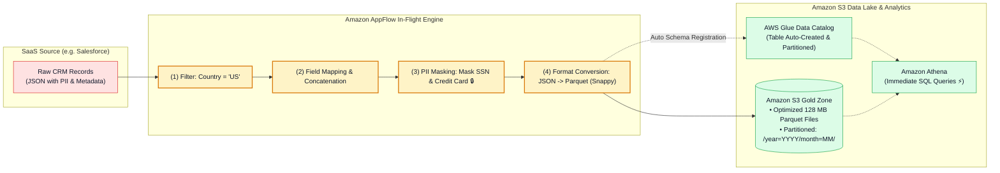
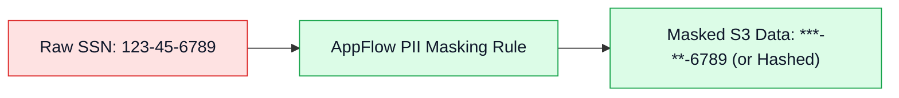

# 🛠️ Amazon AppFlow Data Transformations, PII Masking, Parquet & Glue Catalog

- **Category**: Application Integration / In-Flight Data Preparation, PII Governance & Cataloging
- **Language / ဘာသာစကား**: **English (Original)** | [မြန်မာဘာသာ (Burmese)](/mm/02-services/integration/appflow/appflow-data-transformation-masking-and-catalog)
- **Primary Use Case**: Applying in-flight field mapping, masking sensitive PII before persistence, converting SaaS records to Apache Parquet with Snappy compression, and auto-registering tables in the AWS Glue Data Catalog.
- **Slide Reference**: Pages 530–537 in `[[AWSCertifiedDataEngineerSlides.pdf]]`
- **Hub Links**: `[[index]]` | `[[appflow]]` | `[[appflow-triggers-and-transfer-modes]]` | `[[glue-data-catalog]]` | `[[athena]]`

---

## 1. High-Level Summary

Amazon AppFlow is more than a simple data pipeline connector—it includes a robust **in-flight data transformation engine**.

Instead of landing raw SaaS JSON into S3 and writing expensive Glue Spark jobs to clean and mask the data, AppFlow allows data engineers to **filter records**, **mask sensitive PII**, **convert data to columnar Apache Parquet**, and **register table schemas in the AWS Glue Data Catalog** directly during the ingestion phase.

---

## 2. In-Flight Data Transformation & Mapping

Amazon AppFlow supports several built-in transformation tasks:

1. **Source-to-Destination Field Mapping**:
   - **Direct 1-to-1 Mapping**: Maps SaaS attributes directly to target columns (e.g., Salesforce `BillingCity` $\rightarrow$ S3 column `city`).
   - **Field Concatenation / Formula Calculations**: Combines multiple source fields into a single destination field (e.g., `FirstName` + `" "` + `LastName` $\rightarrow$ `customer_full_name`).
2. **Source Record Filtering**:
   - Filters out unwanted records at the source before transmission over the network (e.g. `StageName = 'Closed Won'` and `Amount >= 50000`), reducing storage and bandwidth costs.
3. **Data Validation & Error Handling**:
   - Validates fields against strict rules (e.g. check if `ZipCode` matches numeric format). If a record fails validation, AppFlow can either **terminate the flow** or **ignore/drop the bad record** and continue processing.

---

## 3. PII Masking & Data Privacy Compliance

To comply with global regulatory frameworks (**GDPR, HIPAA, PCI-DSS, CCPA**), sensitive Personally Identifiable Information (PII) must not be stored in unencrypted, readable formats in analytics data lakes.

- **Masking Capabilities**:
  - Mask entire field values with asterisks (`***`).
  - Partially mask the first $N$ characters or last $N$ characters (e.g., displaying only the last 4 digits of a credit card).
  - Truncate or hash sensitive identifiers before writing to Amazon S3 or Amazon Redshift.

---

## 4. File Formatting & S3 Partitioning

When writing to Amazon S3, AppFlow handles file layout optimization:

| Optimization Feature | How AppFlow Implements It | Benefit for Athena & Spark |
| :--- | :--- | :--- |
| **Columnar Format Conversion** | Converts row-based SaaS JSON into **Apache Parquet**. | Slashes Athena scan query costs ($5/TB) by up to 90%. |
| **Data Compression** | Applies **Snappy or GZIP** compression to Parquet/CSV files. | Reduces S3 storage footprints and accelerates I/O. |
| **Small File Aggregation** | Aggregates small individual event records into larger files (e.g. 128 MB blocks). | **Prevents the Small File Problem** in Spark and Athena. |
| **Dynamic S3 Partitioning** | Automatically creates time-based S3 prefixes (`/year=YYYY/month=MM/day=DD/`). | Enables efficient partition pruning during analytical SQL queries. |

---

## 5. Automatic AWS Glue Data Catalog Registration

In traditional architectures, after files land in S3, data engineers must run an **AWS Glue Crawler** or manual `MSCK REPAIR TABLE` commands to register table schemas.

### AppFlow's Built-In Catalog Integration:
- AppFlow can be configured to **automatically create and update tables in the AWS Glue Data Catalog**.
- As new Parquet files are written to S3 partitions, AppFlow registers the schema and partitions immediately.
- **Result**: Data analysts can query the newest Salesforce or ServiceNow data in **Amazon Athena** instantly with zero crawler delay!

---

## 6. DEA-C01 Exam Essentials

> [!IMPORTANT]
> **Key Exam Decision Triggers for Transformations & Cataloging**:
>
> - **"Transfer data from Salesforce into an Amazon S3 data lake in Apache Parquet format while masking credit card numbers, without writing custom code"** $\rightarrow$ Configure an **Amazon AppFlow flow with PII Masking and Apache Parquet output format**.
> - **"Make Salesforce data in Amazon S3 immediately queryable via Amazon Athena without running an AWS Glue Crawler"** $\rightarrow$ Enable **AWS Glue Data Catalog integration directly within the Amazon AppFlow flow settings**.
> - **"Avoid creating thousands of tiny 1 KB files in S3 when ingesting streaming SaaS events"** $\rightarrow$ Enable **File Aggregation in AppFlow** to group records into optimized file sizes (e.g. 128 MB).

---

## 📌 Related Notes
- `[[appflow]]` — Amazon AppFlow Master Hub
- `[[appflow-triggers-and-transfer-modes]]` — Flow Triggers & Synchronization
- `[[glue-data-catalog]]` — AWS Glue Data Catalog Deep-Dive
- `[[athena]]` — Serverless SQL Analytics with Amazon Athena
