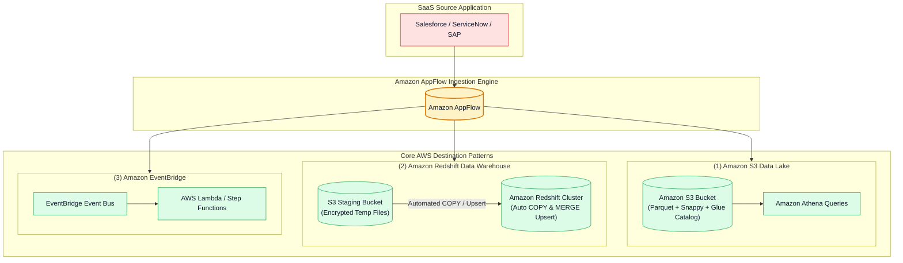
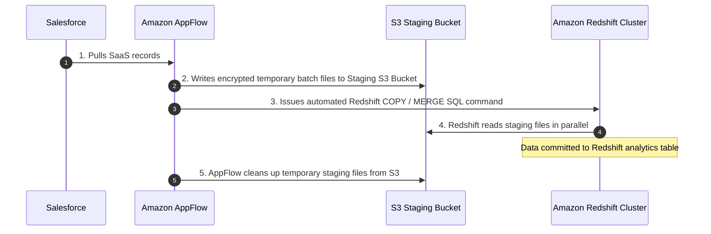

# 🎯 Amazon AppFlow Destination Patterns (Amazon S3, Redshift & EventBridge)

- **Category**: Application Integration / Destination Architectures, Redshift Upsert & Event Routing
- **Language / ဘာသာစကား**: **English (Original)** | [မြန်မာဘာသာ (Burmese)](/mm/02-services/integration/appflow/appflow-destination-patterns-s3-redshift-eventbridge)
- **Primary Use Case**: Architecting AppFlow destinations including Amazon S3 Data Lakes, Amazon Redshift Data Warehouses (with staging buckets and automated MERGE upserts), and Amazon EventBridge event buses.
- **Slide Reference**: Pages 530–537 in `[AWSCertifiedDataEngineerSlides.pdf](/docs/AWSCertifiedDataEngineerSlides.pdf)`
- **Hub Links**: `[[en/index|index]]` | `[[en/02-services/integration/appflow/appflow|appflow]]` | `[[en/02-services/storage/s3/s3|s3]]` | `[[en/02-services/database/redshift|redshift]]` | `[[en/02-services/networking-monitoring/cloudwatch-and-eventbridge|cloudwatch-and-eventbridge]]`

---

## 1. High-Level Summary

Amazon AppFlow supports direct, managed delivery into three core AWS destinations: **Amazon S3** (for data lakes), **Amazon Redshift** (for data warehousing and automated upserts), and **Amazon EventBridge** (for serverless event-driven architectures).

Understanding the technical mechanics of how AppFlow loads each destination—especially the **Redshift S3 staging architecture** and **MERGE write operations**—is heavily tested in the **DEA-C01** exam.

---

## 2. Destination Pattern 1: Amazon S3 (Data Lake Ingestion)

Writing SaaS records to an Amazon S3 data lake is the most common AppFlow pattern.

### Key Configuration Options:
1. **Target S3 Bucket & Prefix**: Define custom folder hierarchies (e.g. `s3://my-lakehouse/salesforce/accounts/`).
2. **File Formatting**: Write data as **Apache Parquet**, CSV, or JSON.
3. **Partitioning**: Configure dynamic timestamp prefixes (`/year=YYYY/month=MM/day=DD/`).
4. **AWS Glue Catalog Integration**: Automatically registers and updates table partitions for instant querying in **Amazon Athena**.

---

## 3. Destination Pattern 2: Amazon Redshift (Data Warehouse Loading)

Loading data from SaaS applications directly into an Amazon Redshift table involves an automated multi-step staging architecture:

---

### Redshift Write Operations:
| Write Mode | How It Works | Ideal Use Case |
| :--- | :--- | :--- |
| **Insert (Append)** | Appends all incoming records as new rows in the Redshift table. | Immutable event logs, audit trails, and clickstreams. |
| **Upsert (MERGE / Update)** | Compares incoming records against existing rows using a defined **Primary Key**. If a match is found, it **updates** the row; if not, it **inserts** a new row. | Keeping CRM Account and Customer records synchronized without duplicates. |
| **Truncate & Insert** | Clears the entire destination table and inserts the new dataset. | Full nightly dimension table refreshes. |

> [!IMPORTANT]
> **Prerequisites for Redshift Ingestion**:
> 1. **Intermediate S3 Staging Bucket**: AppFlow requires an S3 bucket in the same AWS Region to stage temporary files.
> 2. **Redshift IAM Role**: Amazon Redshift must have an IAM role attached with read permissions (`s3:GetObject`, `s3:ListBucket`) to the S3 staging bucket.
> 3. **Database Credentials**: Redshift master username/password stored in **AWS Secrets Manager**.

---

## 4. Destination Pattern 3: Amazon EventBridge (Event-Driven Routing)

When SaaS applications generate real-time operational events (such as a high-priority incident logged in ServiceNow or an enterprise lead created in Salesforce):

- AppFlow routes the event directly to an **Amazon EventBridge custom event bus**.
- **EventBridge Rules** evaluate the event pattern and trigger downstream actions:
  - Invoking an **AWS Step Functions state machine** for multi-step approval workflows.
  - Triggering an **AWS Lambda function** for instant alerting or webhook notifications.
  - Sending the event to an **Amazon SQS queue** for decoupled asynchronous processing.

---

## 5. DEA-C01 Exam Essentials

> [!IMPORTANT]
> **Key Exam Decision Triggers for AppFlow Destinations**:
>
> - **"Synchronize customer records from Salesforce into Amazon Redshift, updating existing customers and inserting new ones without writing custom MERGE scripts"** $\rightarrow$ Configure an **Amazon AppFlow flow to Amazon Redshift using the Upsert write operation with a primary key**.
> - **"What auxiliary AWS resource is required when configuring Amazon AppFlow with Amazon Redshift as the destination?"** $\rightarrow$ An **Amazon S3 intermediate staging bucket**.
> - **"Trigger a serverless Step Functions workflow whenever a Salesforce Opportunity stage changes to 'Closed Won'"** $\rightarrow$ Use **Amazon AppFlow with an Event-Driven trigger sending events to Amazon EventBridge**.

---

## 📌 Related Notes
- `[[en/02-services/integration/appflow/appflow|appflow]]` — Amazon AppFlow Master Hub
- `[[en/02-services/integration/appflow/appflow-data-transformation-masking-and-catalog|appflow-data-transformation-masking-and-catalog]]` — Transformations & Glue Catalog
- `[[en/02-services/database/redshift|redshift]]` — Amazon Redshift Data Warehouse Deep-Dive
- `[[en/02-services/networking-monitoring/cloudwatch-and-eventbridge|cloudwatch-and-eventbridge]]` — Amazon EventBridge Routing
