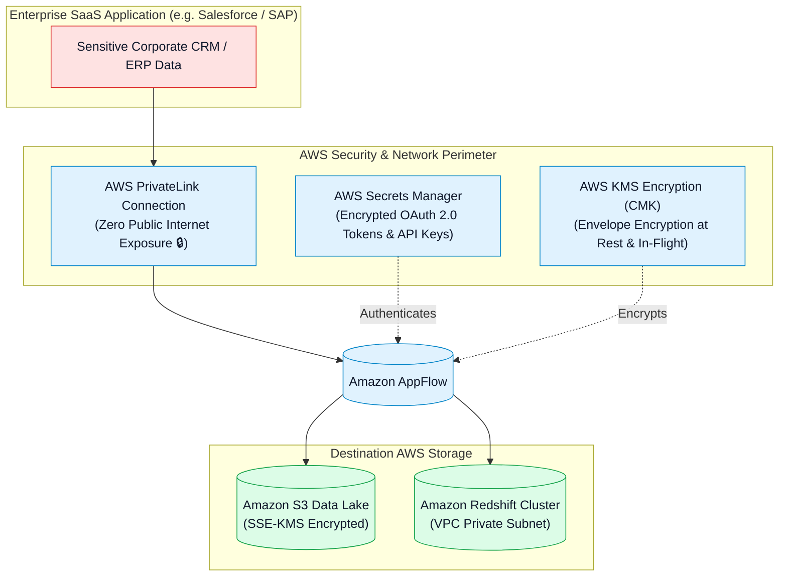

# 🛡️ Amazon AppFlow Security, AWS PrivateLink, KMS Encryption & IAM Governance

- **Category**: Application Integration / Enterprise SaaS Security, Private Networking & Key Management
- **Language / ဘာသာစကား**: **English (Original)** | [မြန်မာဘာသာ (Burmese)](/mm/02-services/integration/appflow/appflow-security-privatelink-and-kms)
- **Primary Use Case**: Establishing private connections between SaaS applications and AWS via AWS PrivateLink, encrypting in-flight and at-rest data with AWS KMS CMKs, and managing OAuth credentials.
- **Slide Reference**: Pages 530–537 in `[[AWSCertifiedDataEngineerSlides.pdf]]`
- **Hub Links**: `[[index]]` | `[[appflow]]` | `[[kms-and-secrets]]` | `[[iam]]` | `[[vpc-and-networking]]`

---

## 1. High-Level Summary

Enterprise SaaS data integration demands stringent security controls. Amazon AppFlow provides enterprise-grade governance through **AWS PrivateLink** (preventing sensitive data from ever traversing the public internet), **AWS KMS Customer Managed Key encryption**, and **automated OAuth token management** via AWS Secrets Manager.

For the **DEA-C01** exam, you must master the **PrivateLink architecture for Salesforce and SAP**, the necessary **S3 Bucket Policies for AppFlow**, and **KMS key permissions**.



---

## 2. AWS PrivateLink for SaaS Applications

By default, SaaS integrations communicate over the public internet using HTTPS/TLS. For highly regulated industries (healthcare, finance, government), sending sensitive records over the public internet violates compliance mandates.

### PrivateLink Architecture with AppFlow:
- Amazon AppFlow integrates natively with **AWS PrivateLink** and **Salesforce Private Connect / SAP PrivateLink**.
- A dedicated, isolated network tunnel is provisioned directly between the SaaS vendor's cloud infrastructure and your AWS environment.
- **Key Advantage**: Data flows entirely over the private AWS global network backbone, eliminating exposure to internet-based security vectors (such as DNS spoofing or man-in-the-middle attacks).

---

## 3. Data Encryption at Rest & In Transit

1. **Encryption in Transit**:
   - All network communication between SaaS endpoints, AppFlow, and AWS services is encrypted using **TLS 1.2 or TLS 1.3**.
2. **Encryption at Rest**:
   - AppFlow automatically encrypts data while processing flows using **AWS KMS**.
   - **KMS Customer Managed Keys (CMK)**: You can select a custom KMS CMK to maintain complete cryptographic control over your data keys and enable key rotation.

---

## 4. Destination S3 Bucket Policy Requirements

To allow Amazon AppFlow to write files into an Amazon S3 bucket, the S3 bucket policy must explicitly grant permissions to the **`appflow.amazonaws.com` service principal**:

```json
{
  "Version": "2012-10-17",
  "Statement": [
    {
      "Sid": "AllowAppFlowToWriteToS3",
      "Effect": "Allow",
      "Principal": {
        "Service": "appflow.amazonaws.com"
      },
      "Action": [
        "s3:PutObject",
        "s3:GetBucketAcl",
        "s3:PutObjectAcl"
      ],
      "Resource": [
        "arn:aws:s3:::my-production-saas-datalake",
        "arn:aws:s3:::my-production-saas-datalake/*"
      ],
      "Condition": {
        "StringEquals": {
          "aws:SourceAccount": "123456789012"
        }
      }
    }
  ]
}
```

---

## 5. Authentication & OAuth Token Governance

- **OAuth 2.0 Integrations**: Supported for Salesforce, Slack, Zendesk, Marketo, and Google Analytics.
- **Automated Token Management**: When you authorize a SaaS connection in AppFlow, AWS securely stores the OAuth refresh tokens in **AWS Secrets Manager** (encrypted with KMS).
- AppFlow automatically refreshes expired access tokens in the background without requiring manual re-authentication by administrators.

---

## 6. DEA-C01 Exam Essentials

> [!IMPORTANT]
> **Key Exam Decision Triggers for AppFlow Security**:
>
> - **"Transfer highly sensitive financial data between Salesforce and Amazon S3 without exposing traffic to the public internet"** $\rightarrow$ Use **Amazon AppFlow with AWS PrivateLink (Salesforce Private Connect)**.
> - **"S3 bucket returns Access Denied when an AppFlow flow runs"** $\rightarrow$ Attach an **S3 Bucket Policy** granting `appflow.amazonaws.com` permissions for `s3:PutObject`, `s3:GetBucketAcl`, and `s3:PutObjectAcl`.
> - **"Customer requires full control and audit logging of encryption keys used by AppFlow"** $\rightarrow$ Configure AppFlow with an **AWS KMS Customer Managed Key (CMK)**.

---

## 📌 Related Notes
- `[[appflow]]` — Amazon AppFlow Master Hub
- `[[kms-and-secrets]]` — AWS KMS Encryption & Secrets Manager
- `[[iam]]` — IAM Policies & Service Principals
- `[[vpc-and-networking]]` — AWS PrivateLink & Interface Endpoints
