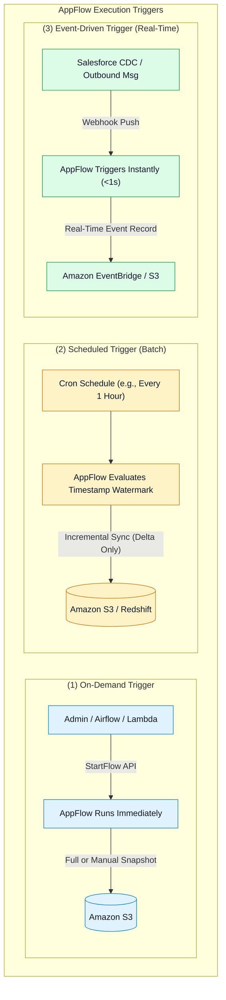
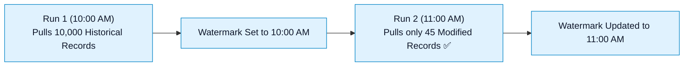

# ⏱️ Amazon AppFlow Triggers, Incremental Transfer & Event-Driven Execution

- **Category**: Application Integration / Flow Execution Triggers & Synchronization Modes
- **Language / ဘာသာစကား**: **English (Original)** | [မြန်မာဘာသာ (Burmese)](/mm/02-services/integration/appflow/appflow-triggers-and-transfer-modes)
- **Primary Use Case**: Configuring On-Demand, Scheduled (Incremental Sync), and Event-Driven flow triggers to optimize SaaS ingestion pipelines while respecting third-party API quotas.
- **Slide Reference**: Pages 530–537 in `[AWSCertifiedDataEngineerSlides.pdf](/docs/AWSCertifiedDataEngineerSlides.pdf)`
- **Hub Links**: `[[index]]` | `[[appflow]]` | `[[appflow-data-transformation-masking-and-catalog]]` | `[[appflow-destination-patterns-s3-redshift-eventbridge]]`

---

## 1. High-Level Summary

Amazon AppFlow provides three distinct execution triggers to accommodate both batch and real-time data engineering patterns: **On-Demand**, **Scheduled**, and **Event-Driven**.

For the **DEA-C01** exam, you must understand how **Incremental Transfer** operates in scheduled flows (tracking timestamp watermarks to transfer only delta changes) and which SaaS sources support **Event-Driven real-time streaming**.

---

## 2. Deep Dive: The 3 Flow Trigger Types

### 1. On-Demand Trigger:
- Executed manually via the AWS Management Console or programmatically via the AWS CLI / Boto3 SDK (`appflow.start_flow(flowName='SalesforceToS3')`).
- *Best For*: One-time historical data backfills, ad-hoc pipeline testing, or orchestration from external workflow tools like **AWS Step Functions** or **Apache Airflow (MWAA)**.

---

### 2. Scheduled Trigger (Batch Synchronization):
- Runs automatically at fixed time intervals (e.g. every 5 minutes, hourly, daily, or on custom cron expressions).
- **Transfer Modes**:
  1. **Incremental Transfer (Recommended)**: AppFlow tracks the `LastModifiedDate` or timestamp watermark of the source SaaS object. On each scheduled run, AppFlow **only transfers records created or updated since the previous flow run**, drastically saving API quota and downstream compute costs.
  2. **Full Transfer**: Pulls the entire dataset on every execution, overwriting or appending to the destination.

---

### 3. Event-Driven Trigger (Real-Time Ingestion):
- AppFlow establishes a persistent listener or webhook integration with the SaaS provider.
- As soon as a business event occurs (e.g., a new opportunity is created in Salesforce or a support ticket is updated in Zendesk), the SaaS provider notifies AppFlow, which immediately processes and delivers the record to the AWS destination in real-time.
- *Supported Sources*: Salesforce (via Change Data Capture / Platform Events), Zendesk, Slack, Marketo.

---

## 3. Flow Triggers & Transfer Modes Comparison

| Trigger Type | Execution Latency | Transfer Mode Options | API Quota Impact | Common Use Case |
| :--- | :--- | :--- | :--- | :--- |
| **On-Demand** | Immediate upon invocation. | Full or Incremental (if timestamp provided). | Controlled by manual run. | Backfills, disaster recovery, test runs, MWAA DAG triggers. |
| **Scheduled** | Interval-based (1 min to 30 days). | **Incremental Transfer** or Full Transfer. | Low (only queries delta changes). | Nightly ERP sync, hourly CRM data lake updates. |
| **Event-Driven** | Real-time (sub-second to seconds). | Single-event streaming. | Event-based push (no constant polling API calls). | Real-time fraud detection, instant customer onboarding alerts. |

---

## 4. Managing SaaS API Rate Limits & Quotas

Enterprise SaaS applications (such as Salesforce and ServiceNow) enforce strict daily REST/SOAP API call limits per organization:

> [!TIP]
> **Production Best Practice for API Optimization**:
> 1. **Always select Incremental Transfer** for scheduled batch flows to prevent pulling hundreds of thousands of unchanged records.
> 2. For high-volume CRM environments, configure **Event-Driven flows with Salesforce Change Data Capture (CDC)** to receive pushed events rather than running aggressive 1-minute polling intervals.

---

## 5. DEA-C01 Exam Essentials

> [!IMPORTANT]
> **Key Exam Decision Triggers for AppFlow Triggers**:
>
> - **"Synchronize only new and modified records from Salesforce into Amazon S3 every hour without writing custom ETL scripts"** $\rightarrow$ Create an **Amazon AppFlow flow with a Scheduled Trigger and Incremental Transfer mode**.
> - **"Ingest Salesforce Opportunity records into Amazon Redshift in real time as soon as sales reps update their pipeline"** $\rightarrow$ Configure an **Amazon AppFlow flow with an Event-Driven trigger**.
> - **"Trigger an AppFlow data transfer as part of a complex AWS Step Functions or Airflow data pipeline"** $\rightarrow$ Configure the flow with an **On-Demand trigger** and invoke it via the `StartFlow` API.

---

## 📌 Related Notes
- `[[appflow]]` — Amazon AppFlow Master Hub
- `[[appflow-data-transformation-masking-and-catalog]]` — Field Transformations & PII Masking
- `[[appflow-destination-patterns-s3-redshift-eventbridge]]` — Destinations: S3, Redshift & EventBridge
- `[[mwaa-airflow]]` — Orchestrating AppFlow from MWAA Airflow
