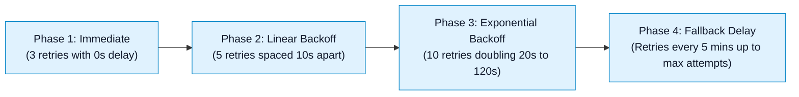
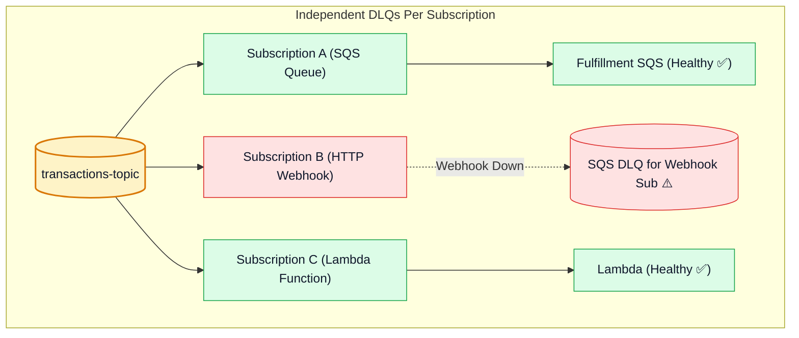

# 🔁 Amazon SNS Delivery Policies, Retry Mechanics & Subscription Dead-Letter Queues (DLQ)

- **Category**: Application Integration / Reliable Delivery, Retries & Subscription-Level DLQ
- **Language / ဘာသာစကား**: **English (Original)** | [မြန်မာဘာသာ (Burmese)](/mm/02-services/integration/sns/sns-delivery-retries-and-dead-letter-queues)
- **Primary Use Case**: Configuring delivery retry policies for failing subscriber endpoints, attaching Amazon SQS Dead-Letter Queues (DLQs) to SNS subscriptions, and preventing unrecoverable message drops.
- **Slide Reference**: Pages 499–525 in `[[AWSCertifiedDataEngineerSlides.pdf]]`
- **Hub Links**: `[[index]]` | `[[sns]]` | `[[sqs-dead-letter-queues-and-error-handling]]` | `[[domain-3-data-operations-and-support]]`

---

## 1. High-Level Summary

Because Amazon SNS is an ephemeral **Push-based** service without built-in long-term message storage, ensuring reliable delivery when downstream endpoints fail (e.g., target HTTP server down, Lambda throttled, or SQS queue permission revoked) is critical.

Amazon SNS guarantees fault tolerance through two primary mechanisms:
1. **Automated Delivery Retry Policies**: Structured multi-phase retries (immediate, linear, and exponential backoff).
2. **Subscription-Level Dead-Letter Queues (DLQ)**: An Amazon SQS queue configured on a specific subscription to isolate messages after all delivery retries are exhausted.

```mermaid
graph TD
    subgraph SNS_Delivery_Flow["SNS Reliable Delivery & DLQ Architecture"]
        Topic[("Amazon SNS Topic<br/>alerts-topic")] --> Sub["Subscription to External Endpoint<br/>(HTTP Webhook / Partner API)"]

        Sub -->|Push Delivery Attempt| Target["Downstream Endpoint<br/>(HTTP 500 Server Error 💥)"]

        Target -.->|Delivery Fails| Retry["SNS 4-Phase Retry Policy<br/>• Immediate Retries<br/>• Linear Backoff<br/>• Exponential Backoff<br/>• Fallback Delay"]
        Retry -->|Re-attempts Push| Target

        Retry -.->|All Retries Exhausted| DLQ[("Amazon SQS DLQ (Attached to Subscription)<br/>failed-deliveries-dlq")]

        DLQ --> Alert["CloudWatch Alarm & Ops Investigation 🚨"]
    end

    classDef topic fill:#fef3c7,stroke:#d97706,stroke-width:2px,color:#0f172a;
    classDef sub fill:#e0f2fe,stroke:#0284c7,stroke-width:1px,color:#0f172a;
    classDef fail fill:#fee2e2,stroke:#dc2626,stroke-width:1px,color:#0f172a;
    classDef dlq fill:#dcfce7,stroke:#16a34a,stroke-width:2px,color:#0f172a;

    class Topic topic;
    class Sub sub;
    class Target,Retry fail;
    class DLQ,Alert dlq;
```



---

## 2. SNS Delivery Retry Policies (HTTP / HTTPS Endpoints)

For HTTP/HTTPS endpoints, Amazon SNS executes a customizable **4-Phase Delivery Policy**:



1. **Immediate Retries**: Retries instantaneously to recover from momentary network blips.
2. **Linear Backoff**: Retries at steady intervals to allow endpoint restarts.
3. **Exponential Backoff**: Gradually spaces out attempts to avoid overwhelming recovering servers.
4. **Fallback Phase**: Periodic retry attempts before terminating the delivery effort (up to 100 total retries over 23+ days if configured).

---

## 3. Subscription-Level Dead-Letter Queues (DLQ)

> [!IMPORTANT]
> **High-Yield Architectural Difference Between SQS and SNS**:
> - In **Amazon SQS**, the DLQ is attached to the **Source Queue** (`RedrivePolicy`).
> - In **Amazon SNS**, the DLQ is attached to the **Individual Subscription**, NOT the SNS Topic! This allows independent failure handling for each distinct subscriber.



---

## 4. Setting Up an SNS Subscription DLQ

To attach an SQS Dead-Letter Queue to an SNS subscription:

1. **Create the SQS DLQ Queue** (in the same AWS Region and Account).
2. **Configure SQS Queue Policy** granting `sns.amazonaws.com` permission to send messages:
   ```json
   {
     "Version": "2012-10-17",
     "Statement": [
       {
         "Effect": "Allow",
         "Principal": {
           "Service": "sns.amazonaws.com"
         },
         "Action": "sqs:SendMessage",
         "Resource": "arn:aws:sqs:us-east-1:123456789012:my-subscription-dlq",
         "Condition": {
           "ArnEquals": {
             "aws:SourceArn": "arn:aws:sns:us-east-1:123456789012:my-topic"
           }
         }
       }
     ]
   }
   ```
3. **Set `RedrivePolicy` on the SNS Subscription** pointing `deadLetterTargetArn` to the SQS DLQ ARN.

---

## 5. DEA-C01 Exam Essentials

> [!IMPORTANT]
> **Key Exam Decision Triggers for Delivery & Error Handling**:
>
> - **"Where is a Dead-Letter Queue attached when an SNS HTTP/Lambda subscriber fails?"** $\rightarrow$ Configure the Dead-Letter Queue on the **SNS Subscription** (not on the SNS topic).
> - **"What type of AWS resource serves as an SNS Dead-Letter Queue?"** $\rightarrow$ An **Amazon SQS Queue** (Standard SQS for Standard Topic subscription, SQS FIFO for FIFO Topic subscription).
> - **"Required Permission for SNS DLQ"** $\rightarrow$ The SQS queue's access policy must allow the **`sns.amazonaws.com` service principal** to execute `sqs:SendMessage`.
> - **"Capture unroutable or failed messages from third-party webhook push deliveries"** $\rightarrow$ Attach an **SQS DLQ** to the HTTP/HTTPS SNS subscription.

---

## 📌 Related Notes
- `[[sns]]` — SNS Master Hub
- `[[sqs-dead-letter-queues-and-error-handling]]` — SQS DLQs and Redrive
- `[[sns-subscription-filter-policies]]` — Subscription Filter Policies
- `[[domain-3-data-operations-and-support]]` — CloudWatch & Incident Recovery
