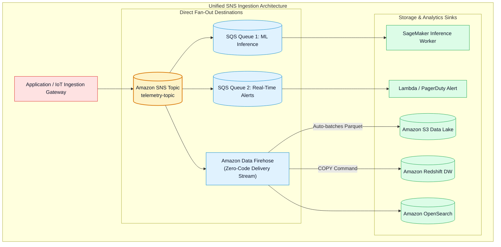
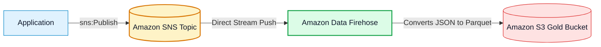

# 🔀 Amazon SNS Fan-Out Pattern, Firehose Ingestion & EventBridge Comparison

- **Category**: Application Integration / Event Fan-Out, Direct Firehose Streaming & Event Router Comparison
- **Language / ဘာသာစကား**: **English (Original)** | [မြန်မာဘာသာ (Burmese)](/mm/02-services/integration/sns/sns-fanout-firehose-and-eventbridge)
- **Primary Use Case**: Architecting the SNS+SQS Fan-Out pattern, delivering SNS topics directly into Amazon Data Firehose for serverless S3/Redshift data lake ingestion, and choosing between SNS and Amazon EventBridge.
- **Slide Reference**: Pages 499–525 in `[AWSCertifiedDataEngineerSlides.pdf](/docs/AWSCertifiedDataEngineerSlides.pdf)`
- **Hub Links**: `[[index]]` | `[[sns]]` | `[[sqs]]` | `[[kinesis-firehose]]` | `[[cloudwatch-and-eventbridge]]`

---

## 1. High-Level Summary

In distributed data pipelines, Amazon SNS is frequently paired with other AWS services to build scalable, event-driven ingestion backbones.

For the **DEA-C01** exam, you must master the **SNS + SQS Fan-Out Pattern**, how SNS integrates natively with **Amazon Data Firehose** to eliminate custom ingestion code, and the architectural trade-offs between **Amazon SNS and Amazon EventBridge**.

---

## 2. The Classic SNS + SQS Fan-Out Architecture

When multiple decoupled consumer services need to process the exact same business events independently:

1. **Publisher Isolation**: The producer publishes the event only once to an **Amazon SNS Topic**.
2. **Parallel Delivery**: SNS replicates the event and pushes a copy to every subscribed **Amazon SQS Queue**.
3. **Independent Worker Scaling**: Each worker fleet polls its dedicated SQS queue at its own pace without blocking or affecting other consumers.
4. **Resilience**: If the ML pipeline crashes, the Real-Time Alerting queue continues processing uninterrupted.

---

## 3. Direct SNS Ingestion into Amazon Data Firehose

A major architectural pattern in data engineering is capturing transactional events and persisting them into a data lake or warehouse without managing servers or writing Lambda code.

- **Zero-Code Delivery**: SNS topics can directly push records to an **Amazon Data Firehose** delivery stream.
- **Data Firehose Capabilities**:
  - Automatically buffers data (e.g. 5 minutes or 128 MB).
  - Converts raw JSON to columnar **Apache Parquet or ORC** formats.
  - Compresses files (GZIP, Snappy) and writes directly to **Amazon S3, Amazon Redshift, or Amazon OpenSearch Service**.

---

## 4. Amazon SNS vs. Amazon EventBridge

Both SNS and EventBridge route events across AWS, but they target different latency, throughput, and architectural needs:

| Evaluation Dimension | Amazon SNS | Amazon EventBridge |
| :--- | :--- | :--- |
| **Primary Architecture** | High-throughput Pub/Sub messaging. | Intelligent event bus and SaaS integration router. |
| **Throughput & Latency** | **Virtually unlimited throughput**, ultra-low latency ($< 30\text{ ms}$). | High throughput, latency typically $\approx 500\text{ ms}$. |
| **SaaS & AWS Sources** | Directly published by custom code / AWS services. | **Direct integration with 300+ SaaS vendors** (Salesforce, Zendesk, GitHub). |
| **Event Replayability** | **No** (Ephemeral delivery, no event store). | **Yes (Archive & Replay)**: Can archive and replay past events. |
| **Schema Management** | None (Payload agnostic). | **EventBridge Schema Registry** & Schema Discovery. |
| **Content Transformation**| Basic attribute/body filtering. | **Input Transformers** (Transforms event payload shape before target delivery). |
| **Target Ecosystem** | SQS, Lambda, Firehose, HTTP, SMS, Email. | Over **35+ AWS targets** (Step Functions, ECS tasks, Kinesis, SSM, etc.). |

---

## 5. DEA-C01 Exam Essentials

> [!IMPORTANT]
> **Key Exam Decision Triggers for Fan-Out & Routing**:
>
> - **"Stream events from an SNS topic to an S3 data lake with zero maintenance overhead"** $\rightarrow$ Configure **Amazon Data Firehose as an SNS Topic subscriber**; Firehose converts and writes directly to Amazon S3.
> - **"Choose between SNS and EventBridge for 300+ Third-Party SaaS Integrations"** $\rightarrow$ Choose **Amazon EventBridge** (native SaaS partner event buses).
> - **"Choose between SNS and EventBridge for replaying past failed events"** $\rightarrow$ Choose **Amazon EventBridge** (supports Archive & Replay; SNS is ephemeral).
> - **"Broadcast millions of high-velocity messages per second to SQS queues with lowest latency"** $\rightarrow$ Choose **Amazon SNS Fan-Out to Amazon SQS**.

---

## 📌 Related Notes
- `[[sns]]` — SNS Master Hub
- `[[sqs]]` — SQS Modular Suite
- `[[kinesis-firehose]]` — Amazon Data Firehose Delivery
- `[[cloudwatch-and-eventbridge]]` — EventBridge Rules & Schema Registry
