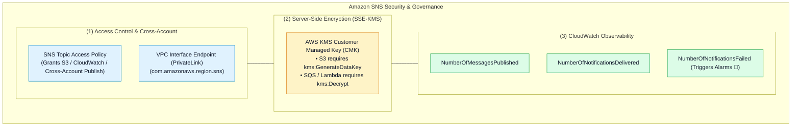

# 🛡️ Amazon SNS Security, Topic Access Policies, KMS Encryption & Observability

- **Category**: Application Integration / Topic Security Governance, Encryption & CloudWatch Monitoring
- **Language / ဘာသာစကား**: **English (Original)** | [မြန်မာဘာသာ (Burmese)](/mm/02-services/integration/sns/sns-security-access-policies-and-encryption)
- **Primary Use Case**: Authorizing AWS services and cross-account publishers via Topic Access Policies, securing messages at rest with AWS KMS, routing via VPC PrivateLink, and monitoring delivery health.
- **Slide Reference**: Pages 499–525 in `[[AWSCertifiedDataEngineerSlides.pdf]]`
- **Hub Links**: `[[index]]` | `[[sns]]` | `[[sns-standard-vs-fifo-topics]]` | `[[sns-delivery-retries-and-dead-letter-queues]]` | `[[domain-3-data-operations-and-support]]`

---

## 1. High-Level Summary

Securing Amazon SNS topics in enterprise data platforms requires configuring **Resource-Based Topic Policies**, granting **AWS KMS key permissions** for server-side encryption, and enabling private traffic via **AWS PrivateLink VPC Endpoints**.

For the **DEA-C01** exam, you must understand the required IAM and KMS permissions when AWS services (such as Amazon S3 or CloudWatch) publish to encrypted SNS topics, and how to triage delivery failures.



---

## 2. Topic Access Policies & Cross-Account Publishing

### 1. Granting Amazon S3 Permission to Publish to SNS:
To allow an S3 bucket to publish event notifications to an SNS topic, attach an **SNS Topic Access Policy**:

```json
{
  "Version": "2012-10-17",
  "Statement": [
    {
      "Sid": "AllowS3ToPublishEvents",
      "Effect": "Allow",
      "Principal": {
        "Service": "s3.amazonaws.com"
      },
      "Action": "sns:Publish",
      "Resource": "arn:aws:sns:us-east-1:123456789012:data-lake-events",
      "Condition": {
        "ArnEquals": {
          "aws:SourceArn": "arn:aws:s3:::my-production-data-lake-bucket"
        }
      }
    }
  ]
}
```

---

### 2. Cross-Account Subscriptions:
- **Account A** owns the SNS Topic.
- **Account B** owns an SQS Queue subscribing to the topic.
- *Requirements*:
  1. Account A's **SNS Topic Policy** must permit Account B to call `sns:Subscribe`.
  2. Account B's **SQS Queue Policy** must permit Account A's SNS topic to call `sqs:SendMessage`.

---

## 3. Server-Side Encryption (SSE-KMS) Gotchas

When enabling SSE-KMS encryption on an SNS topic:

> [!WARNING]
> **High-Yield DEA-C01 KMS Key Policy Trap**:
> When an AWS service (such as Amazon S3 or CloudWatch Alarms) publishes to an SNS topic encrypted with an AWS KMS Customer Managed Key (CMK), **the publish will silently FAIL** unless the KMS Key Policy explicitly grants permissions to the service principal!

### Required KMS Key Policy Statement for S3:
```json
{
  "Sid": "AllowS3ToUseKMSKey",
  "Effect": "Allow",
  "Principal": {
    "Service": "s3.amazonaws.com"
  },
  "Action": [
    "kms:GenerateDataKey*",
    "kms:Decrypt"
  ],
  "Resource": "*"
}
```

---

## 4. VPC Interface Endpoints (AWS PrivateLink)

- Enables applications running inside private VPC subnets (with no Internet Gateway or NAT Gateway) to publish messages securely to Amazon SNS.
- Uses **AWS PrivateLink** (`com.amazonaws.region.sns`).
- Traffic never leaves the private AWS network backbone, reducing data transfer costs and satisfying HIPAA/PCI-DSS compliance.

---

## 5. Master Troubleshooting Cheat Sheet

| Production Issue / Symptom | Root Cause | Remediation / Long-Term Fix |
| :--- | :--- | :--- |
| **S3 bucket event notifications fail to publish to SNS** | Missing or incorrect SNS Topic Access Policy. | Add `s3.amazonaws.com` to the SNS Topic Policy with `sns:Publish` and `aws:SourceArn` condition. |
| **Silent publishing failures on KMS-encrypted SNS topic** | S3 or publisher lacks `kms:GenerateDataKey*` in the KMS CMK Key Policy. | Update KMS Key Policy to allow the publisher service principal to generate data keys. |
| **Messages fail to deliver to an SQS subscriber queue** | SQS Queue Policy lacks permission for the SNS topic ARN. | Update SQS Queue Policy to grant `sqs:SendMessage` to the SNS topic ARN. |
| **Subscribers receiving thousands of irrelevant messages** | Missing Subscription Filter Policies. | Configure **Subscription Filter Policies** (attribute or message-body matching) on the subscriber endpoint. |
| **Unrecoverable message loss during downstream HTTP server outages** | No Dead-Letter Queue configured on the subscription. | Attach an **Amazon SQS Dead-Letter Queue (DLQ)** to the SNS subscription. |

---

## 6. DEA-C01 Exam Essentials

> [!IMPORTANT]
> **Key Exam Decision Triggers for SNS Security & Governance**:
>
> - **"S3 bucket event notifications cannot trigger an encrypted SNS topic"** $\rightarrow$ Grant `s3.amazonaws.com` permissions in the **KMS Key Policy** (`kms:GenerateDataKey*` and `kms:Decrypt`).
> - **"Allow an SQS queue in Account B to receive events from an SNS topic in Account A"** $\rightarrow$ Update both **Account A's Topic Policy** (allow subscribe) and **Account B's SQS Policy** (allow `sqs:SendMessage` from topic ARN).
> - **"Publish messages from private EC2/Lambda instances to SNS without traversing the internet"** $\rightarrow$ Create a **VPC Interface Endpoint (PrivateLink)** for `com.amazonaws.region.sns`.
> - **"Detect failing subscriber deliveries"** $\rightarrow$ Create a CloudWatch Alarm on **`NumberOfNotificationsFailed`**.

---

## 📌 Related Notes
- `[[sns]]` — SNS Master Hub
- `[[sns-standard-vs-fifo-topics]]` — Standard vs FIFO Topics
- `[[sns-delivery-retries-and-dead-letter-queues]]` — Delivery Retries & DLQs
- `[[sqs-security-monitoring-and-troubleshooting]]` — SQS Security & Access Governance
