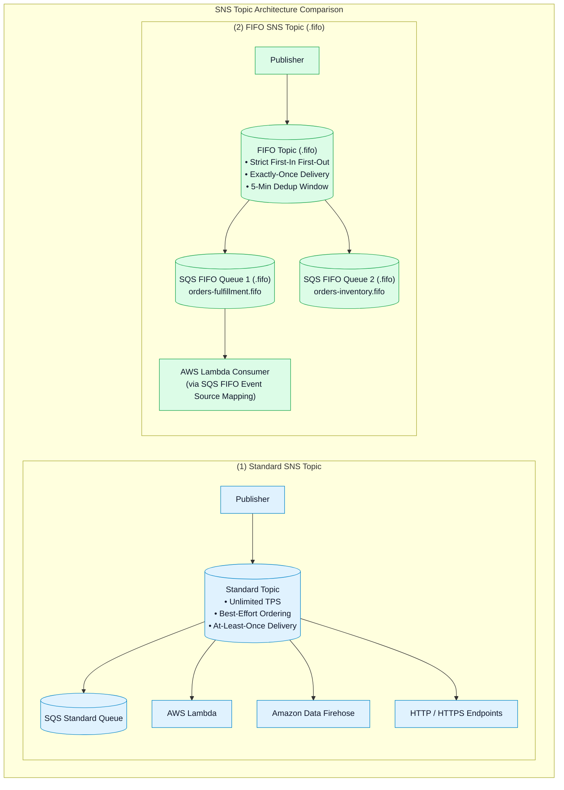
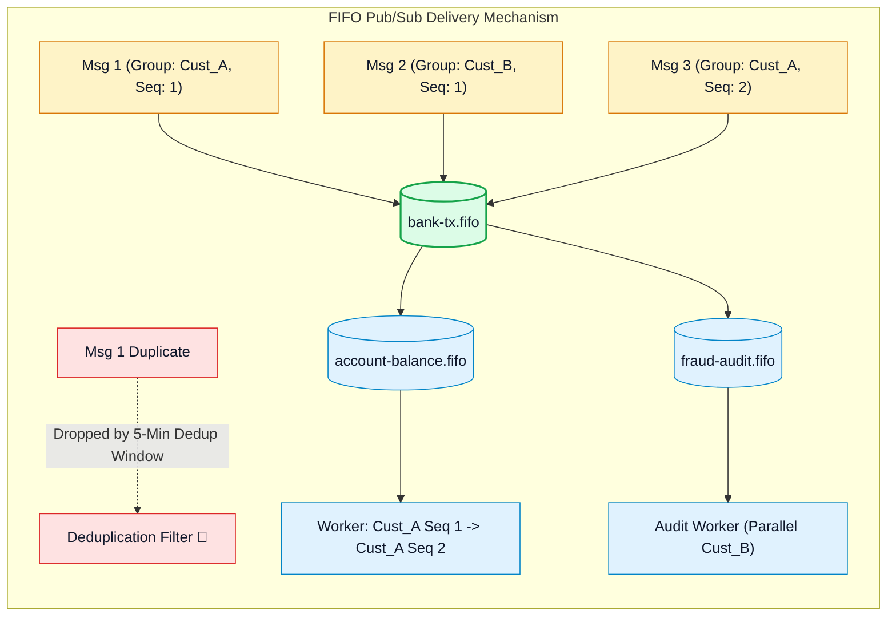

# ⚖️ Amazon SNS Standard vs. FIFO Topics, Deduplication & SQS FIFO Integration

- **Category**: Application Integration / Topic Ordering, Deduplication & FIFO Fanout
- **Language / ဘာသာစကား**: **English (Original)** | [မြန်မာဘာသာ (Burmese)](/mm/02-services/integration/sns/sns-standard-vs-fifo-topics)
- **Primary Use Case**: Choosing between Standard and FIFO topic semantics, preserving message sequence across multiple subscriber queues, enabling Content-Based Deduplication, and integrating FIFO topics with SQS FIFO queues.
- **Slide Reference**: Pages 499–525 in `[[AWSCertifiedDataEngineerSlides.pdf]]`
- **Hub Links**: `[[index]]` | `[[sns]]` | `[[sqs-standard-vs-fifo-queues]]` | `[[sns-subscription-filter-policies]]`

---

## 1. High-Level Summary

Amazon SNS supports two distinct topic architectures: **Standard Topics** and **FIFO (First-In, First-Out) Topics**.

While Standard Topics provide massive throughput and broad protocol support (HTTP, Lambda, SQS, Email, Firehose), FIFO Topics provide strict ordering and exactly-once delivery for sequence-sensitive data streams (such as financial ledgers and inventory reservations).

---

## 2. Standard Topics Deep Dive

1. **Massive Throughput**: Standard topics support virtually unlimited messages per second with sub-10ms delivery latency.
2. **Delivery Semantics**: At-least-once message delivery. Message order is best-effort (network routing or retries may occasionally alter the delivery sequence).
3. **Broad Protocol Ecosystem**: Standard topics can push messages to:
   - **Amazon SQS Standard Queues**
   - **AWS Lambda functions**
   - **Amazon Data Firehose delivery streams** (direct to S3 / Redshift / OpenSearch)
   - **HTTP / HTTPS webhooks**
   - **Email / Email-JSON**
   - **SMS & Mobile Push Notifications (APNs, FCM)**

---

## 3. FIFO Topics Deep Dive

Amazon SNS FIFO topics are purpose-built for distributed architectures where message sequence must never be disrupted, and duplicate events could cause state corruption or financial discrepancy.

### 1. Naming Convention:
The topic name **must end with the `.fifo` suffix** (e.g. `transactions.fifo`).

### 2. Message Group ID:
- Publishers must provide a `MessageGroupId` tag with every published message.
- Messages with the **same `MessageGroupId`** are guaranteed to be delivered and processed in **strict First-In, First-Out sequence**.
- Messages with **different `MessageGroupId`s** can be delivered concurrently to maximize throughput without bottlenecking independent partitions.

### 3. Exactly-Once Delivery & Deduplication ID:
SNS FIFO topics enforce a **5-minute deduplication window**:
- **Explicit Deduplication**: The publisher passes a unique `MessageDeduplicationId` (e.g. transaction hash).
- **Content-Based Deduplication**: SNS automatically generates a **SHA-256 hash** of the message body. If a message with the same hash is published within 5 minutes, it is dropped transparently.

---

## 4. The Critical FIFO Subscription Rule

> [!WARNING]
> **High-Yield DEA-C01 Exam Constraint**:
> Amazon SNS FIFO topics **CAN ONLY subscribe to Amazon SQS FIFO Queues (`.fifo`)**!
> They **CANNOT** deliver messages directly to AWS Lambda, Amazon Data Firehose, HTTP/S endpoints, SMS, or Email.

### The Standard Pattern: Fan-Out FIFO to Lambda
When you need to trigger a serverless Lambda function while maintaining strict FIFO order:
1. Publisher pushes ordered message to **SNS FIFO Topic** (`orders.fifo`).
2. SNS FIFO Topic fans out to an **SQS FIFO Queue** (`orders-worker.fifo`).
3. **AWS Lambda** polls the SQS FIFO Queue via **Event Source Mapping** (configured with concurrency per `MessageGroupId`).

---

## 5. Standard vs. FIFO Topics Definitive Comparison

| Dimension | Standard Topic | FIFO Topic |
| :--- | :--- | :--- |
| **Throughput Capacity** | Unlimited. | 300 to 30,000 msg/sec (with batching and High Throughput mode). |
| **Ordering Guarantee** | Best-effort (out-of-order possible). | **Strictly preserved (First-In, First-Out)**. |
| **Duplicates** | At-least-once delivery (Duplicates possible). | **Exactly-once delivery (5-minute deduplication window)**. |
| **Supported Subscribers** | SQS, Lambda, Firehose, HTTP/S, SMS, Email, Mobile Push. | **Amazon SQS FIFO Queues ONLY** (`.fifo`). |
| **Message Group ID** | Not supported. | **Mandatory** (defines ordered stream). |
| **Deduplication ID** | Not supported. | **Mandatory** (explicit or Content-Based SHA-256). |
| **Pricing** | \$0.50 per million publishes. | \$2.00 per million publishes. |

---

## 6. DEA-C01 Exam Essentials

> [!IMPORTANT]
> **Key Exam Decision Triggers for Topic Types**:
>
> - **"Fan out messages to multiple systems while guaranteeing strictly preserved message ordering and no duplicates"** $\rightarrow$ Use an **Amazon SNS FIFO Topic** subscribing to multiple **Amazon SQS FIFO Queues**.
> - **"Directly stream SNS messages into Amazon S3 or Amazon Redshift without running compute workers"** $\rightarrow$ Use a **Standard SNS Topic** subscribed to **Amazon Data Firehose** (FIFO topics cannot subscribe to Firehose).
> - **"Can an SNS FIFO topic send SMS alerts or email directly?"** $\rightarrow$ **No**. FIFO topics only support SQS FIFO queue endpoints.
> - **"Automatically drop duplicate API publishes without changing application code"** $\rightarrow$ Enable **Content-Based Deduplication** on the SNS FIFO topic.

---

## 📌 Related Notes
- `[[sns]]` — SNS Master Hub
- `[[sqs-standard-vs-fifo-queues]]` — SQS Standard vs FIFO Queues
- `[[sns-subscription-filter-policies]]` — SNS Subscription Filter Policies
- `[[kinesis-firehose]]` — Amazon Data Firehose Ingestion
